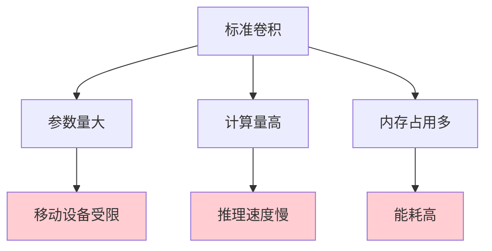
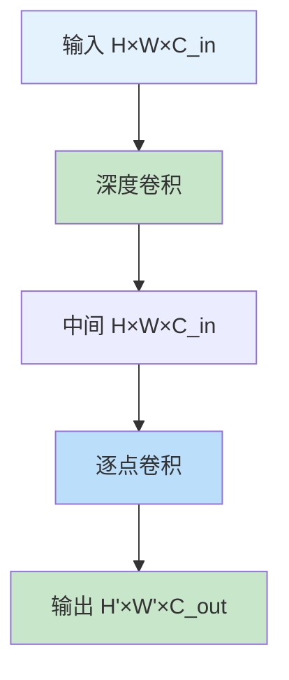

# 深度可分离卷积（Depthwise Separable Convolution）

## 概述

深度可分离卷积（Depthwise Separable Convolution）是一种高效的卷积变体，将标准卷积分解为两个独立的步骤：深度卷积（Depthwise Convolution）和逐点卷积（Pointwise Convolution）。这种设计大幅减少了参数量和计算量，同时保持相似的性能，广泛应用于移动和嵌入式设备上的轻量级网络。

## 为什么需要深度可分离卷积

### 标准卷积的计算成本



### 深度可分离卷积的优势

1. **参数量减少**：8-9 倍减少
2. **计算量降低**：相似比例的 FLOPs 减少
3. **速度提升**：移动端推理更快
4. **能耗降低**：适合电池供电设备

## 深度可分离卷积原理

### 标准卷积


标准卷积同时处理空间相关性和通道相关性。

### 深度可分离卷积分解



**步骤 1：深度卷积（Depthwise Convolution）**
- 每个通道独立卷积
- 卷积核：$K \times K \times 1$
- 捕获空间特征

**步骤 2：逐点卷积（Pointwise Convolution）**
- 1×1 卷积
- 卷积核：$1 \times 1 \times C_{in} \times C_{out}$
- 捕获通道相关性

### 参数量对比

**标准卷积：**
$$Params_{standard} = K \times K \times C_{in} \times C_{out}$$

**深度可分离卷积：**
$$Params_{DW} = K \times K \times C_{in}$$
$$Params_{PW} = 1 \times 1 \times C_{in} \times C_{out}$$
$$Params_{total} = K \times K \times C_{in} + C_{in} \times C_{out}$$

**减少比例：**
$$\frac{Params_{standard}}{Params_{DW+PW}} = \frac{K^2 \times C_{in} \times C_{out}}{K^2 \times C_{in} + C_{in} \times C_{out}} = \frac{1}{\frac{1}{C_{out}} + \frac{1}{K^2}}$$

对于 $K=3, C_{in}=C_{out}=256$：
- 标准卷积：$3^2 \times 256 \times 256 = 589,824$
- 深度可分离：$3^2 \times 256 + 256 \times 256 = 67,840$
- **减少约 8.7 倍**

### 计算量对比

**标准卷积 FLOPs：**
$$FLOPs_{standard} = 2 \times H' \times W' \times K^2 \times C_{in} \times C_{out}$$

**深度可分离卷积 FLOPs：**
$$FLOPs_{DW} = 2 \times H' \times W' \times K^2 \times C_{in}$$
$$FLOPs_{PW} = 2 \times H' \times W' \times C_{in} \times C_{out}$$

## PyTorch 代码示例

### 基础实现

```python
import torch
import torch.nn as nn
import torch.nn.functional as F

class DepthwiseSeparableConv(nn.Module):
    def __init__(self, in_channels, out_channels, kernel_size=3, stride=1, padding=1):
        super().__init__()
        
        # 深度卷积：每个通道独立
        self.depthwise = nn.Conv2d(
            in_channels, in_channels, kernel_size,
            stride=stride, padding=padding, groups=in_channels, bias=False
        )
        self.bn1 = nn.BatchNorm2d(in_channels)
        
        # 逐点卷积：1x1 卷积
        self.pointwise = nn.Conv2d(
            in_channels, out_channels, kernel_size=1,
            stride=1, padding=0, bias=False
        )
        self.bn2 = nn.BatchNorm2d(out_channels)
        
        self.relu = nn.ReLU(inplace=True)
    
    def forward(self, x):
        x = self.depthwise(x)
        x = self.bn1(x)
        x = self.relu(x)
        
        x = self.pointwise(x)
        x = self.bn2(x)
        x = self.relu(x)
        
        return x

# 测试
dw_conv = DepthwiseSeparableConv(64, 128, kernel_size=3)
x = torch.randn(1, 64, 32, 32)
output = dw_conv(x)
print(f"深度可分离卷积：{x.shape} -> {output.shape}")

# 参数量对比
standard_conv = nn.Conv2d(64, 128, 3, padding=1)
dw_params = sum(p.numel() for p in dw_conv.parameters())
std_params = sum(p.numel() for p in standard_conv.parameters())

print(f"\n参数量对比:")
print(f"  标准卷积：{std_params:,}")
print(f"  深度可分离：{dw_params:,}")
print(f"  减少比例：{std_params / dw_params:.1f}x")
```

### MobileNet V1 块

```python
class MobileNetV1Block(nn.Module):
    def __init__(self, in_channels, out_channels, stride=1):
        super().__init__()
        
        self.depthwise = nn.Sequential(
            nn.Conv2d(in_channels, in_channels, 3, stride, 1, groups=in_channels, bias=False),
            nn.BatchNorm2d(in_channels),
            nn.ReLU6(inplace=True)  # ReLU6 用于量化友好
        )
        
        self.pointwise = nn.Sequential(
            nn.Conv2d(in_channels, out_channels, 1, 1, 0, bias=False),
            nn.BatchNorm2d(out_channels),
            nn.ReLU6(inplace=True)
        )
    
    def forward(self, x):
        x = self.depthwise(x)
        x = self.pointwise(x)
        return x

# MobileNet V1 简化版
class MobileNetV1(nn.Module):
    def __init__(self, num_classes=1000):
        super().__init__()
        
        def conv_dw(inp, oup, stride):
            return nn.Sequential(
                nn.Conv2d(inp, inp, 3, stride, 1, groups=inp, bias=False),
                nn.BatchNorm2d(inp),
                nn.ReLU6(inplace=True),
                
                nn.Conv2d(inp, oup, 1, 1, 0, bias=False),
                nn.BatchNorm2d(oup),
                nn.ReLU6(inplace=True),
            )
        
        self.model = nn.Sequential(
            nn.Conv2d(3, 32, 3, 2, 1, bias=False),
            nn.BatchNorm2d(32),
            nn.ReLU6(inplace=True),
            
            conv_dw(32, 64, 1),
            conv_dw(64, 128, 2),
            conv_dw(128, 128, 1),
            conv_dw(128, 256, 2),
            conv_dw(256, 256, 1),
            conv_dw(256, 512, 2),
            conv_dw(512, 512, 1),
            conv_dw(512, 512, 1),
            conv_dw(512, 512, 1),
            conv_dw(512, 512, 1),
            conv_dw(512, 512, 1),
            conv_dw(512, 1024, 2),
            conv_dw(1024, 1024, 1),
            
            nn.AdaptiveAvgPool2d(1),
        )
        
        self.classifier = nn.Linear(1024, num_classes)
    
    def forward(self, x):
        x = self.model(x)
        x = x.view(-1, 1024)
        x = self.classifier(x)
        return x

# 测试 MobileNetV1
mobilenet = MobileNetV1()
x = torch.randn(1, 3, 224, 224)
output = mobilenet(x)
print(f"\nMobileNetV1: {x.shape} -> {output.shape}")
print(f"参数量：{sum(p.numel() for p in mobilenet.parameters()):,}")
```

### MobileNet V2 倒残差块

```python
class InvertedResidual(nn.Module):
    def __init__(self, inp, oup, stride, expand_ratio):
        super().__init__()
        self.stride = stride
        self.use_res_connect = self.stride == 1 and inp == oup
        
        hidden_dim = int(round(inp * expand_ratio))
        
        layers = []
        if expand_ratio != 1:
            # 逐点卷积升维
            layers.extend([
                nn.Conv2d(inp, hidden_dim, 1, 1, 0, bias=False),
                nn.BatchNorm2d(hidden_dim),
                nn.ReLU6(inplace=True)
            ])
        
        # 深度卷积
        layers.extend([
            nn.Conv2d(hidden_dim, hidden_dim, 3, stride, 1, groups=hidden_dim, bias=False),
            nn.BatchNorm2d(hidden_dim),
            nn.ReLU6(inplace=True)
        ])
        
        # 逐点卷积降维
        layers.extend([
            nn.Conv2d(hidden_dim, oup, 1, 1, 0, bias=False),
            nn.BatchNorm2d(oup)
        ])
        
        self.conv = nn.Sequential(*layers)
    
    def forward(self, x):
        if self.use_res_connect:
            return x + self.conv(x)
        else:
            return self.conv(x)

# 测试倒残差块
inverted_block = InvertedResidual(32, 32, stride=1, expand_ratio=6)
x = torch.randn(1, 32, 32, 32)
output = inverted_block(x)
print(f"\nInvertedResidual: {x.shape} -> {output.shape}")
print(f"使用残差连接：{inverted_block.use_res_connect}")
```

## 深度可分离卷积的变体

### 1. 分组卷积（Group Convolution）

介于标准卷积和深度卷积之间：
```python
# groups=1: 标准卷积
# groups=in_channels: 深度卷积
# 1 < groups < in_channels: 分组卷积
conv = nn.Conv2d(64, 64, 3, groups=8)  # 8 组
```

### 2. 逐通道卷积（Channel-wise Convolution）

每个通道使用不同的卷积核。

### 3. 混合卷积

结合标准卷积和深度可分离卷积。

## 轻量级网络对比

| 网络 | 参数量 | Top-1 准确率 | 特点 |
|-----|--------|------------|------|
| ResNet-50 | 25.6M | 76.0% | 基准 |
| MobileNetV1 | 4.2M | 70.6% | 深度可分离 |
| MobileNetV2 | 3.5M | 72.0% | 倒残差 |
| ShuffleNetV2 | 2.3M | 69.4% | 通道混洗 |
| EfficientNet-B0 | 5.3M | 77.1% | 复合缩放 |

## 实际应用技巧

### 1. 选择合适的基础宽度

```python
# MobileNet 宽度乘数
width_mult = 1.0  # 可调整为 0.75, 0.5, 0.25

inp = int(32 * width_mult)
oup = int(64 * width_mult)
```

### 2. 使用 ReLU6

```python
# ReLU6 对量化友好
nn.ReLU6(inplace=True)
```

### 3. 避免 1×1 深度卷积

深度卷积需要 K≥3 才有意义。

### 4. 与注意力机制结合

```python
# SE-Block 配合深度可分离卷积
class SEBlock(nn.Module):
    def __init__(self, channels, reduction=16):
        super().__init__()
        self.avg_pool = nn.AdaptiveAvgPool2d(1)
        self.fc = nn.Sequential(
            nn.Linear(channels, channels // reduction),
            nn.ReLU(inplace=True),
            nn.Linear(channels // reduction, channels),
            nn.Sigmoid()
        )
    
    def forward(self, x):
        b, c, _, _ = x.size()
        y = self.avg_pool(x).view(b, c)
        y = self.fc(y).view(b, c, 1, 1)
        return x * y.expand_as(x)
```

## 总结

深度可分离卷积通过将标准卷积分解为深度卷积和逐点卷积，大幅降低了计算成本和参数量，成为移动端和嵌入式设备深度学习模型的核心技术。理解其原理和优化技巧，对于设计高效的轻量级网络至关重要。
