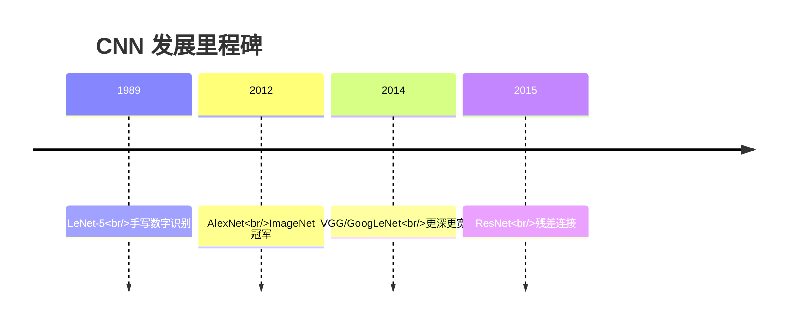
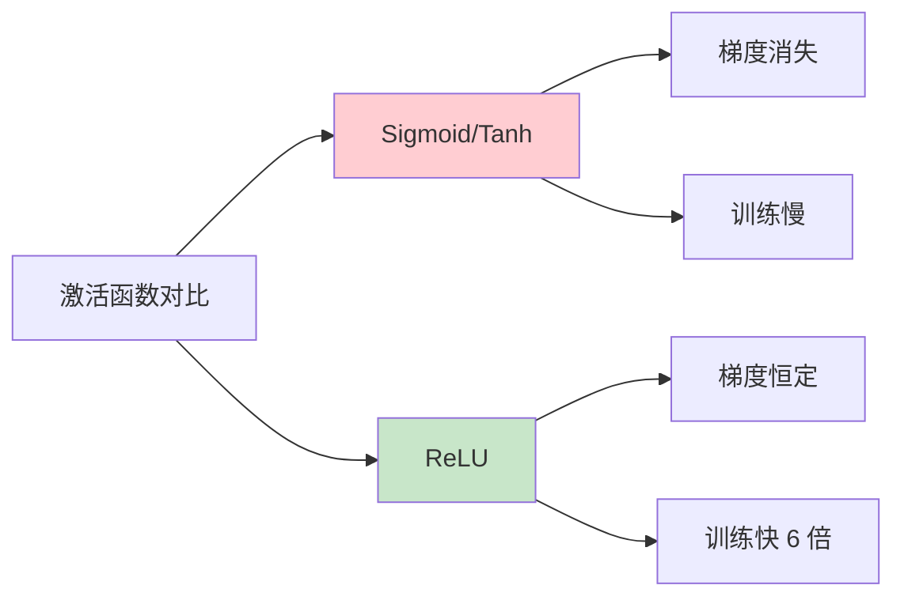
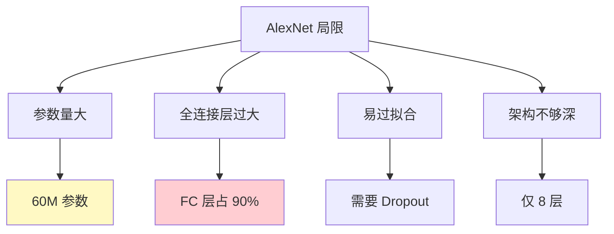

# AlexNet

## 概述

AlexNet 是由 Alex Krizhevsky、Ilya Sutskever 和 Geoffrey Hinton 于 2012 年提出的深度卷积神经网络，在 ImageNet Large Scale Visual Recognition Challenge (ILSVRC) 2012 中以 15.3% 的 Top-5 错误率获得冠军，显著领先第二名（26.2%）。AlexNet 的成功标志着深度学习在计算机视觉领域的崛起，开启了 CNN 研究的新时代。

## 历史背景



### ImageNet 竞赛

- **数据集**：1400 万图像，1000 个类别
- **任务**：图像分类
- **意义**：大规模视觉识别基准

### AlexNet 的突破

| 年份 | 方法 | Top-5 错误率 |
|-----|------|------------|
| 2011 | 传统方法 | 25.7% |
| 2012 | AlexNet | 15.3% |
| 2013 | ZF Net | 11.7% |

## 网络架构

### 整体结构

```mermaid
graph TD
    A[224×224×3 输入] --> B[Conv1<br/>96@55×55]
    B --> C[Pool1<br/>96@27×27]
    C --> D[Conv2<br/>256@27×27]
    D --> E[Pool2<br/>256@13×13]
    E --> F[Conv3<br/>384@13×13]
    F --> G[Conv4<br/>384@13×13]
    G --> H[Conv5<br/>384@13×13]
    H --> I[Pool5<br/>384@6×6]
    I --> J[FC6<br/>4096]
    J --> K[FC7<br/>4096]
    K --> L[FC8<br/>1000]
    L --> M[Softmax 输出]
    
    style B fill:#e3f2fd
    style D fill:#e3f2fd
    style F fill:#e3f2fd
    style G fill:#e3f2fd
    style H fill:#e3f2fd
    style J fill:#fff9c4
    style K fill:#fff9c4
    style L fill:#c8e6c9
```

### 详细配置

| 层 | 类型 | 输出尺寸 | 卷积核 | 步长 | 填充 |
|---|------|---------|--------|------|------|
| Conv1 | Conv | 55×55×96 | 11×11 | 4 | 2 |
| Pool1 | MaxPool | 27×27×96 | 3×3 | 2 | - |
| Conv2 | Conv | 27×27×256 | 5×5 | 1 | 2 |
| Pool2 | MaxPool | 13×13×256 | 3×3 | 2 | - |
| Conv3 | Conv | 13×13×384 | 3×3 | 1 | 1 |
| Conv4 | Conv | 13×13×384 | 3×3 | 1 | 1 |
| Conv5 | Conv | 13×13×384 | 3×3 | 1 | 1 |
| Pool5 | MaxPool | 6×6×384 | 3×3 | 2 | - |
| FC6 | FullyConnected | 4096 | - | - | - |
| FC7 | FullyConnected | 4096 | - | - | - |
| FC8 | FullyConnected | 1000 | - | - | - |

## PyTorch 代码示例

### 原始 AlexNet 实现

```python
import torch
import torch.nn as nn
import torch.nn.functional as F

class AlexNet(nn.Module):
    def __init__(self, num_classes=1000):
        super().__init__()
        
        # 特征提取器
        self.features = nn.Sequential(
            # Conv1: 11x11 conv, stride 4
            nn.Conv2d(3, 96, kernel_size=11, stride=4, padding=2),
            nn.ReLU(inplace=True),
            nn.MaxPool2d(kernel_size=3, stride=2),
            
            # Conv2: 5x5 conv
            nn.Conv2d(96, 256, kernel_size=5, padding=2),
            nn.ReLU(inplace=True),
            nn.MaxPool2d(kernel_size=3, stride=2),
            
            # Conv3: 3x3 conv
            nn.Conv2d(256, 384, kernel_size=3, padding=1),
            nn.ReLU(inplace=True),
            
            # Conv4: 3x3 conv
            nn.Conv2d(384, 384, kernel_size=3, padding=1),
            nn.ReLU(inplace=True),
            
            # Conv5: 3x3 conv
            nn.Conv2d(384, 384, kernel_size=3, padding=1),
            nn.ReLU(inplace=True),
            nn.MaxPool2d(kernel_size=3, stride=2),
        )
        
        # 分类器
        self.classifier = nn.Sequential(
            nn.Dropout(),
            nn.Linear(256 * 6 * 6, 4096),
            nn.ReLU(inplace=True),
            nn.Dropout(),
            nn.Linear(4096, 4096),
            nn.ReLU(inplace=True),
            nn.Linear(4096, num_classes),
        )
    
    def forward(self, x):
        x = self.features(x)
        x = torch.flatten(x, 1)
        x = self.classifier(x)
        return x

# 测试
model = AlexNet()
x = torch.randn(1, 3, 224, 224)
output = model(x)
print(f"AlexNet: {x.shape} -> {output.shape}")
print(f"参数量：{sum(p.numel() for p in model.parameters()):,}")

# 打印每层输出尺寸
print("\n各层输出尺寸:")
x_temp = torch.randn(1, 3, 224, 224)
for i, layer in enumerate(model.features):
    x_temp = layer(x_temp)
    print(f"  Layer {i}: {x_temp.shape}")
```

### 使用 PyTorch 内置 AlexNet

```python
from torchvision import models

# 随机初始化
alexnet = models.alexnet(weights=None)

# 预训练权重
alexnet_pretrained = models.alexnet(weights=models.AlexNet_Weights.IMAGENET1K_V1)

# 修改分类头
alexnet.classifier[6] = nn.Linear(4096, 10)  # 10 类分类

print(f"预训练 AlexNet 参数量：{sum(p.numel() for p in alexnet_pretrained.parameters()):,}")
```

## 关键创新

### 1. ReLU 激活函数



**贡献：** 首次在大尺度 CNN 中使用 ReLU，训练速度提升 6 倍。

### 2. Dropout 正则化

- 在全连接层使用 Dropout (p=0.5)
- 减少过拟合
- 隐式模型集成

### 3. 数据增强

**训练时增强：**
- 随机裁剪（256×256 → 224×224）
- 水平翻转
- 颜色抖动

**测试时增强：**
- 5 个裁剪（4 角 + 中心）
- 水平翻转版本
- 10 个预测平均

### 4. GPU 训练

- 两块 GTX 580 GPU 并行训练
- 模型并行：卷积核分到两个 GPU
- 训练时间：5-6 天

### 5. 重叠池化

- 池化步长 < 池化核尺寸
- 减少信息丢失
- 提升准确率 0.4%

## 训练技巧

### 权重初始化

```python
# AlexNet 使用的初始化
for m in model.modules():
    if isinstance(m, nn.Conv2d):
        nn.init.normal_(m.weight, mean=0, std=0.01)
        if m.bias is not None:
            nn.init.constant_(m.bias, 0.1)  # Conv2/4/5 偏置初始化为 0.1
    elif isinstance(m, nn.Linear):
        nn.init.normal_(m.weight, mean=0, std=0.01)
        nn.init.constant_(m.bias, 0.1)
```

### 优化器配置

```python
import torch.optim as optim

optimizer = optim.SGD(
    model.parameters(),
    lr=0.01,
    momentum=0.9,
    weight_decay=5e-4,
    nesterov=True
)

# 学习率调度
scheduler = optim.lr_scheduler.StepLR(
    optimizer,
    step_size=7,  # 每 7 个 epoch
    gamma=0.1     # 学习率×0.1
)
```

## AlexNet 的影响

### 1. 深度学习复兴

- 证明深度 CNN 的有效性
- 引发研究热潮
- 传统方法迅速被淘汰

### 2. 架构设计启发

- 卷积 + 池化堆叠模式
- ReLU 成为标准激活函数
- Dropout 广泛应用

### 3. 硬件加速

- GPU 训练成为标准
- 专用 AI 芯片发展
- 分布式训练研究

## 局限性与改进

### 局限性



### 后续改进

| 网络 | 年份 | 改进点 |
|-----|------|--------|
| ZF Net | 2013 | 可视化分析 |
| VGG | 2014 | 小卷积核堆叠 |
| GoogLeNet | 2014 | Inception 模块 |
| ResNet | 2015 | 残差连接 |

## 现代应用

### 迁移学习

```python
# 使用预训练 AlexNet 进行迁移学习
def create_transfer_model(num_classes=10):
    model = models.alexnet(weights=models.AlexNet_Weights.IMAGENET1K_V1)
    
    # 冻结特征提取器
    for param in model.features.parameters():
        param.requires_grad = False
    
    # 修改分类器
    model.classifier = nn.Sequential(
        nn.Linear(256 * 6 * 6, 256),
        nn.ReLU(inplace=True),
        nn.Dropout(0.5),
        nn.Linear(256, num_classes)
    )
    
    return model

transfer_model = create_transfer_model(10)
print(f"迁移学习模型参数量：{sum(p.numel() for p in transfer_model.parameters()):,}")
```

### 特征提取

```python
# 提取中间层特征
def extract_features(model, x, layer_idx=4):
    for i, layer in enumerate(model.features):
        x = layer(x)
        if i == layer_idx:
            break
    return x

model = models.alexnet(weights=models.AlexNet_Weights.IMAGENET1K_V1)
model.eval()

x = torch.randn(1, 3, 224, 224)
features = extract_features(model, x, layer_idx=4)
print(f"Conv5 特征形状：{features.shape}")
```

## 总结

AlexNet 作为深度学习革命的起点，通过 ReLU、Dropout、数据增强和 GPU 训练等创新，证明了深度 CNN 在大规模视觉识别中的巨大潜力。尽管现代架构已超越 AlexNet，但其设计理念和训练技巧仍深刻影响着深度学习的发展。
