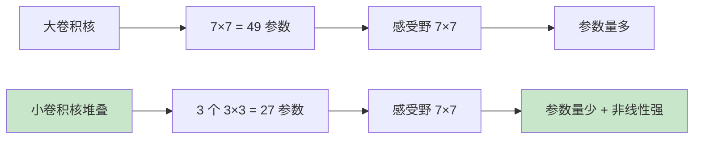
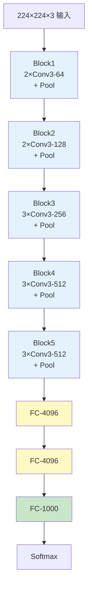
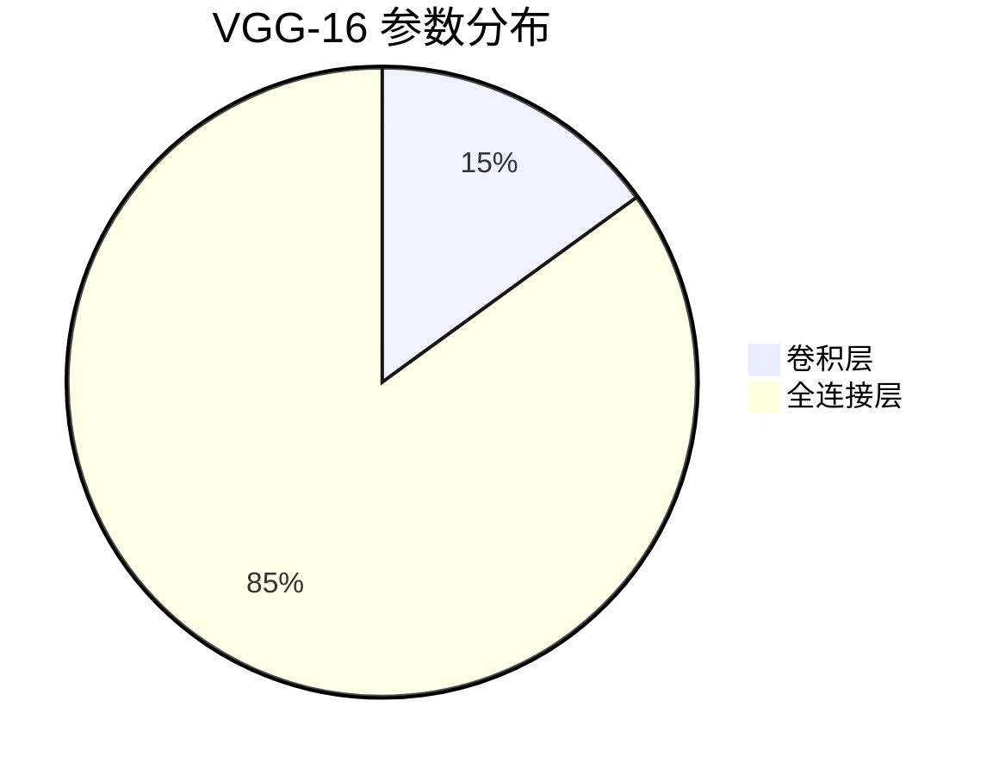
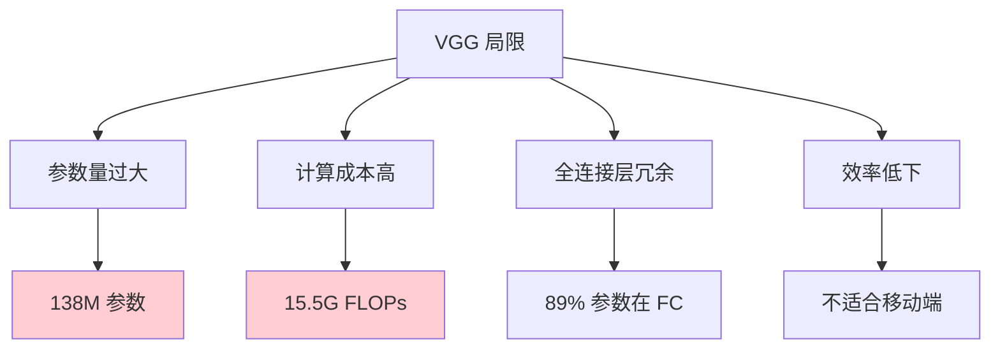

# VGG（Visual Geometry Group Network）

## 概述

VGG 是由牛津大学 Visual Geometry Group 的 Karen Simonyan 和 Andrew Zisserman 于 2014 年提出的卷积神经网络架构。VGG 通过系统性地探索网络深度对性能的影响，证明了使用小尺寸卷积核（3×3）的深层网络能够显著提升性能。VGG-16 和 VGG-19 成为计算机视觉领域最经典和广泛使用的基准模型之一。

## 核心设计理念

### 1. 小卷积核堆叠



**关键洞察：** 堆叠多个小卷积核等价于一个大卷积核的感受野，但：
- 参数量更少
- 非线性更强（更多 ReLU）
- 判别能力更强

### 2. 统一架构

- 所有卷积层使用 3×3 卷积核
- 所有池化层使用 2×2 最大池化
- 步长固定为 1（卷积）或 2（池化）

### 3. 深度重要性

通过对比不同深度的变体，证明更深的网络性能更好。

## VGG 架构变体

### 配置对比

| 层 | VGG-11 | VGG-13 | VGG-16 | VGG-19 |
|---|--------|--------|--------|--------|
| 1 | conv3-64 | conv3-64 | conv3-64 | conv3-64 |
| 2 | pool | pool | conv3-64 | conv3-64 |
| 3 | conv3-128 | conv3-128 | pool | pool |
| 4 | pool | pool | conv3-128 | conv3-128 |
| 5 | conv3-256 | conv3-256 | conv3-128 | conv3-128 |
| 6 | conv3-256 | conv3-256 | pool | pool |
| 7 | pool | pool | conv3-256 | conv3-256 |
| 8 | conv3-512 | conv3-512 | conv3-256 | conv3-256 |
| 9 | conv3-512 | conv3-512 | pool | pool |
| 10 | pool | pool | conv3-512 | conv3-512 |
| 11 | conv3-512 | conv3-512 | conv3-512 | conv3-512 |
| 12 | pool | pool | conv3-512 | conv3-512 |
| 13 | conv3-512 | conv3-512 | pool | pool |
| 14 | conv3-512 | conv3-512 | conv3-512 | conv3-512 |
| 15 | pool | pool | conv3-512 | conv3-512 |
| 16 | pool | pool | pool | pool |
| 17 | FC-4096 | FC-4096 | FC-4096 | FC-4096 |
| 18 | FC-4096 | FC-4096 | FC-4096 | FC-4096 |
| 19 | FC-1000 | FC-1000 | FC-1000 | FC-1000 |
| **总权重层** | **11** | **13** | **16** | **19** |
| **参数量** | **132M** | **133M** | **138M** | **144M** |

### 架构图



## PyTorch 代码示例

### 基础 VGG 实现

```python
import torch
import torch.nn as nn
import torch.nn.functional as F

# VGG 配置字典
cfg = {
    'VGG11': [64, 'M', 128, 'M', 256, 256, 'M', 512, 512, 'M', 512, 512, 'M'],
    'VGG13': [64, 64, 'M', 128, 128, 'M', 256, 256, 'M', 512, 512, 'M', 512, 512, 'M'],
    'VGG16': [64, 64, 'M', 128, 128, 'M', 256, 256, 256, 'M', 512, 512, 512, 'M', 512, 512, 512, 'M'],
    'VGG19': [64, 64, 'M', 128, 128, 'M', 256, 256, 256, 256, 'M', 512, 512, 512, 512, 'M', 512, 512, 512, 512, 'M'],
}

class VGG(nn.Module):
    def __init__(self, vgg_name='VGG16', num_classes=1000):
        super().__init__()
        self.features = self._make_layers(cfg[vgg_name])
        self.classifier = nn.Sequential(
            nn.Linear(512 * 7 * 7, 4096),
            nn.ReLU(inplace=True),
            nn.Dropout(),
            nn.Linear(4096, 4096),
            nn.ReLU(inplace=True),
            nn.Dropout(),
            nn.Linear(4096, num_classes)
        )
    
    def _make_layers(self, cfg):
        layers = []
        in_channels = 3
        for x in cfg:
            if x == 'M':
                layers.append(nn.MaxPool2d(kernel_size=2, stride=2))
            else:
                layers.extend([
                    nn.Conv2d(in_channels, x, kernel_size=3, padding=1),
                    nn.BatchNorm2d(x),
                    nn.ReLU(inplace=True)
                ])
                in_channels = x
        return nn.Sequential(*layers)
    
    def forward(self, x):
        x = self.features(x)
        x = x.view(x.size(0), -1)
        x = self.classifier(x)
        return x

# 测试不同变体
for name in ['VGG11', 'VGG13', 'VGG16', 'VGG19']:
    model = VGG(name)
    x = torch.randn(1, 3, 224, 224)
    output = model(x)
    params = sum(p.numel() for p in model.parameters())
    print(f"{name}: {output.shape}, 参数量：{params:,}")
```

### 使用 PyTorch 内置 VGG

```python
from torchvision import models

# VGG16 预训练
vgg16 = models.vgg16(weights=models.VGG16_Weights.IMAGENET1K_V1)

# VGG19 预训练
vgg19 = models.vgg19(weights=models.VGG19_Weights.IMAGENET1K_V1)

# 修改分类头（迁移学习）
vgg16.classifier[6] = nn.Linear(4096, 10)  # 10 类分类

print(f"VGG16 参数量：{sum(p.numel() for p in vgg16.parameters()):,}")
print(f"VGG19 参数量：{sum(p.numel() for p in vgg19.parameters()):,}")
```

### 特征提取

```python
class VGGFeatureExtractor(nn.Module):
    def __init__(self, vgg_name='VGG16', use_bn=True):
        super().__init__()
        if use_bn:
            from torchvision.models import vgg16_bn, vgg19_bn
            if vgg_name == 'VGG16':
                vgg = vgg16_bn(weights=None)
            else:
                vgg = vgg19_bn(weights=None)
        else:
            from torchvision.models import vgg16, vgg19
            if vgg_name == 'VGG16':
                vgg = vgg16(weights=None)
            else:
                vgg = vgg19(weights=None)
        
        self.features = vgg.features
    
    def forward(self, x):
        features = []
        for layer in self.features:
            x = layer(x)
            if isinstance(layer, nn.MaxPool2d):
                features.append(x)
        return features

# 提取多尺度特征
extractor = VGGFeatureExtractor('VGG16')
x = torch.randn(1, 3, 224, 224)
features = extractor(x)
print(f"\n多尺度特征:")
for i, feat in enumerate(features):
    print(f"  Pool{i+1}: {feat.shape}")
```

## 关键特性

### 1. 1×1 卷积的缺失

VGG 没有使用 1×1 卷积，后续网络（如 Network in Network、GoogLeNet）引入 1×1 卷积进行降维。

### 2. 全连接层主导参数



- 卷积层：约 15M 参数
- 全连接层：约 123M 参数（89%）

### 3. 训练技巧

```python
# VGG 训练配置
optimizer = torch.optim.SGD(
    model.parameters(),
    lr=0.01,
    momentum=0.9,
    weight_decay=5e-4
)

# 多尺度训练
# 输入尺寸在 [224, 256, 384] 之间随机选择

# 测试时多尺度评估
# 多尺寸输入 + 多裁剪平均
```

## VGG 的改进版本

### 1. BN-VGG

添加 Batch Normalization：
```python
# 在 Conv 和 ReLU 之间添加 BN
nn.Sequential(
    nn.Conv2d(in_channels, out_channels, 3, padding=1),
    nn.BatchNorm2d(out_channels),
    nn.ReLU(inplace=True)
)
```

### 2. VGG with Dropout

在全连接层使用 Dropout（p=0.5）。

### 3. 简化 VGG

减少全连接层，使用全局平均池化：
```python
class SimplifiedVGG(nn.Module):
    def __init__(self, num_classes=1000):
        super().__init__()
        self.features = VGG('VGG16').features
        self.avgpool = nn.AdaptiveAvgPool2d(1)
        self.classifier = nn.Linear(512, num_classes)
    
    def forward(self, x):
        x = self.features(x)
        x = self.avgpool(x)
        x = x.view(x.size(0), -1)
        x = self.classifier(x)
        return x
```

## 性能对比

### ImageNet 分类

| 模型 | Top-1 错误率 | Top-5 错误率 | 参数量 |
|-----|------------|------------|--------|
| AlexNet | 37.5% | 17.0% | 61M |
| VGG-16 | 28.4% | 9.6% | 138M |
| VGG-19 | 28.2% | 9.5% | 144M |
| GoogLeNet | 25.2% | 8.2% | 7M |
| ResNet-50 | 22.9% | 6.7% | 26M |

### 计算成本

| 模型 | FLOPs | 推理时间 (GPU) |
|-----|-------|--------------|
| VGG-16 | 15.5G | ~30ms |
| VGG-19 | 19.6G | ~40ms |
| ResNet-50 | 4.1G | ~10ms |

## 应用场景

### 1. 特征提取器

```python
# 使用 VGG 作为通用特征提取器
import torchvision.transforms as transforms

transform = transforms.Compose([
    transforms.Resize(256),
    transforms.CenterCrop(224),
    transforms.ToTensor(),
    transforms.Normalize(mean=[0.485, 0.456, 0.406], 
                         std=[0.229, 0.224, 0.225])
])

vgg = models.vgg16(weights=models.VGG16_Weights.IMAGENET1K_V1)
vgg.features.eval()

# 提取特征
def get_vgg_features(image_tensor):
    with torch.no_grad():
        features = vgg.features(image_tensor)
    return features
```

### 2. 风格迁移

VGG 的中间层特征广泛用于神经风格迁移。

### 3. 目标检测基础

- Faster R-CNN 使用 VGG-16 作为 backbone
- SSD 支持 VGG 作为基础网络

## 局限性与替代

### 局限性



### 现代替代

| 任务 | 推荐架构 |
|-----|---------|
| 图像分类 | ResNet, EfficientNet |
| 目标检测 | ResNet-FPN, CSPDarknet |
| 特征提取 | ResNet-50 |
| 移动端 | MobileNet, ShuffleNet |

## 总结

VGG 通过系统性地探索网络深度，证明了小卷积核堆叠的深层架构的优势。尽管 VGG 因参数量大、计算成本高而逐渐被更高效的架构取代，但其简洁统一的设计理念和对深度的重视，深刻影响了后续 CNN 架构的发展。VGG 预训练模型至今仍是迁移学习和特征提取的常用选择。
