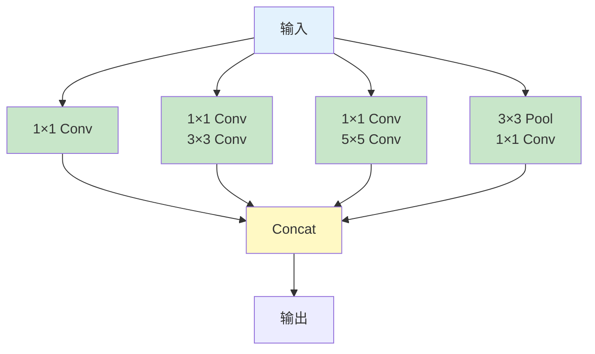
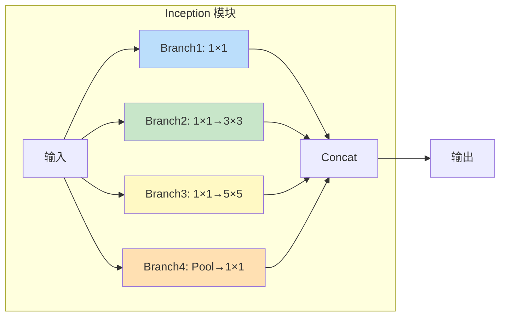
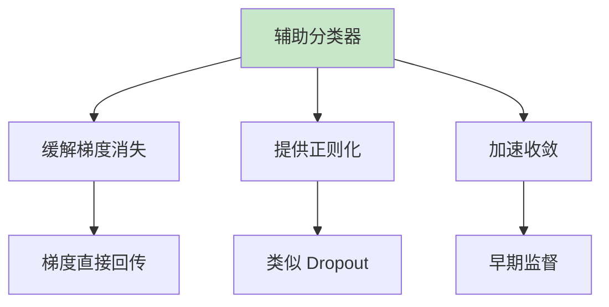

# GoogLeNet (Inception V1)

## 概述

GoogLeNet 是由 Google 的 Christian Szegedy 等人于 2014 年提出的深度卷积神经网络，在 ILSVRC 2014 图像分类竞赛中以 6.67% 的 Top-5 错误率获得冠军。GoogLeNet 引入了 Inception 模块和辅助分类器等创新设计，在显著减少参数量的同时提升了性能，成为 CNN 架构设计的重要里程碑。

## 核心创新

### 1. Inception 模块



**设计思想：** 并行使用不同尺寸的卷积核，捕获多尺度特征。

### 2. 1×1 卷积降维

在 3×3 和 5×5 卷积前使用 1×1 卷积减少通道数，降低计算量。

### 3. 辅助分类器

在中间层添加辅助损失，缓解梯度消失，提供正则化。

### 4. 全局平均池化

替代全连接层，大幅减少参数。

## Inception 模块详解

### Inception V1 结构



**各分支作用：**
- Branch 1：捕获局部细节
- Branch 2：捕获中等范围特征
- Branch 3：捕获大范围特征
- Branch 4：池化特征 + 降维

### 计算量优化

**不使用 1×1 降维：**
```
输入：28×28×192
3×3 Conv (32 filters): 28×28×32×(3×3×192) = 144M FLOPs
5×5 Conv (64 filters): 28×28×64×(5×5×192) = 1204M FLOPs
总计：~1.35G FLOPs
```

**使用 1×1 降维：**
```
输入：28×28×192
1×1 Conv (96 filters): 28×28×96×(1×1×192) = 14.5M FLOPs
3×3 Conv (32 filters): 28×28×32×(3×3×96) = 23M FLOPs

1×1 Conv (16 filters): 28×28×16×(1×1×192) = 2.4M FLOPs
5×5 Conv (64 filters): 28×28×64×(5×5×16) = 100M FLOPs
总计：~140M FLOPs (减少 10 倍)
```

## PyTorch 代码示例

### Inception 模块实现

```python
import torch
import torch.nn as nn
import torch.nn.functional as F

class InceptionBlock(nn.Module):
    def __init__(self, in_channels, ch1x1, ch3x3red, ch3x3, ch5x5red, ch5x5, pool_proj):
        super().__init__()
        
        # Branch 1: 1x1 conv
        self.branch1 = nn.Sequential(
            nn.Conv2d(in_channels, ch1x1, kernel_size=1),
            nn.BatchNorm2d(ch1x1),
            nn.ReLU(inplace=True)
        )
        
        # Branch 2: 1x1 -> 3x3 conv
        self.branch2 = nn.Sequential(
            nn.Conv2d(in_channels, ch3x3red, kernel_size=1),
            nn.BatchNorm2d(ch3x3red),
            nn.ReLU(inplace=True),
            nn.Conv2d(ch3x3red, ch3x3, kernel_size=3, padding=1),
            nn.BatchNorm2d(ch3x3),
            nn.ReLU(inplace=True)
        )
        
        # Branch 3: 1x1 -> 5x5 conv
        self.branch3 = nn.Sequential(
            nn.Conv2d(in_channels, ch5x5red, kernel_size=1),
            nn.BatchNorm2d(ch5x5red),
            nn.ReLU(inplace=True),
            nn.Conv2d(ch5x5red, ch5x5, kernel_size=5, padding=2),
            nn.BatchNorm2d(ch5x5),
            nn.ReLU(inplace=True)
        )
        
        # Branch 4: 3x3 pool -> 1x1 conv
        self.branch4 = nn.Sequential(
            nn.MaxPool2d(kernel_size=3, stride=1, padding=1),
            nn.Conv2d(in_channels, pool_proj, kernel_size=1),
            nn.BatchNorm2d(pool_proj),
            nn.ReLU(inplace=True)
        )
    
    def forward(self, x):
        branch1 = self.branch1(x)
        branch2 = self.branch2(x)
        branch3 = self.branch3(x)
        branch4 = self.branch4(x)
        
        outputs = [branch1, branch2, branch3, branch4]
        return torch.cat(outputs, 1)

# 测试 Inception 模块
inception = InceptionBlock(
    in_channels=192,
    ch1x1=64,
    ch3x3red=96, ch3x3=128,
    ch5x5red=16, ch5x5=32,
    pool_proj=32
)

x = torch.randn(1, 192, 28, 28)
output = inception(x)
print(f"Inception 模块：{x.shape} -> {output.shape}")
print(f"输出通道：{output.shape[1]} = 64 + 128 + 32 + 32")
```

### GoogLeNet 完整实现

```python
class GoogLeNet(nn.Module):
    def __init__(self, num_classes=1000, aux_logits=True):
        super().__init__()
        self.aux_logits = aux_logits
        
        # 初始卷积
        self.conv1 = nn.Sequential(
            nn.Conv2d(3, 64, kernel_size=7, stride=2, padding=3),
            nn.BatchNorm2d(64),
            nn.ReLU(inplace=True),
            nn.MaxPool2d(kernel_size=3, stride=2, padding=1)
        )
        
        # 3×3 卷积降维
        self.conv2 = nn.Sequential(
            nn.Conv2d(64, 64, kernel_size=1),
            nn.BatchNorm2d(64),
            nn.ReLU(inplace=True),
            nn.Conv2d(64, 192, kernel_size=3, padding=1),
            nn.BatchNorm2d(192),
            nn.ReLU(inplace=True),
            nn.MaxPool2d(kernel_size=3, stride=2, padding=1)
        )
        
        # Inception 层
        self.inception3a = InceptionBlock(192, 64, 96, 128, 16, 32, 32)
        self.inception3b = InceptionBlock(256, 128, 128, 192, 32, 96, 64)
        self.maxpool3 = nn.MaxPool2d(kernel_size=3, stride=2, padding=1)
        
        self.inception4a = InceptionBlock(480, 192, 96, 208, 16, 48, 64)
        self.inception4b = InceptionBlock(512, 160, 112, 224, 24, 64, 64)
        self.inception4c = InceptionBlock(512, 128, 128, 256, 24, 64, 64)
        self.inception4d = InceptionBlock(512, 112, 144, 288, 32, 64, 64)
        self.inception4e = InceptionBlock(528, 256, 160, 320, 32, 128, 128)
        self.maxpool4 = nn.MaxPool2d(kernel_size=3, stride=2, padding=1)
        
        self.inception5a = InceptionBlock(832, 256, 160, 320, 32, 128, 128)
        self.inception5b = InceptionBlock(832, 384, 192, 384, 48, 128, 128)
        
        # 全局平均池化
        self.avgpool = nn.AdaptiveAvgPool2d((1, 1))
        self.dropout = nn.Dropout(0.4)
        self.fc = nn.Linear(1024, num_classes)
        
        # 辅助分类器
        if aux_logits:
            self.aux1 = InceptionAux(512, num_classes)
            self.aux2 = InceptionAux(528, num_classes)
    
    def forward(self, x):
        x = self.conv1(x)
        x = self.conv2(x)
        
        x = self.inception3a(x)
        x = self.inception3b(x)
        x = self.maxpool3(x)
        
        x = self.inception4a(x)
        aux1 = None
        if self.training and self.aux_logits:
            aux1 = self.aux1(x)
        
        x = self.inception4b(x)
        x = self.inception4c(x)
        x = self.inception4d(x)
        aux2 = None
        if self.training and self.aux_logits:
            aux2 = self.aux2(x)
        
        x = self.inception4e(x)
        x = self.maxpool4(x)
        
        x = self.inception5a(x)
        x = self.inception5b(x)
        
        x = self.avgpool(x)
        x = torch.flatten(x, 1)
        x = self.dropout(x)
        x = self.fc(x)
        
        if self.training:
            return x, aux1, aux2
        return x

class InceptionAux(nn.Module):
    def __init__(self, in_channels, num_classes):
        super().__init__()
        self.conv = nn.Conv2d(in_channels, 128, kernel_size=1)
        self.fc1 = nn.Linear(2048, 1024)
        self.fc2 = nn.Linear(1024, num_classes)
    
    def forward(self, x):
        x = F.avg_pool2d(x, kernel_size=5, stride=3)
        x = self.conv(x)
        x = F.adaptive_avg_pool2d(x, (1, 1))
        x = torch.flatten(x, 1)
        x = F.relu(self.fc1(x))
        x = self.dropout(x)
        x = self.fc2(x)
        return x

# 测试 GoogLeNet
model = GoogLeNet(num_classes=1000, aux_logits=True)
x = torch.randn(1, 3, 224, 224)
output, aux1, aux2 = model(x)
print(f"\nGoogLeNet: {x.shape} -> {output.shape}")
print(f"参数量：{sum(p.numel() for p in model.parameters()):,}")
```

## GoogLeNet 架构

### 完整网络结构

| 层 | 类型 | 输出尺寸 |
|---|------|---------|
| Conv1 | 7×7 Conv, 64, stride 2 | 112×112×64 |
| Pool1 | 3×3 MaxPool, stride 2 | 56×56×64 |
| Conv2 | 3×3 Conv, 192 | 56×56×192 |
| Pool2 | 3×3 MaxPool, stride 2 | 28×28×192 |
| Inception3a | Inception | 28×28×256 |
| Inception3b | Inception | 28×28×480 |
| Pool3 | 3×3 MaxPool, stride 2 | 14×14×480 |
| Inception4a-e | 5× Inception | 14×14×832 |
| Pool4 | 3×3 MaxPool, stride 2 | 7×7×832 |
| Inception5a-b | 2× Inception | 7×7×1024 |
| AvgPool | 全局平均池化 | 1×1×1024 |
| FC | 全连接 | 1000 |

### 参数量对比

| 模型 | 参数量 | FLOPs |
|-----|--------|-------|
| VGG-16 | 138M | 15.5G |
| GoogLeNet | 7M | 1.5G |
| ResNet-50 | 26M | 4.1G |

GoogLeNet 参数量仅为 VGG-16 的 5%，性能更优。

## 辅助分类器

### 作用



### 训练时的损失

$$Loss = Loss_{main} + 0.3 \times Loss_{aux1} + 0.3 \times Loss_{aux2}$$

测试时辅助分类器被丢弃。

## Inception 演进

### Inception V2/V3

- Batch Normalization
- 因子分解卷积（n×n → 1×n + n×1）
- 标签平滑

### Inception V4

- 与 ResNet 结合
- 更统一的架构

### Inception-ResNet

- 残差连接 + Inception 模块

## 总结

GoogLeNet 通过 Inception 模块的多尺度特征提取和 1×1 卷积降维，在大幅减少参数量的同时提升了性能。其设计理念（多分支、因子分解、全局池化）深刻影响了后续 CNN 架构的发展。
