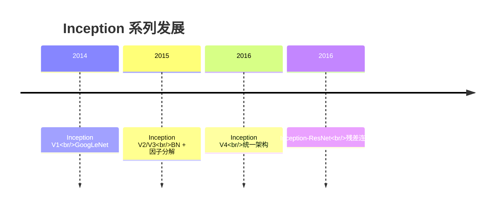
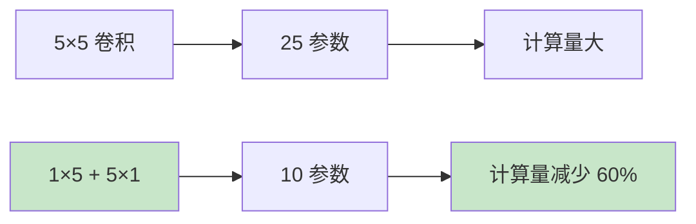
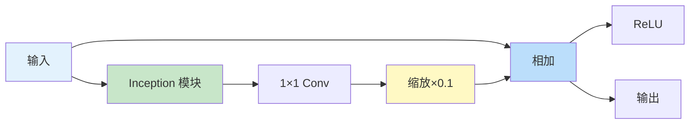

# Inception 系列网络

## 概述

Inception 系列网络是 Google 团队在 GoogLeNet（Inception V1）基础上持续改进的深度卷积神经网络架构，包括 Inception V2、V3、V4 和 Inception-ResNet。该系列通过创新的 Inception 模块设计，在计算效率和模型性能之间取得了优秀平衡，成为计算机视觉领域的经典架构。

## Inception 演进历程



## Inception V2/V3

### 核心改进

#### 1. Batch Normalization

在所有卷积层后添加 BN，加速训练并提高稳定性。

#### 2. 因子分解卷积

将 n×n 卷积分解为 1×n 和 n×1 卷积：



**优势：**
- 减少参数量
- 增加非线性（两个 ReLU）
- 计算效率提升

#### 3. 标签平滑（Label Smoothing）

防止模型对预测过于自信：
$$y_i^{smooth} = (1 - \epsilon) \cdot y_i + \frac{\epsilon}{K}$$

其中 $K$ 是类别数，$\epsilon$ 是平滑因子（通常 0.1）。

### Inception V3 模块

```python
import torch
import torch.nn as nn
import torch.nn.functional as F

class InceptionV3Block(nn.Module):
    def __init__(self, in_channels, ch1x1, ch3x3red, ch3x3, ch5x5red, ch5x5, pool_proj):
        super().__init__()
        
        # Branch 1: 1x1
        self.branch1 = nn.Sequential(
            nn.Conv2d(in_channels, ch1x1, 1),
            nn.BatchNorm2d(ch1x1),
            nn.ReLU(inplace=True)
        )
        
        # Branch 2: 1x1 -> 3x3
        self.branch2 = nn.Sequential(
            nn.Conv2d(in_channels, ch3x3red, 1),
            nn.BatchNorm2d(ch3x3red),
            nn.ReLU(inplace=True),
            nn.Conv2d(ch3x3red, ch3x3, 3, padding=1),
            nn.BatchNorm2d(ch3x3),
            nn.ReLU(inplace=True)
        )
        
        # Branch 3: 1x1 -> 3x3 -> 3x3 (因子分解)
        self.branch3 = nn.Sequential(
            nn.Conv2d(in_channels, ch5x5red, 1),
            nn.BatchNorm2d(ch5x5red),
            nn.ReLU(inplace=True),
            nn.Conv2d(ch5x5red, ch5x5, (1, 5), padding=(0, 2)),
            nn.BatchNorm2d(ch5x5),
            nn.ReLU(inplace=True),
            nn.Conv2d(ch5x5, ch5x5, (5, 1), padding=(2, 0)),
            nn.BatchNorm2d(ch5x5),
            nn.ReLU(inplace=True)
        )
        
        # Branch 4: Pool -> 1x1
        self.branch4 = nn.Sequential(
            nn.AvgPool2d(3, stride=1, padding=1),
            nn.Conv2d(in_channels, pool_proj, 1),
            nn.BatchNorm2d(pool_proj),
            nn.ReLU(inplace=True)
        )
    
    def forward(self, x):
        return torch.cat([
            self.branch1(x),
            self.branch2(x),
            self.branch3(x),
            self.branch4(x)
        ], dim=1)

# 测试
block = InceptionV3Block(288, 64, 64, 96, 64, 96, 96)
x = torch.randn(1, 288, 35, 35)
output = block(x)
print(f"Inception V3: {x.shape} -> {output.shape}")
```

### 因子分解实现

```python
class FactorizedConv(nn.Module):
    """将 n×n 卷积分解为 1×n 和 n×1"""
    def __init__(self, in_channels, out_channels, kernel_size):
        super().__init__()
        padding = kernel_size // 2
        
        self.conv1 = nn.Sequential(
            nn.Conv2d(in_channels, out_channels, (1, kernel_size), padding=(0, padding)),
            nn.BatchNorm2d(out_channels),
            nn.ReLU(inplace=True)
        )
        
        self.conv2 = nn.Sequential(
            nn.Conv2d(out_channels, out_channels, (kernel_size, 1), padding=(padding, 0)),
            nn.BatchNorm2d(out_channels),
            nn.ReLU(inplace=True)
        )
    
    def forward(self, x):
        x = self.conv1(x)
        x = self.conv2(x)
        return x

# 对比计算量
standard = nn.Conv2d(256, 256, 7, padding=3)
factorized = FactorizedConv(256, 256, 7)

print(f"\n7×7 卷积分解:")
print(f"  标准：{sum(p.numel() for p in standard.parameters()):,} 参数")
print(f"  分解：{sum(p.numel() for p in factorized.parameters()):,} 参数")
print(f"  减少：{(1 - sum(p.numel() for p in factorized.parameters()) / sum(p.numel() for p in standard.parameters())) * 100:.1f}%")
```

## Inception V4

### 架构特点

1. **更统一的结构**：简化了 Inception 模块设计
2. **更多的层**：更深的网络
3. **更规则的模式**：易于实现和优化

### Stem 模块

```python
class InceptionV4Stem(nn.Module):
    def __init__(self):
        super().__init__()
        self.conv1 = nn.Sequential(
            nn.Conv2d(3, 32, 3, stride=2),
            nn.BatchNorm2d(32),
            nn.ReLU(inplace=True)
        )
        
        self.conv2 = nn.Sequential(
            nn.Conv2d(32, 32, 3),
            nn.BatchNorm2d(32),
            nn.ReLU(inplace=True)
        )
        
        self.conv3 = nn.Sequential(
            nn.Conv2d(32, 64, 3, padding=1),
            nn.BatchNorm2d(64),
            nn.ReLU(inplace=True)
        )
        
        self.branch_pool = nn.MaxPool2d(3, stride=2)
        self.branch_conv = nn.Sequential(
            nn.Conv2d(64, 96, 3, stride=2),
            nn.BatchNorm2d(96),
            nn.ReLU(inplace=True)
        )
        
        # 后续还有更多层...
    
    def forward(self, x):
        x = self.conv1(x)
        x = self.conv2(x)
        x = self.conv3(x)
        
        x_pool = self.branch_pool(x)
        x_conv = self.branch_conv(x)
        x = torch.cat([x_pool, x_conv], dim=1)
        
        return x
```

## Inception-ResNet

### 残差 Inception 模块



### 关键设计

1. **残差连接**：Inception 模块输出 + 输入
2. **缩放因子**：Inception 输出乘以 0.1-0.3，稳定训练
3. **1×1 卷积投影**：匹配维度

### 实现

```python
class InceptionResNetBlock(nn.Module):
    def __init__(self, channels):
        super().__init__()
        
        # Inception 分支
        self.branch1 = nn.Conv2d(channels, 32, 1)
        
        self.branch2 = nn.Sequential(
            nn.Conv2d(channels, 32, 1),
            nn.Conv2d(32, 32, 3, padding=1)
        )
        
        self.branch3 = nn.Sequential(
            nn.Conv2d(channels, 32, 1),
            nn.Conv2d(32, 32, 3, padding=1),
            nn.Conv2d(32, 32, 3, padding=1)
        )
        
        # 1×1 卷积用于残差
        self.conv2d = nn.Conv2d(96, channels, 1)
        self.scale = 0.1
    
    def forward(self, x):
        residual = x
        
        b1 = self.branch1(x)
        b2 = self.branch2(x)
        b3 = self.branch3(x)
        
        out = torch.cat([b1, b2, b3], dim=1)
        out = self.conv2d(out)
        out = out * self.scale + residual
        out = F.relu(out)
        
        return out

# 测试
block = InceptionResNetBlock(256)
x = torch.randn(1, 256, 32, 32)
output = block(x)
print(f"Inception-ResNet: {x.shape} -> {output.shape}")
```

## 性能对比

### ImageNet 分类

| 模型 | Top-1 错误率 | Top-5 错误率 | 参数量 |
|-----|------------|------------|--------|
| Inception V1 | 25.2% | 8.2% | 7M |
| Inception V3 | 21.2% | 5.6% | 24M |
| Inception V4 | 20.0% | 5.0% | 43M |
| Inception-ResNet V2 | 19.9% | 4.9% | 56M |
| ResNet-152 | 21.7% | 6.0% | 60M |

### 计算效率

| 模型 | FLOPs | 推理时间 |
|-----|-------|---------|
| Inception V3 | 5.7G | 中等 |
| Inception V4 | 13G | 较慢 |
| Inception-ResNet V2 | 13G | 较慢 |
| ResNet-50 | 4.1G | 快 |

## 实际应用

### 迁移学习

```python
from torchvision import models

# 使用预训练 Inception V3
inception = models.inception_v3(weights=models.Inception_V3_Weights.IMAGENET1K_V1)

# 修改分类头
inception.fc = nn.Linear(2048, 10)  # 10 类

# 注意：Inception V3 需要 299×299 输入
```

### 特征提取

```python
def extract_inception_features(model, x):
    # 提取混合层特征
    features = model.Mixed_7c(x)
    return features

# 多尺度特征
# Inception 的多个分支提供丰富的多尺度特征
```

## 设计原则总结

### 1. 多尺度处理
- 并行使用不同尺寸卷积核
- 捕获多尺度特征

### 2. 计算效率
- 1×1 卷积降维
- 因子分解大卷积核

### 3. 训练稳定
- Batch Normalization
- 残差连接（V4 之后）
- 辅助分类器

### 4. 正则化
- 标签平滑
- Dropout

## 总结

Inception 系列通过持续创新，在计算效率和模型性能之间取得了优秀平衡。从 V1 的多分支设计，到 V2/V3 的 BN 和因子分解，再到 V4 和 Inception-ResNet 的统一架构和残差连接，该系列展示了架构设计的演进历程。尽管现代架构（如 EfficientNet）在某些方面超越了 Inception，但其设计理念仍深刻影响着 CNN 研究。
