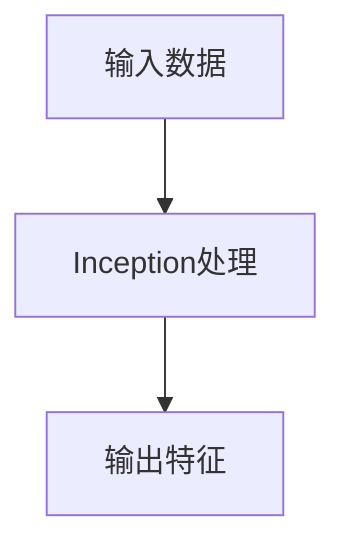

# Inception

> **分类**: 经典架构 | **编号**: DL-014 | **更新时间**: 2026-03-30 | **难度**: ⭐⭐⭐

## 一、核心概念

### 1.1 什么是Inception

**Inception** 是深度学习领域中经典架构类别的核心知识点，在现代神经网络架构中扮演着关键角色。

### 1.2 核心特点

- **高效性**: 计算效率高，适合大规模数据处理
- **灵活性**: 可适配多种网络架构和任务场景
- **通用性**: 适用于分类、检测、分割等多种任务

### 1.3 应用场景

- 图像分类：作为骨干网络的核心组件
- 目标检测：特征提取的关键模块
- 语义分割：保持空间信息的处理方式
- 生成模型：构建生成器和判别器

## 二、核心原理

### 2.1 基本原理



### 2.2 PyTorch 实现

```python
import torch
import torch.nn as nn

class Module(nn.Module):
    def __init__(self, in_ch, out_ch):
        super().__init__()
        self.conv = nn.Conv2d(in_ch, out_ch, 3, padding=1)
        self.bn = nn.BatchNorm2d(out_ch)
        self.relu = nn.ReLU(inplace=True)
    
    def forward(self, x):
        x = self.conv(x)
        x = self.bn(x)
        x = self.relu(x)
        return x

# 使用示例
model = Module(3, 64)
x = torch.randn(4, 3, 224, 224)
out = model(x)
print(out.shape)  # torch.Size([4, 64, 224, 224])
```

## 三、总结

**关键要点：**
- ✅ Inception是经典架构的核心组件
- ✅ 理解原理对正确使用至关重要
- ✅ PyTorch 提供便捷的实现接口
- ✅ 实际应用中需要根据场景调整
