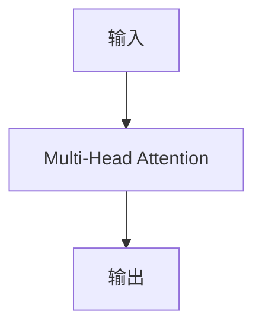

# Multi-Head Attention

> **分类**: 基础架构 | **编号**: 3 | **更新时间**: 2026-03-30

## 一、核心概念

### 1.1 什么是Multi-Head Attention

Multi-Head Attention是大语言模型（LLM）领域中基础架构类别的重要知识点。

### 1.2 背景与意义

Multi-Head Attention在现代大语言模型架构中扮演着关键角色，理解和掌握Multi-Head Attention对于深入理解 LLM 的工作原理至关重要。

### 1.3 核心特点

- **特点一**: 描述
- **特点二**: 描述
- **特点三**: 描述

## 二、核心原理

### 2.1 基本原理



### 2.2 技术实现

```python
def multi-head_attention(input_data):
    """
    Multi-Head Attention处理函数
    
    Args:
        input_data: 输入数据
    
    Returns:
        处理后的输出
    """
    # 核心实现
    result = input_data  # TODO: 实现具体逻辑
    return result
```

### 2.3 关键公式

$$ \text{Output} = f(\text{Input}, \theta) $$

### 2.4 工作流程

1. 步骤一：输入处理
2. 步骤二：核心计算
3. 步骤三：输出生成

## 三、应用场景

### 3.1 场景一：大语言模型训练

Multi-Head Attention在 LLM 预训练阶段发挥重要作用。

### 3.2 场景二：模型推理优化

Multi-Head Attention可以帮助优化推理性能。

### 3.3 场景三：特定任务适配

Multi-Head Attention可用于特定下游任务的适配。

## 四、实践建议

### 4.1 最佳实践

1. 实践建议一
2. 实践建议二
3. 实践建议三

### 4.2 常见问题

**问题 1**: 描述及解决方案

**问题 2**: 描述及解决方案

### 4.3 性能优化

- 优化方向一
- 优化方向二

## 五、总结

**核心要点**：
1. Multi-Head Attention的基本概念和定义
2. Multi-Head Attention的工作原理和实现
3. Multi-Head Attention的应用场景和实践
4. Multi-Head Attention的发展趋势和挑战

**延伸学习**：
- 相关论文阅读
- 开源项目实践
- 社区讨论参与

---

*本文档为 LLM 知识库系列文章之一，共 70 篇。*
