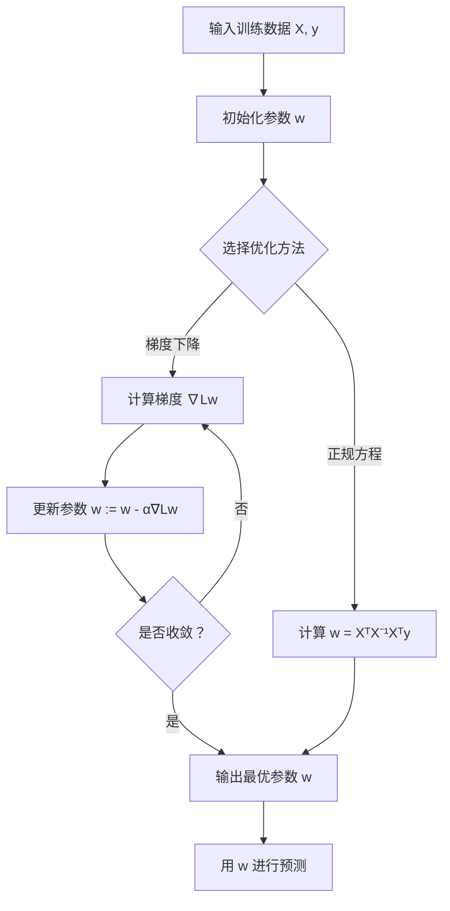
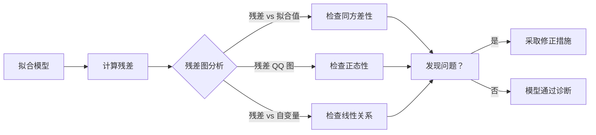

# 线性回归（Linear Regression）

## 1. 概述

线性回归是机器学习中最基础、最经典的监督学习算法之一，用于预测连续型目标变量。它通过建立自变量（特征）与因变量（目标）之间的线性关系模型，实现对未知数据的预测。

线性回归的核心思想是：**找到一条最佳拟合直线（或超平面），使得预测值与真实值之间的误差最小**。

### 1.1 数学定义

对于单变量线性回归，模型形式为：

```
y = w₀ + w₁x + ε
```

其中：
- `y` 是目标变量
- `x` 是特征变量
- `w₀` 是截距（bias）
- `w₁` 是权重（slope）
- `ε` 是误差项

对于多变量线性回归，模型形式为：

```
y = w₀ + w₁x₁ + w₂x₂ + ... + wₙxₙ + ε
```

用矩阵表示为：

```
y = Xw + ε
```

### 1.2 适用场景

- 房价预测
- 销售额预测
- 温度预测
- 股票价格趋势分析
- 任何连续值预测问题

## 2. 算法原理

### 2.1 损失函数

线性回归最常用的损失函数是**均方误差（MSE, Mean Squared Error）**：

```
MSE = (1/n) × Σ(yᵢ - ŷᵢ)²
```

其中：
- `n` 是样本数量
- `yᵢ` 是真实值
- `ŷᵢ` 是预测值

MSE 的优点：
- 处处可导，便于优化
- 对大误差敏感，能更好地惩罚异常值
- 有明确的统计意义（高斯噪声假设下的最大似然估计）

### 2.2 参数求解方法

#### 方法一：正规方程（Normal Equation）

通过解析解直接计算最优参数：

```
w = (XᵀX)⁻¹Xᵀy
```

**优点：**
- 一次性求解，无需迭代
- 精确解

**缺点：**
- 需要计算矩阵逆，复杂度 O(n³)
- 当特征数量很大时计算成本高
- XᵀX 可能不可逆

#### 方法二：梯度下降（Gradient Descent）

通过迭代方式逐步优化参数：

```
w := w - α × ∇L(w)
```

其中：
- `α` 是学习率
- `∇L(w)` 是损失函数的梯度

**梯度计算：**
```
∇L(w) = (2/n) × Xᵀ(Xw - y)
```

**优点：**
- 适用于大规模数据
- 可以在线学习

**缺点：**
- 需要选择合适的学习率
- 可能需要多次迭代才能收敛
- 对特征缩放敏感

### 2.3 算法流程图



## 3. Python 代码实现

### 3.1 使用 scikit-learn 实现

```python
import numpy as np
from sklearn.linear_model import LinearRegression
from sklearn.model_selection import train_test_split
from sklearn.metrics import mean_squared_error, r2_score
import matplotlib.pyplot as plt

# 1. 准备数据
np.random.seed(42)
n_samples = 100
X = np.random.randn(n_samples, 1) * 10
y = 3 * X.squeeze() + 5 + np.random.randn(n_samples) * 5

# 2. 划分训练集和测试集
X_train, X_test, y_train, y_test = train_test_split(
    X, y, test_size=0.2, random_state=42
)

# 3. 创建并训练模型
model = LinearRegression()
model.fit(X_train, y_train)

# 4. 输出模型参数
print(f"截距 (w0): {model.intercept_:.2f}")
print(f"系数 (w1): {model.coef_[0]:.2f}")

# 5. 进行预测
y_pred = model.predict(X_test)

# 6. 评估模型
mse = mean_squared_error(y_test, y_pred)
r2 = r2_score(y_test, y_pred)
print(f"均方误差 (MSE): {mse:.2f}")
print(f"R² 分数：{r2:.2f}")

# 7. 可视化
plt.figure(figsize=(10, 6))
plt.scatter(X_test, y_test, alpha=0.6, label='真实值')
plt.plot(X_test, y_pred, 'r-', linewidth=2, label='预测值')
plt.xlabel('X')
plt.ylabel('y')
plt.title('线性回归拟合效果')
plt.legend()
plt.grid(True, alpha=0.3)
plt.show()
```

### 3.2 从零实现梯度下降

```python
import numpy as np

class LinearRegressionGD:
    """从零实现线性回归（梯度下降）"""
    
    def __init__(self, learning_rate=0.01, n_iterations=1000):
        self.learning_rate = learning_rate
        self.n_iterations = n_iterations
        self.weights = None
        self.bias = None
        self.loss_history = []
    
    def fit(self, X, y):
        n_samples, n_features = X.shape
        
        # 初始化参数
        self.weights = np.zeros(n_features)
        self.bias = 0
        
        # 梯度下降迭代
        for i in range(self.n_iterations):
            # 前向传播
            y_pred = np.dot(X, self.weights) + self.bias
            
            # 计算损失
            loss = np.mean((y - y_pred) ** 2)
            self.loss_history.append(loss)
            
            # 计算梯度
            dw = (2 / n_samples) * np.dot(X.T, (y_pred - y))
            db = (2 / n_samples) * np.sum(y_pred - y)
            
            # 更新参数
            self.weights -= self.learning_rate * dw
            self.bias -= self.learning_rate * db
        
        return self
    
    def predict(self, X):
        return np.dot(X, self.weights) + self.bias
    
    def score(self, X, y):
        y_pred = self.predict(X)
        ss_res = np.sum((y - y_pred) ** 2)
        ss_tot = np.sum((y - np.mean(y)) ** 2)
        return 1 - (ss_res / ss_tot)

# 使用示例
X = np.random.randn(100, 1) * 10
y = 3 * X.squeeze() + 5 + np.random.randn(100) * 5

model = LinearRegressionGD(learning_rate=0.01, n_iterations=1000)
model.fit(X, y)
print(f"权重：{model.weights[0]:.2f}, 偏置：{model.bias:.2f}")
print(f"R² 分数：{model.score(X, y):.2f}")
```

## 4. 模型评估指标

### 4.1 均方误差（MSE）

```
MSE = (1/n) × Σ(yᵢ - ŷᵢ)²
```

- 值越小越好
- 对异常值敏感

### 4.2 均方根误差（RMSE）

```
RMSE = √MSE
```

- 与目标变量单位相同，更易解释

### 4.3 平均绝对误差（MAE）

```
MAE = (1/n) × Σ|yᵢ - ŷᵢ|
```

- 对异常值不敏感
- 更稳健

### 4.4 R² 分数（决定系数）

```
R² = 1 - (SS_res / SS_tot)
```

- 范围：(-∞, 1]
- 越接近 1 越好
- 表示模型解释的方差比例

## 5. 假设检验与诊断

### 5.1 线性回归的基本假设

1. **线性关系**：自变量与因变量之间存在线性关系
2. **独立性**：残差之间相互独立
3. **同方差性**：残差具有恒定方差
4. **正态性**：残差服从正态分布
5. **无多重共线性**：自变量之间不存在高度相关

### 5.2 残差分析



### 5.3 多重共线性检测

**方差膨胀因子（VIF）：**

```
VIFᵢ = 1 / (1 - Rᵢ²)
```

- VIF > 10 表示存在严重多重共线性
- 解决方法：删除相关变量、使用正则化、PCA 降维

## 6. 正则化线性回归

### 6.1 Ridge 回归（L2 正则化）

```
Loss = MSE + α × Σwᵢ²
```

- 缩小系数但不为零
- 适用于特征较多的情况

### 6.2 Lasso 回归（L1 正则化）

```
Loss = MSE + α × Σ|wᵢ|
```

- 可以将系数压缩为零
- 具有特征选择功能

### 6.3 Elastic Net

```
Loss = MSE + α₁ × Σ|wᵢ| + α₂ × Σwᵢ²
```

- 结合 L1 和 L2 正则化
- 平衡特征选择和系数稳定

## 7. 实战技巧

### 7.1 特征缩放

```python
from sklearn.preprocessing import StandardScaler

scaler = StandardScaler()
X_train_scaled = scaler.fit_transform(X_train)
X_test_scaled = scaler.transform(X_test)
```

### 7.2 处理异常值

```python
# 使用 IQR 方法检测异常值
Q1 = y.quantile(0.25)
Q3 = y.quantile(0.75)
IQR = Q3 - Q1
outliers = (y < Q1 - 1.5 * IQR) | (y > Q3 + 1.5 * IQR)
```

### 7.3 交叉验证

```python
from sklearn.model_selection import cross_val_score

scores = cross_val_score(model, X, y, cv=5, scoring='r2')
print(f"平均 R²: {scores.mean():.2f} (+/- {scores.std() * 2:.2f})")
```

## 8. 常见问题与解决方案

| 问题 | 症状 | 解决方案 |
|------|------|----------|
| 欠拟合 | 训练集和测试集表现都差 | 增加特征、使用多项式回归 |
| 过拟合 | 训练集好，测试集差 | 正则化、减少特征、增加数据 |
| 多重共线性 | 系数不稳定，VIF 高 | 删除相关变量、使用 Ridge |
| 异方差性 | 残差图呈漏斗形 | 变换目标变量、加权回归 |
| 非线性关系 | 残差图有模式 | 添加多项式特征、使用非线性模型 |

## 9. 总结

线性回归是机器学习的入门算法，具有以下特点：

**优点：**
- 简单易懂，解释性强
- 计算效率高
- 有完善的统计理论支持
- 可作为基准模型

**缺点：**
- 假设较强（线性、正态等）
- 对异常值敏感
- 无法捕捉复杂非线性关系

**最佳实践：**
1. 始终进行探索性数据分析（EDA）
2. 检查并验证模型假设
3. 使用交叉验证评估泛化能力
4. 考虑正则化防止过拟合
5. 进行残差分析诊断模型

线性回归虽然简单，但掌握其原理和技巧是学习更复杂模型的基础。
