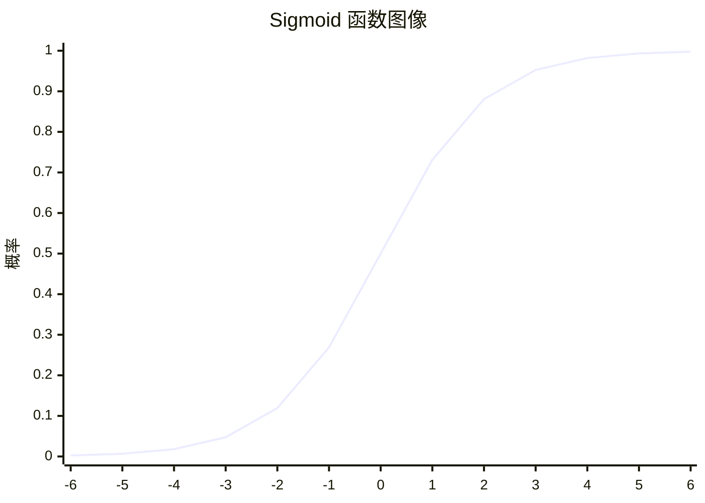
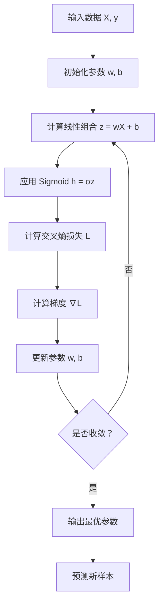
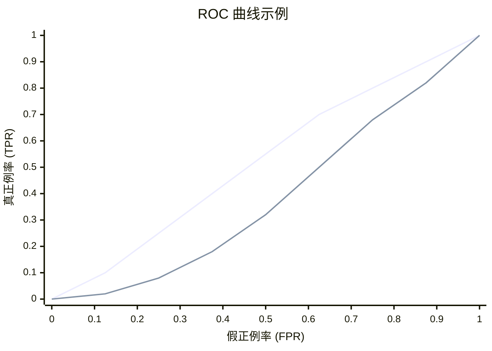

# 逻辑回归（Logistic Regression）

## 1. 概述

逻辑回归是一种经典的**分类算法**，尽管名字中有"回归"，但它实际上用于解决二分类和多分类问题。逻辑回归通过 Sigmoid 函数将线性回归的输出映射到 (0, 1) 区间，表示样本属于某一类别的概率。

**核心思想：** 使用逻辑函数（Sigmoid）将线性组合转换为概率，然后根据概率阈值进行分类。

### 1.1 与线性回归的区别

| 特性 | 线性回归 | 逻辑回归 |
|------|----------|----------|
| 任务类型 | 回归（连续值） | 分类（离散类别） |
| 输出 | 任意实数 | (0, 1) 概率 |
| 损失函数 | MSE | 交叉熵 |
| 激活函数 | 无 | Sigmoid |

### 1.2 适用场景

- 垃圾邮件检测
- 疾病诊断
- 用户流失预测
- 信用评分
- 点击率预测（CTR）
- 任何二分类问题

## 2. 算法原理

### 2.1 Sigmoid 函数

逻辑回归的核心是 Sigmoid 函数（也称为 Logistic 函数）：

```
σ(z) = 1 / (1 + e^(-z))
```

其中 `z = wᵀx + b`

**Sigmoid 函数特性：**
- 输出范围：(0, 1)
- 单调递增
- 关于点 (0, 0.5) 对称
- 导数形式简单：σ'(z) = σ(z)(1 - σ(z))



### 2.2 假设函数

逻辑回归的假设函数为：

```
h_w(x) = σ(wᵀx + b) = 1 / (1 + e^(-(wᵀx + b)))
```

输出解释：
- `h_w(x)` 表示样本属于正类（y=1）的概率
- `P(y=1|x) = h_w(x)`
- `P(y=0|x) = 1 - h_w(x)`

### 2.3 决策边界

```
如果 h_w(x) ≥ 0.5，则预测 y = 1
如果 h_w(x) < 0.5，则预测 y = 0
```

等价于：
```
如果 wᵀx + b ≥ 0，则预测 y = 1
如果 wᵀx + b < 0，则预测 y = 0
```

### 2.4 损失函数：交叉熵损失

对于二分类问题，使用**对数损失（Log Loss）**或**二元交叉熵**：

```
L(w) = -(1/n) × Σ[yᵢ × log(h_w(xᵢ)) + (1-yᵢ) × log(1-h_w(xᵢ))]
```

**为什么不用 MSE？**
- MSE 在逻辑回归中是非凸函数，有多个局部最优
- 交叉熵是凸函数，保证能找到全局最优
- 交叉熵对错误分类的惩罚更大

### 2.5 参数优化

使用梯度下降法优化参数：

```
梯度：∇L(w) = (1/n) × Xᵀ(h_w(X) - y)

更新规则：w := w - α × ∇L(w)
```



## 3. Python 代码实现

### 3.1 使用 scikit-learn 实现

```python
import numpy as np
from sklearn.linear_model import LogisticRegression
from sklearn.model_selection import train_test_split
from sklearn.metrics import (
    accuracy_score, precision_score, recall_score, 
    f1_score, roc_auc_score, classification_report,
    confusion_matrix
)
from sklearn.datasets import make_classification
import matplotlib.pyplot as plt
import seaborn as sns

# 1. 生成模拟数据
X, y = make_classification(
    n_samples=1000, n_features=20, n_informative=15,
    n_redundant=5, random_state=42
)

# 2. 划分数据集
X_train, X_test, y_train, y_test = train_test_split(
    X, y, test_size=0.2, random_state=42, stratify=y
)

# 3. 创建并训练模型
model = LogisticRegression(
    penalty='l2',      # L2 正则化
    C=1.0,            # 正则化强度的倒数
    solver='lbfgs',   # 优化算法
    max_iter=1000,
    random_state=42
)
model.fit(X_train, y_train)

# 4. 预测
y_pred = model.predict(X_test)
y_pred_proba = model.predict_proba(X_test)[:, 1]

# 5. 评估模型
print("=== 模型评估 ===")
print(f"准确率 (Accuracy): {accuracy_score(y_test, y_pred):.4f}")
print(f"精确率 (Precision): {precision_score(y_test, y_pred):.4f}")
print(f"召回率 (Recall): {recall_score(y_test, y_pred):.4f}")
print(f"F1 分数：{f1_score(y_test, y_pred):.4f}")
print(f"ROC-AUC: {roc_auc_score(y_test, y_pred_proba):.4f}")

print("\n=== 分类报告 ===")
print(classification_report(y_test, y_pred))

print("\n=== 混淆矩阵 ===")
cm = confusion_matrix(y_test, y_pred)
sns.heatmap(cm, annot=True, fmt='d', cmap='Blues')
plt.title('混淆矩阵')
plt.ylabel('真实标签')
plt.xlabel('预测标签')
plt.show()

# 6. 特征重要性（系数绝对值）
coef_importance = np.abs(model.coef_[0])
top_features = np.argsort(coef_importance)[-10:][::-1]
print("\n=== Top 10 重要特征 ===")
for i, idx in enumerate(top_features):
    print(f"{i+1}. 特征 {idx}: 系数 = {model.coef_[0][idx]:.4f}")
```

### 3.2 从零实现逻辑回归

```python
import numpy as np

class LogisticRegressionCustom:
    """从零实现逻辑回归"""
    
    def __init__(self, learning_rate=0.01, n_iterations=1000, threshold=0.5):
        self.learning_rate = learning_rate
        self.n_iterations = n_iterations
        self.threshold = threshold
        self.weights = None
        self.bias = None
        self.loss_history = []
    
    def _sigmoid(self, z):
        """Sigmoid 激活函数"""
        # 防止数值溢出
        z = np.clip(z, -500, 500)
        return 1 / (1 + np.exp(-z))
    
    def _compute_loss(self, y_true, y_pred_proba):
        """计算交叉熵损失"""
        epsilon = 1e-15  # 防止 log(0)
        y_pred_proba = np.clip(y_pred_proba, epsilon, 1 - epsilon)
        loss = -np.mean(
            y_true * np.log(y_pred_proba) + 
            (1 - y_true) * np.log(1 - y_pred_proba)
        )
        return loss
    
    def fit(self, X, y):
        n_samples, n_features = X.shape
        
        # 初始化参数
        self.weights = np.zeros(n_features)
        self.bias = 0
        
        # 梯度下降
        for i in range(self.n_iterations):
            # 前向传播
            linear_model = np.dot(X, self.weights) + self.bias
            y_pred_proba = self._sigmoid(linear_model)
            
            # 计算损失
            loss = self._compute_loss(y, y_pred_proba)
            self.loss_history.append(loss)
            
            # 计算梯度
            dw = (1 / n_samples) * np.dot(X.T, (y_pred_proba - y))
            db = (1 / n_samples) * np.sum(y_pred_proba - y)
            
            # 更新参数
            self.weights -= self.learning_rate * dw
            self.bias -= self.learning_rate * db
        
        return self
    
    def predict_proba(self, X):
        """返回属于正类的概率"""
        linear_model = np.dot(X, self.weights) + self.bias
        return self._sigmoid(linear_model)
    
    def predict(self, X):
        """返回预测类别"""
        proba = self.predict_proba(X)
        return (proba >= self.threshold).astype(int)
    
    def score(self, X, y):
        """计算准确率"""
        predictions = self.predict(X)
        return np.mean(predictions == y)

# 使用示例
X = np.random.randn(1000, 10)
y = (np.sum(X[:, :5] * 2, axis=1) + np.random.randn(1000) * 0.5 > 0).astype(int)

model = LogisticRegressionCustom(learning_rate=0.1, n_iterations=1000)
model.fit(X, y)
print(f"训练集准确率：{model.score(X, y):.4f}")
```

## 4. 多分类逻辑回归

逻辑回归可以扩展为多分类问题，常用策略：

### 4.1 One-vs-Rest (OvR)

为每个类别训练一个二分类器：
- 类别 i vs 其他所有类别
- 选择概率最高的类别

### 4.2 Softmax 回归（Multinomial Logistic Regression）

使用 Softmax 函数输出多类别概率：

```
P(y=k|x) = e^(wₖᵀx) / Σⱼ e^(wⱼᵀx)
```


### 4.3 scikit-learn 实现多分类

```python
from sklearn.linear_model import LogisticRegression

# OvR 策略
model_ovr = LogisticRegression(multi_class='ovr', solver='lbfgs')

# Softmax 策略
model_softmax = LogisticRegression(multi_class='multinomial', solver='lbfgs')

model_softmax.fit(X_train, y_train)
```

## 5. 正则化

逻辑回归容易过拟合，常用正则化方法：

### 5.1 L2 正则化（Ridge）

```
Loss = 交叉熵 + (C/2) × ||w||²
```

- 默认选项
- 系数缩小但不为零

### 5.2 L1 正则化（Lasso）

```
Loss = 交叉熵 + C × ||w||₁
```

- 产生稀疏解
- 特征选择

### 5.3 Elastic Net

```
Loss = 交叉熵 + C₁ × ||w||₁ + (C₂/2) × ||w||²
```

- 结合 L1 和 L2

```python
# L1 正则化
model_l1 = LogisticRegression(penalty='l1', solver='liblinear', C=1.0)

# L2 正则化
model_l2 = LogisticRegression(penalty='l2', solver='lbfgs', C=1.0)

# Elastic Net
model_en = LogisticRegression(penalty='elasticnet', solver='saga', 
                               C=1.0, l1_ratio=0.5)
```

## 6. 模型评估指标

### 6.1 混淆矩阵

| | 预测正例 | 预测负例 |
|---|---|---|
| **真实正例** | TP (真正例) | FN (假负例) |
| **真实负例** | FP (假正例) | TN (真负例) |

### 6.2 核心指标

```
准确率 (Accuracy) = (TP + TN) / (TP + TN + FP + FN)
精确率 (Precision) = TP / (TP + FP)
召回率 (Recall) = TP / (TP + FN)
F1 分数 = 2 × (Precision × Recall) / (Precision + Recall)
```

### 6.3 ROC 曲线与 AUC



- **ROC 曲线**：TPR vs FPR
- **AUC**：曲线下面积，越接近 1 越好
- AUC = 0.5 表示随机猜测
- AUC > 0.8 表示模型优秀

## 7. 类别不平衡处理

### 7.1 问题描述

当正负样本比例严重失衡时（如 1:100），模型会倾向于预测多数类。

### 7.2 解决方案

```python
# 方法 1：调整类别权重
model = LogisticRegression(class_weight='balanced')  # 自动调整
# 或手动指定
model = LogisticRegression(class_weight={0: 1, 1: 10})

# 方法 2：过采样（SMOTE）
from imblearn.over_sampling import SMOTE
smote = SMOTE(random_state=42)
X_resampled, y_resampled = smote.fit_resample(X_train, y_train)

# 方法 3：欠采样
from imblearn.under_sampling import RandomUnderSampler
rus = RandomUnderSampler(random_state=42)
X_resampled, y_resampled = rus.fit_resample(X_train, y_train)

# 方法 4：调整阈值
y_pred = (model.predict_proba(X_test)[:, 1] > 0.3).astype(int)  # 降低阈值
```

## 8. 实战技巧

### 8.1 特征缩放

```python
from sklearn.preprocessing import StandardScaler

scaler = StandardScaler()
X_train_scaled = scaler.fit_transform(X_train)
X_test_scaled = scaler.transform(X_test)

# 注意：逻辑回归对特征缩放敏感，建议始终缩放
```

### 8.2 超参数调优

```python
from sklearn.model_selection import GridSearchCV

param_grid = {
    'C': [0.001, 0.01, 0.1, 1, 10, 100],
    'penalty': ['l1', 'l2'],
    'solver': ['liblinear', 'saga']
}

grid_search = GridSearchCV(
    LogisticRegression(max_iter=1000),
    param_grid,
    cv=5,
    scoring='roc_auc',
    n_jobs=-1
)
grid_search.fit(X_train, y_train)

print(f"最佳参数：{grid_search.best_params_}")
print(f"最佳 AUC: {grid_search.best_score_:.4f}")
```

### 8.3 学习曲线

```python
from sklearn.model_selection import learning_curve

train_sizes, train_scores, test_scores = learning_curve(
    model, X, y, cv=5, scoring='roc_auc',
    train_sizes=np.linspace(0.1, 1.0, 10)
)

# 绘制学习曲线判断欠拟合/过拟合
```

## 9. 常见问题与解决方案

| 问题 | 症状 | 解决方案 |
|------|------|----------|
| 欠拟合 | 训练集和测试集 AUC 都低 | 增加特征、降低正则化强度 |
| 过拟合 | 训练集 AUC 高，测试集低 | 增加正则化、减少特征、增加数据 |
| 类别不平衡 | 多数类准确率高，少数类低 | class_weight、重采样、调整阈值 |
| 不收敛 | 警告信息 "did not converge" | 增加 max_iter、缩放特征、调整学习率 |
| 多重共线性 | 系数不稳定 | 删除相关特征、使用正则化 |

## 10. 总结

逻辑回归是分类问题的基石算法：

**优点：**
- 简单高效，易于实现
- 输出概率，可解释性强
- 可添加正则化防止过拟合
- 训练速度快，适合大规模数据
- 可作为深度学习的最后一层

**缺点：**
- 只能处理线性可分问题
- 对特征工程依赖较大
- 对异常值敏感
- 无法自动学习特征交互

**最佳实践：**
1. 始终进行特征缩放
2. 处理类别不平衡问题
3. 使用交叉验证选择正则化参数
4. 根据业务需求选择合适的评估指标
5. 检查系数符号和大小验证模型合理性

逻辑回归虽然简单，但在工业界广泛应用，是每位数据科学家必须掌握的算法。
