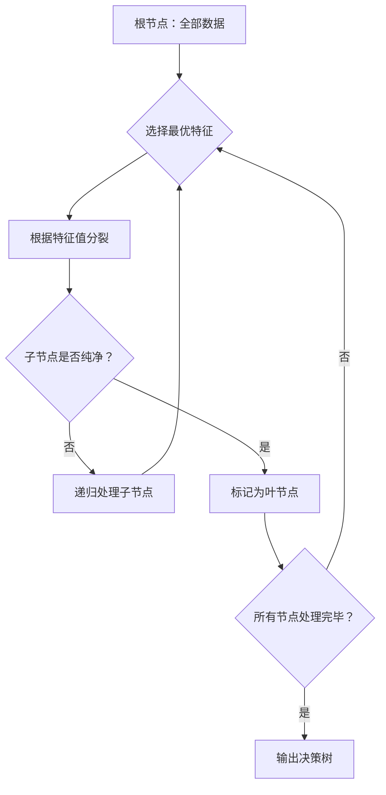
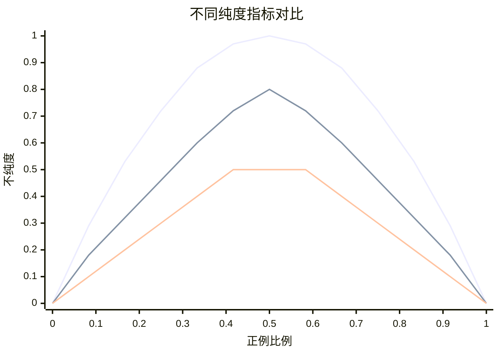
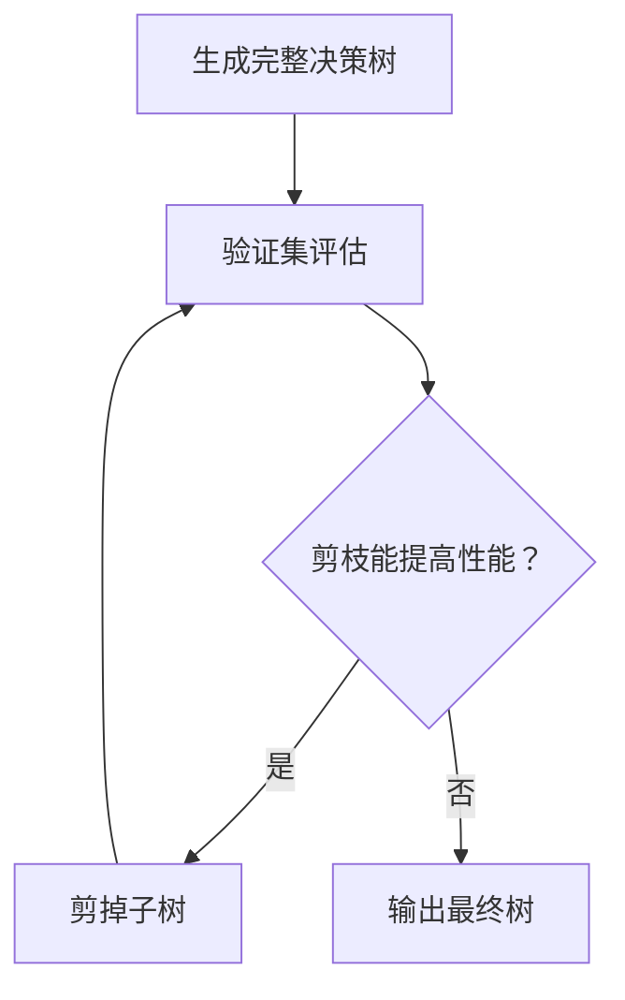
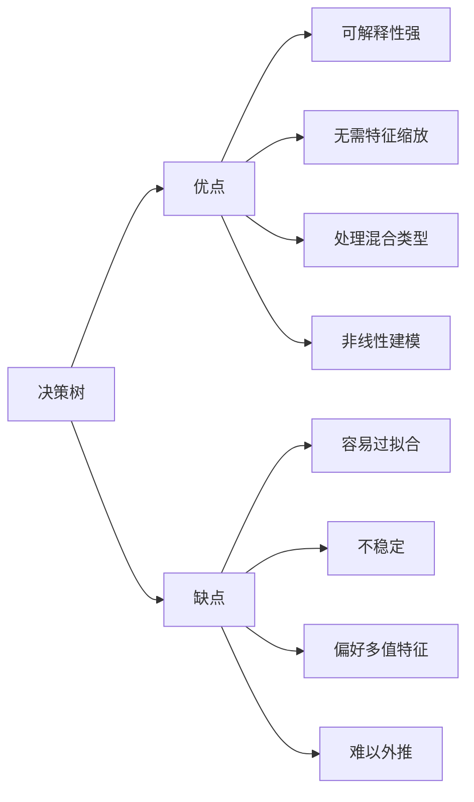

# 决策树（Decision Tree）

## 1. 概述

决策树是一种**监督学习算法**，可用于分类和回归任务。它通过一系列 if-then 规则对数据进行划分，形成树状结构。决策树直观易懂，是集成学习（如随机森林、XGBoost）的基础。

**核心思想：** 通过特征测试条件递归地将数据集划分为更纯净的子集，直到满足停止条件。

### 1.1 树的结构

```
根节点 (Root Node)
├── 内部节点 (Internal Node) - 特征测试
│   ├── 分支 (Branch) - 测试结果
│   │   └── 叶节点 (Leaf Node) - 最终预测
│   └── 分支
└── 内部节点
```

### 1.2 适用场景

- 客户流失预测
- 医疗诊断
- 信用风险评估
- 特征重要性分析
- 需要可解释性的场景
- 表格数据处理

### 1.3 算法变体

| 算法 | 任务类型 | 分裂标准 |
|------|----------|----------|
| ID3 | 分类 | 信息增益 |
| C4.5 | 分类 | 信息增益率 |
| CART | 分类/回归 | 基尼系数/MSE |

## 2. 算法原理

### 2.1 基本流程



### 2.2 特征选择标准

#### 2.2.1 信息增益（ID3）

**熵（Entropy）：** 衡量数据集的不确定性

```
Entropy(D) = -Σ(pᵢ × log₂(pᵢ))
```

**信息增益（Information Gain）：**

```
Gain(D, A) = Entropy(D) - Σ(|Dᵥ|/|D| × Entropy(Dᵥ))
```

选择信息增益最大的特征进行分裂。

#### 2.2.2 信息增益率（C4.5）

解决信息增益偏好多值特征的问题：

```
GainRatio(D, A) = Gain(D, A) / IV(A)
```

其中 IV(A) 是特征 A 的固有值（Intrinsic Value）：

```
IV(A) = -Σ(|Dᵥ|/|D| × log₂(|Dᵥ|/|D|))
```

#### 2.2.3 基尼系数（CART）

**基尼指数（Gini Index）：**

```
Gini(D) = 1 - Σ(pᵢ²)
```

**基尼增益：**

```
GiniGain(D, A) = Gini(D) - Σ(|Dᵥ|/|D| × Gini(Dᵥ))
```

选择基尼增益最大的特征。



### 2.3 回归树的分裂标准

对于回归问题，使用**均方误差（MSE）**或**平均绝对误差（MAE）**：

```
MSE(D) = (1/|D|) × Σ(yᵢ - mean(y))²
```

选择使 MSE 减少最多的特征和分裂点。

### 2.4 停止条件

递归分裂在以下情况停止：

1. 节点纯度达到阈值（所有样本同类别）
2. 达到最大深度
3. 节点样本数少于最小值
4. 没有特征可用
5. 信息增益/基尼增益低于阈值

## 3. Python 代码实现

### 3.1 使用 scikit-learn 实现

```python
import numpy as np
from sklearn.tree import DecisionTreeClassifier, DecisionTreeRegressor
from sklearn.model_selection import train_test_split, cross_val_score
from sklearn.metrics import accuracy_score, classification_report
from sklearn.datasets import make_classification
import matplotlib.pyplot as plt
from sklearn import tree

# 1. 生成数据
X, y = make_classification(
    n_samples=1000, n_features=10, n_informative=8,
    n_redundant=2, random_state=42
)

# 2. 划分数据集
X_train, X_test, y_train, y_test = train_test_split(
    X, y, test_size=0.2, random_state=42, stratify=y
)

# 3. 创建并训练模型
clf = DecisionTreeClassifier(
    criterion='gini',        # 分裂标准：'gini' 或 'entropy'
    max_depth=5,            # 最大深度
    min_samples_split=20,   # 内部节点分裂所需最小样本数
    min_samples_leaf=10,    # 叶节点最小样本数
    max_features='sqrt',    # 最佳分裂考虑的特征数
    random_state=42
)
clf.fit(X_train, y_train)

# 4. 预测与评估
y_pred = clf.predict(X_test)
print(f"准确率：{accuracy_score(y_test, y_pred):.4f}")
print("\n分类报告:")
print(classification_report(y_test, y_pred))

# 5. 特征重要性
importances = clf.feature_importances_
indices = np.argsort(importances)[::-1]

print("\n特征重要性排名:")
for i in range(10):
    print(f"{i+1}. 特征 {indices[i]}: {importances[indices[i]]:.4f}")

# 6. 可视化决策树（前几层）
plt.figure(figsize=(20, 10))
tree.plot_tree(clf, max_depth=3, feature_names=[f'F{i}' for i in range(10)],
               class_names=['Class 0', 'Class 1'], filled=True)
plt.title('决策树可视化（前 3 层）')
plt.show()

# 7. 交叉验证
scores = cross_val_score(clf, X, y, cv=5, scoring='accuracy')
print(f"\n交叉验证准确率：{scores.mean():.4f} (+/- {scores.std() * 2:.4f})")
```

### 3.2 从零实现决策树（简化版）

```python
import numpy as np
from collections import Counter

class DecisionTreeClassifierCustom:
    """简化版决策树分类器"""
    
    def __init__(self, max_depth=5, min_samples_split=2, min_samples_leaf=1):
        self.max_depth = max_depth
        self.min_samples_split = min_samples_split
        self.min_samples_leaf = min_samples_leaf
        self.tree = None
    
    def _gini(self, y):
        """计算基尼系数"""
        counts = Counter(y)
        probs = np.array(list(counts.values())) / len(y)
        return 1 - np.sum(probs ** 2)
    
    def _information_gain(self, y, y_left, y_right):
        """计算信息增益"""
        n = len(y)
        n_left, n_right = len(y_left), len(y_right)
        
        if n_left == 0 or n_right == 0:
            return 0
        
        parent_gini = self._gini(y)
        child_gini = (n_left / n) * self._gini(y_left) + \
                     (n_right / n) * self._gini(y_right)
        
        return parent_gini - child_gini
    
    def _best_split(self, X, y):
        """找到最佳分裂点"""
        best_gain = -1
        best_feature = None
        best_threshold = None
        
        n_samples, n_features = X.shape
        
        for feature_idx in range(n_features):
            thresholds = np.unique(X[:, feature_idx])
            
            for threshold in thresholds:
                left_mask = X[:, feature_idx] <= threshold
                right_mask = ~left_mask
                
                if np.sum(left_mask) < self.min_samples_leaf or \
                   np.sum(right_mask) < self.min_samples_leaf:
                    continue
                
                y_left, y_right = y[left_mask], y[right_mask]
                gain = self._information_gain(y, y_left, y_right)
                
                if gain > best_gain:
                    best_gain = gain
                    best_feature = feature_idx
                    best_threshold = threshold
        
        return best_feature, best_threshold, best_gain
    
    def _build_tree(self, X, y, depth=0):
        """递归构建决策树"""
        n_samples = len(y)
        n_classes = len(np.unique(y))
        
        # 停止条件
        if (depth >= self.max_depth or 
            n_classes == 1 or 
            n_samples < self.min_samples_split):
            leaf_value = Counter(y).most_common(1)[0][0]
            return {'leaf': True, 'value': leaf_value}
        
        # 找到最佳分裂
        feature_idx, threshold, gain = self._best_split(X, y)
        
        if feature_idx is None or gain <= 0:
            leaf_value = Counter(y).most_common(1)[0][0]
            return {'leaf': True, 'value': leaf_value}
        
        # 分裂数据
        left_mask = X[:, feature_idx] <= threshold
        right_mask = ~left_mask
        
        # 递归构建子树
        left_subtree = self._build_tree(X[left_mask], y[left_mask], depth + 1)
        right_subtree = self._build_tree(X[right_mask], y[right_mask], depth + 1)
        
        return {
            'leaf': False,
            'feature': feature_idx,
            'threshold': threshold,
            'left': left_subtree,
            'right': right_subtree
        }
    
    def fit(self, X, y):
        self.tree = self._build_tree(X, y)
        return self
    
    def _predict_sample(self, x, node):
        """预测单个样本"""
        if node['leaf']:
            return node['value']
        
        if x[node['feature']] <= node['threshold']:
            return self._predict_sample(x, node['left'])
        else:
            return self._predict_sample(x, node['right'])
    
    def predict(self, X):
        return np.array([self._predict_sample(x, self.tree) for x in X])
    
    def score(self, X, y):
        return np.mean(self.predict(X) == y)

# 使用示例
X = np.random.randn(100, 5)
y = (X[:, 0] + X[:, 1] > 0).astype(int)

tree_model = DecisionTreeClassifierCustom(max_depth=3)
tree_model.fit(X, y)
print(f"训练集准确率：{tree_model.score(X, y):.4f}")
```

## 4. 剪枝技术

决策树容易过拟合，需要剪枝：

### 4.1 预剪枝（Pre-pruning）

在树生长过程中提前停止：

```python
clf = DecisionTreeClassifier(
    max_depth=5,              # 最大深度
    min_samples_split=20,     # 最小分裂样本数
    min_samples_leaf=10,      # 最小叶节点样本数
    min_impurity_decrease=0.01,  # 最小不纯度减少
    max_features='sqrt'       # 最大特征数
)
```

### 4.2 后剪枝（Post-pruning）

先生成完整树，再剪枝：



```python
# scikit-learn 使用成本复杂度剪枝
path = clf.cost_complexity_pruning_path(X_train, y_train)
ccp_alphas = path.ccp_alphas

# 选择最佳 alpha
from sklearn.model_selection import cross_val_score
cv_scores = []
for alpha in ccp_alphas:
    clf_pruned = DecisionTreeClassifier(random_state=42, ccp_alpha=alpha)
    scores = cross_val_score(clf_pruned, X_train, y_train, cv=5)
    cv_scores.append(scores.mean())

best_alpha = ccp_alphas[np.argmax(cv_scores)]
clf_final = DecisionTreeClassifier(random_state=42, ccp_alpha=best_alpha)
clf_final.fit(X_train, y_train)
```

## 5. 优缺点分析

### 5.1 优点

- **可解释性强**：树结构直观，易于理解和解释
- **无需特征缩放**：对特征的尺度不敏感
- **处理混合类型**：可同时处理数值和类别特征
- **非线性关系**：能捕捉特征间的非线性关系
- **特征选择**：自动进行特征选择
- **可视化**：可以可视化决策过程

### 5.2 缺点

- **容易过拟合**：树深度过大时泛化能力差
- **不稳定**：数据小变化可能导致树结构大变化
- **偏好取值多的特征**：信息增益偏向多值特征
- **难以表达线性关系**：需要多层分裂近似线性边界
- **不擅长外推**：无法预测训练数据范围外的值



## 6. 超参数调优

```python
from sklearn.model_selection import GridSearchCV

param_grid = {
    'max_depth': [3, 5, 7, 10, None],
    'min_samples_split': [2, 5, 10, 20],
    'min_samples_leaf': [1, 2, 4, 8],
    'max_features': ['sqrt', 'log2', None],
    'criterion': ['gini', 'entropy']
}

grid_search = GridSearchCV(
    DecisionTreeClassifier(random_state=42),
    param_grid,
    cv=5,
    scoring='accuracy',
    n_jobs=-1,
    verbose=1
)

grid_search.fit(X_train, y_train)

print(f"最佳参数：{grid_search.best_params_}")
print(f"最佳分数：{grid_search.best_score_:.4f}")
```

## 7. 决策边界可视化

```python
import matplotlib.pyplot as plt
from sklearn.datasets import make_moons

# 生成月牙形数据
X_moons, y_moons = make_moons(n_samples=300, noise=0.2, random_state=42)

# 训练不同深度的树
fig, axes = plt.subplots(1, 4, figsize=(16, 4))
depths = [1, 3, 5, 10]

for ax, depth in zip(axes, depths):
    clf = DecisionTreeClassifier(max_depth=depth, random_state=42)
    clf.fit(X_moons, y_moons)
    
    # 绘制决策边界
    x_min, x_max = X_moons[:, 0].min() - 0.5, X_moons[:, 0].max() + 0.5
    y_min, y_max = X_moons[:, 1].min() - 0.5, X_moons[:, 1].max() + 0.5
    xx, yy = np.meshgrid(np.arange(x_min, x_max, 0.02),
                         np.arange(y_min, y_max, 0.02))
    Z = clf.predict(np.c_[xx.ravel(), yy.ravel()])
    Z = Z.reshape(xx.shape)
    
    ax.contourf(xx, yy, Z, alpha=0.3, cmap='RdBu')
    ax.scatter(X_moons[:, 0], X_moons[:, 1], c=y_moons, cmap='RdBu', edgecolors='k')
    ax.set_title(f'最大深度 = {depth}')
    ax.set_xlabel('特征 1')
    ax.set_ylabel('特征 2')

plt.tight_layout()
plt.show()
```

## 8. 回归决策树

```python
from sklearn.tree import DecisionTreeRegressor
from sklearn.metrics import mean_squared_error, r2_score

# 生成回归数据
np.random.seed(42)
X_reg = np.sort(5 * np.random.rand(200, 1), axis=0)
y_reg = np.sin(X_reg).ravel() + np.random.randn(200) * 0.1

# 训练回归树
regressor = DecisionTreeRegressor(max_depth=5, random_state=42)
regressor.fit(X_reg, y_reg)

# 预测
X_test = np.arange(0.0, 5.0, 0.01).reshape(-1, 1)
y_pred = regressor.predict(X_test)

# 评估
mse = mean_squared_error(y_reg, regressor.predict(X_reg))
r2 = r2_score(y_reg, regressor.predict(X_reg))
print(f"MSE: {mse:.4f}, R²: {r2:.4f}")

# 可视化
plt.figure(figsize=(10, 6))
plt.scatter(X_reg, y_reg, alpha=0.5, label='训练数据')
plt.plot(X_test, y_pred, 'r-', linewidth=2, label='决策树预测')
plt.xlabel('X')
plt.ylabel('y')
plt.title('回归决策树')
plt.legend()
plt.show()
```

## 9. 实战技巧

### 9.1 处理类别特征

```python
from sklearn.preprocessing import LabelEncoder

# 方法 1：标签编码
le = LabelEncoder()
X_encoded = X.copy()
for col in categorical_columns:
    X_encoded[col] = le.fit_transform(X[col])

# 方法 2：独热编码（推荐）
from sklearn.preprocessing import OneHotEncoder
from sklearn.compose import ColumnTransformer

preprocessor = ColumnTransformer([
    ('cat', OneHotEncoder(handle_unknown='ignore'), categorical_columns),
    ('num', 'passthrough', numerical_columns)
])

X_processed = preprocessor.fit_transform(X)
```

### 9.2 特征重要性分析

```python
# 获取特征重要性
importances = clf.feature_importances_

# 绘制重要性图
plt.figure(figsize=(10, 6))
plt.barh(range(len(importances)), importances[np.argsort(importances)])
plt.yticks(range(len(importances)), feature_names[np.argsort(importances)])
plt.xlabel('重要性')
plt.title('特征重要性')
plt.tight_layout()
plt.show()

# 使用排列重要性（更可靠）
from sklearn.inspection import permutation_importance

perm_importance = permutation_importance(
    clf, X_test, y_test, n_repeats=10, random_state=42
)
```

### 9.3 处理不平衡数据

```python
# 使用 class_weight
clf = DecisionTreeClassifier(class_weight='balanced')

# 或使用采样
from imblearn.pipeline import Pipeline as ImbPipeline
from imblearn.over_sampling import SMOTE

pipeline = ImbPipeline([
    ('smote', SMOTE(random_state=42)),
    ('classifier', DecisionTreeClassifier(random_state=42))
])
pipeline.fit(X_train, y_train)
```

## 10. 总结

决策树是机器学习的基础算法：

**核心要点：**
1. 通过递归分裂构建预测模型
2. 使用信息增益、基尼系数等选择最优分裂
3. 需要剪枝防止过拟合
4. 可解释性强，适合需要透明度的场景

**最佳实践：**
- 使用交叉验证选择超参数
- 优先使用预剪枝控制复杂度
- 结合集成方法提升性能
- 可视化决策过程辅助理解

**进阶方向：**
- 随机森林（Bagging）
- GBDT/XGBoost（Boosting）
- 决策树作为基学习器

决策树是理解更复杂集成方法的基础，掌握其原理对深入学习机器学习至关重要。
