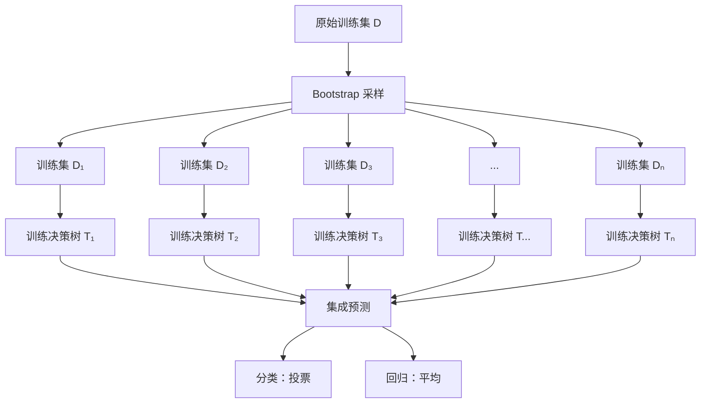
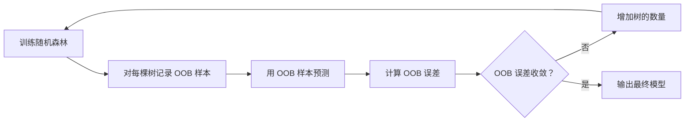
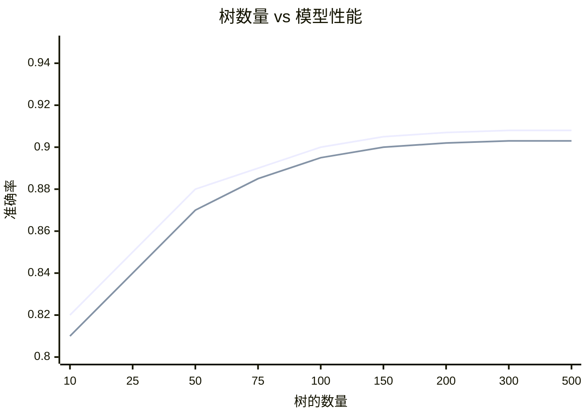
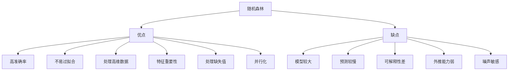

# 随机森林（Random Forest）

## 1. 概述

随机森林是一种**集成学习算法**，通过构建多个决策树并综合它们的预测结果来提高模型性能。它结合了 Bagging 思想和随机特征选择，是机器学习中最强大且广泛使用的算法之一。

**核心思想：** "三个臭皮匠，顶个诸葛亮"——多个弱学习器组合成强学习器。

### 1.1 为什么需要随机森林？

单棵决策树的问题：
- 容易过拟合
- 对训练数据变化敏感（高方差）
- 泛化能力有限

随机森林的解决方案：
- 多棵树投票/平均，降低方差
- 数据采样和特征采样增加多样性
- 泛化能力显著提升

### 1.2 适用场景

- 分类和回归任务
- 特征重要性评估
- 处理高维数据
- 缺失值处理
- 异常检测
- 需要鲁棒性的场景

## 2. 算法原理

### 2.1 Bagging 框架



### 2.2 双重随机性

随机森林的"随机"体现在两个方面：

#### 2.2.1 样本随机（Bootstrap）

- 每棵树使用有放回抽样的训练子集
- 约 63.2% 的原始样本被选中
- 约 36.8% 的样本未被选中（袋外样本 OOB）

#### 2.2.2 特征随机

- 每个节点分裂时，只考虑随机子集的特征
- 默认：`max_features = sqrt(n_features)`（分类）
- 默认：`max_features = n_features/3`（回归）

### 2.3 预测方式

**分类任务：** 多数投票
```
ŷ = mode({T₁(x), T₂(x), ..., Tₙ(x)})
```

**回归任务：** 平均预测
```
ŷ = (1/n) × ΣTᵢ(x)
```

### 2.4 袋外误差（OOB Error）

利用未被抽中的样本评估模型：

```
OOB 误差 = (1/|OOB|) × ΣL(yᵢ, ŷᵢ)  for i ∈ OOB
```

优点：无需单独验证集，充分利用数据。



## 3. Python 代码实现

### 3.1 使用 scikit-learn

```python
import numpy as np
from sklearn.ensemble import RandomForestClassifier, RandomForestRegressor
from sklearn.model_selection import train_test_split, cross_val_score
from sklearn.metrics import accuracy_score, classification_report, mean_squared_error
from sklearn.datasets import make_classification
import matplotlib.pyplot as plt
import seaborn as sns

# ============ 分类任务 ============
print("=== 随机森林分类 ===\n")

# 1. 生成数据
X, y = make_classification(
    n_samples=1000, n_features=20, n_informative=15,
    n_redundant=5, random_state=42
)

# 2. 划分数据集
X_train, X_test, y_train, y_test = train_test_split(
    X, y, test_size=0.2, random_state=42, stratify=y
)

# 3. 创建并训练模型
clf = RandomForestClassifier(
    n_estimators=100,        # 树的数量
    max_depth=10,           # 最大深度
    min_samples_split=5,    # 最小分裂样本数
    min_samples_leaf=2,     # 最小叶节点样本数
    max_features='sqrt',    # 最大特征数
    bootstrap=True,         # 使用 Bootstrap
    oob_score=True,         # 计算 OOB 分数
    n_jobs=-1,             # 并行处理
    random_state=42,
    verbose=0
)
clf.fit(X_train, y_train)

# 4. 评估
y_pred = clf.predict(X_test)
y_pred_proba = clf.predict_proba(X_test)

print(f"OOB 分数：{clf.oob_score_:.4f}")
print(f"测试集准确率：{accuracy_score(y_test, y_pred):.4f}")
print("\n分类报告:")
print(classification_report(y_test, y_pred))

# 5. 特征重要性
importances = clf.feature_importances_
indices = np.argsort(importances)[::-1]

plt.figure(figsize=(12, 6))
plt.bar(range(20), importances[indices])
plt.xlabel('特征索引')
plt.ylabel('重要性')
plt.title('随机森林特征重要性')
plt.tight_layout()
plt.show()

# Top 10 特征
print("\nTop 10 重要特征:")
for i in range(10):
    print(f"{i+1}. 特征 {indices[i]}: {importances[indices[i]]:.4f}")

# ============ 回归任务 ============
print("\n=== 随机森林回归 ===\n")

from sklearn.datasets import make_regression

X_reg, y_reg = make_regression(
    n_samples=1000, n_features=10, noise=10, random_state=42
)

X_train_reg, X_test_reg, y_train_reg, y_test_reg = train_test_split(
    X_reg, y_reg, test_size=0.2, random_state=42
)

reg = RandomForestRegressor(
    n_estimators=100,
    max_depth=15,
    min_samples_split=5,
    min_samples_leaf=2,
    max_features='sqrt',
    n_jobs=-1,
    random_state=42
)
reg.fit(X_train_reg, y_train_reg)

y_pred_reg = reg.predict(X_test_reg)
mse = mean_squared_error(y_test_reg, y_pred_reg)
r2 = reg.score(X_test_reg, y_test_reg)

print(f"测试集 MSE: {mse:.4f}")
print(f"测试集 R²: {r2:.4f}")
```

### 3.2 从零实现随机森林

```python
import numpy as np
from collections import Counter

class DecisionTreeStump:
    """简化决策树桩"""
    
    def __init__(self, max_depth=5, max_features=None):
        self.max_depth = max_depth
        self.max_features = max_features
        self.tree = None
    
    def _gini(self, y):
        counts = Counter(y)
        probs = np.array(list(counts.values())) / len(y)
        return 1 - np.sum(probs ** 2)
    
    def _best_split(self, X, y, feature_indices):
        best_gain = -1
        best_feature = None
        best_threshold = None
        
        for feature_idx in feature_indices:
            thresholds = np.unique(X[:, feature_idx])
            for threshold in thresholds:
                left_mask = X[:, feature_idx] <= threshold
                right_mask = ~left_mask
                
                if np.sum(left_mask) < 1 or np.sum(right_mask) < 1:
                    continue
                
                y_left, y_right = y[left_mask], y[right_mask]
                n = len(y)
                gain = self._gini(y) - (
                    len(y_left)/n * self._gini(y_left) +
                    len(y_right)/n * self._gini(y_right)
                )
                
                if gain > best_gain:
                    best_gain = gain
                    best_feature = feature_idx
                    best_threshold = threshold
        
        return best_feature, best_threshold
    
    def _build_tree(self, X, y, depth=0):
        if depth >= self.max_depth or len(np.unique(y)) == 1:
            return {'leaf': True, 'value': Counter(y).most_common(1)[0][0]}
        
        n_features = X.shape[1]
        n_select = self.max_features if self.max_features else n_features
        feature_indices = np.random.choice(n_features, n_select, replace=False)
        
        feature_idx, threshold = self._best_split(X, y, feature_indices)
        
        if feature_idx is None:
            return {'leaf': True, 'value': Counter(y).most_common(1)[0][0]}
        
        left_mask = X[:, feature_idx] <= threshold
        right_mask = ~left_mask
        
        return {
            'leaf': False,
            'feature': feature_idx,
            'threshold': threshold,
            'left': self._build_tree(X[left_mask], y[left_mask], depth+1),
            'right': self._build_tree(X[right_mask], y[right_mask], depth+1)
        }
    
    def fit(self, X, y):
        self.tree = self._build_tree(X, y)
        return self
    
    def _predict_one(self, x, node):
        if node['leaf']:
            return node['value']
        if x[node['feature']] <= node['threshold']:
            return self._predict_one(x, node['left'])
        return self._predict_one(x, node['right'])
    
    def predict(self, X):
        return np.array([self._predict_one(x, self.tree) for x in X])


class RandomForestClassifierCustom:
    """随机森林分类器（简化版）"""
    
    def __init__(self, n_estimators=10, max_depth=5, max_features='sqrt'):
        self.n_estimators = n_estimators
        self.max_depth = max_depth
        self.max_features = max_features
        self.trees = []
        self.oob_predictions = None
    
    def fit(self, X, y):
        n_samples, n_features = X.shape
        
        # 确定每个树考虑的特征数
        if self.max_features == 'sqrt':
            max_feat = int(np.sqrt(n_features))
        elif self.max_features == 'log2':
            max_feat = int(np.log2(n_features))
        else:
            max_feat = n_features
        
        self.trees = []
        oob_indices = np.zeros(n_samples)
        oob_predictions = np.zeros((n_samples, len(np.unique(y))))
        
        for i in range(self.n_estimators):
            # Bootstrap 采样
            indices = np.random.choice(n_samples, n_samples, replace=True)
            X_boot = X[indices]
            y_boot = y[indices]
            
            # 训练决策树
            tree = DecisionTreeStump(max_depth=self.max_depth, max_features=max_feat)
            tree.fit(X_boot, y_boot)
            self.trees.append(tree)
            
            # OOB 预测
            oob_mask = np.ones(n_samples, dtype=bool)
            oob_mask[np.unique(indices)] = False
            if np.sum(oob_mask) > 0:
                oob_indices[oob_mask] += 1
                oob_pred = tree.predict(X[oob_mask])
                for j, idx in enumerate(np.where(oob_mask)[0]):
                    oob_predictions[idx, oob_pred[j]] += 1
        
        # 计算 OOB 分数
        if np.sum(oob_indices > 0) > 0:
            oob_final_pred = np.argmax(oob_predictions[oob_indices > 0], axis=1)
            self.oob_score_ = np.mean(oob_final_pred == y[oob_indices > 0])
        else:
            self.oob_score_ = None
        
        return self
    
    def predict(self, X):
        # 所有树的预测
        predictions = np.array([tree.predict(X) for tree in self.trees])
        # 多数投票
        return np.array([Counter(predictions[:, i]).most_common(1)[0][0] 
                        for i in range(X.shape[0])])
    
    def score(self, X, y):
        return np.mean(self.predict(X) == y)

# 使用示例
X = np.random.randn(200, 10)
y = (np.sum(X[:, :5] > 0, axis=1) > 2).astype(int)

rf = RandomForestClassifierCustom(n_estimators=10, max_depth=5)
rf.fit(X, y)
print(f"OOB 分数：{rf.oob_score_:.4f}")
print(f"测试准确率：{rf.score(X, y):.4f}")
```

## 4. 超参数详解

### 4.1 核心参数

| 参数 | 说明 | 推荐值 |
|------|------|--------|
| `n_estimators` | 树的数量 | 100-500 |
| `max_depth` | 树的最大深度 | 10-None |
| `min_samples_split` | 内部节点最小样本数 | 2-10 |
| `min_samples_leaf` | 叶节点最小样本数 | 1-5 |
| `max_features` | 最大特征数 | 'sqrt'/'log2' |
| `bootstrap` | 是否使用 Bootstrap | True |

### 4.2 参数调优

```python
from sklearn.model_selection import RandomizedSearchCV
from scipy.stats import randint, uniform

param_dist = {
    'n_estimators': randint(50, 300),
    'max_depth': [5, 10, 15, 20, None],
    'min_samples_split': randint(2, 20),
    'min_samples_leaf': randint(1, 10),
    'max_features': ['sqrt', 'log2', 0.3, 0.5],
    'bootstrap': [True, False]
}

random_search = RandomizedSearchCV(
    RandomForestClassifier(random_state=42, n_jobs=-1),
    param_distributions=param_dist,
    n_iter=50,
    cv=5,
    scoring='accuracy',
    n_jobs=-1,
    random_state=42,
    verbose=1
)

random_search.fit(X_train, y_train)
print(f"最佳参数：{random_search.best_params_}")
print(f"最佳分数：{random_search.best_score_:.4f}")
```

## 5. 树数量与性能关系



**关键观察：**
- 树越多，性能越稳定
- 超过一定数量后性能饱和
- 不会过拟合（增加树只降低方差）

```python
# 分析树数量的影响
n_estimators_range = [10, 25, 50, 75, 100, 150, 200, 300]
train_scores = []
test_scores = []
oob_scores = []

for n_est in n_estimators_range:
    rf = RandomForestClassifier(n_estimators=n_est, oob_score=True, 
                                random_state=42, n_jobs=-1)
    rf.fit(X_train, y_train)
    train_scores.append(rf.score(X_train, y_train))
    test_scores.append(rf.score(X_test, y_test))
    oob_scores.append(rf.oob_score_)

plt.figure(figsize=(10, 6))
plt.plot(n_estimators_range, train_scores, 'b-o', label='训练集')
plt.plot(n_estimators_range, test_scores, 'g-s', label='测试集')
plt.plot(n_estimators_range, oob_scores, 'r-^', label='OOB')
plt.xlabel('树的数量')
plt.ylabel('准确率')
plt.title('树数量对性能的影响')
plt.legend()
plt.grid(True, alpha=0.3)
plt.show()
```

## 6. 特征重要性

### 6.1 基于不纯度的重要性

```python
# 获取特征重要性
importances = rf.feature_importances_

# 可视化
plt.figure(figsize=(12, 8))
indices = np.argsort(importances)[::-1]
plt.barh(range(len(importances)), importances[indices])
plt.yticks(range(len(importances)), [f'Feature {i}' for i in indices])
plt.xlabel('重要性分数')
plt.title('特征重要性（基于不纯度）')
plt.gca().invert_yaxis()
plt.tight_layout()
plt.show()
```

### 6.2 排列重要性（更可靠）

```python
from sklearn.inspection import permutation_importance

# 计算排列重要性
perm_importance = permutation_importance(
    rf, X_test, y_test,
    n_repeats=10,
    random_state=42,
    n_jobs=-1
)

# 可视化
sorted_idx = perm_importance.importances_mean.argsort()[::-1]
plt.figure(figsize=(12, 8))
plt.barh(range(len(sorted_idx)), perm_importance.importances_mean[sorted_idx])
plt.yticks(range(len(sorted_idx)), [f'Feature {i}' for i in sorted_idx])
plt.xlabel('重要性变化')
plt.title('排列特征重要性')
plt.tight_layout()
plt.show()
```

### 6.3 特征选择

```python
from sklearn.feature_selection import SelectFromModel

# 基于重要性选择特征
selector = SelectFromModel(rf, threshold='mean', prefit=True)
X_selected = selector.transform(X)
print(f"原始特征数：{X.shape[1]}")
print(f"选择后特征数：{X_selected.shape[1]}")

# 获取选择的特征索引
selected_mask = selector.get_support()
selected_features = np.where(selected_mask)[0]
print(f"选择的特征：{selected_features}")
```

## 7. 优缺点分析



### 7.1 优点

- **高准确率**：在大多数数据集上表现优秀
- **不易过拟合**：集成降低方差
- **处理高维数据**：随机特征选择有效
- **特征重要性**：内置特征选择能力
- **处理缺失值**：鲁棒性强
- **并行化**：树之间独立，易于并行
- **无需特征缩放**：对特征尺度不敏感

### 7.2 缺点

- **模型较大**：存储多棵树占用内存
- **预测较慢**：需要遍历所有树
- **可解释性差**：不如单棵树直观
- **外推能力弱**：无法预测范围外值
- **噪声敏感**：大量噪声特征影响性能
- **偏向高基数特征**：特征重要性可能有偏

## 8. 与其他算法对比

| 算法 | 准确率 | 训练速度 | 预测速度 | 可解释性 | 过拟合风险 |
|------|--------|----------|----------|----------|------------|
| 单棵决策树 | 中 | 快 | 快 | 高 | 高 |
| 随机森林 | 高 | 中 | 中 | 中 | 低 |
| XGBoost | 很高 | 中 | 快 | 低 | 中 |
| SVM | 高 | 慢 | 慢 | 低 | 中 |
| 神经网络 | 很高 | 慢 | 快 | 很低 | 中 |

## 9. 实战技巧

### 9.1 处理类别不平衡

```python
# 方法 1：class_weight
rf = RandomForestClassifier(class_weight='balanced', random_state=42)

# 方法 2：手动设置权重
class_counts = np.bincount(y_train)
class_weights = len(y_train) / (2 * class_counts)
rf = RandomForestClassifier(class_weight=dict(enumerate(class_weights)))

# 方法 3：结合 SMOTE
from imblearn.pipeline import Pipeline
from imblearn.over_sampling import SMOTE

pipeline = Pipeline([
    ('smote', SMOTE(random_state=42)),
    ('rf', RandomForestClassifier(random_state=42))
])
pipeline.fit(X_train, y_train)
```

### 9.2 概率校准

```python
from sklearn.calibration import CalibratedClassifierCV

# 校准概率
rf = RandomForestClassifier(n_estimators=100, random_state=42)
calibrated_rf = CalibratedClassifierCV(rf, method='sigmoid', cv=5)
calibrated_rf.fit(X_train, y_train)

# 使用校准后的概率
y_proba_calibrated = calibrated_rf.predict_proba(X_test)
```

### 9.3 增量学习（近似）

```python
# 随机森林本身不支持增量学习
# 但可以通过 Warm Start 近似

rf = RandomForestClassifier(n_estimators=100, warm_start=True, random_state=42)

# 第一批数据
rf.fit(X_batch1, y_batch1)

# 添加更多树
rf.n_estimators = 200
rf.fit(X_batch2, y_batch2)  # 在原有基础上增加 100 棵树
```

## 10. 总结

随机森林是机器学习的"瑞士军刀"：

**核心价值：**
1. 集成多棵树，显著提升泛化能力
2. 双重随机性（样本 + 特征）增加多样性
3. OOB 评估无需单独验证集
4. 内置特征重要性评估

**最佳实践：**
- 树数量：100-500（根据数据规模）
- 使用 OOB 分数快速评估
- 调整 max_features 控制多样性
- 结合排列重要性进行特征选择

**适用场景：**
- 表格数据分类/回归
- 特征重要性分析
- 基线模型建立
- 需要鲁棒性的生产环境

随机森林是每位数据科学家工具箱中的必备算法，在 Kaggle 竞赛和工业界都有广泛应用。
