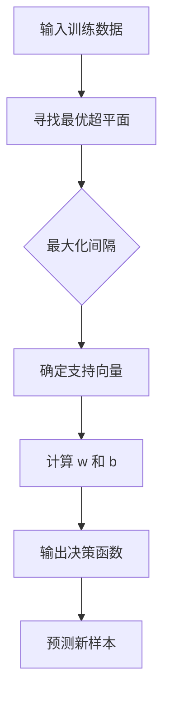
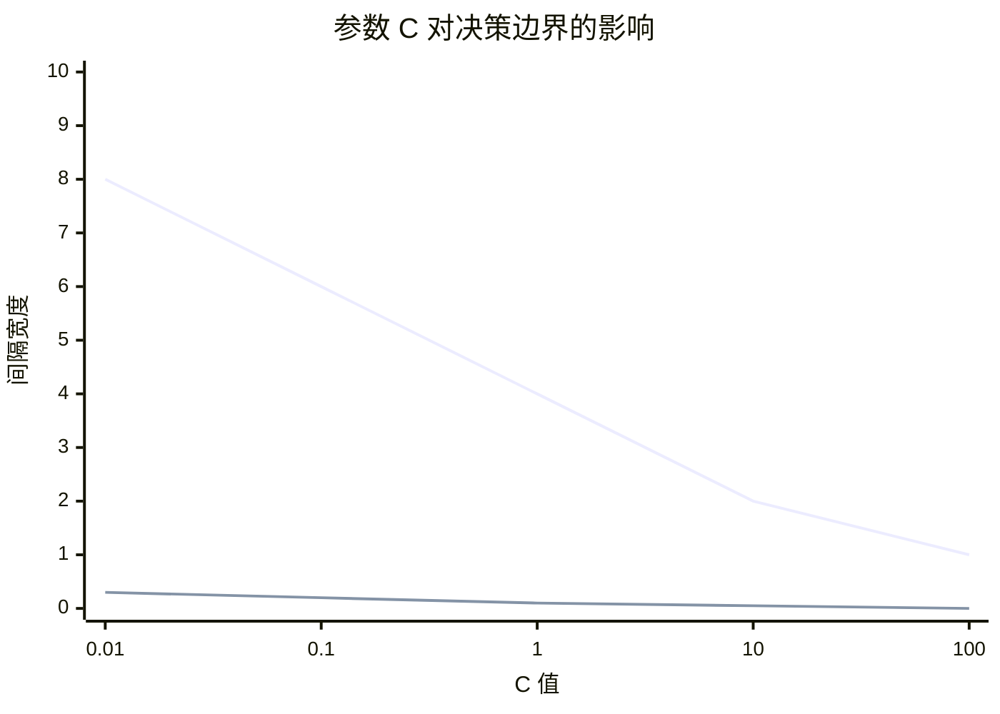
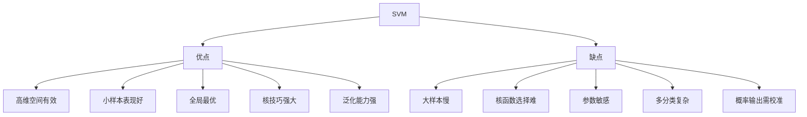

# 支持向量机（SVM, Support Vector Machine）

## 1. 概述

支持向量机是一种强大的**监督学习算法**，用于分类和回归任务。SVM 的核心思想是找到一个最优超平面，使得不同类别的样本之间的间隔（margin）最大化。

**核心思想：** 最大化分类间隔，提高泛化能力。

### 1.1 历史背景

- 1963 年：Vapnik 和 Lerner 提出原始概念
- 1992 年：Vapnik 等人引入核技巧
- 1995 年：Cortes 和 Vapnik 提出软间隔 SVM
- 2000 年代：成为最流行的机器学习算法之一

### 1.2 适用场景

- 文本分类
- 图像识别
- 生物信息学（基因分类）
- 手写数字识别
- 小样本高维数据
- 非线性分类问题

### 1.3 关键概念

| 概念 | 说明 |
|------|------|
| 支持向量 | 决定超平面位置的关键样本 |
| 间隔（Margin） | 支持向量到超平面的距离 |
| 核函数 | 将数据映射到高维空间 |
| 软间隔 | 允许部分样本分类错误 |

## 2. 算法原理

### 2.1 最大间隔分类器

对于线性可分数据，SVM 寻找最优超平面：

```
wᵀx + b = 0
```

**优化目标：**

```
最小化：||w||²/2

约束条件：yᵢ(wᵀxᵢ + b) ≥ 1, ∀i
```



### 2.2 支持向量

**定义：** 距离超平面最近的样本点，满足：

```
yᵢ(wᵀxᵢ + b) = 1
```

**关键性质：**
- 只有支持向量影响超平面位置
- 移除其他样本不影响模型
- 支持向量通常很少（稀疏性）

### 2.3 软间隔与正则化

对于线性不可分数据，引入松弛变量 ξ：

```
最小化：||w||²/2 + C × Σξᵢ

约束条件：yᵢ(wᵀxᵢ + b) ≥ 1 - ξᵢ, ξᵢ ≥ 0
```

**参数 C 的作用：**
- C 大：硬间隔，不允许错误（可能过拟合）
- C 小：软间隔，允许错误（可能欠拟合）



### 2.4 核技巧（Kernel Trick）

对于非线性问题，将数据映射到高维空间：

```
φ: x → φ(x)  (低维 → 高维)
```

**核函数：** 直接计算高维空间的内积

```
K(xᵢ, xⱼ) = φ(xᵢ)ᵀφ(xⱼ)
```

**常用核函数：**

| 核函数 | 公式 | 参数 | 适用场景 |
|--------|------|------|----------|
| 线性核 | xᵢᵀxⱼ | 无 | 线性可分 |
| 多项式核 | (γxᵢᵀxⱼ + r)^d | γ, r, d | 图像识别 |
| RBF 核 | exp(-γ\|\|xᵢ-xⱼ\|\|²) | γ | 通用 |
| Sigmoid 核 | tanh(γxᵢᵀxⱼ + r) | γ, r | 神经网络 |


### 2.5 对偶问题

通过拉格朗日乘子法，原始问题转化为对偶问题：

```
最大化：Σαᵢ - (1/2)ΣΣαᵢαⱼyᵢyⱼK(xᵢ, xⱼ)

约束条件：Σαᵢyᵢ = 0, 0 ≤ αᵢ ≤ C
```

**决策函数：**

```
f(x) = sign(ΣαᵢyᵢK(xᵢ, x) + b)
```

## 3. Python 代码实现

### 3.1 使用 scikit-learn

```python
import numpy as np
from sklearn import svm
from sklearn.model_selection import train_test_split, GridSearchCV
from sklearn.metrics import classification_report, accuracy_score
from sklearn.datasets import make_classification, make_circles
from sklearn.preprocessing import StandardScaler
import matplotlib.pyplot as plt

# ============ 线性 SVM ============
print("=== 线性 SVM ===\n")

# 1. 生成线性可分数据
X, y = make_classification(
    n_samples=200, n_features=2, n_informative=2,
    n_redundant=0, random_state=42
)

# 2. 特征缩放（SVM 对尺度敏感！）
scaler = StandardScaler()
X_scaled = scaler.fit_transform(X)

# 3. 划分数据集
X_train, X_test, y_train, y_test = train_test_split(
    X_scaled, y, test_size=0.3, random_state=42
)

# 4. 创建并训练线性 SVM
clf_linear = svm.SVC(
    kernel='linear',
    C=1.0,
    random_state=42
)
clf_linear.fit(X_train, y_train)

# 5. 评估
y_pred = clf_linear.predict(X_test)
print(f"准确率：{accuracy_score(y_test, y_pred):.4f}")
print("\n分类报告:")
print(classification_report(y_test, y_pred))

# 6. 支持向量
print(f"支持向量数量：{len(clf_linear.support_)}")
print(f"支持向量比例：{len(clf_linear.support_)/len(X_train):.2%}")

# ============ 非线性 SVM (RBF 核) ============
print("\n=== 非线性 SVM (RBF 核) ===\n")

# 1. 生成非线性数据（同心圆）
X_circles, y_circles = make_circles(
    n_samples=300, noise=0.1, factor=0.5, random_state=42
)

# 2. 特征缩放
X_circles_scaled = scaler.fit_transform(X_circles)

# 3. 训练 RBF 核 SVM
clf_rbf = svm.SVC(
    kernel='rbf',
    C=10.0,
    gamma='scale',  # 'scale' 或 'auto' 或具体数值
    random_state=42
)
clf_rbf.fit(X_circles_scaled, y_circles)

# 4. 评估
y_pred_rbf = clf_rbf.predict(X_circles_scaled)
print(f"训练集准确率：{accuracy_score(y_circles, y_pred_rbf):.4f}")

# 5. 可视化决策边界
def plot_decision_boundary(clf, X, y, title):
    plt.figure(figsize=(8, 6))
    
    # 创建网格
    x_min, x_max = X[:, 0].min() - 0.5, X[:, 0].max() + 0.5
    y_min, y_max = X[:, 1].min() - 0.5, X[:, 1].max() + 0.5
    xx, yy = np.meshgrid(np.arange(x_min, x_max, 0.02),
                         np.arange(y_min, y_max, 0.02))
    
    # 预测
    Z = clf.predict(np.c_[xx.ravel(), yy.ravel()])
    Z = Z.reshape(xx.shape)
    
    # 绘制
    plt.contourf(xx, yy, Z, alpha=0.3, cmap='RdBu')
    plt.scatter(X[:, 0], X[:, 1], c=y, cmap='RdBu', edgecolors='k', s=50)
    
    # 标记支持向量
    plt.scatter(clf.support_vectors_[:, 0], clf.support_vectors_[:, 1],
               s=100, facecolors='none', edgecolors='yellow', linewidth=2)
    
    plt.title(title)
    plt.xlabel('特征 1')
    plt.ylabel('特征 2')
    plt.show()

plot_decision_boundary(clf_rbf, X_circles_scaled, y_circles, 'SVM with RBF Kernel')
```

### 3.2 从零实现简化版 SVM

```python
import numpy as np

class SimpleSVM:
    """简化版线性 SVM（使用梯度下降）"""
    
    def __init__(self, C=1.0, learning_rate=0.001, n_iterations=1000):
        self.C = C
        self.learning_rate = learning_rate
        self.n_iterations = n_iterations
        self.w = None
        self.b = None
    
    def _hinge_loss(self, y_true, y_pred):
        """合页损失"""
        return np.maximum(0, 1 - y_true * y_pred)
    
    def fit(self, X, y):
        n_samples, n_features = X.shape
        
        # 将标签转换为 -1 和 1
        y_signed = np.where(y == 0, -1, 1)
        
        # 初始化参数
        self.w = np.zeros(n_features)
        self.b = 0
        
        # 梯度下降
        for _ in range(self.n_iterations):
            for i in range(n_samples):
                # 计算预测
                y_pred = np.dot(X[i], self.w) + self.b
                
                # 计算梯度
                if y_signed[i] * y_pred >= 1:
                    # 正确分类且间隔足够
                    dw = 2 * self.w
                else:
                    # 分类错误或间隔不足
                    dw = 2 * self.w - self.C * y_signed[i] * X[i]
                    db = -self.C * y_signed[i]
                    self.b -= self.learning_rate * db
                
                # 更新权重
                self.w -= self.learning_rate * dw
        
        return self
    
    def predict(self, X):
        linear_output = np.dot(X, self.w) + self.b
        return np.sign(linear_output)
    
    def score(self, X, y):
        y_signed = np.where(y == 0, -1, 1)
        predictions = self.predict(X)
        return np.mean(predictions == y_signed)

# 使用示例
X = np.random.randn(100, 2)
y = (X[:, 0] + X[:, 1] > 0).astype(int)

svm_model = SimpleSVM(C=1.0, learning_rate=0.001, n_iterations=1000)
svm_model.fit(X, y)
print(f"训练准确率：{svm_model.score(X, y):.4f}")
```

## 4. 核函数详解

### 4.1 线性核（Linear Kernel）

```python
clf = svm.SVC(kernel='linear', C=1.0)
```

- 公式：K(x, y) = xᵀy
- 适用：线性可分数据
- 优点：速度快，可解释
- 缺点：无法处理非线性

### 4.2 多项式核（Polynomial Kernel）

```python
clf = svm.SVC(kernel='poly', degree=3, gamma='scale', coef0=1, C=1.0)
```

- 公式：K(x, y) = (γxᵀy + r)^d
- 参数：degree(d), gamma(γ), coef0(r)
- 适用：图像识别等

### 4.3 RBF 核（高斯核）

```python
clf = svm.SVC(kernel='rbf', gamma='scale', C=1.0)
```

- 公式：K(x, y) = exp(-γ\|\|x-y\|\|²)
- 参数：gamma(γ)
- 适用：大多数非线性问题
- **最常用**的核函数

### 4.4 Sigmoid 核

```python
clf = svm.SVC(kernel='sigmoid', gamma='scale', coef0=0, C=1.0)
```

- 公式：K(x, y) = tanh(γxᵀy + r)
- 类似两层神经网络
- 较少使用

```mermaid
xychart-beta
    title "不同核函数对比"
    x-axis "测试场景" ["线性", "非线性", "高维", "小样本"]
    y-axis "推荐度" 0 --> 5
    bar "线性核" [5, 1, 3, 4]
    bar "RBF 核" [4, 5, 5, 5]
    bar "多项式核" [3, 4, 3, 3]
    bar "Sigmoid 核" [2, 3, 2, 2]
```



## 5. 超参数调优

### 5.1 关键参数

| 参数 | 说明 | 影响 |
|------|------|------|
| C | 正则化参数 | 大=低偏差高方差，小=高偏差低方差 |
| gamma | 核系数 | 大=复杂边界，小=平滑边界 |
| kernel | 核函数类型 | 决定模型能力 |
| degree | 多项式次数 | 仅多项式核使用 |

### 5.2 网格搜索

```python
from sklearn.model_selection import GridSearchCV

# 参数网格
param_grid = {
    'C': [0.1, 1, 10, 100],
    'gamma': ['scale', 0.01, 0.1, 1],
    'kernel': ['rbf', 'poly'],
    'degree': [2, 3]  # 仅多项式核使用
}

# 网格搜索
grid_search = GridSearchCV(
    svm.SVC(random_state=42),
    param_grid,
    cv=5,
    scoring='accuracy',
    n_jobs=-1,
    verbose=1
)

grid_search.fit(X_train, y_train)

print(f"最佳参数：{grid_search.best_params_}")
print(f"最佳分数：{grid_search.best_score_:.4f}")

# 使用最佳模型
best_clf = grid_search.best_estimator_
```

### 5.3 C 和 gamma 的影响可视化

```python
# 可视化不同参数的影响
Cs = [0.1, 1, 10, 100]
gammas = [0.01, 0.1, 1, 10]

fig, axes = plt.subplots(4, 4, figsize=(16, 16))

for i, C in enumerate(Cs):
    for j, gamma in enumerate(gammas):
        clf = svm.SVC(kernel='rbf', C=C, gamma=gamma, random_state=42)
        clf.fit(X_circles_scaled, y_circles)
        
        # 绘制决策边界
        x_min, x_max = X_circles_scaled[:, 0].min() - 0.5, X_circles_scaled[:, 0].max() + 0.5
        y_min, y_max = X_circles_scaled[:, 1].min() - 0.5, X_circles_scaled[:, 1].max() + 0.5
        xx, yy = np.meshgrid(np.arange(x_min, x_max, 0.02),
                             np.arange(y_min, y_max, 0.02))
        Z = clf.predict(np.c_[xx.ravel(), yy.ravel()])
        Z = Z.reshape(xx.shape)
        
        axes[i, j].contourf(xx, yy, Z, alpha=0.3, cmap='RdBu')
        axes[i, j].scatter(X_circles_scaled[:, 0], X_circles_scaled[:, 1], 
                          c=y_circles, cmap='RdBu', s=20)
        axes[i, j].set_title(f'C={C}, γ={gamma}')
        axes[i, j].set_xticks([])
        axes[i, j].set_yticks([])

plt.tight_layout()
plt.show()
```

## 6. SVM 用于回归（SVR）

```python
from sklearn.svm import SVR
from sklearn.metrics import mean_squared_error, r2_score

# 生成回归数据
np.random.seed(42)
X_reg = np.sort(5 * np.random.rand(100, 1), axis=0)
y_reg = np.sin(X_reg).ravel() + np.random.randn(100) * 0.1

# 特征缩放
X_reg_scaled = scaler.fit_transform(X_reg)

# 训练 SVR
svr = SVR(kernel='rbf', C=100, gamma=0.1, epsilon=0.1)
svr.fit(X_reg_scaled, y_reg)

# 预测
X_test = np.arange(0.0, 5.0, 0.01).reshape(-1, 1)
X_test_scaled = scaler.transform(X_test)
y_pred = svr.predict(X_test_scaled)

# 评估
mse = mean_squared_error(y_reg, svr.predict(X_reg_scaled))
r2 = r2_score(y_reg, svr.predict(X_reg_scaled))
print(f"MSE: {mse:.4f}, R²: {r2:.4f}")

# 可视化
plt.figure(figsize=(10, 6))
plt.scatter(X_reg, y_reg, alpha=0.5, label='训练数据')
plt.plot(X_test, y_pred, 'r-', linewidth=2, label='SVR 预测')
plt.xlabel('X')
plt.ylabel('y')
plt.title('支持向量回归')
plt.legend()
plt.show()
```

## 7. 优缺点分析



### 7.1 优点

- **高维空间有效**：核技巧处理高维数据
- **小样本表现好**：基于支持向量，不依赖大量数据
- **全局最优**：凸优化问题，保证全局最优解
- **核技巧强大**：隐式映射到高维，无需显式计算
- **泛化能力强**：最大化间隔原理

### 7.2 缺点

- **大样本慢**：训练复杂度 O(n²)~O(n³)
- **核函数选择难**：需要领域知识
- **参数敏感**：C 和 gamma 需要仔细调优
- **多分类复杂**：需要 One-vs-One 或 One-vs-Rest
- **概率输出需校准**：默认不输出概率

## 8. 多分类 SVM

```python
from sklearn.multiclass import OneVsOneClassifier, OneVsRestClassifier

# 方法 1: One-vs-One (默认)
# 每两个类别训练一个分类器，投票决定
clf_ovo = svm.SVC(kernel='rbf', C=1.0, decision_function_shape='ovo')

# 方法 2: One-vs-Rest
# 每个类别 vs 其他所有类别
clf_ovr = svm.SVC(kernel='rbf', C=1.0, decision_function_shape='ovr')

# 或使用包装器
clf_ovo_wrapper = OneVsOneClassifier(svm.SVC(kernel='rbf', C=1.0))
clf_ovr_wrapper = OneVsRestClassifier(svm.SVC(kernel='rbf', C=1.0))
```

## 9. 概率估计

```python
# 启用概率估计（需要 Platt scaling）
clf_proba = svm.SVC(kernel='rbf', C=1.0, probability=True, random_state=42)
clf_proba.fit(X_train, y_train)

# 获取概率
y_proba = clf_proba.predict_proba(X_test)
print(f"类别概率形状：{y_proba.shape}")

# 注意：probability=True 会增加训练时间
```

## 10. 实战技巧

### 10.1 特征缩放（必须！）

```python
from sklearn.preprocessing import StandardScaler

# SVM 对特征尺度非常敏感
scaler = StandardScaler()
X_train_scaled = scaler.fit_transform(X_train)
X_test_scaled = scaler.transform(X_test)  # 注意：用训练集的 scaler

# 不缩放会导致某些特征主导
```

### 10.2 处理不平衡数据

```python
# 使用 class_weight
clf = svm.SVC(kernel='rbf', C=1.0, class_weight='balanced')

# 或手动设置
class_weights = {0: 1, 1: 10}  # 正例权重更高
clf = svm.SVC(kernel='rbf', C=1.0, class_weight=class_weights)
```

### 10.3 大规模数据近似

```python
from sklearn.linear_model import SGDClassifier

# 对于大规模数据，使用线性 SVM 的近似
clf_approx = SGDClassifier(
    loss='hinge',  # SVM 损失
    penalty='l2',
    alpha=0.0001,
    max_iter=1000,
    random_state=42
)
clf_approx.fit(X_train, y_train)
```

### 10.4 特征选择

```python
from sklearn.feature_selection import SelectFromModel
from sklearn.svm import LinearSVC

# 使用线性 SVM 进行特征选择
lsvc = LinearSVC(C=0.01, penalty='l1', dual=False, max_iter=1000)
lsvc.fit(X_train, y_train)

selector = SelectFromModel(lsvc, prefit=True)
X_selected = selector.transform(X_train)
print(f"选择特征数：{X_selected.shape[1]}")
```

## 11. 总结

SVM 是机器学习的经典算法：

**核心价值：**
1. 最大化间隔，理论保证强
2. 核技巧处理非线性问题
3. 小样本高维数据表现优秀
4. 全局最优解

**最佳实践：**
- 始终进行特征缩放
- 优先尝试 RBF 核
- 仔细调优 C 和 gamma
- 大样本考虑线性 SVM 或 SGD

**适用场景：**
- 小样本高维数据
- 文本分类
- 生物信息学
- 需要强理论保证的场景

SVM 虽然训练较慢，但在特定场景下仍是首选算法，理解其原理对深入学习机器学习至关重要。
