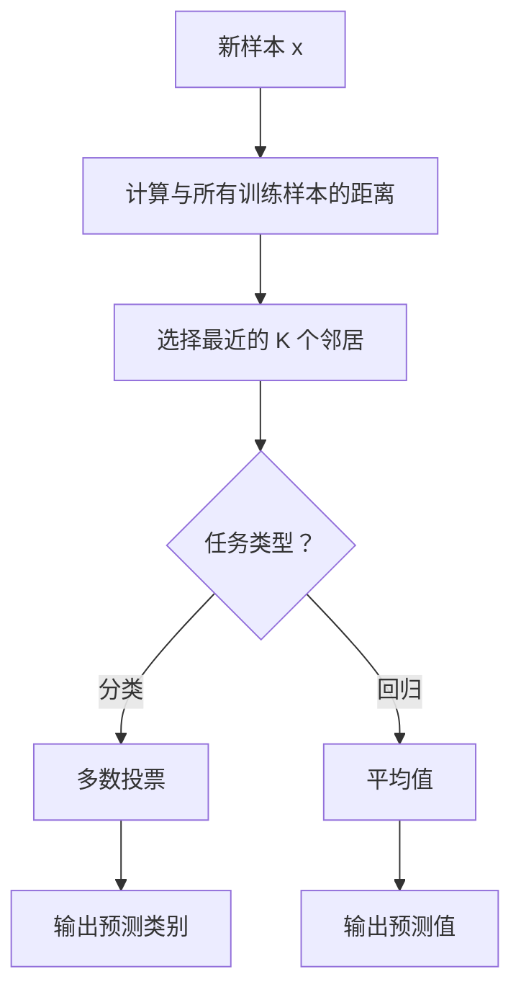
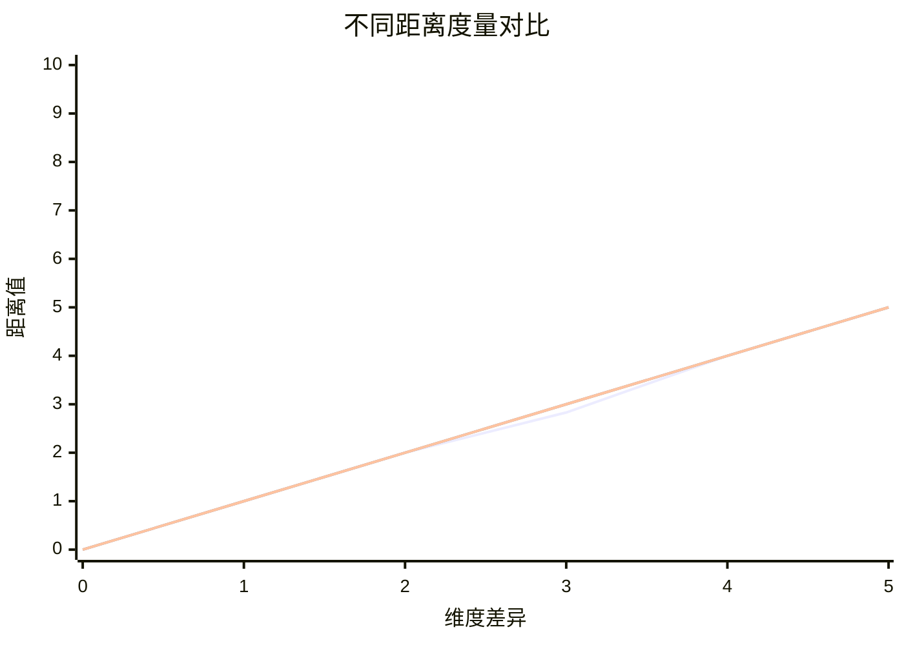
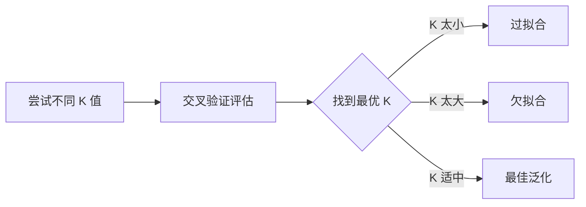
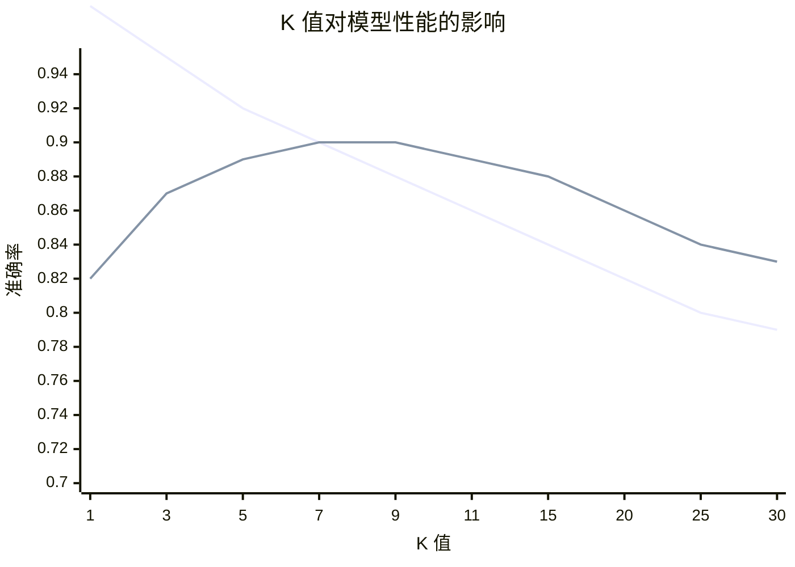
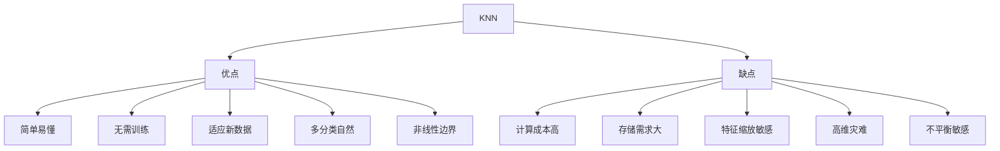

# K 近邻算法（K-Nearest Neighbors, KNN）

## 1. 概述

K 近邻算法是一种**基于实例的懒惰学习算法**，用于分类和回归任务。KNN 的核心思想是：相似的样本在特征空间中距离相近，通过找到最近的 K 个邻居来预测新样本的类别或值。

**核心思想：** "近朱者赤，近墨者黑"——物以类聚。

### 1.1 算法特点

| 特点 | 说明 |
|------|------|
| 懒惰学习 | 训练阶段不做任何计算 |
| 基于实例 | 存储所有训练数据 |
| 非参数 | 不对数据分布做假设 |
| 局部决策 | 基于局部邻域预测 |

### 1.2 适用场景

- 推荐系统
- 异常检测
- 文本分类
- 图像识别
- 小数据集
- 需要简单基线模型

## 2. 算法原理

### 2.1 基本流程



### 2.2 距离度量

#### 2.2.1 闵可夫斯基距离（Minkowski Distance）

```
d(x, y) = (Σ|xᵢ - yᵢ|^p)^(1/p)
```

- p=1: 曼哈顿距离
- p=2: 欧氏距离（最常用）
- p=∞: 切比雪夫距离

#### 2.2.2 常用距离公式

**欧氏距离（Euclidean）：**
```
d(x, y) = √(Σ(xᵢ - yᵢ)²)
```

**曼哈顿距离（Manhattan）：**
```
d(x, y) = Σ|xᵢ - yᵢ|
```

**余弦相似度（Cosine Similarity）：**
```
similarity = (x·y) / (||x|| × ||y||)
```



### 2.3 K 值选择

**K 值的影响：**

| K 值 | 决策边界 | 偏差 | 方差 | 抗噪性 |
|------|----------|------|------|--------|
| 小（如 1） | 复杂 | 低 | 高 | 差 |
| 大 | 平滑 | 高 | 低 | 好 |

**选择原则：**
- 通常选择奇数（避免平票）
- 经验法则：K ≈ √n
- 使用交叉验证选择最优 K



### 2.4 加权 KNN

对近邻赋予不同权重：

```
权重 wᵢ = 1 / dᵢ  或  wᵢ = exp(-dᵢ)
```

预测：
```
分类：ŷ = argmax_c Σ(wᵢ × I(yᵢ=c))
回归：ŷ = Σ(wᵢ × yᵢ) / Σwᵢ
```

## 3. Python 代码实现

### 3.1 使用 scikit-learn

```python
import numpy as np
from sklearn.neighbors import KNeighborsClassifier, KNeighborsRegressor
from sklearn.model_selection import train_test_split, cross_val_score
from sklearn.metrics import accuracy_score, classification_report, mean_squared_error
from sklearn.datasets import make_classification, make_regression
from sklearn.preprocessing import StandardScaler
import matplotlib.pyplot as plt

# ============ KNN 分类 ============
print("=== KNN 分类 ===\n")

# 1. 生成数据
X, y = make_classification(
    n_samples=1000, n_features=20, n_informative=15,
    random_state=42
)

# 2. 特征缩放（KNN 对尺度敏感！）
scaler = StandardScaler()
X_scaled = scaler.fit_transform(X)

# 3. 划分数据集
X_train, X_test, y_train, y_test = train_test_split(
    X_scaled, y, test_size=0.2, random_state=42, stratify=y
)

# 4. 创建并训练模型
knn = KNeighborsClassifier(
    n_neighbors=5,           # K 值
    weights='uniform',       # 'uniform' 或 'distance'
    metric='minkowski',      # 距离度量
    p=2,                     # 闵可夫斯基距离参数（p=2 为欧氏距离）
    n_jobs=-1               # 并行处理
)
knn.fit(X_train, y_train)

# 5. 预测与评估
y_pred = knn.predict(X_test)
y_pred_proba = knn.predict_proba(X_test)

print(f"准确率：{accuracy_score(y_test, y_pred):.4f}")
print("\n分类报告:")
print(classification_report(y_test, y_pred))

# ============ KNN 回归 ============
print("\n=== KNN 回归 ===\n")

X_reg, y_reg = make_regression(
    n_samples=1000, n_features=10, noise=10, random_state=42
)

X_reg_scaled = scaler.fit_transform(X_reg)
X_train_reg, X_test_reg, y_train_reg, y_test_reg = train_test_split(
    X_reg_scaled, y_reg, test_size=0.2, random_state=42
)

knn_reg = KNeighborsRegressor(n_neighbors=5, weights='distance')
knn_reg.fit(X_train_reg, y_train_reg)

y_pred_reg = knn_reg.predict(X_test_reg)
mse = mean_squared_error(y_test_reg, y_pred_reg)
r2 = knn_reg.score(X_test_reg, y_test_reg)

print(f"MSE: {mse:.4f}, R²: {r2:.4f}")
```

### 3.2 从零实现 KNN

```python
import numpy as np
from collections import Counter

class KNNClassifier:
    """从零实现 KNN 分类器"""
    
    def __init__(self, n_neighbors=5, weights='uniform', metric='euclidean'):
        self.n_neighbors = n_neighbors
        self.weights = weights
        self.metric = metric
        self.X_train = None
        self.y_train = None
    
    def _euclidean_distance(self, x1, x2):
        """欧氏距离"""
        return np.sqrt(np.sum((x1 - x2) ** 2))
    
    def _manhattan_distance(self, x1, x2):
        """曼哈顿距离"""
        return np.sum(np.abs(x1 - x2))
    
    def _compute_distances(self, x):
        """计算与所有训练样本的距离"""
        if self.metric == 'euclidean':
            distances = np.array([self._euclidean_distance(x, x_train) 
                                 for x_train in self.X_train])
        elif self.metric == 'manhattan':
            distances = np.array([self._manhattan_distance(x, x_train) 
                                 for x_train in self.X_train])
        else:
            raise ValueError(f"Unknown metric: {self.metric}")
        return distances
    
    def fit(self, X, y):
        """KNN 是懒惰学习，fit 只是存储数据"""
        self.X_train = np.array(X)
        self.y_train = np.array(y)
        return self
    
    def _predict_single(self, x):
        """预测单个样本"""
        # 计算距离
        distances = self._compute_distances(x)
        
        # 找到 K 个最近邻居
        k_indices = np.argsort(distances)[:self.n_neighbors]
        k_distances = distances[k_indices]
        k_labels = self.y_train[k_indices]
        
        # 计算权重
        if self.weights == 'distance':
            # 距离加权（避免除零）
            weights = 1 / (k_distances + 1e-10)
        else:
            weights = np.ones(self.n_neighbors)
        
        # 加权投票
        label_weights = {}
        for label, weight in zip(k_labels, weights):
            label_weights[label] = label_weights.get(label, 0) + weight
        
        # 返回权重最大的类别
        return max(label_weights, key=label_weights.get)
    
    def predict(self, X):
        """预测多个样本"""
        return np.array([self._predict_single(x) for x in X])
    
    def score(self, X, y):
        """计算准确率"""
        predictions = self.predict(X)
        return np.mean(predictions == y)

# 使用示例
X = np.random.randn(100, 5)
y = (np.sum(X[:, :3] > 0, axis=1) > 1).astype(int)

knn = KNNClassifier(n_neighbors=5, weights='distance')
knn.fit(X, y)
print(f"训练准确率：{knn.score(X, y):.4f}")
```

## 4. K 值选择

### 4.1 交叉验证选择 K

```python
from sklearn.model_selection import cross_val_score

# 尝试不同 K 值
k_range = range(1, 31)
cv_scores = []

for k in k_range:
    knn = KNeighborsClassifier(n_neighbors=k, n_jobs=-1)
    scores = cross_val_score(knn, X_train, y_train, cv=5, scoring='accuracy')
    cv_scores.append(scores.mean())

# 找到最优 K
optimal_k = k_range[np.argmax(cv_scores)]
print(f"最优 K 值：{optimal_k}")
print(f"最佳交叉验证分数：{max(cv_scores):.4f}")

# 可视化
plt.figure(figsize=(10, 6))
plt.plot(k_range, cv_scores, 'bo-')
plt.axvline(x=optimal_k, color='r', linestyle='--', label=f'最优 K={optimal_k}')
plt.xlabel('K 值')
plt.ylabel('交叉验证准确率')
plt.title('K 值选择')
plt.legend()
plt.grid(True, alpha=0.3)
plt.show()
```

### 4.2 学习曲线



## 5. 距离度量选择

```python
# 比较不同距离度量
metrics = ['euclidean', 'manhattan', 'chebyshev', 'minkowski']
scores = []

for metric in metrics:
    if metric == 'minkowski':
        knn = KNeighborsClassifier(n_neighbors=5, metric=metric, p=2)
    else:
        knn = KNeighborsClassifier(n_neighbors=5, metric=metric)
    knn.fit(X_train, y_train)
    scores.append(knn.score(X_test, y_test))

# 可视化
plt.figure(figsize=(10, 6))
plt.bar(metrics, scores)
plt.xlabel('距离度量')
plt.ylabel('准确率')
plt.title('不同距离度量对比')
plt.xticks(rotation=45)
plt.tight_layout()
plt.show()

print(f"最佳距离度量：{metrics[np.argmax(scores)]}")
```

## 6. 加权策略

### 6.1 均匀加权 vs 距离加权

```python
# 均匀加权：所有邻居权重相同
knn_uniform = KNeighborsClassifier(n_neighbors=5, weights='uniform')

# 距离加权：近邻权重更大
knn_distance = KNeighborsClassifier(n_neighbors=5, weights='distance')

knn_uniform.fit(X_train, y_train)
knn_distance.fit(X_train, y_train)

print(f"均匀加权准确率：{knn_uniform.score(X_test, y_test):.4f}")
print(f"距离加权准确率：{knn_distance.score(X_test, y_test):.4f}")
```

### 6.2 自定义权重函数

```python
# 使用自定义权重函数
def custom_weight(distance):
    return 1 / (distance ** 2 + 1)

knn_custom = KNeighborsClassifier(
    n_neighbors=5,
    weights=lambda distances: np.array([custom_weight(d) for d in distances])
)
```

## 7. 优缺点分析



### 7.1 优点

- **简单易懂**：原理直观，易于实现
- **无需训练**：懒惰学习，训练时间为零
- **适应新数据**：添加新样本无需重新训练
- **多分类自然**：天然支持多分类
- **非线性边界**：可以学习复杂决策边界

### 7.2 缺点

- **计算成本高**：预测时需要计算所有距离
- **存储需求大**：需要存储所有训练数据
- **特征缩放敏感**：必须进行特征缩放
- **高维灾难**：高维空间距离失效
- **不平衡敏感**：多数类主导预测

## 8. 加速技术

### 8.1 KD 树（K-Dimensional Tree）

```python
# 使用 KD 树加速（适合低维数据）
knn_kd = KNeighborsClassifier(
    n_neighbors=5,
    algorithm='kd_tree',  # 'ball_tree', 'kd_tree', 'brute', 'auto'
    leaf_size=30,
    n_jobs=-1
)
```

### 8.2 球树（Ball Tree）

```python
# 使用球树（适合高维数据）
knn_ball = KNeighborsClassifier(
    n_neighbors=5,
    algorithm='ball_tree',
    leaf_size=30,
    metric='euclidean'
)
```

### 8.3 近似最近邻

```python
# 使用 Annoy 或 FAISS 进行近似搜索
# 适合超大规模数据
```

## 9. 处理高维数据

### 9.1 降维

```python
from sklearn.decomposition import PCA

# PCA 降维
pca = PCA(n_components=0.95)  # 保留 95% 方差
X_train_pca = pca.fit_transform(X_train)
X_test_pca = pca.transform(X_test)

knn_pca = KNeighborsClassifier(n_neighbors=5)
knn_pca.fit(X_train_pca, y_train)
print(f"降维后准确率：{knn_pca.score(X_test_pca, y_test):.4f}")
```

### 9.2 特征选择

```python
from sklearn.feature_selection import SelectKBest, f_classif

# 选择最重要的 K 个特征
selector = SelectKBest(score_func=f_classif, k=10)
X_train_selected = selector.fit_transform(X_train, y_train)
X_test_selected = selector.transform(X_test)

knn_selected = KNeighborsClassifier(n_neighbors=5)
knn_selected.fit(X_train_selected, y_train)
print(f"特征选择后准确率：{knn_selected.score(X_test_selected, y_test):.4f}")
```

## 10. 实战技巧

### 10.1 特征缩放（必须！）

```python
from sklearn.preprocessing import StandardScaler, MinMaxScaler

# 标准化（推荐）
scaler = StandardScaler()
X_train_scaled = scaler.fit_transform(X_train)
X_test_scaled = scaler.transform(X_test)

# 或归一化
scaler_minmax = MinMaxScaler()
X_train_normalized = scaler_minmax.fit_transform(X_train)
```

### 10.2 处理类别特征

```python
from sklearn.preprocessing import OneHotEncoder
from sklearn.compose import ColumnTransformer

# 独热编码类别特征
preprocessor = ColumnTransformer([
    ('cat', OneHotEncoder(handle_unknown='ignore'), categorical_columns),
    ('num', StandardScaler(), numerical_columns)
])

X_processed = preprocessor.fit_transform(X)
```

### 10.3 处理不平衡数据

```python
# 欠采样多数类
from imblearn.under_sampling import RandomUnderSampler

rus = RandomUnderSampler(random_state=42)
X_resampled, y_resampled = rus.fit_resample(X_train, y_train)

knn = KNeighborsClassifier(n_neighbors=5)
knn.fit(X_resampled, y_resampled)
```

## 11. 总结

KNN 是简单而强大的基线算法：

**核心价值：**
1. 原理简单，易于理解和实现
2. 无需训练，适应新数据
3. 天然支持多分类和回归
4. 可以学习复杂非线性边界

**最佳实践：**
- 始终进行特征缩放
- 使用交叉验证选择 K
- 低维用 KD 树，高维用球树
- 考虑距离加权提升性能

**适用场景：**
- 小数据集
- 需要简单基线
- 推荐系统
- 异常检测

KNN 虽然计算成本较高，但作为基线模型和特定场景下的解决方案，仍有重要价值。
