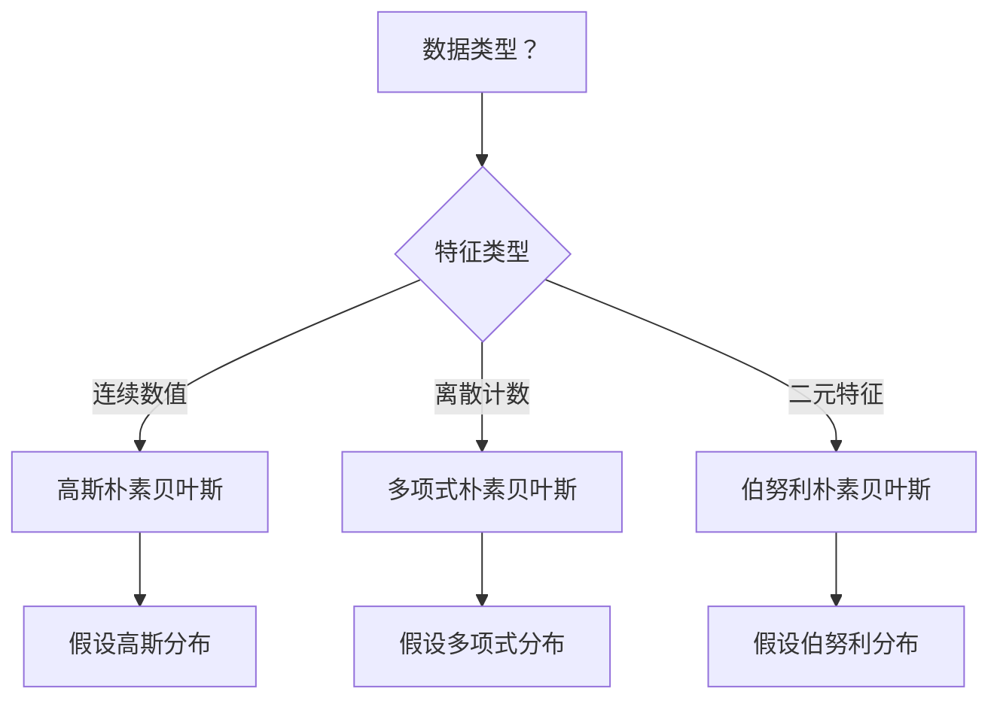
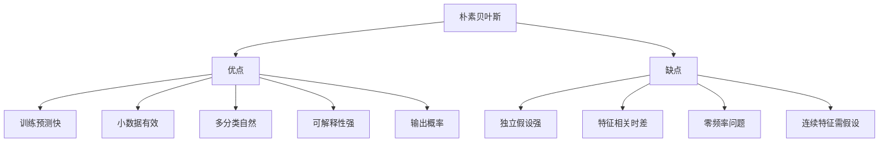

# 朴素贝叶斯（Naive Bayes）

## 1. 概述

朴素贝叶斯是一种基于**贝叶斯定理**和**特征条件独立假设**的概率分类算法。尽管"朴素"的假设在现实中很少成立，但朴素贝叶斯在许多实际应用中表现出色，尤其是文本分类任务。

**核心思想：** 基于贝叶斯定理，计算给定特征下各类别的后验概率，选择概率最大的类别。

### 1.1 贝叶斯定理

```
P(Y|X) = P(X|Y) × P(Y) / P(X)
```

其中：
- P(Y|X)：后验概率（给定 X，Y 的概率）
- P(X|Y)：似然（给定 Y，X 的概率）
- P(Y)：先验概率
- P(X)：证据（通常作为归一化常数）

### 1.2 适用场景

- 文本分类（垃圾邮件、情感分析）
- 文档分类
- 医疗诊断
- 实时预测
- 多分类任务
- 小数据集

### 1.3 算法变体

| 变体 | 适用数据类型 | 分布假设 |
|------|-------------|----------|
| 高斯朴素贝叶斯 | 连续特征 | 高斯分布 |
| 多项式朴素贝叶斯 | 离散计数 | 多项式分布 |
| 伯努利朴素贝叶斯 | 二元特征 | 伯努利分布 |

## 2. 算法原理

### 2.1 条件独立假设

**朴素假设：** 给定类别，所有特征相互独立

```
P(X|Y) = P(x₁|Y) × P(x₂|Y) × ... × P(xₙ|Y)
```

这个假设大大简化了计算，尽管在现实中很少完全成立。

### 2.2 分类决策

```
ŷ = argmax_c P(Y=c) × Π P(xᵢ|Y=c)
```

由于分母 P(X) 对所有类别相同，可以忽略。

```mermaid
flowchart TD
    A[输入样本 X] --> B[计算每个类别的先验 P Y]
    B --> C[计算每个特征的似然 P xi|Y]
    C --> D[计算后验概率 P Y|X]
    D --> E{选择最大概率}
    E --> F[输出预测类别]
```

### 2.3 拉普拉斯平滑

为避免零概率问题，使用拉普拉斯平滑：

```
P(xᵢ|Y) = (count(xᵢ, Y) + α) / (count(Y) + α × n)
```

其中 α 是平滑参数（通常 α=1）。

## 3. Python 代码实现

### 3.1 使用 scikit-learn

```python
import numpy as np
from sklearn.naive_bayes import GaussianNB, MultinomialNB, BernoulliNB
from sklearn.model_selection import train_test_split, cross_val_score
from sklearn.metrics import accuracy_score, classification_report, confusion_matrix
from sklearn.datasets import make_classification
from sklearn.feature_extraction.text import CountVectorizer
import matplotlib.pyplot as plt
import seaborn as sns

# ============ 高斯朴素贝叶斯（连续特征） ============
print("=== 高斯朴素贝叶斯 ===\n")

# 1. 生成数据
X, y = make_classification(
    n_samples=1000, n_features=20, n_informative=15,
    random_state=42
)

# 2. 划分数据集
X_train, X_test, y_train, y_test = train_test_split(
    X, y, test_size=0.2, random_state=42, stratify=y
)

# 3. 创建并训练模型
gnb = GaussianNB(
    priors=None,        # 类别先验概率（None 表示从数据学习）
    var_smoothing=1e-9  # 方差平滑参数
)
gnb.fit(X_train, y_train)

# 4. 预测与评估
y_pred = gnb.predict(X_test)
y_pred_proba = gnb.predict_proba(X_test)

print(f"准确率：{accuracy_score(y_test, y_pred):.4f}")
print("\n分类报告:")
print(classification_report(y_test, y_pred))

# 5. 混淆矩阵
plt.figure(figsize=(8, 6))
cm = confusion_matrix(y_test, y_pred)
sns.heatmap(cm, annot=True, fmt='d', cmap='Blues')
plt.title('混淆矩阵')
plt.ylabel('真实标签')
plt.xlabel('预测标签')
plt.show()

# ============ 文本分类示例（多项式朴素贝叶斯） ============
print("\n=== 文本分类示例 ===\n")

# 示例文本数据
texts = [
    "I love this movie, it's amazing and wonderful",
    "This is the best film I've ever seen",
    "Great acting and beautiful cinematography",
    "I hate this movie, it's terrible and boring",
    "Worst film ever, complete waste of time",
    "Awful acting and poor story",
] * 50  # 复制多份

labels = [1, 1, 1, 0, 0, 0] * 50  # 1=正面，0=负面

# 划分数据
texts_train, texts_test, y_train, y_test = train_test_split(
    texts, labels, test_size=0.3, random_state=42
)

# 文本向量化（词袋模型）
vectorizer = CountVectorizer(stop_words='english')
X_train = vectorizer.fit_transform(texts_train)
X_test = vectorizer.transform(texts_test)

# 训练多项式朴素贝叶斯
mnb = MultinomialNB(alpha=1.0)  # 拉普拉斯平滑
mnb.fit(X_train, y_train)

# 评估
y_pred_text = mnb.predict(X_test)
print(f"文本分类准确率：{accuracy_score(y_test, y_pred_text):.4f}")
print("\n分类报告:")
print(classification_report(y_test, y_pred_text))

# 预测新文本
new_texts = ["This movie is fantastic!", "I didn't like it at all"]
X_new = vectorizer.transform(new_texts)
predictions = mnb.predict(X_new)
probas = mnb.predict_proba(X_new)

for text, pred, proba in zip(new_texts, predictions, probas):
    print(f"\n文本：{text}")
    print(f"预测：{'正面' if pred==1 else '负面'} (置信度：{max(proba):.2%})")
```

### 3.2 从零实现高斯朴素贝叶斯

```python
import numpy as np
from collections import defaultdict

class GaussianNaiveBayesCustom:
    """从零实现高斯朴素贝叶斯"""
    
    def __init__(self, var_smoothing=1e-9):
        self.var_smoothing = var_smoothing
        self.classes = None
        self.class_prior = None
        self.theta = None  # 均值
        self.var = None    # 方差
    
    def fit(self, X, y):
        n_samples, n_features = X.shape
        self.classes = np.unique(y)
        n_classes = len(self.classes)
        
        # 初始化参数
        self.class_prior = np.zeros(n_classes)
        self.theta = np.zeros((n_classes, n_features))
        self.var = np.zeros((n_classes, n_features))
        
        # 计算每个类别的参数
        for i, c in enumerate(self.classes):
            X_c = X[y == c]
            self.class_prior[i] = len(X_c) / n_samples
            self.theta[i] = X_c.mean(axis=0)
            self.var[i] = X_c.var(axis=0) + self.var_smoothing
        
        return self
    
    def _gaussian_probability(self, x, mean, var):
        """计算高斯概率密度"""
        epsilon = 1e-4
        exponent = np.exp(-(x - mean) ** 2 / (2 * var + epsilon))
        return exponent / np.sqrt(2 * np.pi * var + epsilon)
    
    def _compute_likelihood(self, x):
        """计算似然 P(X|Y)"""
        likelihoods = []
        for i in range(len(self.classes)):
            # 各特征条件独立，概率相乘
            likelihood = np.prod(
                self._gaussian_probability(x, self.theta[i], self.var[i])
            )
            likelihoods.append(likelihood)
        return np.array(likelihoods)
    
    def _compute_posterior(self, x):
        """计算后验概率 P(Y|X)"""
        likelihood = self._compute_likelihood(x)
        posterior = likelihood * self.class_prior
        # 归一化
        posterior = posterior / (posterior.sum() + 1e-10)
        return posterior
    
    def predict(self, X):
        return np.array([self.classes[np.argmax(self._compute_posterior(x))] 
                        for x in X])
    
    def predict_proba(self, X):
        return np.array([self._compute_posterior(x) for x in X])
    
    def score(self, X, y):
        predictions = self.predict(X)
        return np.mean(predictions == y)

# 使用示例
X = np.random.randn(100, 5)
y = (X[:, 0] + X[:, 1] > 0).astype(int)

gnb_custom = GaussianNaiveBayesCustom()
gnb_custom.fit(X, y)
print(f"训练准确率：{gnb_custom.score(X, y):.4f}")
```

## 4. 三种朴素贝叶斯变体

### 4.1 高斯朴素贝叶斯（GaussianNB）

适用于连续特征，假设特征服从高斯分布：

```python
from sklearn.naive_bayes import GaussianNB

gnb = GaussianNB(var_smoothing=1e-9)
gnb.fit(X_train, y_train)
```

**适用场景：** 数值型特征（如身高、体重、温度）

### 4.2 多项式朴素贝叶斯（MultinomialNB）

适用于离散计数特征：

```python
from sklearn.naive_bayes import MultinomialNB

mnb = MultinomialNB(
    alpha=1.0,        # 拉普拉斯平滑参数
    fit_prior=True,   # 学习类别先验
    class_prior=None  # 自定义先验
)
```

**适用场景：** 文本分类（词频计数）、计数数据

### 4.3 伯努利朴素贝叶斯（BernoulliNB）

适用于二元特征：

```python
from sklearn.naive_bayes import BernoulliNB

bnb = BernoulliNB(
    alpha=1.0,              # 平滑参数
    binarize=0.0,           # 二值化阈值
    fit_prior=True
)
```

**适用场景：** 文本分类（词是否出现）、二元特征



## 5. 文本分类实战

### 5.1 完整文本分类流程

```python
from sklearn.feature_extraction.text import TfidfVectorizer
from sklearn.pipeline import Pipeline
from sklearn.model_selection import GridSearchCV

# 创建管道
pipeline = Pipeline([
    ('tfidf', TfidfVectorizer(
        stop_words='english',
        max_features=10000,
        ngram_range=(1, 2)  # 使用 unigram 和 bigram
    )),
    ('clf', MultinomialNB())
])

# 参数网格
param_grid = {
    'tfidf__max_features': [5000, 10000],
    'tfidf__ngram_range': [(1, 1), (1, 2)],
    'clf__alpha': [0.1, 0.5, 1.0]
}

# 网格搜索
grid_search = GridSearchCV(
    pipeline, param_grid,
    cv=5, scoring='accuracy',
    n_jobs=-1, verbose=1
)

grid_search.fit(texts_train, y_train)

print(f"最佳参数：{grid_search.best_params_}")
print(f"最佳分数：{grid_search.best_score_:.4f}")
```

### 5.2 特征重要性（词的重要性）

```python
# 获取每个类别的词概率
feature_names = vectorizer.get_feature_names_out()
class_log_prior = mnb.class_log_prior_
feature_log_prob = mnb.feature_log_prob_

# 显示每个类别最重要的词
for i, class_name in enumerate(mnb.classes_):
    print(f"\n类别 '{class_name}' 最重要的词:")
    top_indices = feature_log_prob[i].argsort()[::-1][:10]
    for idx in top_indices:
        print(f"  {feature_names[idx]}: {np.exp(feature_log_prob[i][idx]):.4f}")
```

## 6. 优缺点分析



### 6.1 优点

- **训练预测快**：线性时间复杂度
- **小数据有效**：基于概率，小样本也能工作
- **多分类自然**：天然支持多分类
- **可解释性强**：可以查看每个特征的贡献
- **输出概率**：提供类别概率估计
- **对缺失值鲁棒**：可以忽略缺失特征

### 6.2 缺点

- **独立假设强**：特征独立假设很少成立
- **特征相关时差**：特征相关时性能下降
- **零频率问题**：需要平滑处理
- **连续特征需假设**：需要假设分布类型

## 7. 平滑技术

### 7.1 拉普拉斯平滑（Lidstone 平滑）

```python
# alpha=1：拉普拉斯平滑
mnb = MultinomialNB(alpha=1.0)

# alpha<1：Lidstone 平滑
mnb = MultinomialNB(alpha=0.5)

# alpha=0：无平滑（可能出错）
mnb = MultinomialNB(alpha=0.0)
```

### 7.2 选择平滑参数

```python
from sklearn.model_selection import validation_curve

# 测试不同 alpha 值
alpha_values = [0.01, 0.1, 0.5, 1.0, 2.0, 5.0]
train_scores, test_scores = validation_curve(
    MultinomialNB(), X_train, y_train,
    param_name='alpha', param_range=alpha_values,
    cv=5, scoring='accuracy'
)

# 可视化
plt.figure(figsize=(10, 6))
plt.plot(alpha_values, train_scores.mean(axis=1), 'o-', label='训练集')
plt.plot(alpha_values, test_scores.mean(axis=1), 's-', label='验证集')
plt.xlabel('Alpha（平滑参数）')
plt.ylabel('准确率')
plt.title('平滑参数选择')
plt.legend()
plt.xscale('log')
plt.grid(True, alpha=0.3)
plt.show()
```

## 8. 处理不平衡数据

```python
# 方法 1：使用 class_prior 设置先验
class_counts = np.bincount(y_train)
class_prior = class_counts / class_counts.sum()
gnb = GaussianNB(class_prior=class_prior)

# 方法 2：手动调整先验（给少数类更高权重）
adjusted_prior = np.array([0.3, 0.7])  # 给少数类更高先验
gnb = GaussianNB(class_prior=adjusted_prior)

# 方法 3：结合重采样
from imblearn.pipeline import Pipeline as ImbPipeline
from imblearn.over_sampling import SMOTE

pipeline = ImbPipeline([
    ('smote', SMOTE(random_state=42)),
    ('clf', MultinomialNB())
])
pipeline.fit(X_train, y_train)
```

## 9. 实战技巧

### 9.1 特征选择

```python
from sklearn.feature_selection import SelectKBest, chi2

# 卡方检验选择特征
selector = SelectKBest(score_func=chi2, k=1000)
X_train_selected = selector.fit_transform(X_train, y_train)
X_test_selected = selector.transform(X_test)

gnb = GaussianNB()
gnb.fit(X_train_selected, y_train)
print(f"特征选择后准确率：{gnb.score(X_test_selected, y_test):.4f}")
```

### 9.2 对数概率避免下溢

```python
# 使用对数概率计算（scikit-learn 内部已实现）
log_posterior = np.log(class_prior) + np.sum(np.log(likelihoods), axis=1)
prediction = classes[np.argmax(log_posterior)]
```

### 9.3 半监督学习

```python
from sklearn.semi_supervised import SemiSupervisedLearning

# 使用未标记数据提升性能（需要 sklearn 1.4+）
# 或使用自训练
from sklearn.semi_supervised import SelfTrainingClassifier

base_clf = GaussianNB()
semi_clf = SelfTrainingClassifier(base_clf, verbose=True)
semi_clf.fit(X_train, y_train)  # 部分 y_train 可以是 -1（未标记）
```

## 10. 与其他算法对比

| 算法 | 训练速度 | 预测速度 | 小数据 | 大数据 | 文本分类 |
|------|----------|----------|--------|--------|----------|
| 朴素贝叶斯 | 很快 | 很快 | 好 | 好 | 优秀 |
| 逻辑回归 | 快 | 快 | 中 | 好 | 好 |
| SVM | 慢 | 中 | 好 | 差 | 好 |
| 随机森林 | 中 | 中 | 中 | 好 | 中 |

## 11. 总结

朴素贝叶斯是文本分类的经典算法：

**核心价值：**
1. 基于贝叶斯定理，理论完备
2. 训练和预测速度极快
3. 小数据集也能工作良好
4. 输出概率，可解释性强

**最佳实践：**
- 文本分类首选多项式或伯努利变体
- 使用 TF-IDF 替代词袋模型
- 调整 alpha 参数优化性能
- 结合特征选择提升效果

**适用场景：**
- 文本分类（垃圾邮件、情感分析）
- 实时预测系统
- 多分类任务
- 资源受限环境

朴素贝叶斯虽然假设"朴素"，但在实践中表现优异，是每位数据科学家必备的工具。
