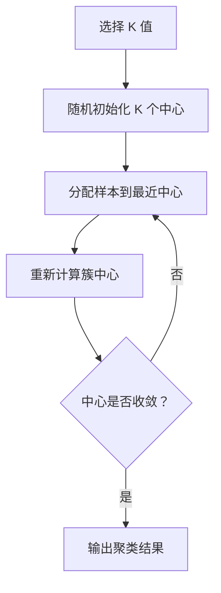
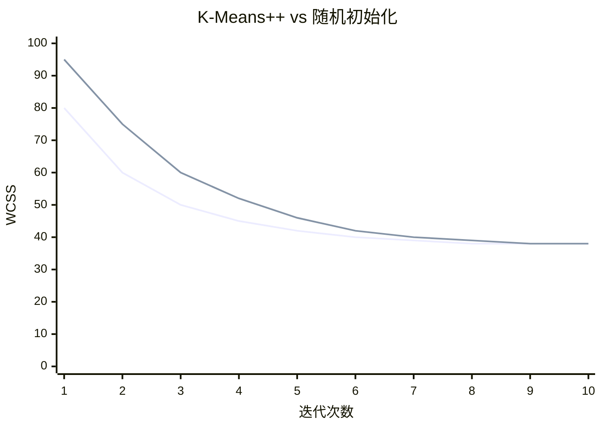
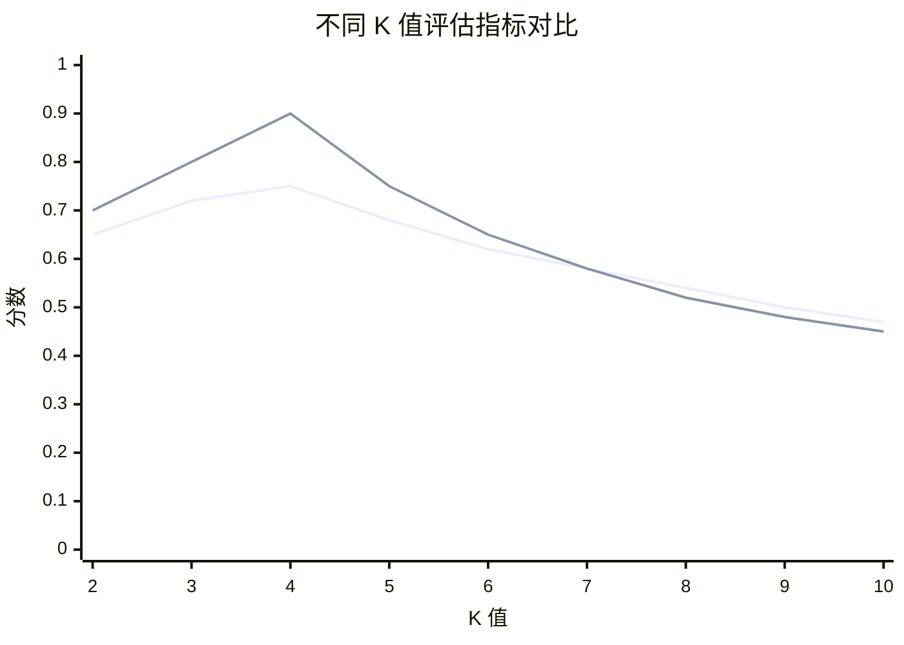
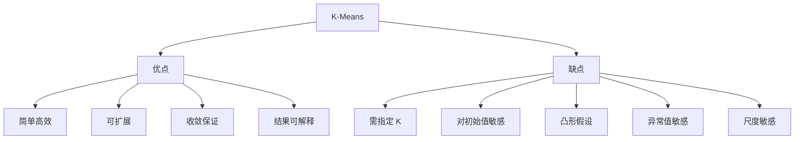

# K-Means 聚类

## 1. 概述

K-Means 是一种经典的**无监督学习算法**，用于将数据划分为 K 个簇（clusters）。它通过迭代优化簇中心，使得簇内样本距离最近，簇间样本距离最远。

**核心思想：** 物以类聚——相似的数据点归为一类。

### 1.1 算法特点

| 特点 | 说明 |
|------|------|
| 无监督学习 | 不需要标签 |
| 划分方法 | 将数据划分为 K 个簇 |
| 基于距离 | 使用欧氏距离 |
| 迭代优化 | 交替更新簇中心和分配 |

### 1.2 适用场景

- 客户细分
- 图像压缩
- 异常检测
- 数据压缩
- 特征学习
- 探索性数据分析

### 1.3 算法局限

- 需要预先指定 K 值
- 对初始中心敏感
- 假设簇是凸形的
- 对异常值敏感

## 2. 算法原理

### 2.1 优化目标

最小化簇内平方和（Within-Cluster Sum of Squares, WCSS）：

```
WCSS = Σᵢ Σₓ∈Cᵢ ||x - μᵢ||²
```

其中：
- Cᵢ 是第 i 个簇
- μᵢ 是第 i 个簇的中心
- x 是簇内样本

### 2.2 算法步骤



**详细步骤：**

1. **初始化**：随机选择 K 个样本作为初始簇中心
2. **分配**：将每个样本分配到最近的簇中心
3. **更新**：重新计算每个簇的中心（均值）
4. **重复**：重复步骤 2-3 直到收敛

### 2.3 收敛条件

- 簇中心不再变化
- 样本分配不再变化
- 达到最大迭代次数
- WCSS 变化小于阈值

### 2.4 初始化方法

#### 2.4.1 随机初始化

```python
# 简单随机选择 K 个样本
init = 'random'
```

#### 2.4.2 K-Means++（推荐）

```python
# 智能初始化，提高收敛速度和质量
init = 'k-means++'
```

**K-Means++ 原理：**
1. 随机选择第一个中心
2. 对于每个样本，计算到最近中心的距离 D(x)
3. 以 D(x)² 的概率选择下一个中心
4. 重复直到选择 K 个中心



## 3. Python 代码实现

### 3.1 使用 scikit-learn

```python
import numpy as np
from sklearn.cluster import KMeans
from sklearn.datasets import make_blobs
from sklearn.metrics import silhouette_score, calinski_harabasz_score
from sklearn.preprocessing import StandardScaler
import matplotlib.pyplot as plt
import seaborn as sns

# 1. 生成聚类数据
X, y_true = make_blobs(
    n_samples=300, centers=4, cluster_std=0.60,
    random_state=42
)

# 2. 特征缩放（K-Means 对尺度敏感！）
scaler = StandardScaler()
X_scaled = scaler.fit_transform(X)

# 3. 创建并训练模型
kmeans = KMeans(
    n_clusters=4,           # 簇的数量
    init='k-means++',       # 初始化方法
    n_init=10,             # 不同初始化的运行次数
    max_iter=300,          # 最大迭代次数
    tol=1e-4,              # 收敛阈值
    random_state=42,
    verbose=0
)
kmeans.fit(X_scaled)

# 4. 获取结果
labels = kmeans.labels_
centers = kmeans.cluster_centers_
inertia = kmeans.inertia_  # WCSS

print(f"簇中心形状：{centers.shape}")
print(f"WCSS (惯性): {inertia:.2f}")
print(f"迭代次数：{kmeans.n_iter_}")

# 5. 评估
silhouette = silhouette_score(X_scaled, labels)
ch_score = calinski_harabasz_score(X_scaled, labels)

print(f"\n轮廓系数：{silhouette:.4f} (越接近 1 越好)")
print(f"CH 分数：{ch_score:.2f} (越大越好)")

# 6. 可视化
plt.figure(figsize=(12, 5))

# 原始数据
plt.subplot(1, 2, 1)
plt.scatter(X[:, 0], X[:, 1], alpha=0.6)
plt.title('原始数据')
plt.xlabel('特征 1')
plt.ylabel('特征 2')

# 聚类结果
plt.subplot(1, 2, 2)
plt.scatter(X[:, 0], X[:, 1], c=labels, cmap='viridis', alpha=0.6)
plt.scatter(centers[:, 0], centers[:, 1], c='red', s=200, 
           marker='X', edgecolors='black', linewidth=2)
plt.title(f'K-Means 聚类结果 (K={4})')
plt.xlabel('特征 1')
plt.ylabel('特征 2')

plt.tight_layout()
plt.show()
```

### 3.2 从零实现 K-Means

```python
import numpy as np

class KMeansCustom:
    """从零实现 K-Means"""
    
    def __init__(self, n_clusters=3, max_iter=300, tol=1e-4, random_state=None):
        self.n_clusters = n_clusters
        self.max_iter = max_iter
        self.tol = tol
        self.random_state = random_state
        self.centers = None
        self.labels = None
        self.inertia = None
        self.n_iter_ = 0
    
    def _euclidean_distance(self, X, centers):
        """计算样本到各中心的距离"""
        # X: (n_samples, n_features)
        # centers: (n_clusters, n_features)
        # distances: (n_samples, n_clusters)
        distances = np.zeros((X.shape[0], centers.shape[0]))
        for i, center in enumerate(centers):
            distances[:, i] = np.sqrt(np.sum((X - center) ** 2, axis=1))
        return distances
    
    def _initialize_centers(self, X):
        """K-Means++ 初始化"""
        np.random.seed(self.random_state)
        n_samples = X.shape[0]
        
        # 选择第一个中心
        centers = [X[np.random.randint(n_samples)]]
        
        for _ in range(1, self.n_clusters):
            # 计算每个点到最近中心的距离
            distances = self._euclidean_distance(X, np.array(centers))
            min_distances = distances.min(axis=1)
            
            # 以距离平方为概率选择下一个中心
            probs = min_distances ** 2
            probs = probs / probs.sum()
            next_center_idx = np.random.choice(n_samples, p=probs)
            centers.append(X[next_center_idx])
        
        return np.array(centers)
    
    def fit(self, X):
        n_samples = X.shape[0]
        
        # 初始化中心
        self.centers = self._initialize_centers(X)
        
        for iteration in range(self.max_iter):
            # 分配步骤：将样本分配到最近中心
            distances = self._euclidean_distance(X, self.centers)
            self.labels = np.argmin(distances, axis=1)
            
            # 更新步骤：重新计算中心
            new_centers = np.zeros_like(self.centers)
            for k in range(self.n_clusters):
                mask = self.labels == k
                if np.sum(mask) > 0:
                    new_centers[k] = X[mask].mean(axis=0)
                else:
                    # 空簇处理：重新随机初始化
                    new_centers[k] = X[np.random.randint(n_samples)]
            
            # 检查收敛
            center_shift = np.sqrt(np.sum((new_centers - self.centers) ** 2))
            self.centers = new_centers
            self.n_iter_ = iteration + 1
            
            if center_shift < self.tol:
                break
        
        # 计算惯性（WCSS）
        self.inertia = 0
        for k in range(self.n_clusters):
            mask = self.labels == k
            if np.sum(mask) > 0:
                self.inertia += np.sum((X[mask] - self.centers[k]) ** 2)
        
        return self
    
    def predict(self, X):
        distances = self._euclidean_distance(X, self.centers)
        return np.argmin(distances, axis=1)
    
    def fit_predict(self, X):
        self.fit(X)
        return self.labels

# 使用示例
X = np.random.randn(100, 2)
kmeans = KMeansCustom(n_clusters=3, random_state=42)
labels = kmeans.fit_predict(X)
print(f"惯性：{kmeans.inertia:.2f}")
print(f"迭代次数：{kmeans.n_iter_}")
```

## 4. 选择最优 K 值

### 4.1 肘部法则（Elbow Method）

```python
from sklearn.cluster import KMeans

# 计算不同 K 值的 WCSS
k_range = range(1, 11)
inertias = []

for k in k_range:
    kmeans = KMeans(n_clusters=k, random_state=42, n_init=10)
    kmeans.fit(X_scaled)
    inertias.append(kmeans.inertia_)

# 可视化
plt.figure(figsize=(10, 6))
plt.plot(k_range, inertias, 'bo-')
plt.xlabel('簇数量 K')
plt.ylabel('WCSS (惯性)')
plt.title('肘部法则')
plt.grid(True, alpha=0.3)
plt.show()

# 寻找肘部（二阶导数最大处）
second_derivative = np.diff(np.diff(inertias))
optimal_k = k_range[np.argmax(second_derivative) + 2]
print(f"最优 K 值（肘部法则）: {optimal_k}")
```

### 4.2 轮廓系数（Silhouette Score）

```python
from sklearn.metrics import silhouette_score

silhouette_scores = []

for k in range(2, 11):  # K 从 2 开始
    kmeans = KMeans(n_clusters=k, random_state=42, n_init=10)
    labels = kmeans.fit_predict(X_scaled)
    score = silhouette_score(X_scaled, labels)
    silhouette_scores.append(score)

# 可视化
plt.figure(figsize=(10, 6))
plt.plot(range(2, 11), silhouette_scores, 'gs-')
plt.xlabel('簇数量 K')
plt.ylabel('轮廓系数')
plt.title('轮廓系数法')
plt.grid(True, alpha=0.3)
plt.show()

optimal_k = range(2, 11)[np.argmax(silhouette_scores)]
print(f"最优 K 值（轮廓系数）: {optimal_k}")
```

### 4.3 CH 分数（Calinski-Harabasz Score）

```python
from sklearn.metrics import calinski_harabasz_score

ch_scores = []

for k in range(2, 11):
    kmeans = KMeans(n_clusters=k, random_state=42, n_init=10)
    labels = kmeans.fit_predict(X_scaled)
    score = calinski_harabasz_score(X_scaled, labels)
    ch_scores.append(score)

optimal_k = range(2, 11)[np.argmax(ch_scores)]
print(f"最优 K 值（CH 分数）: {optimal_k}")
```



## 5. 聚类评估指标

### 5.1 轮廓系数（Silhouette Coefficient）

```
s(i) = (b(i) - a(i)) / max(a(i), b(i))
```

- a(i)：样本 i 到同簇其他样本的平均距离
- b(i)：样本 i 到最近其他簇样本的平均距离
- 范围：[-1, 1]，越接近 1 越好

### 5.2 CH 分数（Calinski-Harabasz Score）

```
CH = (B_k / (k-1)) / (W_k / (n-k))
```

- B_k：簇间离散度
- W_k：簇内离散度
- 越大越好

### 5.3 DB 指数（Davies-Bouldin Index）

```
DB = (1/k) × Σ max(Rᵢⱼ)
```

- Rᵢⱼ：簇 i 和簇 j 的相似度
- 越小越好

```python
from sklearn.metrics import (
    silhouette_score,
    calinski_harabasz_score,
    davies_bouldin_score
)

# 综合评估
kmeans = KMeans(n_clusters=4, random_state=42)
labels = kmeans.fit_predict(X_scaled)

print(f"轮廓系数：{silhouette_score(X_scaled, labels):.4f}")
print(f"CH 分数：{calinski_harabasz_score(X_scaled, labels):.2f}")
print(f"DB 指数：{davies_bouldin_score(X_scaled, labels):.4f}")
```

## 6. 优缺点分析



### 6.1 优点

- **简单高效**：算法简单，易于实现
- **可扩展**：适合大规模数据
- **收敛保证**：保证收敛到局部最优
- **结果可解释**：簇中心有明确含义

### 6.2 缺点

- **需指定 K**：需要预先知道簇数量
- **对初始值敏感**：不同初始化结果可能不同
- **凸形假设**：只能发现凸形簇
- **异常值敏感**：异常值影响簇中心
- **尺度敏感**：需要特征缩放

## 7. 处理异常值

### 7.1 K-Medians（使用中位数）

```python
from sklearn.cluster import KMedians

# 使用中位数代替均值，对异常值更鲁棒
kmedians = KMedians(n_clusters=4, random_state=42)
kmedians.fit(X_scaled)
```

### 7.2 K-Medoids（PAM 算法）

```python
from sklearn_extra.cluster import KMedoids

# 使用实际样本点作为中心
kmedoids = KMedoids(n_clusters=4, method='pam', random_state=42)
kmedoids.fit(X_scaled)
```

### 7.3 预处理去除异常值

```python
from sklearn.ensemble import IsolationForest

# 使用孤立森林检测异常值
iso_forest = IsolationForest(contamination=0.1, random_state=42)
outliers = iso_forest.fit_predict(X_scaled) == -1

# 去除异常值后聚类
X_clean = X_scaled[~outliers]
kmeans = KMeans(n_clusters=4, random_state=42)
kmeans.fit(X_clean)
```

## 8. 实战应用

### 8.1 客户细分

```python
import pandas as pd

# 假设客户数据
customer_data = pd.DataFrame({
    'age': np.random.randn(1000) * 10 + 35,
    'income': np.random.randn(1000) * 20000 + 50000,
    'spending_score': np.random.randn(1000) * 20 + 50,
    'visit_frequency': np.random.randn(1000) * 5 + 10
})

# 特征缩放
scaler = StandardScaler()
customer_scaled = scaler.fit_transform(customer_data)

# 聚类
kmeans = KMeans(n_clusters=5, random_state=42)
customer_data['cluster'] = kmeans.fit_predict(customer_scaled)

# 分析每个簇的特征
cluster_profiles = customer_data.groupby('cluster').mean()
print(cluster_profiles)
```

### 8.2 图像压缩

```python
from sklearn.datasets import load_sample_image
from sklearn.cluster import KMeans

# 加载示例图像
china = load_sample_image('china.jpg')
pixels = china.reshape(-1, 3)

# 聚类（将颜色压缩到 K 种）
kmeans = KMeans(n_clusters=64, random_state=42)
kmeans.fit(pixels)

# 压缩后的图像
compressed_pixels = kmeans.cluster_centers_[kmeans.labels_]
compressed_image = compressed_pixels.reshape(china.shape).astype(np.uint8)

# 显示压缩效果
plt.figure(figsize=(15, 5))

plt.subplot(1, 2, 1)
plt.imshow(china)
plt.title('原始图像')
plt.axis('off')

plt.subplot(1, 2, 2)
plt.imshow(compressed_image)
plt.title('压缩后图像 (64 色)')
plt.axis('off')

plt.tight_layout()
plt.show()
```

## 9. 变体算法

### 9.1 Mini-Batch K-Means

```python
from sklearn.cluster import MiniBatchKMeans

# 适合大规模数据
mb_kmeans = MiniBatchKMeans(
    n_clusters=4,
    batch_size=100,    # 每次迭代的样本数
    max_iter=100,
    random_state=42
)
mb_kmeans.fit(X_scaled)
```

### 9.2 K-Means++

```python
# scikit-learn 默认使用 K-Means++
kmeans = KMeans(n_clusters=4, init='k-means++', random_state=42)
```

### 9.3 二分 K-Means

```python
# 层次式 K-Means，避免肘部法则
def bisecting_kmeans(X, k, random_state=42):
    clusters = [X]
    
    while len(clusters) < k:
        # 选择最大的簇进行分裂
        largest_idx = np.argmax([len(c) for c in clusters])
        largest_cluster = clusters.pop(largest_idx)
        
        # 二分
        kmeans = KMeans(n_clusters=2, random_state=random_state)
        labels = kmeans.fit_predict(largest_cluster)
        
        # 添加两个子簇
        clusters.append(largest_cluster[labels == 0])
        clusters.append(largest_cluster[labels == 1])
    
    return clusters
```

## 10. 总结

K-Means 是最经典的聚类算法：

**核心价值：**
1. 算法简单，易于理解和实现
2. 计算效率高，适合大规模数据
3. 结果可解释，簇中心有意义
4. 广泛应用，工业界标准

**最佳实践：**
- 始终进行特征缩放
- 使用 K-Means++ 初始化
- 用肘部法则和轮廓系数选择 K
- 多次运行取最佳结果

**适用场景：**
- 客户细分
- 图像压缩
- 探索性数据分析
- 特征学习

K-Means 是聚类入门的必备算法，理解其原理对学习更高级聚类方法至关重要。
