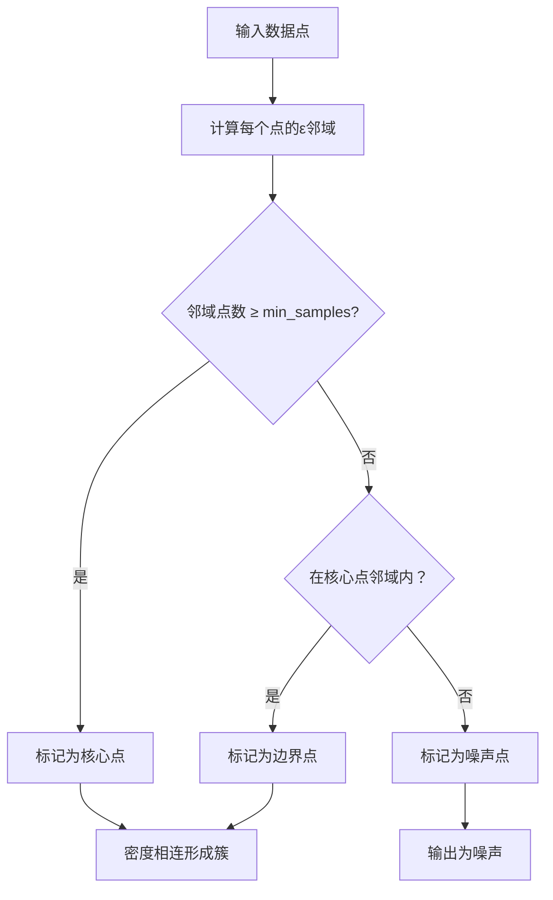
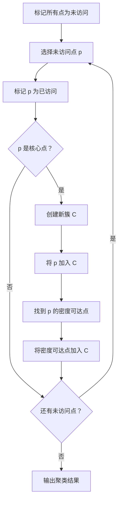
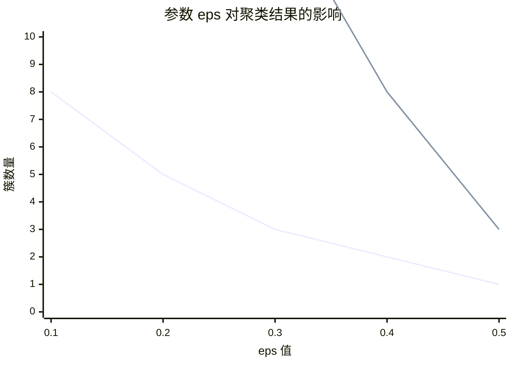
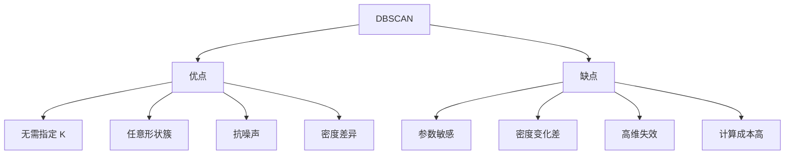

# DBSCAN 聚类

## 1. 概述

DBSCAN（Density-Based Spatial Clustering of Applications with Noise）是一种基于密度的聚类算法。与 K-Means 不同，DBSCAN 可以发现任意形状的簇，并能自动识别噪声点（异常值）。

**核心思想：** 密度相连的区域形成一个簇，低密度区域是噪声。

### 1.1 算法特点

| 特点 | 说明 |
|------|------|
| 基于密度 | 不需要指定簇数量 |
| 任意形状 | 可发现非凸形簇 |
| 抗噪声 | 自动识别异常值 |
| 参数敏感 | 对 eps 和 min_samples 敏感 |

### 1.2 适用场景

- 异常检测
- 空间数据分析
- 任意形状簇发现
- 含噪声数据聚类
- 客户分群
- 图像分割

### 1.3 与 K-Means 对比

| 特性 | K-Means | DBSCAN |
|------|---------|--------|
| 簇数量 | 需预先指定 | 自动发现 |
| 簇形状 | 凸形 | 任意形状 |
| 异常值 | 敏感 | 鲁棒 |
| 参数 | K | eps, min_samples |
| 密度差异 | 不适用 | 可处理 |

## 2. 算法原理

### 2.1 核心概念

**ε-邻域（Epsilon Neighborhood）：**
```
N_ε(p) = {q ∈ D | dist(p, q) ≤ ε}
```

**核心点（Core Point）：**
ε-邻域内至少有 min_samples 个点

**边界点（Border Point）：**
ε-邻域内点数少于 min_samples，但在某个核心点的邻域内

**噪声点（Noise Point）：**
既不是核心点也不是边界点



### 2.2 密度可达与密度相连

**直接密度可达：**
点 q 从点 p 直接密度可达，如果：
- p 是核心点
- q 在 p 的ε邻域内

**密度可达：**
存在一系列点 p₁, p₂, ..., pₙ，其中 p₁=p, pₙ=q，且 pᵢ₊₁ 从 pᵢ 直接密度可达

**密度相连：**
存在点 o，使得 p 和 q 都从 o 密度可达

### 2.3 算法步骤



## 3. Python 代码实现

### 3.1 使用 scikit-learn

```python
import numpy as np
from sklearn.cluster import DBSCAN
from sklearn.datasets import make_moons, make_blobs
from sklearn.preprocessing import StandardScaler
from sklearn.metrics import silhouette_score
import matplotlib.pyplot as plt
import seaborn as sns

# 1. 生成月牙形数据（非凸形）
X, y_true = make_moons(n_samples=300, noise=0.05, random_state=42)

# 2. 特征缩放
scaler = StandardScaler()
X_scaled = scaler.fit_transform(X)

# 3. 创建并训练模型
dbscan = DBSCAN(
    eps=0.3,              # ε邻域半径
    min_samples=5,        # 核心点最小邻居数
    metric='euclidean',   # 距离度量
    n_jobs=-1            # 并行处理
)
labels = dbscan.fit_predict(X_scaled)

# 4. 结果分析
n_clusters = len(set(labels)) - (1 if -1 in labels else 0)
n_noise = list(labels).count(-1)

print(f"发现的簇数量：{n_clusters}")
print(f"噪声点数量：{n_noise}")
print(f"噪声点比例：{n_noise/len(labels):.2%}")

# 5. 评估（仅针对非噪声点）
if n_clusters > 1:
    mask = labels != -1
    silhouette = silhouette_score(X_scaled[mask], labels[mask])
    print(f"轮廓系数：{silhouette:.4f}")

# 6. 可视化
plt.figure(figsize=(12, 5))

# 真实标签
plt.subplot(1, 2, 1)
plt.scatter(X[:, 0], X[:, 1], c=y_true, cmap='viridis', alpha=0.6)
plt.title('真实标签')
plt.xlabel('特征 1')
plt.ylabel('特征 2')

# DBSCAN 结果
plt.subplot(1, 2, 2)
# 噪声点用黑色表示
colors = plt.cm.viridis(np.linspace(0, 1, n_clusters))
for i in range(n_clusters):
    mask = labels == i
    plt.scatter(X[mask, 0], X[mask, 1], c=[colors[i]], label=f'簇 {i}', alpha=0.6)
noise_mask = labels == -1
plt.scatter(X[noise_mask, 0], X[noise_mask, 1], c='black', label='噪声', alpha=0.6)
plt.title(f'DBSCAN 结果 (簇={n_clusters}, 噪声={n_noise})')
plt.xlabel('特征 1')
plt.ylabel('特征 2')
plt.legend()

plt.tight_layout()
plt.show()
```

### 3.2 从零实现 DBSCAN

```python
import numpy as np
from collections import deque

class DBSCANCustom:
    """从零实现 DBSCAN"""
    
    def __init__(self, eps=0.5, min_samples=5, metric='euclidean'):
        self.eps = eps
        self.min_samples = min_samples
        self.metric = metric
        self.labels = None
        self.core_sample_indices = None
    
    def _compute_distance_matrix(self, X):
        """计算距离矩阵"""
        n_samples = X.shape[0]
        distances = np.zeros((n_samples, n_samples))
        for i in range(n_samples):
            for j in range(i + 1, n_samples):
                dist = np.sqrt(np.sum((X[i] - X[j]) ** 2))
                distances[i, j] = dist
                distances[j, i] = dist
        return distances
    
    def _get_neighbors(self, distances, point_idx):
        """获取ε邻域内的点"""
        return np.where(distances[point_idx] <= self.eps)[0]
    
    def fit(self, X):
        n_samples = X.shape[0]
        
        # 计算距离矩阵
        distances = self._compute_distance_matrix(X)
        
        # 初始化标签（-1 表示噪声）
        self.labels = np.full(n_samples, -1)
        
        # 找出所有核心点
        core_samples = []
        for i in range(n_samples):
            neighbors = self._get_neighbors(distances, i)
            if len(neighbors) >= self.min_samples:
                core_samples.append(i)
        
        self.core_sample_indices = np.array(core_samples)
        
        # 聚类
        cluster_id = 0
        
        for point_idx in range(n_samples):
            # 跳过已处理的点
            if self.labels[point_idx] != -1:
                continue
            
            # 如果不是核心点，跳过（保持为噪声）
            if point_idx not in core_samples:
                continue
            
            # 创建新簇
            self.labels[point_idx] = cluster_id
            
            # BFS 扩展簇
            queue = deque([point_idx])
            
            while queue:
                current = queue.popleft()
                neighbors = self._get_neighbors(distances, current)
                
                for neighbor in neighbors:
                    if self.labels[neighbor] == -1:
                        # 未访问的点
                        self.labels[neighbor] = cluster_id
                        
                        # 如果是核心点，加入队列继续扩展
                        if neighbor in core_samples:
                            queue.append(neighbor)
            
            cluster_id += 1
        
        return self
    
    def fit_predict(self, X):
        self.fit(X)
        return self.labels

# 使用示例
X = np.random.randn(100, 2)
dbscan = DBSCANCustom(eps=0.5, min_samples=5)
labels = dbscan.fit_predict(X)
print(f"簇数量：{len(set(labels)) - (1 if -1 in labels else 0)}")
```

## 4. 参数选择

### 4.1 K-Distance 图选择 eps

```python
from sklearn.neighbors import NearestNeighbors

# 计算每个点到其第 k 个最近邻居的距离
k = 5  # 通常等于 min_samples
nbrs = NearestNeighbors(n_neighbors=k)
nbrs.fit(X_scaled)

# 获取 k 距离
distances, indices = nbrs.kneighbors(X_scaled)
k_distances = distances[:, -1]  # 第 k 个最近邻居的距离

# 排序并绘制
k_distances_sorted = np.sort(k_distances)[::-1]

plt.figure(figsize=(10, 6))
plt.plot(k_distances_sorted)
plt.xlabel('点索引（排序后）')
plt.ylabel(f'{k}-距离')
plt.title('K-Distance 图')
plt.grid(True, alpha=0.3)

# 寻找肘部（eps 的候选值）
# 通常选择曲线开始变平的点
plt.axhline(y=0.3, color='r', linestyle='--', label='建议 eps=0.3')
plt.legend()
plt.show()

# eps 通常选择肘部对应的距离值
```

### 4.2 参数网格搜索

```python
from sklearn.metrics import silhouette_score

# 参数网格
eps_values = [0.1, 0.2, 0.3, 0.4, 0.5]
min_samples_values = [3, 5, 7, 10]

best_score = -1
best_params = None

for eps in eps_values:
    for min_samples in min_samples_values:
        dbscan = DBSCAN(eps=eps, min_samples=min_samples)
        labels = dbscan.fit_predict(X_scaled)
        
        # 跳过只有一个簇或全是噪声的情况
        n_clusters = len(set(labels)) - (1 if -1 in labels else 0)
        if n_clusters < 2:
            continue
        
        # 计算轮廓系数（排除噪声）
        mask = labels != -1
        if np.sum(mask) > 10:  # 至少有 10 个非噪声点
            score = silhouette_score(X_scaled[mask], labels[mask])
            
            if score > best_score:
                best_score = score
                best_params = (eps, min_samples)

print(f"最佳参数：eps={best_params[0]}, min_samples={best_params[1]}")
print(f"最佳轮廓系数：{best_score:.4f}")
```



## 5. 优缺点分析



### 5.1 优点

- **无需指定 K**：自动发现簇数量
- **任意形状簇**：可发现非凸形簇
- **抗噪声**：自动识别并排除噪声点
- **密度差异**：可以处理不同密度的簇

### 5.2 缺点

- **参数敏感**：eps 和 min_samples 难以选择
- **密度变化差**：密度差异大的簇难以同时处理
- **高维失效**：高维空间距离失效
- **计算成本高**：需要计算距离矩阵 O(n²)

## 6. 处理密度变化的簇

### 6.1 HDBSCAN（层次 DBSCAN）

```python
import hdbscan

# HDBSCAN 自动选择 eps
clusterer = hdbscan.HDBSCAN(
    min_cluster_size=5,
    min_samples=5,
    metric='euclidean'
)
labels = clusterer.fit_predict(X_scaled)

# 获取簇的概率
probabilities = clusterer.probabilities_
```

### 6.2 OPTICS

```python
from sklearn.cluster import OPTICS

# OPTICS 可以处理密度变化的簇
optics = OPTICS(
    min_samples=5,
    max_eps=np.inf,  # 不限制最大 eps
    metric='euclidean'
)
labels = optics.fit_predict(X_scaled)
```

## 7. 高维数据处理

### 7.1 降维后聚类

```python
from sklearn.decomposition import PCA

# PCA 降维
pca = PCA(n_components=2)
X_pca = pca.fit_transform(X_scaled)

# 在降维后的空间聚类
dbscan = DBSCAN(eps=0.3, min_samples=5)
labels = dbscan.fit_predict(X_pca)
```

### 7.2 使用余弦距离

```python
from sklearn.preprocessing import normalize

# 归一化后使用余弦距离
X_normalized = normalize(X_scaled)

dbscan = DBSCAN(eps=0.3, min_samples=5, metric='cosine')
labels = dbscan.fit_predict(X_normalized)
```

## 8. 实战应用

### 8.1 异常检测

```python
# DBSCAN 的噪声点可以作为异常值
dbscan = DBSCAN(eps=0.3, min_samples=5)
labels = dbscan.fit_predict(X_scaled)

# 噪声点即为异常值
outliers = X_scaled[labels == -1]
print(f"检测到 {len(outliers)} 个异常值")

# 可视化
plt.figure(figsize=(10, 6))
plt.scatter(X_scaled[:, 0], X_scaled[:, 1], c='blue', alpha=0.3, label='正常点')
plt.scatter(outliers[:, 0], outliers[:, 1], c='red', alpha=0.6, label='异常值')
plt.title('DBSCAN 异常检测')
plt.legend()
plt.show()
```

### 8.2 空间数据分析

```python
import pandas as pd

# 假设 GPS 坐标数据
gps_data = pd.DataFrame({
    'lat': np.random.randn(1000) * 0.01 + 39.9,  # 北京附近
    'lon': np.random.randn(1000) * 0.01 + 116.4
})

# DBSCAN 聚类（使用 Haversine 距离）
from sklearn.cluster import DBSCAN

# 将经纬度转换为弧度
gps_rad = np.radians(gps_data[['lat', 'lon']].values)

# 使用 Haversine 距离（地球表面距离）
dbscan = DBSCAN(eps=0.01, min_samples=10, metric='haversine')
labels = dbscan.fit_predict(gps_rad)

# 分析每个热点区域
gps_data['cluster'] = labels
hotspots = gps_data.groupby('cluster').size().sort_values(ascending=False)
print("热点区域:")
print(hotspots)
```

## 9. 性能优化

### 9.1 使用 KD 树或球树

```python
# DBSCAN 自动选择算法
dbscan = DBSCAN(
    eps=0.3,
    min_samples=5,
    algorithm='auto'  # 'auto', 'ball_tree', 'kd_tree', 'brute'
)
```

### 9.2 采样加速

```python
# 对大规模数据先采样
from sklearn.utils import resample

X_sample, indices = resample(X_scaled, n_samples=10000, random_state=42)

# 在样本上聚类
dbscan = DBSCAN(eps=0.3, min_samples=5)
labels_sample = dbscan.fit_predict(X_sample)

# 将结果扩展到全量数据（可选）
```

## 10. 总结

DBSCAN 是基于密度的经典聚类算法：

**核心价值：**
1. 无需预先指定簇数量
2. 可发现任意形状的簇
3. 自动识别噪声点
4. 对异常值鲁棒

**最佳实践：**
- 使用 K-Distance 图选择 eps
- 特征缩放很重要
- 高维数据先降维
- 密度变化大时用 HDBSCAN

**适用场景：**
- 异常检测
- 空间数据分析
- 任意形状簇发现
- 含噪声数据

DBSCAN 是 K-Means 的重要补充，特别适合处理非凸形簇和含噪声数据。
