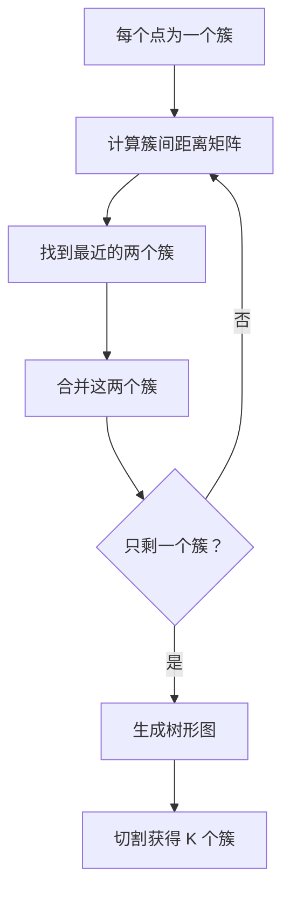
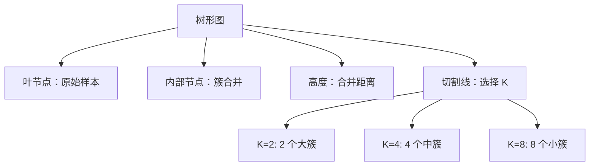
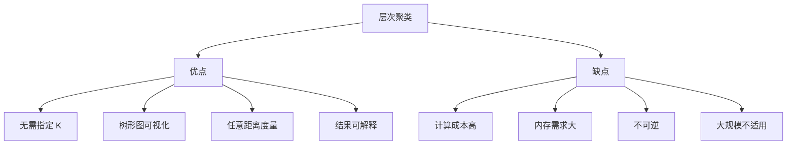

# 层次聚类（Hierarchical Clustering）

## 1. 概述

层次聚类是一种构建簇层次结构的聚类方法，可以生成树状结构（树形图/dendrogram）。与 K-Means 不同，层次聚类不需要预先指定簇数量，可以通过切割树形图获得任意数量的簇。

**核心思想：** 自底向上或自顶向下构建簇的层次结构。

### 1.1 算法类型

| 类型 | 方向 | 说明 |
|------|------|------|
| 凝聚（Agglomerative） | 自底向上 | 每个点初始为簇，逐步合并 |
| 分裂（Divisive） | 自顶向下 | 所有点初始为一簇，逐步分裂 |

### 1.2 适用场景

- 生物信息学（基因聚类）
- 文档分类
- 社交网络分析
- 市场细分
- 需要层次结构的场景
- 探索性数据分析

### 1.3 与 K-Means 对比

| 特性 | K-Means | 层次聚类 |
|------|---------|----------|
| 簇数量 | 需预先指定 | 可从树形图选择 |
| 层次结构 | 无 | 有（树形图） |
| 可解释性 | 中 | 高 |
| 计算复杂度 | O(n) | O(n²)~O(n³) |
| 大规模数据 | 适合 | 不适合 |

## 2. 算法原理

### 2.1 凝聚层次聚类步骤



### 2.2 簇间距离度量（Linkage）

#### 2.2.1 单链接（Single Linkage）

```
d(A, B) = min{d(a, b) | a ∈ A, b ∈ B}
```

- 最近邻距离
- 易产生链式效应

#### 2.2.2 全链接（Complete Linkage）

```
d(A, B) = max{d(a, b) | a ∈ A, b ∈ B}
```

- 最远邻距离
- 产生紧凑的簇

#### 2.2.3 平均链接（Average Linkage）

```
d(A, B) = (1/|A||B|) × ΣΣ d(a, b)
```

- 平均距离
- 平衡单链接和全链接

#### 2.2.4 质心链接（Centroid Linkage）

```
d(A, B) = d(centroid(A), centroid(B))
```

- 簇中心距离
- 可能产生反转

#### 2.2.5 Ward 链接（Ward's Method）

```
d(A, B) = 合并后的方差增加
```

- 最小化方差增加
- 产生大小相近的簇
- **最常用**

```mermaid
xychart-beta
    title "不同 Linkage 方法对比"
    x-axis "方法" ["单链接", "全链接", "平均链接", "Ward"]
    y-axis "推荐度" 0 --> 5
    bar "簇紧凑性" [2, 5, 4, 5]
    bar "抗噪声" [2, 4, 3, 4]
    bar "通用性" [3, 4, 4, 5]
```



## 3. Python 代码实现

### 3.1 使用 scikit-learn

```python
import numpy as np
from sklearn.cluster import AgglomerativeClustering
from sklearn.datasets import make_blobs
from sklearn.preprocessing import StandardScaler
from sklearn.metrics import silhouette_score
import matplotlib.pyplot as plt
import seaborn as sns
from scipy.cluster.hierarchy import dendrogram, linkage

# 1. 生成数据
X, y_true = make_blobs(
    n_samples=200, centers=4, cluster_std=0.60,
    random_state=42
)

# 2. 特征缩放
scaler = StandardScaler()
X_scaled = scaler.fit_transform(X)

# 3. 创建并训练模型
hc = AgglomerativeClustering(
    n_clusters=4,           # 簇数量（None 表示从树形图选择）
    metric='euclidean',     # 距离度量
    linkage='ward'          # 链接方法：'ward', 'complete', 'average', 'single'
)
labels = hc.fit_predict(X_scaled)

# 4. 结果分析
n_clusters = len(set(labels))
print(f"簇数量：{n_clusters}")

# 5. 评估
silhouette = silhouette_score(X_scaled, labels)
print(f"轮廓系数：{silhouette:.4f}")

# 6. 可视化
plt.figure(figsize=(12, 5))

# 聚类结果
plt.subplot(1, 2, 1)
plt.scatter(X[:, 0], X[:, 1], c=labels, cmap='viridis', alpha=0.6)
plt.title(f'层次聚类结果 (K={n_clusters})')
plt.xlabel('特征 1')
plt.ylabel('特征 2')

# 树形图
plt.subplot(1, 2, 2)
linkage_matrix = linkage(X_scaled, method='ward')
dendrogram(linkage_matrix, truncate_mode='level', p=3)
plt.title('树形图（Dendrogram）')
plt.xlabel('样本索引')
plt.ylabel('距离')
plt.axhline(y=10, color='r', linestyle='--', label='切割线')
plt.legend()

plt.tight_layout()
plt.show()
```

### 3.2 使用 SciPy 实现

```python
from scipy.cluster.hierarchy import dendrogram, linkage, fcluster
from scipy.spatial.distance import pdist

# 1. 计算距离矩阵
distance_matrix = pdist(X_scaled, metric='euclidean')

# 2. 执行层次聚类
linkage_matrix = linkage(distance_matrix, method='ward')

# 3. 从树形图切割获得簇
labels = fcluster(linkage_matrix, t=4, criterion='maxclust')

# 4. 绘制完整树形图
plt.figure(figsize=(15, 8))
dendrogram(linkage_matrix, leaf_rotation=90, leaf_font_size=8)
plt.title('完整树形图')
plt.xlabel('样本索引')
plt.ylabel('距离')
plt.tight_layout()
plt.show()

# 5. 不同切割高度获得不同簇数
for k in [2, 3, 4, 5]:
    labels_k = fcluster(linkage_matrix, t=k, criterion='maxclust')
    print(f"K={k}: 簇数量={len(set(labels_k))}")
```

### 3.3 从零实现简化版

```python
import numpy as np

class AgglomerativeClusteringCustom:
    """简化版凝聚层次聚类"""
    
    def __init__(self, n_clusters=2, linkage='ward'):
        self.n_clusters = n_clusters
        self.linkage = linkage
        self.labels = None
    
    def _compute_distance_matrix(self, X):
        """计算欧氏距离矩阵"""
        n = X.shape[0]
        dist = np.zeros((n, n))
        for i in range(n):
            for j in range(i + 1, n):
                d = np.sqrt(np.sum((X[i] - X[j]) ** 2))
                dist[i, j] = d
                dist[j, i] = d
        return dist
    
    def _ward_distance(self, X, cluster_i, cluster_j):
        """Ward 距离"""
        n_i, n_j = len(cluster_i), len(cluster_j)
        center_i = X[cluster_i].mean(axis=0)
        center_j = X[cluster_j].mean(axis=0)
        return (n_i * n_j) / (n_i + n_j) * np.sum((center_i - center_j) ** 2)
    
    def fit_predict(self, X):
        n_samples = X.shape[0]
        
        # 初始每个点为一个簇
        clusters = [[i] for i in range(n_samples)]
        
        while len(clusters) > self.n_clusters:
            # 找到最近的两个簇
            min_dist = float('inf')
            merge_i, merge_j = 0, 1
            
            for i in range(len(clusters)):
                for j in range(i + 1, len(clusters)):
                    if self.linkage == 'ward':
                        dist = self._ward_distance(X, clusters[i], clusters[j])
                    else:
                        # 简化：使用单链接
                        dist = min(np.sqrt(np.sum((X[a] - X[b]) ** 2)) 
                                  for a in clusters[i] for b in clusters[j])
                    
                    if dist < min_dist:
                        min_dist = dist
                        merge_i, merge_j = i, j
            
            # 合并簇
            clusters[merge_i] = clusters[merge_i] + clusters[merge_j]
            clusters.pop(merge_j)
        
        # 生成标签
        self.labels = np.zeros(n_samples, dtype=int)
        for i, cluster in enumerate(clusters):
            for idx in cluster:
                self.labels[idx] = i
        
        return self.labels

# 使用示例
X = np.random.randn(50, 2)
hc = AgglomerativeClusteringCustom(n_clusters=3, linkage='ward')
labels = hc.fit_predict(X)
print(f"簇数量：{len(set(labels))}")
```

## 4. 树形图解读

### 4.1 树形图结构



### 4.2 选择最优簇数

```python
from scipy.cluster.hierarchy import inconsistent

# 方法 1：观察树形图
linkage_matrix = linkage(X_scaled, method='ward')
plt.figure(figsize=(15, 5))
dendrogram(linkage_matrix)
plt.title('树形图')
plt.xlabel('样本索引')
plt.ylabel('距离')
plt.show()

# 方法 2：不一致系数
inconsistent_matrix = inconsistent(linkage_matrix, d=4)
# 大的不一致系数表示自然的簇边界

# 方法 3：肘部法则
distances = linkage_matrix[:, 2]  # 合并距离
plt.figure(figsize=(10, 5))
plt.plot(range(1, len(distances) + 1), distances[::-1])
plt.xlabel('合并步骤')
plt.ylabel('合并距离')
plt.title('合并距离变化')
plt.grid(True, alpha=0.3)
plt.show()
```

### 4.3 不同 Linkage 对比

```python
linkage_methods = ['ward', 'complete', 'average', 'single']

fig, axes = plt.subplots(2, 2, figsize=(15, 12))
axes = axes.flatten()

for ax, method in zip(axes, linkage_methods):
    linkage_matrix = linkage(X_scaled, method=method)
    dendrogram(linkage_matrix, truncate_mode='lastp', p=12, ax=ax)
    ax.set_title(f'Linkage: {method}')
    ax.set_xlabel('样本索引')
    ax.set_ylabel('距离')

plt.tight_layout()
plt.show()
```

## 5. 优缺点分析



### 5.1 优点

- **无需指定 K**：可从树形图选择任意簇数
- **树形图可视化**：直观展示层次结构
- **任意距离度量**：支持多种距离定义
- **结果可解释**：层次关系清晰

### 5.2 缺点

- **计算成本高**：O(n²)~O(n³) 复杂度
- **内存需求大**：需要存储距离矩阵
- **不可逆**：一旦合并无法撤销
- **大规模不适用**：适合中小规模数据

## 6. 距离度量选择

```python
from scipy.spatial.distance import pdist
from sklearn.metrics import pairwise_distances

# 常用距离度量
metrics = ['euclidean', 'manhattan', 'cosine', 'correlation']

for metric in metrics:
    try:
        dist_matrix = pairwise_distances(X_scaled, metric=metric)
        print(f"{metric}: 距离矩阵形状 {dist_matrix.shape}")
    except Exception as e:
        print(f"{metric}: 不支持 - {e}")
```

## 7. 大规模数据优化

### 7.1 采样

```python
from sklearn.utils import resample

# 对大规模数据采样
X_sample, indices = resample(X_scaled, n_samples=1000, random_state=42)

# 在样本上聚类
hc = AgglomerativeClustering(n_clusters=5, linkage='ward')
labels_sample = hc.fit_predict(X_sample)

# 将结果扩展到全量数据（使用最近邻）
from sklearn.neighbors import NearestNeighbors

nbrs = NearestNeighbors(n_neighbors=1)
nbrs.fit(X_sample)
_, nearest_indices = nbrs.kneighbors(X_scaled)
labels_full = labels_sample[nearest_indices.flatten()]
```

### 7.2 BIRCH 算法

```python
from sklearn.cluster import Birch

# BIRCH 适合大规模数据
birch = Birch(
    n_clusters=5,
    threshold=0.5,      # 簇半径阈值
    branching_factor=50  # 分支因子
)
labels = birch.fit_predict(X_scaled)
```

## 8. 实战应用

### 8.1 文档聚类

```python
from sklearn.feature_extraction.text import TfidfVectorizer
from sklearn.datasets import fetch_20newsgroups

# 加载文本数据
categories = ['sci.space', 'rec.sport.baseball', 'comp.graphics']
newsgroups = fetch_20newsgroups(categories=categories, remove=('headers', 'footers', 'quotes'))

# TF-IDF 向量化
vectorizer = TfidfVectorizer(max_features=1000, stop_words='english')
X = vectorizer.fit_transform(newsgroups.data)

# 层次聚类
hc = AgglomerativeClustering(n_clusters=3, linkage='ward')
labels = hc.fit_predict(X.toarray())

# 评估
from sklearn.metrics import adjusted_rand_score
ari = adjusted_rand_score(newsgroups.target, labels)
print(f"调整 Rand 指数：{ari:.4f}")
```

### 8.2 基因表达分析

```python
import pandas as pd

# 假设基因表达数据
# genes: 行，samples: 列
gene_expression = pd.DataFrame(
    np.random.randn(100, 20),
    index=[f'Gene_{i}' for i in range(100)],
    columns=[f'Sample_{i}' for i in range(20)]
)

# 双向层次聚类（热图）
from scipy.cluster.hierarchy import linkage, dendrogram
import seaborn as sns

# 行聚类（基因）
row_linkage = linkage(gene_expression, method='ward')
# 列聚类（样本）
col_linkage = linkage(gene_expression.T, method='ward')

# 绘制热图
plt.figure(figsize=(12, 10))
sns.clustermap(gene_expression, 
               row_linkage=row_linkage,
               col_linkage=col_linkage,
               cmap='RdBu_r',
               figsize=(12, 10))
plt.show()
```

## 9. 评估指标

```python
from sklearn.metrics import (
    silhouette_score,
    calinski_harabasz_score,
    davies_bouldin_score,
    adjusted_rand_score,
    normalized_mutual_info_score
)

# 内部指标（无需真实标签）
print(f"轮廓系数：{silhouette_score(X_scaled, labels):.4f}")
print(f"CH 分数：{calinski_harabasz_score(X_scaled, labels):.2f}")
print(f"DB 指数：{davies_bouldin_score(X_scaled, labels):.4f}")

# 外部指标（需要真实标签）
if y_true is not None:
    print(f"调整 Rand 指数：{adjusted_rand_score(y_true, labels):.4f}")
    print(f"NMI: {normalized_mutual_info_score(y_true, labels):.4f}")
```

## 10. 总结

层次聚类是经典的聚类方法：

**核心价值：**
1. 构建簇的层次结构
2. 树形图直观可视化
3. 无需预先指定簇数
4. 支持多种距离度量

**最佳实践：**
- 优先使用 Ward 链接
- 中小规模数据（<10000 样本）
- 使用树形图选择 K
- 特征缩放很重要

**适用场景：**
- 生物信息学
- 文档分类
- 需要层次结构的场景
- 探索性数据分析

层次聚类虽然计算成本较高，但其可解释性和层次结构使其在特定场景下不可替代。
