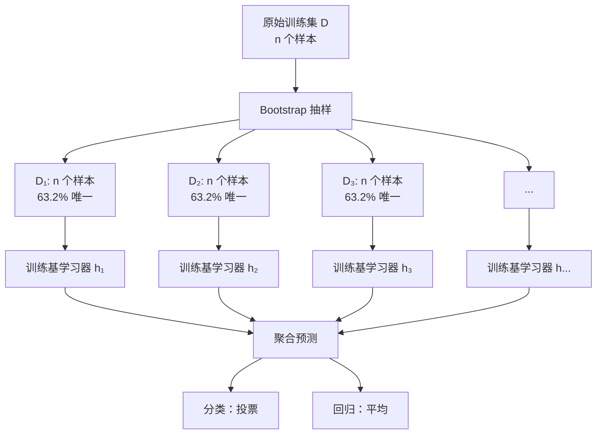
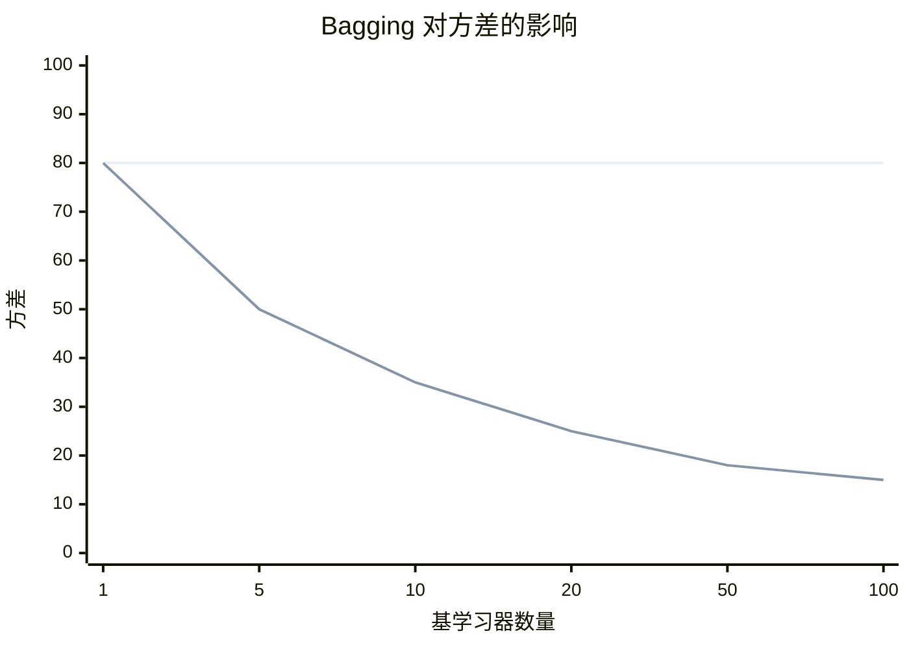
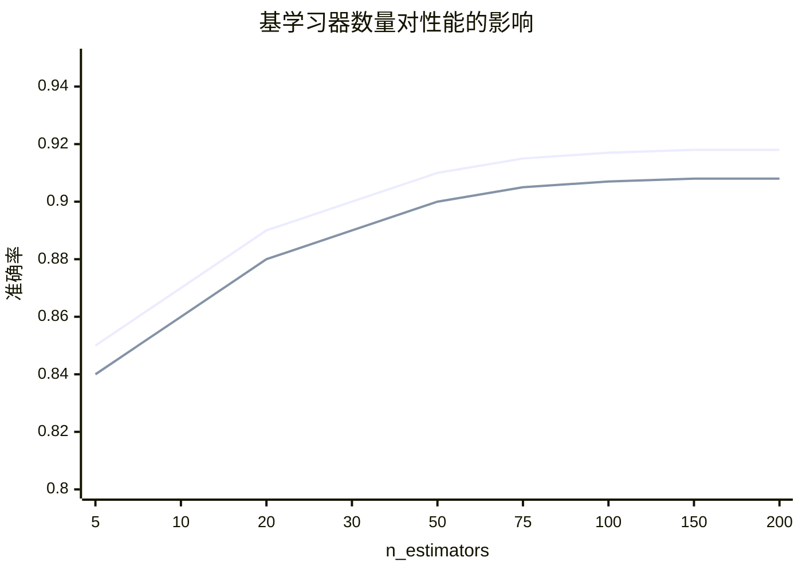
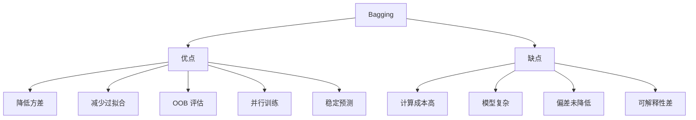

# Bagging（Bootstrap Aggregating）

## 1. 概述

Bagging（Bootstrap Aggregating，自助聚合）是一种**集成学习技术**，通过对训练数据进行有放回抽样，训练多个基学习器，然后聚合它们的预测结果。Bagging 主要用于降低模型的方差，提高泛化能力。

**核心思想：** "三个臭皮匠，顶个诸葛亮"——多个模型的组合优于单个模型。

### 1.1 历史背景

- 1996 年：Leo Breiman 首次提出 Bagging
- 核心贡献：证明 Bagging 可以降低方差
- 经典应用：随机森林（Random Forest）

### 1.2 适用场景

- 高方差模型（如决策树）
- 不稳定学习器
- 需要提高泛化能力
- 减少过拟合风险
- 分类和回归任务

### 1.3 与 Boosting 对比

| 特性 | Bagging | Boosting |
|------|---------|----------|
| 抽样方式 | 有放回独立抽样 | 根据误差调整权重 |
| 基学习器关系 | 独立并行 | 顺序依赖 |
| 主要目标 | 降低方差 | 降低偏差 |
| 对异常值 | 鲁棒 | 敏感 |
| 典型算法 | 随机森林 | AdaBoost, GBDT |

## 2. 算法原理

### 2.1 Bootstrap 抽样

从原始训练集 D（大小为 n）中有放回地抽取 n 个样本，形成训练子集 Dᵢ。

**抽样特性：**
- 每个样本被抽中的概率：1/n
- 每个样本未被抽中的概率：(1 - 1/n)^n ≈ 1/e ≈ 0.368
- 约 63.2% 的样本被选中
- 约 36.8% 的样本未被选中（袋外样本 OOB）



### 2.2 算法流程

```
输入：训练集 D = {(x₁, y₁), ..., (xₙ, yₙ)}
      基学习器算法 L
      集成大小 T

过程：
1. for t = 1 to T:
2.     D_t = BootstrapSample(D)  # 有放回抽样
3.     h_t = L(D_t)              # 训练基学习器
4. 输出：H(x) = Aggregate({h₁(x), ..., h_T(x)})
```

### 2.3 聚合策略

**分类任务（投票法）：**
```
H(x) = argmax_y Σ I(h_t(x) = y)
```

**回归任务（平均法）：**
```
H(x) = (1/T) × Σ h_t(x)
```

### 2.4 为什么 Bagging 有效？

**偏差 - 方差分解：**
```
Error = Bias² + Variance + Irreducible Error
```

Bagging 主要降低**方差**：
- 多个独立模型的预测方差小于单个模型
- 对于高方差模型（如深度决策树）效果显著
- 对偏差影响较小



## 3. Python 代码实现

### 3.1 使用 scikit-learn

```python
import numpy as np
from sklearn.ensemble import BaggingClassifier, BaggingRegressor
from sklearn.tree import DecisionTreeClassifier, DecisionTreeRegressor
from sklearn.model_selection import train_test_split, cross_val_score
from sklearn.metrics import accuracy_score, mean_squared_error
from sklearn.datasets import make_classification, make_regression
import matplotlib.pyplot as plt

# ============ Bagging 分类 ============
print("=== Bagging 分类 ===\n")

# 1. 生成数据
X, y = make_classification(
    n_samples=1000, n_features=20, n_informative=15,
    random_state=42
)

# 2. 划分数据集
X_train, X_test, y_train, y_test = train_test_split(
    X, y, test_size=0.2, random_state=42, stratify=y
)

# 3. 创建并训练模型
base_clf = DecisionTreeClassifier(max_depth=10, random_state=42)

bagging_clf = BaggingClassifier(
    estimator=base_clf,
    n_estimators=50,          # 基学习器数量
    max_samples=1.0,          # 每个基学习器的样本比例（1.0=100%）
    max_features=1.0,         # 每个基学习器的特征比例
    bootstrap=True,           # 是否 Bootstrap 抽样
    bootstrap_features=False, # 是否 Bootstrap 特征
    oob_score=True,           # 使用 OOB 样本评估
    n_jobs=-1,
    random_state=42
)
bagging_clf.fit(X_train, y_train)

# 4. 评估
y_pred = bagging_clf.predict(X_test)
print(f"OOB 分数：{bagging_clf.oob_score_:.4f}")
print(f"测试集准确率：{accuracy_score(y_test, y_pred):.4f}")

# 5. 与单棵树对比
single_clf = DecisionTreeClassifier(max_depth=10, random_state=42)
single_clf.fit(X_train, y_train)
single_score = single_clf.score(X_test, y_test)
bagging_score = bagging_clf.score(X_test, y_test)

print(f"\n单棵树准确率：{single_score:.4f}")
print(f"Bagging 准确率：{bagging_score:.4f}")
print(f"性能提升：{(bagging_score - single_score):.4f}")

# ============ Bagging 回归 ============
print("\n=== Bagging 回归 ===\n")

X_reg, y_reg = make_regression(
    n_samples=1000, n_features=10, noise=10, random_state=42
)

X_train_reg, X_test_reg, y_train_reg, y_test_reg = train_test_split(
    X_reg, y_reg, test_size=0.2, random_state=42
)

base_reg = DecisionTreeRegressor(max_depth=10, random_state=42)
bagging_reg = BaggingRegressor(
    estimator=base_reg,
    n_estimators=50,
    oob_score=True,
    n_jobs=-1,
    random_state=42
)
bagging_reg.fit(X_train_reg, y_train_reg)

mse_single = mean_squared_error(y_test_reg, base_reg.fit(X_train_reg, y_train_reg).predict(X_test_reg))
mse_bagging = mean_squared_error(y_test_reg, bagging_reg.predict(X_test_reg))

print(f"单棵树 MSE: {mse_single:.4f}")
print(f"Bagging MSE: {mse_bagging:.4f}")
print(f"MSE 降低：{(mse_single - mse_bagging):.4f}")
```

### 3.2 从零实现 Bagging

```python
import numpy as np
from collections import Counter

class BaggingClassifierCustom:
    """从零实现 Bagging 分类器"""
    
    def __init__(self, base_estimator, n_estimators=50, max_samples=1.0, 
                 bootstrap=True, random_state=None):
        self.base_estimator = base_estimator
        self.n_estimators = n_estimators
        self.max_samples = max_samples
        self.bootstrap = bootstrap
        self.random_state = random_state
        self.estimators = []
        self.oob_score_ = None
    
    def _bootstrap_sample(self, X, y):
        """Bootstrap 抽样"""
        n_samples = X.shape[0]
        n_sample = int(self.max_samples * n_samples)
        
        if self.bootstrap:
            indices = np.random.choice(n_samples, n_sample, replace=True)
        else:
            indices = np.random.choice(n_samples, n_sample, replace=False)
        
        return X[indices], y[indices], indices
    
    def fit(self, X, y):
        np.random.seed(self.random_state)
        n_samples = X.shape[0]
        
        self.estimators = []
        oob_predictions = np.zeros((n_samples, len(np.unique(y))))
        oob_counts = np.zeros(n_samples)
        
        for _ in range(self.n_estimators):
            # Bootstrap 抽样
            X_boot, y_boot, indices = self._bootstrap_sample(X, y)
            
            # 训练基学习器
            estimator = type(self.base_estimator)(**self.base_estimator.get_params())
            estimator.fit(X_boot, y_boot)
            self.estimators.append(estimator)
            
            # OOB 预测
            oob_mask = np.ones(n_samples, dtype=bool)
            oob_mask[np.unique(indices)] = False
            if np.sum(oob_mask) > 0:
                oob_pred = estimator.predict(X[oob_mask])
                for i, idx in enumerate(np.where(oob_mask)[0]):
                    oob_predictions[idx, oob_pred[i]] += 1
                    oob_counts[idx] += 1
        
        # 计算 OOB 分数
        valid_oob = oob_counts > 0
        if np.sum(valid_oob) > 0:
            oob_final_pred = np.argmax(oob_predictions[valid_oob], axis=1)
            self.oob_score_ = np.mean(oob_final_pred == y[valid_oob])
        
        return self
    
    def predict(self, X):
        # 收集所有基学习器的预测
        predictions = np.array([est.predict(X) for est in self.estimators])
        # 多数投票
        return np.array([Counter(predictions[:, i]).most_common(1)[0][0] 
                        for i in range(X.shape[0])])
    
    def score(self, X, y):
        return np.mean(self.predict(X) == y)

# 简化决策树桩
class DecisionTreeStump:
    def __init__(self, max_depth=5, random_state=None):
        self.max_depth = max_depth
        self.random_state = random_state
        self.tree = None
    
    def fit(self, X, y):
        # 简化：只使用第一个特征
        threshold = np.median(X[:, 0])
        self.tree = {'threshold': threshold}
        return self
    
    def predict(self, X):
        return (X[:, 0] > self.tree['threshold']).astype(int)
    
    def get_params(self):
        return {'max_depth': self.max_depth, 'random_state': self.random_state}

# 使用示例
X = np.random.randn(100, 5)
y = (np.sum(X[:, :3] > 0, axis=1) > 1).astype(int)

base = DecisionTreeStump(max_depth=3, random_state=42)
bagging = BaggingClassifierCustom(base, n_estimators=10, random_state=42)
bagging.fit(X, y)
print(f"OOB 分数：{bagging.oob_score_}")
print(f"训练准确率：{bagging.score(X, y)}")
```

## 4. 超参数详解

### 4.1 核心参数

| 参数 | 说明 | 推荐值 |
|------|------|--------|
| `n_estimators` | 基学习器数量 | 50-200 |
| `max_samples` | 每个学习器的样本比例 | 0.5-1.0 |
| `max_features` | 每个学习器的特征比例 | 0.5-1.0 |
| `bootstrap` | 是否 Bootstrap 抽样 | True |
| `oob_score` | 是否使用 OOB 评估 | True |

### 4.2 参数调优

```python
from sklearn.model_selection import GridSearchCV

param_grid = {
    'n_estimators': [20, 50, 100, 200],
    'max_samples': [0.5, 0.8, 1.0],
    'max_features': [0.5, 0.8, 1.0]
}

grid_search = GridSearchCV(
    BaggingClassifier(
        estimator=DecisionTreeClassifier(max_depth=10, random_state=42),
        random_state=42,
        n_jobs=-1
    ),
    param_grid,
    cv=5,
    scoring='accuracy',
    n_jobs=-1,
    verbose=1
)

grid_search.fit(X_train, y_train)
print(f"最佳参数：{grid_search.best_params_}")
print(f"最佳分数：{grid_search.best_score_:.4f}")
```

## 5. 基学习器数量与性能



```python
# 分析基学习器数量的影响
n_estimators_range = [5, 10, 20, 30, 50, 75, 100, 150, 200]
train_scores = []
test_scores = []
oob_scores = []

for n_est in n_estimators_range:
    bagging = BaggingClassifier(
        estimator=DecisionTreeClassifier(max_depth=10, random_state=42),
        n_estimators=n_est,
        oob_score=True,
        random_state=42,
        n_jobs=-1
    )
    bagging.fit(X_train, y_train)
    train_scores.append(bagging.score(X_train, y_train))
    test_scores.append(bagging.score(X_test, y_test))
    oob_scores.append(bagging.oob_score_)

plt.figure(figsize=(10, 6))
plt.plot(n_estimators_range, train_scores, 'b-o', label='训练集')
plt.plot(n_estimators_range, test_scores, 'g-s', label='测试集')
plt.plot(n_estimators_range, oob_scores, 'r-^', label='OOB')
plt.xlabel('基学习器数量')
plt.ylabel('准确率')
plt.title('基学习器数量对性能的影响')
plt.legend()
plt.grid(True, alpha=0.3)
plt.show()
```

## 6. 优缺点分析



### 6.1 优点

- **降低方差**：显著提高高方差模型的泛化能力
- **减少过拟合**：集成降低过拟合风险
- **OOB 评估**：无需单独验证集
- **并行训练**：基学习器独立，可并行
- **稳定预测**：预测结果更稳定

### 6.2 缺点

- **计算成本高**：需要训练多个模型
- **模型复杂**：存储和预测成本高
- **偏差未降低**：对高偏差模型效果有限
- **可解释性差**：不如单个模型直观

## 7. 与随机森林的关系

**随机森林 = Bagging + 随机特征选择**

```python
# Bagging
bagging = BaggingClassifier(
    estimator=DecisionTreeClassifier(),
    max_samples=1.0,
    max_features=1.0,  # 使用所有特征
    bootstrap=True
)

# 随机森林
from sklearn.ensemble import RandomForestClassifier

rf = RandomForestClassifier(
    n_estimators=100,
    max_features='sqrt'  # 随机选择特征
)
```

## 8. 实战技巧

### 8.1 OOB 评估

```python
# 启用 OOB 评估
bagging = BaggingClassifier(oob_score=True, random_state=42)
bagging.fit(X_train, y_train)

print(f"OOB 分数：{bagging.oob_score_:.4f}")
print(f"测试集分数：{bagging.score(X_test, y_test):.4f}")
# OOB 分数通常接近测试集分数
```

### 8.2 特征重要性

```python
# 聚合基学习器的特征重要性
importances = np.mean([
    est.feature_importances_ 
    for est in bagging.estimators_
], axis=0)

# 可视化
plt.figure(figsize=(10, 6))
plt.bar(range(len(importances)), importances)
plt.xlabel('特征')
plt.ylabel('重要性')
plt.title('Bagging 特征重要性')
plt.show()
```

### 8.3 处理不平衡数据

```python
from imblearn.ensemble import BalancedBaggingClassifier

# 平衡 Bagging
balanced_bagging = BalancedBaggingClassifier(
    base_estimator=DecisionTreeClassifier(),
    n_estimators=50,
    sampling_strategy='auto',
    replacement=True,
    random_state=42
)
balanced_bagging.fit(X_train, y_train)
```

## 9. 总结

Bagging 是经典的集成学习技术：

**核心价值：**
1. 通过 Bootstrap 抽样增加多样性
2. 聚合预测降低方差
3. OOB 评估无需验证集
4. 并行训练效率高

**最佳实践：**
- 使用高方差基学习器（如决策树）
- 基学习器数量 50-200
- 启用 OOB 评估
- 结合随机特征选择（随机森林）

**适用场景：**
- 决策树集成
- 需要降低方差
- 减少过拟合风险
- 稳定预测结果

Bagging 是集成学习的基础，理解其原理对学习随机森林和 Boosting 至关重要。
