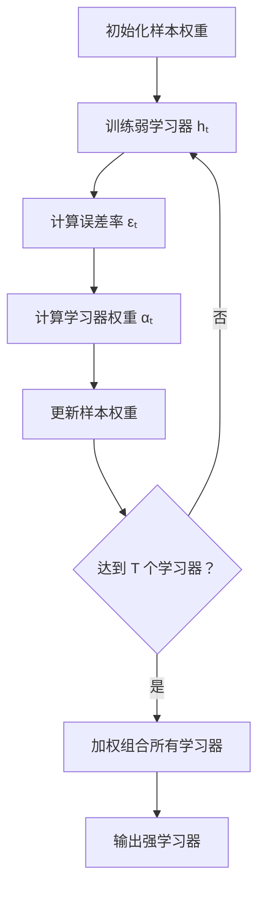
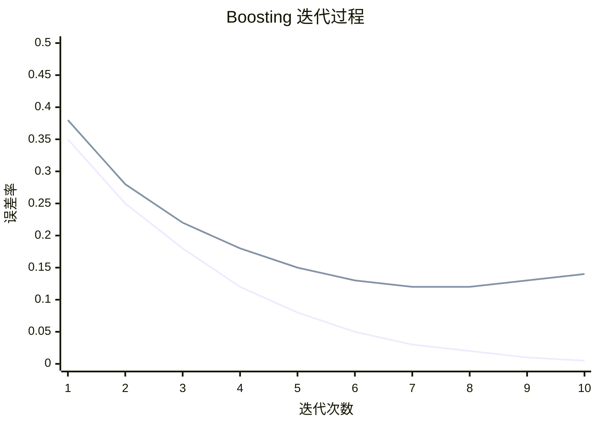
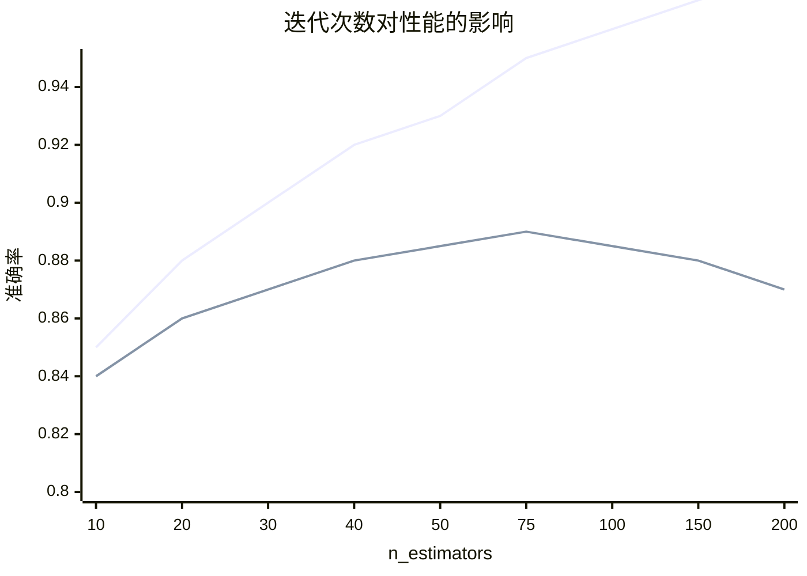
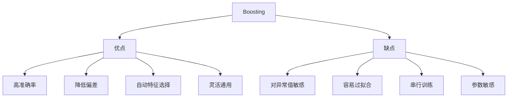

# Boosting 提升法

## 1. 概述

Boosting 是一种**集成学习技术**，通过顺序训练多个弱学习器，每个新学习器关注前一个学习器的错误，最终将弱学习器组合成强学习器。与 Bagging 的并行独立不同，Boosting 是串行依赖的。

**核心思想：** "循序渐进"——从错误中学习，逐步提升性能。

### 1.1 历史背景

- 1988 年：Kearns 和 Valiant 提出 PAC 学习框架
- 1989 年：Schapire 证明 Boosting 理论可行性
- 1995 年：Freund 和 Schapire 提出 AdaBoost
- 1997 年：Freund 和 Schapire 获得 Gödel 奖
- 2000 年代：GBDT、XGBoost 等发展

### 1.2 适用场景

- 需要高准确率的场景
- 结构化数据
- Kaggle 竞赛
- 特征工程充分的数据
- 分类和回归任务

### 1.3 与 Bagging 对比

| 特性 | Bagging | Boosting |
|------|---------|----------|
| 训练方式 | 并行独立 | 串行依赖 |
| 抽样方式 | Bootstrap | 加权/残差 |
| 主要目标 | 降低方差 | 降低偏差 |
| 对异常值 | 鲁棒 | 敏感 |
| 典型算法 | 随机森林 | AdaBoost, GBDT, XGBoost |

## 2. 算法原理

### 2.1 核心思想

Boosting 的核心是**加法模型**和**前向分步算法**：

```
F(x) = Σ αₜ × hₜ(x)  (t = 1 to T)
```

其中：
- hₜ(x) 是第 t 个弱学习器
- αₜ 是第 t 个学习器的权重

### 2.2 通用 Boosting 流程



### 2.3 样本权重更新

**错误分类的样本权重增加：**
```
wᵢ ← wᵢ × exp(αₜ × I(yᵢ ≠ hₜ(xᵢ)))
```

**正确分类的样本权重减少：**
```
wᵢ ← wᵢ × exp(-αₜ × I(yᵢ = hₜ(xᵢ)))
```

### 2.4 为什么 Boosting 有效？

**偏差 - 方差分析：**
- Boosting 主要降低**偏差**
- 通过关注错误样本，逐步改进
- 也可以降低方差（通过集成）



## 3. AdaBoost 算法

### 3.1 算法步骤

```
输入：训练集 D = {(x₁, y₁), ..., (xₙ, yₙ)}
      弱学习器算法 L
      迭代次数 T

1. 初始化权重：wᵢ = 1/n

2. for t = 1 to T:
   a. 使用权重 w 训练弱学习器 hₜ
   b. 计算加权误差：εₜ = Σ wᵢ × I(yᵢ ≠ hₜ(xᵢ))
   c. 计算学习器权重：αₜ = (1/2) × ln((1-εₜ)/εₜ)
   d. 更新样本权重：
      wᵢ ← wᵢ × exp(-αₜ × yᵢ × hₜ(xᵢ))
      wᵢ ← wᵢ / Σwᵢ  (归一化)

3. 输出：H(x) = sign(Σ αₜ × hₜ(x))
```

### 3.2 Python 实现

```python
import numpy as np
from sklearn.ensemble import AdaBoostClassifier, AdaBoostRegressor
from sklearn.tree import DecisionTreeClassifier
from sklearn.model_selection import train_test_split
from sklearn.metrics import accuracy_score, classification_report
from sklearn.datasets import make_classification
import matplotlib.pyplot as plt

# 1. 生成数据
X, y = make_classification(
    n_samples=1000, n_features=20, n_informative=15,
    random_state=42
)

# 2. 划分数据集
X_train, X_test, y_train, y_test = train_test_split(
    X, y, test_size=0.2, random_state=42, stratify=y
)

# 3. 创建并训练模型
base_clf = DecisionTreeClassifier(max_depth=1, random_state=42)  # 决策树桩

ada_clf = AdaBoostClassifier(
    estimator=base_clf,
    n_estimators=50,          # 弱学习器数量
    learning_rate=1.0,        # 学习率（缩放 αₜ）
    algorithm='SAMME',        # 'SAMME' 或 'SAMME.R'
    random_state=42
)
ada_clf.fit(X_train, y_train)

# 4. 评估
y_pred = ada_clf.predict(X_test)
print(f"准确率：{accuracy_score(y_test, y_pred):.4f}")
print("\n分类报告:")
print(classification_report(y_test, y_pred))

# 5. 与单棵树对比
single_clf = DecisionTreeClassifier(max_depth=1, random_state=42)
single_clf.fit(X_train, y_train)
print(f"\n单棵决策树桩准确率：{single_clf.score(X_test, y_test):.4f}")
print(f"AdaBoost 准确率：{ada_clf.score(X_test, y_test):.4f}")

# 6. 可视化学习器权重
plt.figure(figsize=(12, 5))

plt.subplot(1, 2, 1)
plt.plot(range(1, len(ada_clf.estimator_weights_) + 1), 
         ada_clf.estimator_weights_, 'bo-')
plt.xlabel('弱学习器索引')
plt.ylabel('学习器权重 α')
plt.title('弱学习器权重')
plt.grid(True, alpha=0.3)

plt.subplot(1, 2, 2)
plt.plot(range(1, len(ada_clf.estimator_errors_) + 1), 
         ada_clf.estimator_errors_, 'ro-')
plt.xlabel('弱学习器索引')
plt.ylabel('误差率 ε')
plt.title('弱学习器误差率')
plt.grid(True, alpha=0.3)

plt.tight_layout()
plt.show()
```

### 3.3 从零实现 AdaBoost

```python
import numpy as np

class AdaBoostClassifierCustom:
    """从零实现 AdaBoost 分类器"""
    
    def __init__(self, base_estimator, n_estimators=50, learning_rate=1.0, 
                 random_state=None):
        self.base_estimator = base_estimator
        self.n_estimators = n_estimators
        self.learning_rate = learning_rate
        self.random_state = random_state
        self.estimators = []
        self.estimator_weights = []
        self.estimator_errors = []
    
    def fit(self, X, y):
        np.random.seed(self.random_state)
        n_samples = X.shape[0]
        
        # 初始化权重
        sample_weights = np.ones(n_samples) / n_samples
        
        # 将标签转换为 -1 和 1
        y_signed = np.where(y == 0, -1, 1)
        
        self.estimators = []
        self.estimator_weights = []
        self.estimator_errors = []
        
        for t in range(self.n_estimators):
            # 训练弱学习器
            estimator = type(self.base_estimator)(**self.base_estimator.get_params())
            estimator.fit(X, y_signed, sample_weight=sample_weights)
            self.estimators.append(estimator)
            
            # 预测
            y_pred = estimator.predict(X)
            
            # 计算加权误差
            misclassified = (y_pred != y_signed)
            error = np.sum(sample_weights * misclassified) / np.sum(sample_weights)
            error = max(error, 1e-10)  # 避免除零
            self.estimator_errors.append(error)
            
            # 计算学习器权重
            alpha = self.learning_rate * 0.5 * np.log((1 - error) / error)
            self.estimator_weights.append(alpha)
            
            # 更新样本权重
            sample_weights = sample_weights * np.exp(-alpha * y_signed * y_pred)
            sample_weights = sample_weights / np.sum(sample_weights)  # 归一化
        
        return self
    
    def predict(self, X):
        # 加权投票
        predictions = np.zeros(X.shape[0])
        for estimator, alpha in zip(self.estimators, self.estimator_weights):
            predictions += alpha * estimator.predict(X)
        return np.sign(predictions).astype(int)
    
    def score(self, X, y):
        y_signed = np.where(y == 0, -1, 1)
        predictions = np.zeros(X.shape[0])
        for estimator, alpha in zip(self.estimators, self.estimator_weights):
            predictions += alpha * estimator.predict(X)
        return np.mean(np.sign(predictions) == y_signed)

# 使用示例
X = np.random.randn(100, 5)
y = (np.sum(X[:, :3] > 0, axis=1) > 1).astype(int)

class Stump:
    def __init__(self, random_state=None):
        self.random_state = random_state
        self.threshold = 0
        self.feature = 0
    
    def fit(self, X, y, sample_weight=None):
        # 简化：找到最佳阈值
        best_error = float('inf')
        for feature in range(X.shape[1]):
            for threshold in np.percentile(X[:, feature], range(0, 101, 10)):
                pred = np.where(X[:, feature] > threshold, 1, -1)
                if sample_weight is not None:
                    error = np.sum(sample_weight * (pred != y)) / np.sum(sample_weight)
                else:
                    error = np.mean(pred != y)
                if error < best_error:
                    best_error = error
                    self.feature = feature
                    self.threshold = threshold
        return self
    
    def predict(self, X):
        return np.where(X[:, self.feature] > self.threshold, 1, -1)
    
    def get_params(self):
        return {'random_state': self.random_state}

ada = AdaBoostClassifierCustom(Stump(), n_estimators=10, random_state=42)
ada.fit(X, y)
print(f"训练准确率：{ada.score(X, y):.4f}")
```

## 4. 学习率与迭代次数

### 4.1 学习率的影响

```python
from sklearn.model_selection import validation_curve

# 测试不同学习率
learning_rates = [0.01, 0.1, 0.5, 1.0, 2.0]
train_scores = []
test_scores = []

for lr in learning_rates:
    ada = AdaBoostClassifier(
        estimator=DecisionTreeClassifier(max_depth=1),
        n_estimators=100,
        learning_rate=lr,
        random_state=42
    )
    ada.fit(X_train, y_train)
    train_scores.append(ada.score(X_train, y_train))
    test_scores.append(ada.score(X_test, y_test))

plt.figure(figsize=(10, 6))
plt.plot(learning_rates, train_scores, 'bo-', label='训练集')
plt.plot(learning_rates, test_scores, 'gs-', label='测试集')
plt.xlabel('学习率')
plt.ylabel('准确率')
plt.title('学习率对性能的影响')
plt.legend()
plt.xscale('log')
plt.grid(True, alpha=0.3)
plt.show()
```

### 4.2 迭代次数选择



```python
# 分析迭代次数的影响
n_estimators_range = [10, 20, 30, 40, 50, 75, 100, 150, 200]
train_scores = []
test_scores = []

for n_est in n_estimators_range:
    ada = AdaBoostClassifier(
        estimator=DecisionTreeClassifier(max_depth=1),
        n_estimators=n_est,
        learning_rate=1.0,
        random_state=42
    )
    ada.fit(X_train, y_train)
    train_scores.append(ada.score(X_train, y_train))
    test_scores.append(ada.score(X_test, y_test))

plt.figure(figsize=(10, 6))
plt.plot(n_estimators_range, train_scores, 'bo-', label='训练集')
plt.plot(n_estimators_range, test_scores, 'gs-', label='测试集')
plt.xlabel('迭代次数')
plt.ylabel('准确率')
plt.title('迭代次数对性能的影响')
plt.legend()
plt.grid(True, alpha=0.3)
plt.show()
```

## 5. 优缺点分析



### 5.1 优点

- **高准确率**：在许多任务上表现优秀
- **降低偏差**：将弱学习器提升为强学习器
- **自动特征选择**：关注难分类样本
- **灵活通用**：可与多种基学习器结合

### 5.2 缺点

- **对异常值敏感**：异常值权重会不断增加
- **容易过拟合**：迭代过多可能过拟合
- **串行训练**：无法并行，训练慢
- **参数敏感**：学习率和迭代次数需要调优

## 6. Boosting 变体

### 6.1 AdaBoost 变体

```python
# AdaBoost-SAMME（多分类）
ada_samme = AdaBoostClassifier(algorithm='SAMME', n_estimators=50)

# AdaBoost-SAMME.R（使用概率）
ada_samme_r = AdaBoostClassifier(algorithm='SAMME.R', n_estimators=50)
```

### 6.2 Gradient Boosting

```python
from sklearn.ensemble import GradientBoostingClassifier

gbdt = GradientBoostingClassifier(
    n_estimators=100,
    learning_rate=0.1,
    max_depth=3,
    random_state=42
)
```

### 6.3 XGBoost

```python
import xgboost as xgb

xgb_clf = xgb.XGBClassifier(
    n_estimators=100,
    learning_rate=0.1,
    max_depth=3,
    random_state=42
)
```

## 7. 总结

Boosting 是强大的集成学习技术：

**核心价值：**
1. 顺序训练，从错误中学习
2. 将弱学习器提升为强学习器
3. 主要降低偏差
4. 高准确率

**最佳实践：**
- 使用决策树桩或浅层树
- 仔细调优学习率和迭代次数
- 使用交叉验证防止过拟合
- 考虑 XGBoost/LightGBM 等现代变体

**适用场景：**
- 需要高准确率的场景
- 结构化数据
- 竞赛和工业应用

Boosting 是机器学习的核心技术，理解其原理对学习 XGBoost、LightGBM 等现代算法至关重要。
