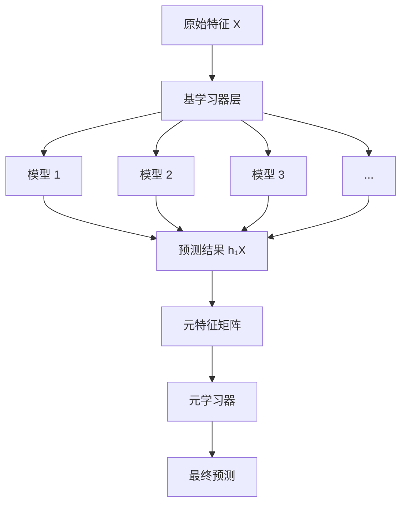
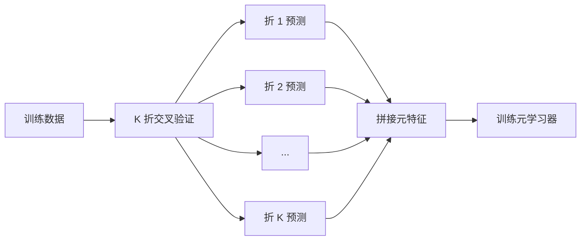
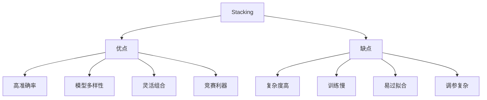

# Stacking 堆叠法

## 1. 概述

Stacking（Stacked Generalization，堆叠泛化）是一种**多层集成学习技术**，通过将多个基学习器的预测结果作为输入，训练一个元学习器（meta-learner）来进行最终预测。

**核心思想：** "集思广益"——用多个模型的预测来训练一个更好的模型。

### 1.1 算法特点

| 特点 | 说明 |
|------|------|
| 多层结构 | 基学习器 + 元学习器 |
| 异质集成 | 可使用不同类型的模型 |
| 特征转换 | 基学习器输出作为新特征 |
| 交叉验证 | 防止元学习器过拟合 |

### 1.2 适用场景

- Kaggle 竞赛
- 需要最高准确率的场景
- 有多种可用模型
- 模型多样性高
- 计算资源充足

### 1.3 与其他集成对比

| 方法 | 结构 | 模型类型 | 复杂度 |
|------|------|----------|--------|
| Bagging | 单层平行 | 同质 | 低 |
| Boosting | 单层串行 | 同质 | 中 |
| Voting | 单层平行 | 异质 | 低 |
| Stacking | 多层 | 异质 | 高 |

## 2. 算法原理

### 2.1 两层 Stacking 结构



### 2.2 算法流程

```
输入：训练集 D = {(x₁, y₁), ..., (xₙ, yₙ)}
      基学习器集合 {L₁, L₂, ..., Lₖ}
      元学习器 M

过程：
1. 使用交叉验证生成元特征：
   for i = 1 to k:
       for 每个折 j:
           在除 j 外的数据上训练 Lᵢ
           在折 j 上预测，得到 hᵢⱼ
       合并所有折的预测，得到元特征 Hᵢ

2. 构建元特征矩阵：H = [H₁, H₂, ..., Hₖ]

3. 在原始数据上重新训练所有基学习器

4. 使用 H 训练元学习器 M

5. 预测时：
   a. 用基学习器预测新样本，得到元特征 h_new
   b. 用 M 预测：ŷ = M(h_new)
```

### 2.3 为什么使用交叉验证？

**问题：** 如果直接用训练集预测作为元特征，会导致过拟合

**解决：** 使用 K 折交叉验证，确保元特征来自"未见过的"数据



## 3. Python 代码实现

### 3.1 使用 scikit-learn

```python
import numpy as np
from sklearn.ensemble import StackingClassifier, StackingRegressor
from sklearn.linear_model import LogisticRegression, Ridge
from sklearn.tree import DecisionTreeClassifier
from sklearn.ensemble import RandomForestClassifier, GradientBoostingClassifier
from sklearn.svm import SVC
from sklearn.neighbors import KNeighborsClassifier
from sklearn.model_selection import train_test_split, cross_val_score
from sklearn.metrics import accuracy_score, classification_report
from sklearn.datasets import make_classification
import matplotlib.pyplot as plt

# 1. 生成数据
X, y = make_classification(
    n_samples=1000, n_features=20, n_informative=15,
    random_state=42
)

# 2. 划分数据集
X_train, X_test, y_train, y_test = train_test_split(
    X, y, test_size=0.2, random_state=42, stratify=y
)

# 3. 定义基学习器
base_learners = [
    ('rf', RandomForestClassifier(n_estimators=50, random_state=42)),
    ('gbdt', GradientBoostingClassifier(n_estimators=50, random_state=42)),
    ('svm', SVC(probability=True, random_state=42)),
    ('knn', KNeighborsClassifier(n_neighbors=5)),
    ('dt', DecisionTreeClassifier(max_depth=5, random_state=42))
]

# 4. 定义元学习器
meta_learner = LogisticRegression(max_iter=1000)

# 5. 创建 Stacking 分类器
stacking_clf = StackingClassifier(
    estimators=base_learners,
    final_estimator=meta_learner,
    cv=5,                   # 5 折交叉验证生成元特征
    stack_method='predict_proba',  # 使用概率作为元特征
    n_jobs=-1
)

# 6. 训练
stacking_clf.fit(X_train, y_train)

# 7. 评估
y_pred = stacking_clf.predict(X_test)
y_pred_proba = stacking_clf.predict_proba(X_test)

print(f"Stacking 准确率：{accuracy_score(y_test, y_pred):.4f}")
print("\n分类报告:")
print(classification_report(y_test, y_pred))

# 8. 与单个模型对比
print("\n=== 单个模型对比 ===")
for name, clf in base_learners:
    clf.fit(X_train, y_train)
    score = clf.score(X_test, y_test)
    print(f"{name}: {score:.4f}")

print(f"\nStacking: {stacking_clf.score(X_test, y_test):.4f}")
```

### 3.2 从零实现 Stacking

```python
import numpy as np
from sklearn.model_selection import KFold

class StackingClassifierCustom:
    """从零实现 Stacking 分类器"""
    
    def __init__(self, base_estimators, meta_estimator, cv=5):
        self.base_estimators = base_estimators
        self.meta_estimator = meta_estimator
        self.cv = cv
        self.fitted_base_estimators = []
        self.meta_fitted = False
    
    def _generate_meta_features(self, X, y, estimator):
        """使用交叉验证生成元特征"""
        n_samples = X.shape[0]
        kf = KFold(n_splits=self.cv, shuffle=True, random_state=42)
        
        # 存储每折的预测
        meta_features = np.zeros((n_samples, len(np.unique(y))))
        
        for train_idx, val_idx in kf.split(X):
            X_train_fold, X_val_fold = X[train_idx], X[val_idx]
            y_train_fold = y[train_idx]
            
            # 训练
            est = type(estimator)(**estimator.get_params())
            est.fit(X_train_fold, y_train_fold)
            
            # 预测
            meta_features[val_idx] = est.predict_proba(X_val_fold)
        
        return meta_features
    
    def fit(self, X, y):
        # 1. 生成元特征
        meta_features_list = []
        self.fitted_base_estimators = []
        
        for name, estimator in self.base_estimators:
            print(f"训练基学习器：{name}")
            
            # 生成元特征
            meta_feat = self._generate_meta_features(X, y, estimator)
            meta_features_list.append(meta_feat)
            
            # 在完整数据上重新训练
            est = type(estimator)(**estimator.get_params())
            est.fit(X, y)
            self.fitted_base_estimators.append((name, est))
        
        # 拼接元特征
        meta_features = np.hstack(meta_features_list)
        
        # 2. 训练元学习器
        self.meta_estimator.fit(meta_features, y)
        self.meta_fitted = True
        
        return self
    
    def predict(self, X):
        if not self.meta_fitted:
            raise ValueError("Model not fitted")
        
        # 生成元特征
        meta_features_list = []
        for name, estimator in self.fitted_base_estimators:
            meta_feat = estimator.predict_proba(X)
            meta_features_list.append(meta_feat)
        
        meta_features = np.hstack(meta_features_list)
        
        # 元学习器预测
        return self.meta_estimator.predict(meta_features)
    
    def predict_proba(self, X):
        if not self.meta_fitted:
            raise ValueError("Model not fitted")
        
        meta_features_list = []
        for name, estimator in self.fitted_base_estimators:
            meta_feat = estimator.predict_proba(X)
            meta_features_list.append(meta_feat)
        
        meta_features = np.hstack(meta_features_list)
        return self.meta_estimator.predict_proba(meta_features)
    
    def score(self, X, y):
        return np.mean(self.predict(X) == y)

# 使用示例
from sklearn.linear_model import LogisticRegression
from sklearn.ensemble import RandomForestClassifier

base_estimators = [
    ('rf', RandomForestClassifier(n_estimators=10, random_state=42)),
    ('lr', LogisticRegression(max_iter=1000, random_state=42))
]

stacking = StackingClassifierCustom(
    base_estimators=base_estimators,
    meta_estimator=LogisticRegression(max_iter=1000),
    cv=3
)

X = np.random.randn(100, 5)
y = (np.sum(X[:, :3] > 0, axis=1) > 1).astype(int)

stacking.fit(X, y)
print(f"训练准确率：{stacking.score(X, y):.4f}")
```

## 4. 超参数配置

### 4.1 关键参数

| 参数 | 说明 | 推荐值 |
|------|------|--------|
| `estimators` | 基学习器列表 | 3-5 个不同模型 |
| `final_estimator` | 元学习器 | 线性模型 |
| `cv` | 交叉验证折数 | 5 |
| `stack_method` | 预测方法 | 'predict_proba' |
| `passthrough` | 是否传递原始特征 | False/True |

### 4.2 使用原始特征

```python
# 将原始特征传递给元学习器
stacking_clf = StackingClassifier(
    estimators=base_learners,
    final_estimator=meta_learner,
    cv=5,
    passthrough=True  # 元学习器接收原始特征 + 基学习器预测
)
```

### 4.3 选择 stack_method

```python
# 分类任务选项
# 'predict': 类别标签
# 'predict_proba': 类别概率（推荐）
# 'decision_function': 决策函数值

stacking_clf = StackingClassifier(
    estimators=base_learners,
    final_estimator=meta_learner,
    stack_method='predict_proba'  # 通常效果最好
)
```

## 5. 基学习器选择

### 5.1 多样性原则

**好的 Stacking 需要多样化的基学习器：**

```python
# 推荐的基学习器组合
base_learners = [
    ('rf', RandomForestClassifier(n_estimators=100)),      # 基于树
    ('gbdt', GradientBoostingClassifier(n_estimators=100)), # 基于树
    ('svm', SVC(probability=True)),                         # 基于距离
    ('knn', KNeighborsClassifier()),                        # 基于实例
    ('nb', GaussianNB())                                    # 基于概率
]
```

### 5.2 避免的陷阱

```python
# 不推荐：使用相似的模型
bad_base_learners = [
    ('rf1', RandomForestClassifier(n_estimators=100)),
    ('rf2', RandomForestClassifier(n_estimators=200)),
    ('rf3', RandomForestClassifier(n_estimators=300)),
]

# 推荐：使用不同类型的模型
good_base_learners = [
    ('rf', RandomForestClassifier(n_estimators=100)),
    ('svm', SVC(probability=True)),
    ('knn', KNeighborsClassifier()),
]
```

## 6. 优缺点分析



### 6.1 优点

- **高准确率**：通常优于单个模型和简单集成
- **模型多样性**：可结合不同类型模型的优势
- **灵活组合**：可自定义基学习器和元学习器
- **竞赛利器**：Kaggle 获胜常用技术

### 6.2 缺点

- **复杂度高**：实现和理解复杂
- **训练慢**：需要训练多层模型
- **易过拟合**：元学习器可能过拟合
- **调参复杂**：需要调优多个模型

## 7. 实战技巧

### 7.1 防止过拟合

```python
# 1. 使用交叉验证（必须）
stacking_clf = StackingClassifier(cv=5)

# 2. 使用简单的元学习器
from sklearn.linear_model import LogisticRegression
meta_learner = LogisticRegression(C=0.1)  # 强正则化

# 3. 限制基学习器数量
base_learners = base_learners[:3]  # 3-5 个足够

# 4. 使用正则化
from sklearn.linear_model import Ridge
meta_learner = Ridge(alpha=1.0)
```

### 7.2 特征重要性分析

```python
# 获取元学习器的系数（特征重要性）
if hasattr(stacking_clf.final_estimator_, 'coef_'):
    importances = np.abs(stacking_clf.final_estimator_.coef_)
    
    # 每个基学习器的贡献
    n_classes = importances.shape[0] if len(importances.shape) > 1 else 1
    n_base = len(stacking_clf.estimators_)
    
    for i, (name, _) in enumerate(stacking_clf.estimators_):
        if n_classes == 1:
            print(f"{name}: {importances[i]:.4f}")
        else:
            print(f"{name}: {importances[:, i].mean():.4f}")
```

### 7.3 多层 Stacking

```python
# 第一层
level_0 = StackingClassifier(
    estimators=[('rf', RandomForestClassifier()), ('svm', SVC())],
    final_estimator=LogisticRegression(),
    cv=5
)

# 第二层
level_1 = StackingClassifier(
    estimators=[('level0', level_0), ('gbdt', GradientBoostingClassifier())],
    final_estimator=LogisticRegression(),
    cv=5
)

# 注意：多层 Stacking 容易过拟合，谨慎使用
```

## 8. 回归 Stacking

```python
from sklearn.ensemble import StackingRegressor
from sklearn.linear_model import Ridge
from sklearn.ensemble import RandomForestRegressor, GradientBoostingRegressor
from sklearn.svm import SVR
from sklearn.datasets import make_regression
from sklearn.metrics import mean_squared_error

# 生成回归数据
X_reg, y_reg = make_regression(n_samples=1000, n_features=20, noise=10)

# 定义基学习器
base_regressors = [
    ('rf', RandomForestRegressor(n_estimators=50)),
    ('gbdt', GradientBoostingRegressor(n_estimators=50)),
    ('svr', SVR())
]

# 创建 Stacking 回归器
stacking_reg = StackingRegressor(
    estimators=base_regressors,
    final_estimator=Ridge(),
    cv=5
)

stacking_reg.fit(X_train_reg, y_train_reg)
y_pred_reg = stacking_reg.predict(X_test_reg)

mse = mean_squared_error(y_test_reg, y_pred_reg)
print(f"Stacking 回归 MSE: {mse:.4f}")
```

## 9. 总结

Stacking 是高级集成学习技术：

**核心价值：**
1. 多层结构，充分利用模型多样性
2. 元学习器学习如何组合基学习器
3. 交叉验证防止过拟合
4. 竞赛和工业界常用

**最佳实践：**
- 选择多样化的基学习器
- 使用交叉验证生成元特征
- 元学习器选择简单模型
- 注意防止过拟合

**适用场景：**
- Kaggle 竞赛
- 需要最高准确率
- 计算资源充足
- 有多种可用模型

Stacking 是集成学习的高级技术，掌握它可以显著提升模型性能。
