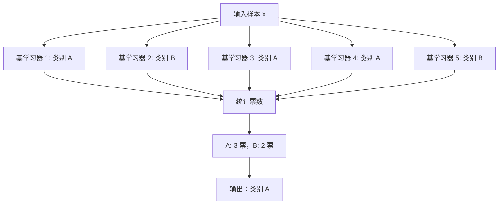
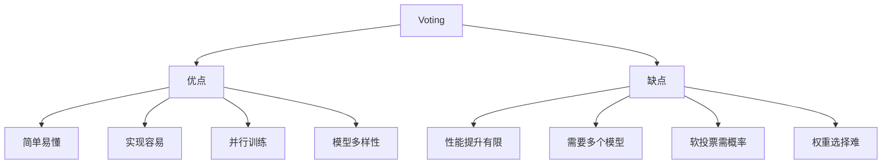

# Voting 投票法

## 1. 概述

Voting（投票法）是一种简单而有效的**集成学习技术**，通过组合多个分类器的预测结果，使用多数投票（分类）或平均（回归）来做出最终预测。

**核心思想：** "民主决策"——少数服从多数。

### 1.1 算法类型

| 类型 | 说明 | 适用场景 |
|------|------|----------|
| 硬投票（Hard Voting） | 多数类别获胜 | 分类任务 |
| 软投票（Soft Voting） | 平均概率后选择 | 分类任务（有概率） |
| 平均法（Averaging） | 预测值平均 | 回归任务 |
| 加权投票 | 给不同模型不同权重 | 模型性能差异大 |

### 1.2 适用场景

- 多模型融合
- 快速提升性能
- 模型多样性高
- 需要简单有效的集成
- 分类和回归任务

### 1.3 与其他集成对比

| 方法 | 复杂度 | 性能提升 | 实现难度 |
|------|--------|----------|----------|
| Voting | 低 | 中 | 简单 |
| Bagging | 中 | 高 | 中等 |
| Boosting | 高 | 很高 | 较难 |
| Stacking | 很高 | 最高 | 复杂 |

## 2. 算法原理

### 2.1 硬投票（Hard Voting）

每个基学习器投票选择一个类别，得票最多的类别获胜：

```
ŷ = mode({h₁(x), h₂(x), ..., hₜ(x)})
```



### 2.2 软投票（Soft Voting）

每个基学习器输出类别概率，平均后选择概率最大的类别：

```
P(y=c|x) = (1/T) × Σ Pₜ(y=c|x)
ŷ = argmax_c P(y=c|x)
```

**软投票的优势：**
- 考虑预测置信度
- 通常比硬投票效果更好
- 需要基学习器支持概率输出

### 2.3 加权投票

给不同模型赋予不同权重：

```
硬投票加权：ŷ = argmax_c Σ wₜ × I(hₜ(x) = c)
软投票加权：P(y=c|x) = Σ wₜ × Pₜ(y=c|x) / Σ wₜ
```

## 3. Python 代码实现

### 3.1 使用 scikit-learn

```python
import numpy as np
from sklearn.ensemble import VotingClassifier, VotingRegressor
from sklearn.linear_model import LogisticRegression
from sklearn.tree import DecisionTreeClassifier
from sklearn.ensemble import RandomForestClassifier, GradientBoostingClassifier
from sklearn.svm import SVC
from sklearn.neighbors import KNeighborsClassifier
from sklearn.model_selection import train_test_split, cross_val_score
from sklearn.metrics import accuracy_score, classification_report
from sklearn.datasets import make_classification
import matplotlib.pyplot as plt

# 1. 生成数据
X, y = make_classification(
    n_samples=1000, n_features=20, n_informative=15,
    random_state=42
)

# 2. 划分数据集
X_train, X_test, y_train, y_test = train_test_split(
    X, y, test_size=0.2, random_state=42, stratify=y
)

# 3. 定义基学习器
clf1 = LogisticRegression(max_iter=1000, random_state=42)
clf2 = DecisionTreeClassifier(max_depth=5, random_state=42)
clf3 = RandomForestClassifier(n_estimators=50, random_state=42)
clf4 = GradientBoostingClassifier(n_estimators=50, random_state=42)
clf5 = SVC(probability=True, random_state=42)  # 需要 probability=True

# 4. 硬投票
voting_hard = VotingClassifier(
    estimators=[
        ('lr', clf1),
        ('dt', clf2),
        ('rf', clf3),
        ('gbdt', clf4),
        ('svm', clf5)
    ],
    voting='hard'  # 硬投票
)

# 5. 软投票
voting_soft = VotingClassifier(
    estimators=[
        ('lr', clf1),
        ('dt', clf2),
        ('rf', clf3),
        ('gbdt', clf4),
        ('svm', clf5)
    ],
    voting='soft'  # 软投票
)

# 6. 训练和评估
print("=== 单个模型 ===")
for name, clf in [('lr', clf1), ('dt', clf2), ('rf', clf3), ('gbdt', clf4), ('svm', clf5)]:
    clf.fit(X_train, y_train)
    score = clf.score(X_test, y_test)
    print(f"{name}: {score:.4f}")

print("\n=== 投票集成 ===")
voting_hard.fit(X_train, y_train)
print(f"硬投票准确率：{voting_hard.score(X_test, y_test):.4f}")

voting_soft.fit(X_train, y_train)
print(f"软投票准确率：{voting_soft.score(X_test, y_test):.4f}")

# 7. 交叉验证对比
print("\n=== 交叉验证（5 折）===")
cv_scores_hard = cross_val_score(voting_hard, X, y, cv=5, scoring='accuracy')
cv_scores_soft = cross_val_score(voting_soft, X, y, cv=5, scoring='accuracy')

print(f"硬投票：{cv_scores_hard.mean():.4f} (+/- {cv_scores_hard.std() * 2:.4f})")
print(f"软投票：{cv_scores_soft.mean():.4f} (+/- {cv_scores_soft.std() * 2:.4f})")
```

### 3.2 从零实现投票分类器

```python
import numpy as np
from collections import Counter

class VotingClassifierCustom:
    """从零实现投票分类器"""
    
    def __init__(self, estimators, voting='hard', weights=None):
        self.estimators = estimators
        self.voting = voting
        self.weights = weights
        self.fitted_estimators = []
    
    def fit(self, X, y):
        self.classes = np.unique(y)
        self.fitted_estimators = []
        
        for name, estimator in self.estimators:
            est = type(estimator)(**estimator.get_params())
            est.fit(X, y)
            self.fitted_estimators.append((name, est))
        
        return self
    
    def predict(self, X):
        if self.voting == 'hard':
            # 硬投票：多数投票
            predictions = np.array([est.predict(X) for _, est in self.fitted_estimators])
            
            if self.weights is None:
                # 等权重
                return np.array([Counter(predictions[:, i]).most_common(1)[0][0] 
                               for i in range(X.shape[0])])
            else:
                # 加权投票
                weighted_predictions = []
                for i in range(X.shape[0]):
                    votes = {}
                    for j, pred in enumerate(predictions[:, i]):
                        weight = self.weights[j] if self.weights else 1
                        votes[pred] = votes.get(pred, 0) + weight
                    weighted_predictions.append(max(votes, key=votes.get))
                return np.array(weighted_predictions)
        
        elif self.voting == 'soft':
            # 软投票：平均概率
            probas = np.array([est.predict_proba(X) for _, est in self.fitted_estimators])
            
            if self.weights is None:
                avg_probas = np.mean(probas, axis=0)
            else:
                weights = np.array(self.weights) / np.sum(self.weights)
                avg_probas = np.average(probas, axis=0, weights=weights)
            
            return self.classes[np.argmax(avg_probas, axis=1)]
    
    def predict_proba(self, X):
        probas = np.array([est.predict_proba(X) for _, est in self.fitted_estimators])
        
        if self.weights is None:
            return np.mean(probas, axis=0)
        else:
            weights = np.array(self.weights) / np.sum(self.weights)
            return np.average(probas, axis=0, weights=weights)
    
    def score(self, X, y):
        return np.mean(self.predict(X) == y)

# 使用示例
from sklearn.linear_model import LogisticRegression
from sklearn.ensemble import RandomForestClassifier

estimators = [
    ('lr', LogisticRegression(max_iter=1000)),
    ('rf', RandomForestClassifier(n_estimators=10))
]

voting = VotingClassifierCustom(estimators, voting='soft')

X = np.random.randn(100, 5)
y = (np.sum(X[:, :3] > 0, axis=1) > 1).astype(int)

voting.fit(X, y)
print(f"训练准确率：{voting.score(X, y):.4f}")
```

### 3.3 加权投票

```python
# 根据模型性能设置权重
weights = [2, 1, 3, 3, 2]  # 给性能好的模型更高权重

voting_weighted = VotingClassifier(
    estimators=[
        ('lr', clf1),
        ('dt', clf2),
        ('rf', clf3),
        ('gbdt', clf4),
        ('svm', clf5)
    ],
    voting='soft',
    weights=weights
)

voting_weighted.fit(X_train, y_train)
print(f"加权投票准确率：{voting_weighted.score(X_test, y_test):.4f}")
```

## 4. 硬投票 vs 软投票

```mermaid
xychart-beta
    title "硬投票 vs 软投票对比"
    x-axis "测试场景" ["平衡数据", "不平衡", "高噪声", "模型差异大"]
    y-axis "推荐度" 0 --> 5
    bar "硬投票" [4, 3, 4, 3]
    bar "软投票" [5, 4, 3, 5]
```



```python
# 对比硬投票和软投票
voting_hard = VotingClassifier(estimators=estimators, voting='hard')
voting_soft = VotingClassifier(estimators=estimators, voting='soft')

voting_hard.fit(X_train, y_train)
voting_soft.fit(X_train, y_train)

print(f"硬投票准确率：{voting_hard.score(X_test, y_test):.4f}")
print(f"软投票准确率：{voting_soft.score(X_test, y_test):.4f}")

# 通常软投票效果更好（如果基学习器支持概率输出）
```

## 5. 优缺点分析



### 5.1 优点

- **简单易懂**：原理直观，易于理解
- **实现容易**：几行代码即可实现
- **并行训练**：基学习器独立，可并行
- **模型多样性**：可结合不同类型模型

### 5.2 缺点

- **性能提升有限**：不如 Boosting/Stacking
- **需要多个模型**：训练和存储成本高
- **软投票需概率**：部分模型不支持概率输出
- **权重选择难**：需要经验或调优

## 6. 回归 Voting

```python
from sklearn.ensemble import VotingRegressor
from sklearn.linear_model import LinearRegression
from sklearn.ensemble import RandomForestRegressor, GradientBoostingRegressor
from sklearn.svm import SVR
from sklearn.datasets import make_regression
from sklearn.metrics import mean_squared_error

# 生成回归数据
X_reg, y_reg = make_regression(n_samples=1000, n_features=20, noise=10)
X_train_reg, X_test_reg, y_train_reg, y_test_reg = train_test_split(
    X_reg, y_reg, test_size=0.2, random_state=42
)

# 定义基学习器
reg1 = LinearRegression()
reg2 = RandomForestRegressor(n_estimators=50, random_state=42)
reg3 = GradientBoostingRegressor(n_estimators=50, random_state=42)
reg4 = SVR()

# 创建投票回归器
voting_reg = VotingRegressor(
    estimators=[
        ('lr', reg1),
        ('rf', reg2),
        ('gbdt', reg3),
        ('svr', reg4)
    ]
)

voting_reg.fit(X_train_reg, y_train_reg)
y_pred = voting_reg.predict(X_test_reg)

mse = mean_squared_error(y_test_reg, y_pred)
print(f"Voting 回归 MSE: {mse:.4f}")

# 与单个模型对比
print("\n=== 单个模型 MSE ===")
for name, reg in [('lr', reg1), ('rf', reg2), ('gbdt', reg3), ('svr', reg4)]:
    reg.fit(X_train_reg, y_train_reg)
    mse_single = mean_squared_error(y_test_reg, reg.predict(X_test_reg))
    print(f"{name}: {mse_single:.4f}")

print(f"\nVoting: {mse:.4f}")
```

## 7. 实战技巧

### 7.1 选择基学习器

```python
# 推荐：选择多样化的模型
good_estimators = [
    ('lr', LogisticRegression()),      # 线性模型
    ('rf', RandomForestClassifier()),  # 基于树
    ('svm', SVC(probability=True)),    # 基于距离
    ('knn', KNeighborsClassifier()),   # 基于实例
]

# 不推荐：使用相似的模型
bad_estimators = [
    ('rf1', RandomForestClassifier(n_estimators=100)),
    ('rf2', RandomForestClassifier(n_estimators=200)),
    ('rf3', RandomForestClassifier(n_estimators=300)),
]
```

### 7.2 权重调优

```python
from sklearn.model_selection import GridSearchCV

# 网格搜索最佳权重
param_grid = {
    'weights': [
        [1, 1, 1, 1, 1],
        [2, 1, 2, 2, 1],
        [1, 1, 3, 3, 2],
        [2, 1, 3, 3, 2],
    ]
}

voting = VotingClassifier(estimators=estimators, voting='soft')

grid_search = GridSearchCV(voting, param_grid, cv=5, scoring='accuracy')
grid_search.fit(X_train, y_train)

print(f"最佳权重：{grid_search.best_params_['weights']}")
print(f"最佳分数：{grid_search.best_score_:.4f}")
```

### 7.3 模型选择

```python
# 使用交叉验证选择最佳模型组合
from itertools import combinations

estimator_dict = {
    'lr': LogisticRegression(max_iter=1000),
    'dt': DecisionTreeClassifier(max_depth=5),
    'rf': RandomForestClassifier(n_estimators=50),
    'gbdt': GradientBoostingClassifier(n_estimators=50),
    'svm': SVC(probability=True)
}

best_score = 0
best_combo = None

# 尝试 3 个模型的组合
for combo in combinations(estimator_dict.keys(), 3):
    estimators = [(name, estimator_dict[name]) for name in combo]
    voting = VotingClassifier(estimators=estimators, voting='soft')
    scores = cross_val_score(voting, X, y, cv=5, scoring='accuracy')
    
    if scores.mean() > best_score:
        best_score = scores.mean()
        best_combo = combo

print(f"最佳组合：{best_combo}")
print(f"最佳分数：{best_score:.4f}")
```

## 8. 总结

Voting 是简单有效的集成方法：

**核心价值：**
1. 多数投票，民主决策
2. 软投票考虑置信度
3. 实现简单，易于理解
4. 可结合多样模型

**最佳实践：**
- 选择多样化的基学习器
- 优先使用软投票（如果支持）
- 根据性能设置权重
- 3-5 个模型通常足够

**适用场景：**
- 快速提升性能
- 多模型融合
- 需要简单集成
- 基线模型建立

Voting 是集成学习的入门技术，简单但有效，适合快速原型和基线建立。
