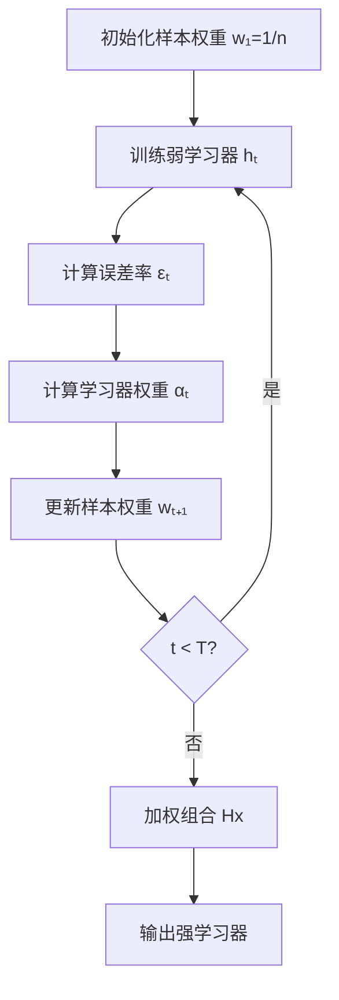
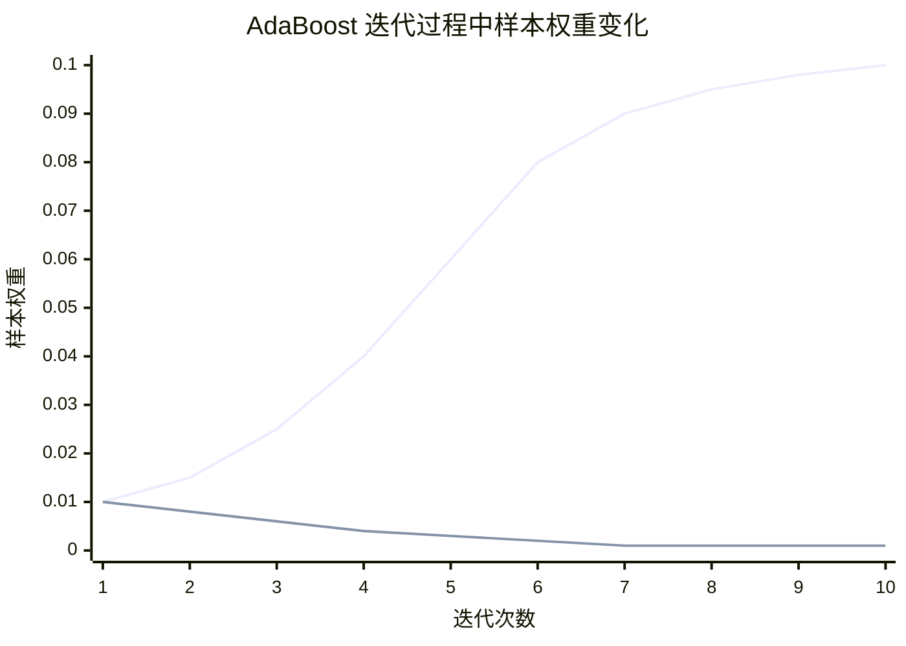
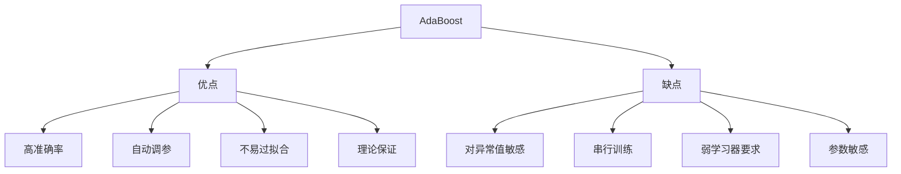

# AdaBoost 自适应提升

## 1. 概述

AdaBoost（Adaptive Boosting，自适应提升）是 Boosting 家族中最经典的算法，由 Freund 和 Schapire 于 1995 年提出。AdaBoost 通过自适应地调整样本权重，使后续学习器关注之前学习器分类错误的样本。

**核心思想：** "从错误中学习"——错误分类的样本权重增加，正确分类的样本权重减少。

### 1.1 历史意义

- 1995 年：Freund 和 Schapire 提出 AdaBoost
- 2003 年：获得 Gödel 奖（理论计算机最高奖）
- 被评选为"Top 10 Algorithms in Data Mining"
- 开启了 Boosting 算法研究热潮

### 1.2 适用场景

- 二分类和多分类
- 弱学习器集成
- 需要高准确率
- 特征工程充分
- 数据质量较高

### 1.3 算法特点

| 特点 | 说明 |
|------|------|
| 自适应 | 根据误差调整样本权重 |
| 串行 | 学习器顺序依赖 |
| 加权 | 学习器和样本都有权重 |
| 理论保证 | PAC 学习框架支持 |

## 2. 算法原理

### 2.1 算法流程

```
输入：训练集 D = {(x₁, y₁), ..., (xₙ, yₙ)}, yᵢ ∈ {-1, +1}
      弱学习器算法 L
      迭代次数 T

1. 初始化权重：wᵢ⁽¹⁾ = 1/n

2. for t = 1 to T:
   a. 使用权重 w⁽ᵗ⁾ 训练弱学习器 hₜ
   b. 计算加权误差率：
      εₜ = Pᵢ~w⁽ᵗ⁾[hₜ(xᵢ) ≠ yᵢ] = Σ wᵢ⁽ᵗ⁾ × I(hₜ(xᵢ) ≠ yᵢ)
   c. 计算 hₜ 的权重：
      αₜ = (1/2) × ln((1 - εₜ) / εₜ)
   d. 更新样本权重：
      wᵢ⁽ᵗ⁺¹⁾ = wᵢ⁽ᵗ⁾ × exp(-αₜ × yᵢ × hₜ(xᵢ))
      wᵢ⁽ᵗ⁺¹⁾ = wᵢ⁽ᵗ⁺¹⁾ / Zₜ  (归一化)
      Zₜ 是归一化因子

3. 输出强学习器：
   H(x) = sign(Σ αₜ × hₜ(x))
```



### 2.2 权重更新机制

**样本权重更新：**
```
wᵢ⁽ᵗ⁺¹⁾ = wᵢ⁽ᵗ⁾ × exp(-αₜ × yᵢ × hₜ(xᵢ)) / Zₜ
```

- 正确分类（yᵢ = hₜ(xᵢ)）：权重乘以 exp(-αₜ) < 1，权重减小
- 错误分类（yᵢ ≠ hₜ(xᵢ)）：权重乘以 exp(αₜ) > 1，权重增加

**学习器权重：**
```
αₜ = (1/2) × ln((1 - εₜ) / εₜ)
```

- 误差率 εₜ 越小，αₜ 越大（学习器越重要）
- εₜ = 0.5 时，αₜ = 0（随机猜测，无贡献）
- εₜ > 0.5 时，αₜ < 0（比随机还差，反向使用）

### 2.3 可视化权重变化



## 3. Python 代码实现

### 3.1 使用 scikit-learn

```python
import numpy as np
from sklearn.ensemble import AdaBoostClassifier
from sklearn.tree import DecisionTreeClassifier
from sklearn.model_selection import train_test_split, cross_val_score
from sklearn.metrics import accuracy_score, classification_report, confusion_matrix
from sklearn.datasets import make_classification
import matplotlib.pyplot as plt
import seaborn as sns

# 1. 生成数据
X, y = make_classification(
    n_samples=1000, n_features=20, n_informative=15,
    n_redundant=5, random_state=42
)

# 2. 划分数据集
X_train, X_test, y_train, y_test = train_test_split(
    X, y, test_size=0.2, random_state=42, stratify=y
)

# 3. 创建并训练模型
# 使用决策树桩（深度为 1 的树）作为弱学习器
base_clf = DecisionTreeClassifier(max_depth=1, random_state=42)

ada_clf = AdaBoostClassifier(
    estimator=base_clf,
    n_estimators=50,          # 弱学习器数量
    learning_rate=1.0,        # 学习率（缩放 αₜ）
    algorithm='SAMME',        # 'SAMME' 或 'SAMME.R'
    random_state=42
)
ada_clf.fit(X_train, y_train)

# 4. 评估
y_pred = ada_clf.predict(X_test)
print(f"准确率：{accuracy_score(y_test, y_pred):.4f}")
print("\n分类报告:")
print(classification_report(y_test, y_pred))

# 5. 混淆矩阵
plt.figure(figsize=(8, 6))
cm = confusion_matrix(y_test, y_pred)
sns.heatmap(cm, annot=True, fmt='d', cmap='Blues')
plt.title('混淆矩阵')
plt.ylabel('真实标签')
plt.xlabel('预测标签')
plt.show()

# 6. 分析弱学习器
print(f"\n弱学习器数量：{len(ada_clf.estimators_)}")
print(f"学习器权重范围：[{min(ada_clf.estimator_weights_):.4f}, {max(ada_clf.estimator_weights_):.4f}]")
print(f"学习器误差率范围：[{min(ada_clf.estimator_errors_):.4f}, {max(ada_clf.estimator_errors_):.4f}]")

# 7. 可视化学习器权重和误差
fig, (ax1, ax2) = plt.subplots(1, 2, figsize=(14, 5))

ax1.plot(range(1, len(ada_clf.estimator_weights_) + 1), 
         ada_clf.estimator_weights_, 'bo-')
ax1.set_xlabel('弱学习器索引')
ax1.set_ylabel('学习器权重 α')
ax1.set_title('弱学习器权重变化')
ax1.grid(True, alpha=0.3)

ax2.plot(range(1, len(ada_clf.estimator_errors_) + 1), 
         ada_clf.estimator_errors_, 'ro-')
ax2.set_xlabel('弱学习器索引')
ax2.set_ylabel('误差率 ε')
ax2.set_title('弱学习器误差率变化')
ax2.grid(True, alpha=0.3)

plt.tight_layout()
plt.show()
```

### 3.2 从零实现 AdaBoost

```python
import numpy as np

class AdaBoostClassifierCustom:
    """从零实现 AdaBoost 分类器（支持多分类 SAMME）"""
    
    def __init__(self, base_estimator, n_estimators=50, learning_rate=1.0, 
                 random_state=None):
        self.base_estimator = base_estimator
        self.n_estimators = n_estimators
        self.learning_rate = learning_rate
        self.random_state = random_state
        self.estimators = []
        self.estimator_weights = []
        self.classes = None
    
    def _samme_alpha(self, error, n_classes):
        """SAMME 算法的学习器权重"""
        return self.learning_rate * (np.log((1 - error) / error) + np.log(n_classes - 1)) / 2
    
    def fit(self, X, y):
        np.random.seed(self.random_state)
        n_samples = X.shape[0]
        self.classes = np.unique(y)
        n_classes = len(self.classes)
        
        # 初始化权重
        sample_weights = np.ones(n_samples) / n_samples
        
        # 将标签转换为 0, 1, 2, ...
        y_encoded = np.searchsorted(self.classes, y)
        
        self.estimators = []
        self.estimator_weights = []
        
        for t in range(self.n_estimators):
            # 训练弱学习器
            estimator = type(self.base_estimator)(**self.base_estimator.get_params())
            estimator.fit(X, y_encoded, sample_weight=sample_weights)
            self.estimators.append(estimator)
            
            # 预测
            y_pred = estimator.predict(X)
            
            # 计算加权误差
            misclassified = (y_pred != y_encoded)
            error = np.sum(sample_weights * misclassified)
            error = max(error, 1e-10)  # 避免除零
            
            # SAMME 算法计算权重
            alpha = self._samme_alpha(error, n_classes)
            self.estimator_weights.append(alpha)
            
            # 更新样本权重
            # 错误分类的样本权重增加
            sample_weights = sample_weights * np.exp(alpha * misclassified)
            sample_weights = sample_weights / np.sum(sample_weights)  # 归一化
        
        return self
    
    def _compute_score(self, X):
        """计算每个类别的得分"""
        n_samples = X.shape[0]
        n_classes = len(self.classes)
        scores = np.zeros((n_samples, n_classes))
        
        for estimator, alpha in zip(self.estimators, self.estimator_weights):
            y_pred = estimator.predict(X)
            for i in range(n_samples):
                scores[i, y_pred[i]] += alpha
        
        return scores
    
    def predict(self, X):
        scores = self._compute_score(X)
        return self.classes[np.argmax(scores, axis=1)]
    
    def predict_proba(self, X):
        scores = self._compute_score(X)
        # Softmax 归一化
        exp_scores = np.exp(scores - np.max(scores, axis=1, keepdims=True))
        return exp_scores / np.sum(exp_scores, axis=1, keepdims=True)
    
    def score(self, X, y):
        return np.mean(self.predict(X) == y)

# 简化决策树桩
class DecisionTreeStump:
    def __init__(self, max_depth=1, random_state=None):
        self.max_depth = max_depth
        self.random_state = random_state
        self.feature = 0
        self.threshold = 0
        self.left_value = 0
        self.right_value = 0
    
    def fit(self, X, y, sample_weight=None):
        n_samples, n_features = X.shape
        best_error = float('inf')
        
        # 寻找最佳分裂
        for feature in range(n_features):
            thresholds = np.percentile(X[:, feature], range(0, 101, 5))
            for threshold in thresholds:
                left_mask = X[:, feature] <= threshold
                right_mask = ~left_mask
                
                if np.sum(left_mask) < 1 or np.sum(right_mask) < 1:
                    continue
                
                # 计算加权误差
                if sample_weight is not None:
                    left_pred = np.bincount(y[left_mask], weights=sample_weight[left_mask]).argmax()
                    right_pred = np.bincount(y[right_mask], weights=sample_weight[right_mask]).argmax()
                    
                    pred = np.where(left_mask, left_pred, right_pred)
                    error = np.sum(sample_weight * (pred != y))
                else:
                    error = np.mean(pred != y)
                
                if error < best_error:
                    best_error = error
                    self.feature = feature
                    self.threshold = threshold
        
        # 存储叶节点值
        left_mask = X[:, self.feature] <= self.threshold
        if sample_weight is not None:
            self.left_value = np.bincount(y[left_mask], weights=sample_weight[left_mask]).argmax()
            self.right_value = np.bincount(y[~left_mask], weights=sample_weight[~left_mask]).argmax()
        else:
            self.left_value = np.bincount(y[left_mask]).argmax()
            self.right_value = np.bincount(y[~left_mask]).argmax()
        
        return self
    
    def predict(self, X):
        return np.where(X[:, self.feature] <= self.threshold, 
                       self.left_value, self.right_value)
    
    def get_params(self):
        return {'max_depth': self.max_depth, 'random_state': self.random_state}

# 使用示例
X = np.random.randn(100, 5)
y = (np.sum(X[:, :3] > 0, axis=1) > 1).astype(int)

ada = AdaBoostClassifierCustom(DecisionTreeStump(), n_estimators=10, random_state=42)
ada.fit(X, y)
print(f"训练准确率：{ada.score(X, y):.4f}")
```

## 4. SAMME vs SAMME.R

### 4.1 SAMME（Stagewise Additive Modeling）

用于多分类，使用类别标签：

```python
ada_samme = AdaBoostClassifier(
    algorithm='SAMME',  # 使用类别标签
    n_estimators=50
)
```

### 4.2 SAMME.R（Real）

使用概率，通常效果更好：

```python
ada_samme_r = AdaBoostClassifier(
    algorithm='SAMME.R',  # 使用概率
    n_estimators=50
)
```

**区别：**
- SAMME：αₜ = (1/2) × ln((1-εₜ)/εₜ) + ln(K-1)/2
- SAMME.R：使用对数概率更新，更平滑

## 5. 超参数调优

### 5.1 学习率与迭代次数

```python
from sklearn.model_selection import GridSearchCV

param_grid = {
    'n_estimators': [20, 50, 100, 200],
    'learning_rate': [0.01, 0.1, 0.5, 1.0, 2.0]
}

grid_search = GridSearchCV(
    AdaBoostClassifier(
        estimator=DecisionTreeClassifier(max_depth=1, random_state=42),
        algorithm='SAMME',
        random_state=42
    ),
    param_grid,
    cv=5,
    scoring='accuracy',
    n_jobs=-1,
    verbose=1
)

grid_search.fit(X_train, y_train)
print(f"最佳参数：{grid_search.best_params_}")
print(f"最佳分数：{grid_search.best_score_:.4f}")
```

### 5.2 基学习器深度

```python
# 测试不同深度的决策树
from sklearn.model_selection import validation_curve

depths = [1, 2, 3, 4, 5]
train_scores = []
test_scores = []

for depth in depths:
    ada = AdaBoostClassifier(
        estimator=DecisionTreeClassifier(max_depth=depth, random_state=42),
        n_estimators=50,
        random_state=42
    )
    ada.fit(X_train, y_train)
    train_scores.append(ada.score(X_train, y_train))
    test_scores.append(ada.score(X_test, y_test))

plt.figure(figsize=(10, 6))
plt.plot(depths, train_scores, 'bo-', label='训练集')
plt.plot(depths, test_scores, 'gs-', label='测试集')
plt.xlabel('决策树深度')
plt.ylabel('准确率')
plt.title('基学习器深度对性能的影响')
plt.legend()
plt.grid(True, alpha=0.3)
plt.show()
```

## 6. 优缺点分析



### 6.1 优点

- **高准确率**：在许多任务上表现优秀
- **自动调参**：自适应调整样本权重
- **不易过拟合**：理论保证泛化能力
- **理论保证**：PAC 学习框架支持

### 6.2 缺点

- **对异常值敏感**：异常值权重会不断增加
- **串行训练**：无法并行，训练慢
- **弱学习器要求**：需要略好于随机猜测
- **参数敏感**：学习率和迭代次数需要调优

## 7. 总结

AdaBoost 是经典的 Boosting 算法：

**核心价值：**
1. 自适应调整样本权重
2. 从错误中不断学习
3. 理论保证强
4. 高准确率

**最佳实践：**
- 使用决策树桩或浅层树
- 仔细调优学习率和迭代次数
- 注意异常值影响
- 考虑使用 SAMME.R

**适用场景：**
- 二分类和多分类
- 需要高准确率
- 数据质量较高
- 特征工程充分

AdaBoost 是 Boosting 的奠基之作，理解其原理对学习 GBDT、XGBoost 等现代算法至关重要。
