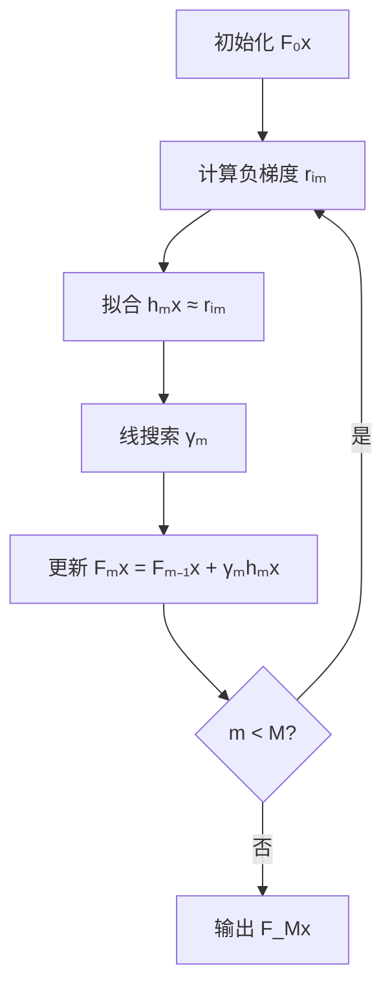
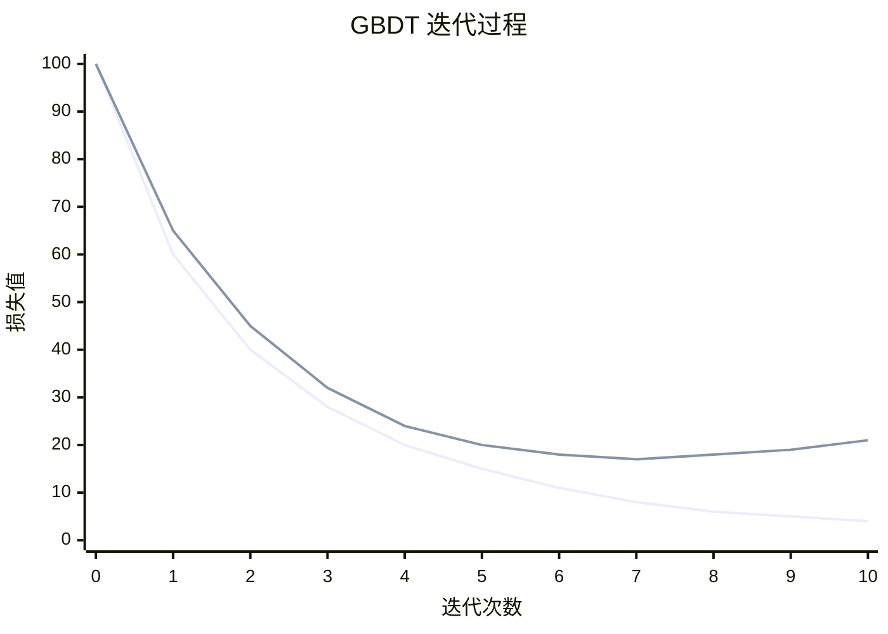
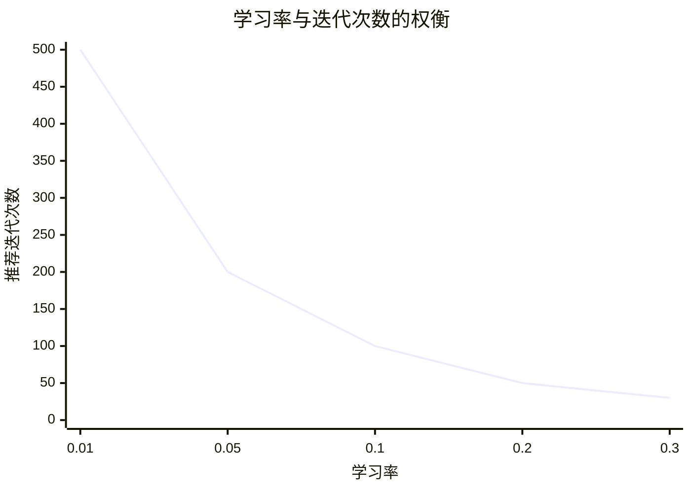
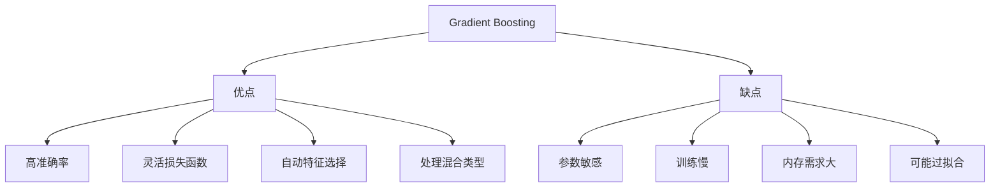

# Gradient Boosting 梯度提升

## 1. 概述

Gradient Boosting（梯度提升，GBDT）是一种强大的**集成学习算法**，通过迭代训练弱学习器来拟合前一轮的残差（负梯度），逐步提升模型性能。与 AdaBoost 调整样本权重不同，GBDT 直接拟合残差。

**核心思想：** "循序渐进"——每一步都朝着减少误差的方向前进。

### 1.1 历史背景

- 1999 年：Friedman 提出 Gradient Boosting Machine
- 2001 年：Friedman 发表 Greedy Function Approximation
- 2010 年代：XGBoost、LightGBM、CatBoost 等改进
- 成为 Kaggle 竞赛最常用的算法之一

### 1.2 适用场景

- 结构化数据
- 回归和分类任务
- 需要高准确率
- 特征工程充分
- 工业界广泛应用

### 1.3 与 AdaBoost 对比

| 特性 | AdaBoost | Gradient Boosting |
|------|----------|-------------------|
| 优化方式 | 调整样本权重 | 拟合残差/负梯度 |
| 损失函数 | 指数损失 | 任意可微损失 |
| 学习器权重 | 自适应计算 | 固定或线搜索 |
| 异常值 | 敏感 | 较鲁棒 |

## 2. 算法原理

### 2.1 梯度下降视角

GBDT 可以看作是在**函数空间**的梯度下降：

```
1. 初始化：F₀(x) = argmin_γ Σ L(yᵢ, γ)

2. for m = 1 to M:
   a. 计算负梯度（伪残差）：
      rᵢₘ = -[∂L(yᵢ, F(xᵢ)) / ∂F(xᵢ)]|F=Fₘ₋₁
   b. 拟合负梯度：hₘ(x) ≈ rᵢₘ
   c. 计算步长（线搜索）：
      γₘ = argmin_γ Σ L(yᵢ, Fₘ₋₁(xᵢ) + γ × hₘ(xᵢ))
   d. 更新模型：
      Fₘ(x) = Fₘ₋₁(x) + γₘ × hₘ(x)

3. 输出：F_M(x)
```



### 2.2 常用损失函数

#### 2.2.1 回归任务

**平方损失（L2）：**
```
L(y, F) = (1/2) × (y - F)²
负梯度：rᵢ = yᵢ - F(xᵢ)  (残差)
```

**绝对损失（L1）：**
```
L(y, F) = |y - F|
负梯度：rᵢ = sign(yᵢ - F(xᵢ))
```

**Huber 损失：**
```
L(y, F) = { (1/2)(y-F)²           if |y-F| ≤ δ
          { δ(|y-F| - δ/2)        otherwise
```

#### 2.2.2 分类任务

**对数损失（Log Loss）：**
```
L(y, p) = -[y × log(p) + (1-y) × log(1-p)]
```

**多分类交叉熵：**
```
L(y, p) = -Σ yₖ × log(pₖ)
```

### 2.3 回归 GBDT 示例

```
目标：拟合 y = F(x) + ε

迭代 1:
- F₀(x) = mean(y)
- 残差 rᵢ = yᵢ - F₀(xᵢ)
- 训练 h₁(x) 拟合 rᵢ
- F₁(x) = F₀(x) + γ₁ × h₁(x)

迭代 2:
- 残差 rᵢ = yᵢ - F₁(xᵢ)
- 训练 h₂(x) 拟合 rᵢ
- F₂(x) = F₁(x) + γ₂ × h₂(x)

...

最终：F_M(x) = F₀(x) + Σ γₘ × hₘ(x)
```



## 3. Python 代码实现

### 3.1 使用 scikit-learn

```python
import numpy as np
from sklearn.ensemble import GradientBoostingClassifier, GradientBoostingRegressor
from sklearn.model_selection import train_test_split, cross_val_score
from sklearn.metrics import accuracy_score, mean_squared_error, classification_report
from sklearn.datasets import make_classification, make_regression
import matplotlib.pyplot as plt

# ============ GBDT 分类 ============
print("=== GBDT 分类 ===\n")

# 1. 生成数据
X, y = make_classification(
    n_samples=1000, n_features=20, n_informative=15,
    random_state=42
)

# 2. 划分数据集
X_train, X_test, y_train, y_test = train_test_split(
    X, y, test_size=0.2, random_state=42, stratify=y
)

# 3. 创建并训练模型
gbdt_clf = GradientBoostingClassifier(
    n_estimators=100,         # 树的数量
    learning_rate=0.1,        # 学习率（收缩系数）
    max_depth=3,             # 树的最大深度
    min_samples_split=2,     # 最小分裂样本数
    min_samples_leaf=1,      # 最小叶节点样本数
    subsample=1.0,           # 样本采样比例（1.0=全部）
    max_features=None,       # 最大特征数
    random_state=42
)
gbdt_clf.fit(X_train, y_train)

# 4. 评估
y_pred = gbdt_clf.predict(X_test)
y_pred_proba = gbdt_clf.predict_proba(X_test)

print(f"准确率：{accuracy_score(y_test, y_pred):.4f}")
print("\n分类报告:")
print(classification_report(y_test, y_pred))

# 5. 特征重要性
importances = gbdt_clf.feature_importances_
indices = np.argsort(importances)[::-1]

plt.figure(figsize=(12, 6))
plt.bar(range(20), importances[indices])
plt.xlabel('特征索引')
plt.ylabel('重要性')
plt.title('GBDT 特征重要性')
plt.tight_layout()
plt.show()

# ============ GBDT 回归 ============
print("\n=== GBDT 回归 ===\n")

X_reg, y_reg = make_regression(
    n_samples=1000, n_features=10, noise=10, random_state=42
)

X_train_reg, X_test_reg, y_train_reg, y_test_reg = train_test_split(
    X_reg, y_reg, test_size=0.2, random_state=42
)

gbdt_reg = GradientBoostingRegressor(
    n_estimators=100,
    learning_rate=0.1,
    max_depth=3,
    min_samples_split=2,
    min_samples_leaf=1,
    subsample=1.0,
    random_state=42
)
gbdt_reg.fit(X_train_reg, y_train_reg)

y_pred_reg = gbdt_reg.predict(X_test_reg)
mse = mean_squared_error(y_test_reg, y_pred_reg)
r2 = gbdt_reg.score(X_test_reg, y_test_reg)

print(f"MSE: {mse:.4f}")
print(f"R²: {r2:.4f}")
```

### 3.2 训练过程可视化

```python
# 分析迭代次数的影响
n_estimators_range = [10, 20, 30, 40, 50, 75, 100, 150, 200]
train_scores = []
test_scores = []

for n_est in n_estimators_range:
    gbdt = GradientBoostingClassifier(
        n_estimators=n_est,
        learning_rate=0.1,
        max_depth=3,
        random_state=42
    )
    gbdt.fit(X_train, y_train)
    train_scores.append(gbdt.score(X_train, y_train))
    test_scores.append(gbdt.score(X_test, y_test))

plt.figure(figsize=(12, 5))

plt.subplot(1, 2, 1)
plt.plot(n_estimators_range, train_scores, 'bo-', label='训练集')
plt.plot(n_estimators_range, test_scores, 'gs-', label='测试集')
plt.xlabel('树的数量')
plt.ylabel('准确率')
plt.title('迭代次数对性能的影响')
plt.legend()
plt.grid(True, alpha=0.3)

# 训练损失变化
plt.subplot(1, 2, 2)
train_errors = gbdt_clf.train_score_
plt.plot(range(1, len(train_errors) + 1), 1 - train_errors, 'r-')
plt.xlabel('迭代次数')
plt.ylabel('训练误差')
plt.title('训练误差变化')
plt.grid(True, alpha=0.3)

plt.tight_layout()
plt.show()
```

## 4. 超参数详解

### 4.1 核心参数

| 参数 | 说明 | 推荐值 |
|------|------|--------|
| `n_estimators` | 树的数量 | 100-500 |
| `learning_rate` | 学习率（收缩） | 0.01-0.3 |
| `max_depth` | 树的最大深度 | 3-8 |
| `min_samples_split` | 最小分裂样本数 | 2-10 |
| `min_samples_leaf` | 最小叶节点样本数 | 1-5 |
| `subsample` | 样本采样比例 | 0.5-1.0 |
| `max_features` | 最大特征数 | sqrt(n), log2(n) |

### 4.2 参数调优

```python
from sklearn.model_selection import GridSearchCV

param_grid = {
    'n_estimators': [50, 100, 200],
    'learning_rate': [0.01, 0.05, 0.1, 0.2],
    'max_depth': [3, 4, 5],
    'min_samples_split': [2, 5, 10],
    'subsample': [0.8, 1.0]
}

grid_search = GridSearchCV(
    GradientBoostingClassifier(random_state=42),
    param_grid,
    cv=5,
    scoring='accuracy',
    n_jobs=-1,
    verbose=1
)

grid_search.fit(X_train, y_train)
print(f"最佳参数：{grid_search.best_params_}")
print(f"最佳分数：{grid_search.best_score_:.4f}")
```

## 5. 学习率与迭代次数



**经验法则：**
- 学习率小 → 需要更多迭代
- 学习率大 → 可能过拟合
- 典型组合：learning_rate=0.1, n_estimators=100

```python
# 测试不同学习率
learning_rates = [0.01, 0.05, 0.1, 0.2, 0.3]
best_scores = []

for lr in learning_rates:
    gbdt = GradientBoostingClassifier(
        n_estimators=200,
        learning_rate=lr,
        max_depth=3,
        random_state=42
    )
    scores = cross_val_score(gbdt, X, y, cv=5, scoring='accuracy')
    best_scores.append(scores.mean())

plt.figure(figsize=(10, 6))
plt.plot(learning_rates, best_scores, 'bo-')
plt.xlabel('学习率')
plt.ylabel('交叉验证准确率')
plt.title('学习率对性能的影响')
plt.xscale('log')
plt.grid(True, alpha=0.3)
plt.show()
```

## 6. 正则化技术

### 6.1 收缩（Shrinkage）

```python
# 学习率就是收缩系数
gbdt = GradientBoostingClassifier(learning_rate=0.1)
```

### 6.2 子采样（Subsampling）

```python
# 随机采样样本（类似 Bagging）
gbdt = GradientBoostingClassifier(subsample=0.8)  # 每次用 80% 样本
```

### 6.3 特征采样

```python
# 随机采样特征
gbdt = GradientBoostingClassifier(max_features='sqrt')  # sqrt(n_features)
```

### 6.4 树复杂度控制

```python
gbdt = GradientBoostingClassifier(
    max_depth=3,              # 限制深度
    min_samples_split=10,     # 限制分裂
    min_samples_leaf=5,       # 限制叶节点
    max_leaf_nodes=10         # 限制叶节点总数
)
```

## 7. 优缺点分析



### 7.1 优点

- **高准确率**：在许多任务上表现优秀
- **灵活损失函数**：支持多种损失函数
- **自动特征选择**：特征重要性评估
- **处理混合类型**：数值和类别特征

### 7.2 缺点

- **参数敏感**：需要仔细调优
- **训练慢**：串行训练，无法并行
- **内存需求大**：需要存储所有树
- **可能过拟合**：需要正则化

## 8. 总结

Gradient Boosting 是强大的集成算法：

**核心价值：**
1. 函数空间梯度下降
2. 拟合残差逐步提升
3. 灵活损失函数
4. 高准确率

**最佳实践：**
- 学习率 0.01-0.1
- 树深度 3-5
- 使用子采样正则化
- 早停防止过拟合

**适用场景：**
- 结构化数据
- 需要高准确率
- 回归和分类
- 特征工程充分

GBDT 是现代 Boosting 算法的基础，XGBoost、LightGBM 都是其改进版本。
