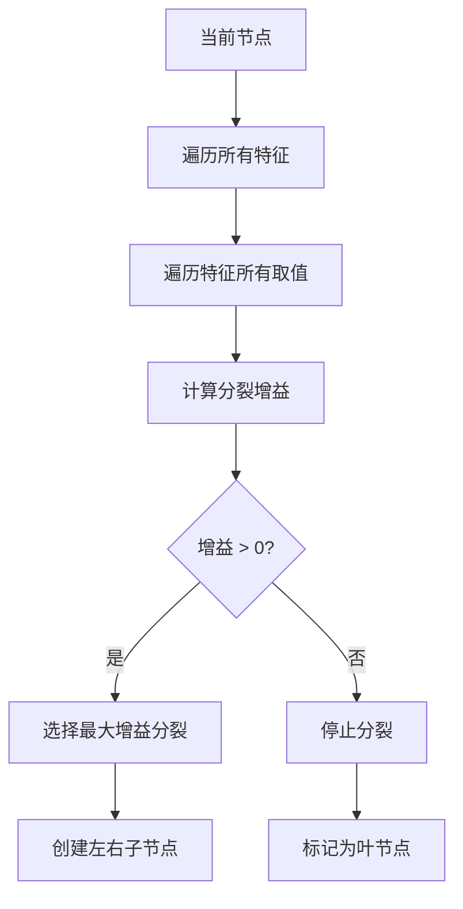
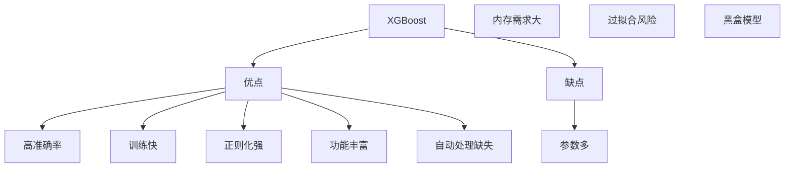

# XGBoost 极端梯度提升

## 1. 概述

XGBoost（eXtreme Gradient Boosting）是 Gradient Boosting 的**高效改进版本**，由陈天奇于 2016 年提出。XGBoost 通过系统优化和算法改进，实现了更快的训练速度和更高的预测精度。

**核心思想：** "更快、更准、更强"——在 GBDT 基础上进行系统优化。

### 1.1 历史背景

- 2016 年：陈天奇提出 XGBoost
- 2016 年：获得 KDD Cup 冠军
- 成为 Kaggle 竞赛最流行算法
- 工业界广泛采用

### 1.2 主要改进

| 改进 | 说明 |
|------|------|
| 二阶泰勒展开 | 使用二阶导数信息 |
| 正则化 | L1+L2 正则化防止过拟合 |
| 列采样 | 类似随机森林的特征采样 |
| 并行计算 | 特征粒度并行 |
| 缺失值处理 | 自动学习缺失值方向 |
| 剪枝 | 基于增益的剪枝 |

### 1.3 适用场景

- 结构化数据竞赛
- 需要高准确率
- 大规模数据
- 特征工程充分
- 工业级应用

## 2. 算法原理

### 2.1 目标函数

XGBoost 的目标函数包含损失函数和正则化项：

```
Obj(θ) = Σ L(yᵢ, ŷᵢ) + Σ Ω(fₖ)
```

其中正则化项：
```
Ω(f) = γT + (1/2)λ||w||² + α||w||₁
```

- T：叶节点数量
- w：叶节点权重
- γ：复杂度控制
- λ：L2 正则化
- α：L1 正则化

### 2.2 二阶泰勒展开

使用二阶泰勒展开近似损失函数：

```
Obj⁽ᵗ⁾ ≈ Σ [gᵢfₜ(xᵢ) + (1/2)hᵢfₜ²(xᵢ)] + Ω(fₜ)
```

其中：
- gᵢ = ∂L(yᵢ, ŷᵢ)/∂ŷᵢ  (一阶导数)
- hᵢ = ∂²L(yᵢ, ŷᵢ)/∂ŷᵢ² (二阶导数)

### 2.3 最优分裂点

对于每个可能的分裂点，计算增益：

```
Gain = (1/2) × [G_L²/(H_L+λ) + G_R²/(H_R+λ) - (G_L+G_R)²/(H_L+H_R+λ)] - γ
```

其中 G 是一阶导数和，H 是二阶导数和。



## 3. Python 代码实现

### 3.1 使用 xgboost 库

```python
import numpy as np
import xgboost as xgb
from sklearn.model_selection import train_test_split, cross_val_score
from sklearn.metrics import accuracy_score, mean_squared_error, classification_report
from sklearn.datasets import make_classification, make_regression
import matplotlib.pyplot as plt

# ============ XGBoost 分类 ============
print("=== XGBoost 分类 ===\n")

# 1. 生成数据
X, y = make_classification(
    n_samples=1000, n_features=20, n_informative=15,
    random_state=42
)

# 2. 划分数据集
X_train, X_test, y_train, y_test = train_test_split(
    X, y, test_size=0.2, random_state=42, stratify=y
)

# 3. 创建 DMatrix（XGBoost 专用数据格式）
dtrain = xgb.DMatrix(X_train, label=y_train)
dtest = xgb.DMatrix(X_test, label=y_test)

# 4. 设置参数
params = {
    'objective': 'binary:logistic',  # 二分类
    'eval_metric': 'logloss',
    'max_depth': 6,                  # 树深度
    'learning_rate': 0.1,            # 学习率
    'n_estimators': 100,             # 树数量
    'subsample': 0.8,                # 样本采样
    'colsample_bytree': 0.8,         # 特征采样
    'gamma': 0,                      # 分裂最小增益
    'reg_alpha': 0,                  # L1 正则化
    'reg_lambda': 1,                 # L2 正则化
    'random_state': 42
}

# 5. 训练模型
model = xgb.train(
    params,
    dtrain,
    num_boost_round=100,
    evals=[(dtrain, 'train'), (dtest, 'valid')],
    early_stopping_rounds=10,
    verbose_eval=10
)

# 6. 预测
y_pred = model.predict(dtest)
y_pred_class = (y_pred > 0.5).astype(int)

print(f"\n准确率：{accuracy_score(y_test, y_pred_class):.4f}")
print("\n分类报告:")
print(classification_report(y_test, y_pred_class))

# 7. 特征重要性
xgb.plot_importance(model, max_num_features=20)
plt.title('XGBoost 特征重要性')
plt.show()

# ============ 使用 sklearn API ============
print("\n=== sklearn API ===\n")

from xgboost import XGBClassifier

xgb_clf = XGBClassifier(
    n_estimators=100,
    max_depth=6,
    learning_rate=0.1,
    subsample=0.8,
    colsample_bytree=0.8,
    gamma=0,
    reg_alpha=0,
    reg_lambda=1,
    random_state=42,
    n_jobs=-1
)

xgb_clf.fit(X_train, y_train)
y_pred = xgb_clf.predict(X_test)

print(f"准确率：{accuracy_score(y_test, y_pred):.4f}")
```

### 3.2 XGBoost 回归

```python
from xgboost import XGBRegressor

X_reg, y_reg = make_regression(n_samples=1000, n_features=10, noise=10)
X_train_reg, X_test_reg, y_train_reg, y_test_reg = train_test_split(
    X_reg, y_reg, test_size=0.2, random_state=42
)

xgb_reg = XGBRegressor(
    n_estimators=100,
    max_depth=6,
    learning_rate=0.1,
    subsample=0.8,
    colsample_bytree=0.8,
    random_state=42,
    n_jobs=-1
)

xgb_reg.fit(X_train_reg, y_train_reg)
y_pred_reg = xgb_reg.predict(X_test_reg)

mse = mean_squared_error(y_test_reg, y_pred_reg)
r2 = xgb_reg.score(X_test_reg, y_test_reg)

print(f"MSE: {mse:.4f}")
print(f"R²: {r2:.4f}")
```

## 4. 超参数详解

### 4.1 核心参数

| 参数 | 说明 | 推荐值 |
|------|------|--------|
| `max_depth` | 树深度 | 3-10 |
| `learning_rate` | 学习率 | 0.01-0.3 |
| `n_estimators` | 树数量 | 100-1000 |
| `subsample` | 样本采样 | 0.5-1.0 |
| `colsample_bytree` | 特征采样 | 0.5-1.0 |
| `gamma` | 最小分裂增益 | 0-10 |
| `reg_alpha` | L1 正则化 | 0-10 |
| `reg_lambda` | L2 正则化 | 0-10 |

### 4.2 参数调优

```python
from sklearn.model_selection import GridSearchCV

param_grid = {
    'max_depth': [3, 5, 7],
    'learning_rate': [0.01, 0.1, 0.3],
    'n_estimators': [50, 100, 200],
    'subsample': [0.8, 1.0],
    'colsample_bytree': [0.8, 1.0]
}

grid_search = GridSearchCV(
    XGBClassifier(random_state=42, n_jobs=-1),
    param_grid,
    cv=5,
    scoring='accuracy',
    n_jobs=-1,
    verbose=1
)

grid_search.fit(X_train, y_train)
print(f"最佳参数：{grid_search.best_params_}")
print(f"最佳分数：{grid_search.best_score_:.4f}")
```

## 5. 早停（Early Stopping）

```python
# 使用验证集进行早停
eval_set = [(X_train, y_train), (X_test, y_test)]

xgb_clf = XGBClassifier(
    n_estimators=1000,  # 设置较大的值
    learning_rate=0.1,
    random_state=42
)

xgb_clf.fit(
    X_train, y_train,
    eval_set=eval_set,
    early_stopping_rounds=10,  # 10 轮不改善则停止
    verbose=10
)

print(f"最佳迭代：{xgb_clf.best_iteration}")
print(f"最佳分数：{xgb_clf.best_score}")
```

## 6. 处理缺失值

```python
# XGBoost 自动处理缺失值
X_with_nan = X.copy()
X_with_nan[np.random.random(X.shape) < 0.1] = np.nan  # 10% 缺失

xgb_clf = XGBClassifier(random_state=42)
xgb_clf.fit(X_with_nan, y)

# XGBoost 自动学习缺失值应该走向左子树还是右子树
```

## 7. 优缺点分析



### 7.1 优点

- **高准确率**：竞赛和工业界首选
- **训练快**：并行计算优化
- **正则化强**：L1+L2 防止过拟合
- **功能丰富**：支持多种目标函数
- **自动处理缺失**：无需预处理

### 7.2 缺点

- **参数多**：调优复杂
- **内存需求大**：需要存储树结构
- **过拟合风险**：需要仔细调参
- **黑盒模型**：可解释性较差

## 8. 总结

XGBoost 是工业级 Boosting 算法：

**核心价值：**
1. 二阶泰勒展开优化
2. 正则化防止过拟合
3. 系统优化训练快
4. 功能丰富灵活

**最佳实践：**
- 使用早停防止过拟合
- 调优 max_depth 和 learning_rate
- 使用子采样和列采样
- 处理类别特征用 One-Hot

**适用场景：**
- Kaggle 竞赛
- 结构化数据
- 需要高准确率
- 大规模数据

XGBoost 是现代机器学习的必备工具，掌握它对数据科学工作至关重要。
