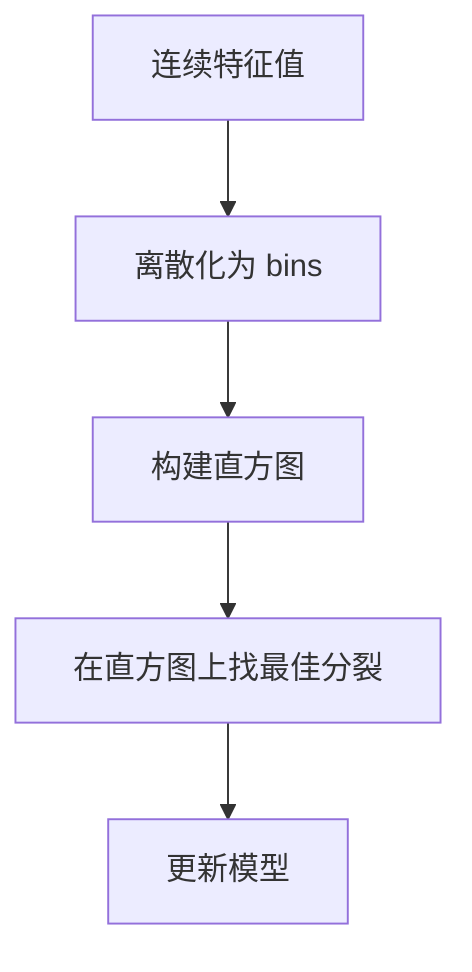
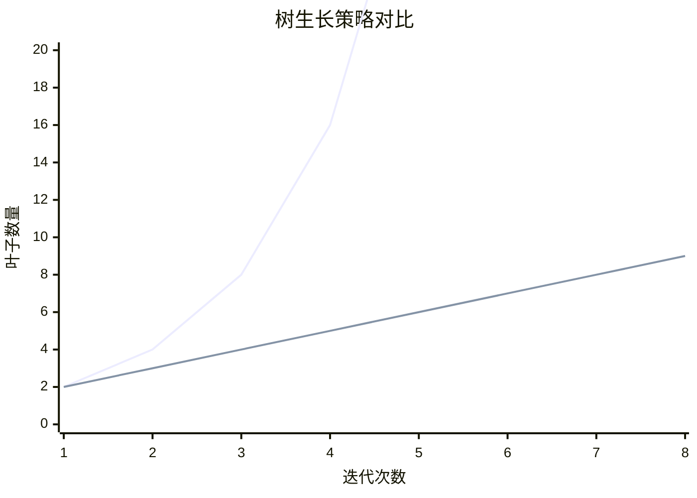
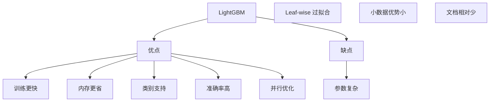

# LightGBM 轻量级梯度提升

## 1. 概述

LightGBM（Light Gradient Boosting Machine）是微软于 2017 年开源的**高效梯度提升框架**。相比 XGBoost，LightGBM 在保持高精度的同时，显著提升了训练速度和降低了内存消耗。

**核心思想：** "更快、更省、更高效"——基于直方图和 leaf-wise 生长策略。

### 1.1 主要特性

| 特性 | 说明 |
|------|------|
| 直方图算法 | 离散化特征，加速训练 |
| Leaf-wise 生长 | 按叶子生长，更深更准 |
| GOSS | 梯度单边采样加速 |
| EFB | 互斥特征捆绑降维 |
| 原生类别支持 | 无需 One-Hot 编码 |
| 并行优化 | 多 GPU、多机并行 |

### 1.2 与 XGBoost 对比

| 特性 | XGBoost | LightGBM |
|------|---------|----------|
| 树生长策略 | Level-wise | Leaf-wise |
| 特征离散化 | 预排序 | 直方图 |
| 类别特征 | One-Hot | 原生支持 |
| 训练速度 | 快 | 更快 |
| 内存消耗 | 中 | 低 |
| 准确率 | 高 | 高（略优） |

### 1.3 适用场景

- 大规模数据
- 需要快速训练
- 类别特征多
- 内存受限
- 工业级应用

## 2. 算法原理

### 2.1 直方图算法（Histogram-based）

将连续特征离散化为 bins，构建直方图：

```
原始方法：O(数据量 × 特征数)
直方图方法：O(bins × 特征数)
```

**优势：**
- 内存消耗降低
- 计算速度提升
- 支持并行优化



### 2.2 Leaf-wise 生长策略

**Level-wise（XGBoost）：**
- 按层生长，所有叶子同时分裂
- 容易浪费资源在不重要的叶子上

**Leaf-wise（LightGBM）：**
- 每次选择增益最大的叶子分裂
- 可以产生更深的树
- 需要限制深度防止过拟合



### 2.3 GOSS（Gradient-based One-Side Sampling）

保留大梯度样本，随机采样小梯度样本：

```
1. 按梯度绝对值排序
2. 保留前 a% 大梯度样本
3. 随机采样 b% 小梯度样本
4. 对小梯度样本加权补偿
```

**效果：** 减少数据量，保持精度

### 2.4 EFB（Exclusive Feature Bundling）

捆绑互斥特征（很少同时非零）：

```
原始特征：F₁, F₂, F₃, ..., Fₙ
捆绑后：B₁={F₁,F₂}, B₂={F₃,F₄}, ...
```

**效果：** 降低特征维度，加速训练

## 3. Python 代码实现

### 3.1 使用 lightgbm 库

```python
import numpy as np
import lightgbm as lgb
from sklearn.model_selection import train_test_split, cross_val_score
from sklearn.metrics import accuracy_score, mean_squared_error, classification_report
from sklearn.datasets import make_classification, make_regression
import matplotlib.pyplot as plt

# ============ LightGBM 分类 ============
print("=== LightGBM 分类 ===\n")

# 1. 生成数据
X, y = make_classification(
    n_samples=1000, n_features=20, n_informative=15,
    random_state=42
)

# 2. 划分数据集
X_train, X_test, y_train, y_test = train_test_split(
    X, y, test_size=0.2, random_state=42, stratify=y
)

# 3. 创建 Dataset
train_data = lgb.Dataset(X_train, label=y_train)
valid_data = lgb.Dataset(X_test, label=y_test, reference=train_data)

# 4. 设置参数
params = {
    'objective': 'binary',           # 二分类
    'metric': 'binary_logloss',
    'boosting_type': 'gbdt',         # 梯度提升
    'num_leaves': 31,               # 叶子数（替代 max_depth）
    'learning_rate': 0.1,
    'feature_fraction': 0.8,        # 特征采样
    'bagging_fraction': 0.8,        # 样本采样
    'bagging_freq': 5,              # 每 5 轮采样一次
    'verbose': -1,
    'random_state': 42
}

# 5. 训练模型
model = lgb.train(
    params,
    train_data,
    num_boost_round=100,
    valid_sets=[train_data, valid_data],
    valid_names=['train', 'valid'],
    early_stopping_rounds=10,
    verbose_eval=10
)

# 6. 预测
y_pred = model.predict(X_test, num_iteration=model.best_iteration)
y_pred_class = (y_pred > 0.5).astype(int)

print(f"\n准确率：{accuracy_score(y_test, y_pred_class):.4f}")
print("\n分类报告:")
print(classification_report(y_test, y_pred_class))

# 7. 特征重要性
lgb.plot_importance(model, max_num_features=20)
plt.title('LightGBM 特征重要性')
plt.show()

# ============ 使用 sklearn API ============
print("\n=== sklearn API ===\n")

from lightgbm import LGBMClassifier

lgbm_clf = LGBMClassifier(
    n_estimators=100,
    num_leaves=31,
    learning_rate=0.1,
    feature_fraction=0.8,
    bagging_fraction=0.8,
    bagging_freq=5,
    random_state=42,
    n_jobs=-1
)

lgbm_clf.fit(X_train, y_train)
y_pred = lgbm_clf.predict(X_test)

print(f"准确率：{accuracy_score(y_test, y_pred):.4f}")
```

### 3.2 处理类别特征

```python
# LightGBM 原生支持类别特征（无需 One-Hot）
import pandas as pd

# 创建包含类别特征的数据
df = pd.DataFrame({
    'num_feature1': np.random.randn(1000),
    'num_feature2': np.random.randn(1000),
    'cat_feature1': np.random.choice(['A', 'B', 'C'], 1000),
    'cat_feature2': np.random.choice(['X', 'Y', 'Z', 'W'], 1000),
})
y = np.random.randint(0, 2, 1000)

# 指定类别特征
categorical_features = ['cat_feature1', 'cat_feature2']

# 训练
model = lgb.LGBMClassifier()
model.fit(df, y, categorical_feature=categorical_features)
```

## 4. 超参数详解

### 4.1 核心参数

| 参数 | 说明 | 推荐值 |
|------|------|--------|
| `num_leaves` | 叶子数 | 20-100 |
| `learning_rate` | 学习率 | 0.01-0.3 |
| `n_estimators` | 树数量 | 100-1000 |
| `max_depth` | 最大深度 | -1（不限制） |
| `feature_fraction` | 特征采样 | 0.5-1.0 |
| `bagging_fraction` | 样本采样 | 0.5-1.0 |
| `min_data_in_leaf` | 叶最小样本 | 20-100 |
| `lambda_l1/l2` | 正则化 | 0-10 |

### 4.2 参数调优

```python
from sklearn.model_selection import GridSearchCV

param_grid = {
    'num_leaves': [20, 31, 50],
    'learning_rate': [0.01, 0.1, 0.3],
    'n_estimators': [50, 100, 200],
    'feature_fraction': [0.8, 1.0],
    'bagging_fraction': [0.8, 1.0]
}

grid_search = GridSearchCV(
    LGBMClassifier(random_state=42, n_jobs=-1),
    param_grid,
    cv=5,
    scoring='accuracy',
    n_jobs=-1,
    verbose=1
)

grid_search.fit(X_train, y_train)
print(f"最佳参数：{grid_search.best_params_}")
print(f"最佳分数：{grid_search.best_score_:.4f}")
```

## 5. 优缺点分析



### 5.1 优点

- **训练更快**：直方图算法加速
- **内存更省**：离散化降低内存
- **类别支持**：原生处理类别特征
- **准确率高**：Leaf-wise 更精确
- **并行优化**：支持多 GPU、多机

### 5.2 缺点

- **参数复杂**：调优需要经验
- **Leaf-wise 过拟合**：需要限制深度
- **小数据优势小**：大数据更明显
- **文档相对少**：社区较小

## 6. 总结

LightGBM 是高效梯度提升框架：

**核心价值：**
1. 直方图算法加速
2. Leaf-wise 更精确
3. 原生类别支持
4. 内存消耗低

**最佳实践：**
- 使用 num_leaves 替代 max_depth
- 启用早停防止过拟合
- 类别特征用原生支持
- 大数据集优势明显

**适用场景：**
- 大规模数据
- 类别特征多
- 需要快速训练
- 内存受限

LightGBM 与 XGBoost 互补，是现代机器学习的必备工具。
