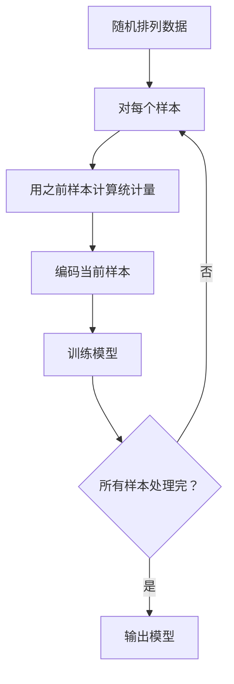
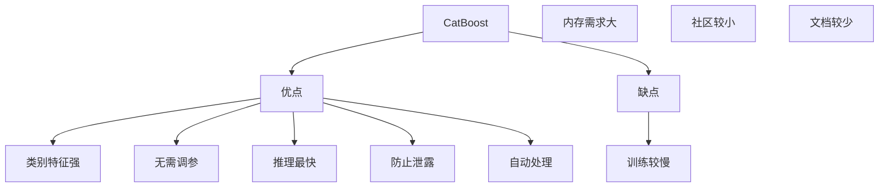

# CatBoost 类别特征提升

## 1. 概述

CatBoost（Categorical Boosting）是 Yandex 于 2017 年开源的梯度提升算法，专为**高效处理类别特征**而设计。CatBoost 通过 Ordered Boosting 和创新的类别特征处理，实现了高精度且无需大量调参。

**核心思想：** "类别特征专家"——原生高效处理类别特征，减少调参需求。

### 1.1 主要特性

| 特性 | 说明 |
|------|------|
| Ordered Boosting | 解决目标泄露 |
| 类别特征处理 | 自动编码类别特征 |
| 对称树结构 | 提升推理速度 |
| 无需调参 | 默认参数表现好 |
| 原生类别支持 | 无需 One-Hot |
| 缺失值处理 | 自动处理缺失 |

### 1.2 与其他 Boosting 对比

| 特性 | XGBoost | LightGBM | CatBoost |
|------|---------|----------|----------|
| 类别特征 | One-Hot | 原生支持 | 原生支持（最优） |
| 目标泄露 | 需要处理 | 需要处理 | Ordered Boosting |
| 调参需求 | 高 | 中 | 低 |
| 推理速度 | 快 | 快 | 最快 |
| 训练速度 | 快 | 最快 | 中 |

### 1.3 适用场景

- 类别特征多
- 需要快速原型
- 不想调参
- 需要快速推理
- 表格数据竞赛

## 2. 算法原理

### 2.1 Ordered Boosting

解决传统 Boosting 的目标泄露问题：

**问题：** 使用当前样本计算统计量会导致过拟合

**解决：** 使用排列后的"历史"数据计算



### 2.2 类别特征处理

**目标编码（Target Encoding）：**
```
编码值 = (Σprior + Σy) / (prior_count + count)
```

**组合类别：**
- 自动组合多个类别特征
- 捕捉特征交互

### 2.3 对称树结构

所有节点使用相同的分裂条件：

```
传统树：
节点 1: if x > 5
节点 2: if x < 3
节点 3: if x > 7

对称树：
所有节点：if x > threshold
```

**优势：**
- 推理速度更快
- 内存占用更小
- 更适合 CPU 优化

## 3. Python 代码实现

### 3.1 使用 catboost 库

```python
import numpy as np
import pandas as pd
from catboost import CatBoostClassifier, CatBoostRegressor, Pool
from sklearn.model_selection import train_test_split
from sklearn.metrics import accuracy_score, mean_squared_error, classification_report
import matplotlib.pyplot as plt

# ============ CatBoost 分类 ============
print("=== CatBoost 分类 ===\n")

# 1. 生成数据（包含类别特征）
n_samples = 1000
df = pd.DataFrame({
    'num_feature1': np.random.randn(n_samples),
    'num_feature2': np.random.randn(n_samples),
    'cat_feature1': np.random.choice(['A', 'B', 'C', 'D'], n_samples),
    'cat_feature2': np.random.choice(['X', 'Y', 'Z'], n_samples),
    'cat_feature3': np.random.choice(['P', 'Q', 'R', 'S', 'T'], n_samples),
})
y = np.random.randint(0, 2, n_samples)

# 2. 指定类别特征索引
cat_features = [2, 3, 4]  # 列索引

# 3. 划分数据集
X_train, X_test, y_train, y_test = train_test_split(
    df, y, test_size=0.2, random_state=42, stratify=y
)

# 4. 创建 Pool（CatBoost 专用数据格式）
train_pool = Pool(X_train, y_train, cat_features=cat_features)
test_pool = Pool(X_test, y_test, cat_features=cat_features)

# 5. 创建并训练模型（几乎无需调参！）
model = CatBoostClassifier(
    iterations=100,
    depth=6,
    learning_rate=0.1,
    loss_function='Logloss',
    verbose=10,
    random_state=42
)

model.fit(
    train_pool,
    eval_set=test_pool,
    early_stopping_rounds=10,
    use_best_model=True
)

# 6. 评估
y_pred = model.predict(X_test)
y_pred_proba = model.predict_proba(X_test)

print(f"\n准确率：{accuracy_score(y_test, y_pred):.4f}")
print("\n分类报告:")
print(classification_report(y_test, y_pred))

# 7. 特征重要性
importances = model.get_feature_importance()
feature_names = df.columns

plt.figure(figsize=(10, 6))
plt.barh(range(len(importances)), importances)
plt.yticks(range(len(importances)), feature_names)
plt.xlabel('重要性')
plt.title('CatBoost 特征重要性')
plt.gca().invert_yaxis()
plt.tight_layout()
plt.show()

# ============ 使用 sklearn API ============
print("\n=== sklearn API ===\n")

from catboost import CatBoostClassifier

cb_clf = CatBoostClassifier(
    iterations=100,
    depth=6,
    learning_rate=0.1,
    random_state=42,
    verbose=0
)

cb_clf.fit(X_train, y_train, cat_features=cat_features)
y_pred = cb_clf.predict(X_test)

print(f"准确率：{accuracy_score(y_test, y_pred):.4f}")
```

### 3.2 CatBoost 回归

```python
from catboost import CatBoostRegressor

# 生成回归数据
df_reg = pd.DataFrame({
    'num_feature1': np.random.randn(1000),
    'cat_feature1': np.random.choice(['A', 'B', 'C'], 1000),
    'cat_feature2': np.random.choice(['X', 'Y', 'Z'], 1000),
})
y_reg = np.random.randn(1000)

cat_features = [1, 2]

X_train_reg, X_test_reg, y_train_reg, y_test_reg = train_test_split(
    df_reg, y_reg, test_size=0.2, random_state=42
)

cb_reg = CatBoostRegressor(
    iterations=100,
    depth=6,
    learning_rate=0.1,
    loss_function='RMSE',
    verbose=0,
    random_state=42
)

cb_reg.fit(X_train_reg, y_train_reg, cat_features=cat_features)
y_pred_reg = cb_reg.predict(X_test_reg)

mse = mean_squared_error(y_test_reg, y_pred_reg)
r2 = cb_reg.score(X_test_reg, y_test_reg)

print(f"MSE: {mse:.4f}")
print(f"R²: {r2:.4f}")
```

## 4. 超参数详解

### 4.1 核心参数

| 参数 | 说明 | 推荐值 |
|------|------|--------|
| `iterations` | 树数量 | 100-1000 |
| `depth` | 树深度 | 4-10 |
| `learning_rate` | 学习率 | 0.01-0.3 |
| `l2_leaf_reg` | L2 正则化 | 1-10 |
| `border_count` | 数值特征 bins | 32-255 |
| `one_hot_max_size` | One-Hot 阈值 | 2-10 |

### 4.2 默认参数表现

```python
# CatBoost 的默认参数通常就很好！
model = CatBoostClassifier(verbose=0)
model.fit(X_train, y_train, cat_features=cat_features)

# 无需大量调参即可获得好结果
```

## 5. 优缺点分析



### 5.1 优点

- **类别特征强**：原生高效处理
- **无需调参**：默认参数表现好
- **推理最快**：对称树结构优化
- **防止泄露**：Ordered Boosting
- **自动处理**：缺失值、类别编码

### 5.2 缺点

- **训练较慢**：比 LightGBM 慢
- **内存需求大**：存储更多统计量
- **社区较小**：相比 XGBoost
- **文档较少**：中文资源少

## 6. 总结

CatBoost 是类别特征专家：

**核心价值：**
1. 原生高效处理类别特征
2. Ordered Boosting 防泄露
3. 默认参数表现好
4. 推理速度最快

**最佳实践：**
- 类别特征多时首选
- 使用默认参数快速原型
- 启用早停优化迭代数
- 大数据集考虑内存

**适用场景：**
- 类别特征多
- 快速原型
- 需要快速推理
- 不想调参

CatBoost 与 XGBoost、LightGBM 形成互补，是表格数据建模的利器。
