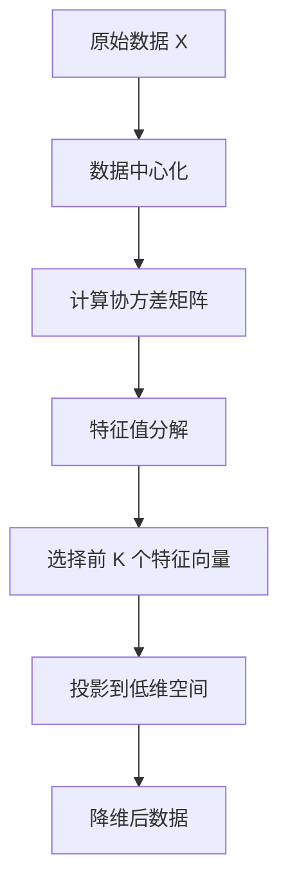

# PCA 主成分分析

## 1. 概述

PCA（Principal Component Analysis，主成分分析）是一种经典的**无监督降维算法**，通过线性变换将数据投影到方差最大的方向（主成分），实现降维和特征提取。

**核心思想：** "保留最大信息"——找到数据变化最大的方向。

### 1.1 适用场景

- 数据降维
- 特征提取
- 数据可视化
- 去噪
- 多重共线性处理
- 数据压缩

### 1.2 算法特点

| 特点 | 说明 |
|------|------|
| 无监督 | 不需要标签 |
| 线性 | 线性变换 |
| 正交 | 主成分相互正交 |
| 方差最大 | 保留最大方差 |

## 2. 算法原理

### 2.1 核心步骤



### 2.2 数学推导

**1. 数据中心化：**
```
X_centered = X - mean(X)
```

**2. 协方差矩阵：**
```
Σ = (1/n) × X_centeredᵀ × X_centered
```

**3. 特征值分解：**
```
Σ × v = λ × v
```

**4. 选择主成分：**
- 按特征值λ降序排列
- 选择前 K 个特征向量

**5. 投影：**
```
X_new = X_centered × V_k
```

### 2.3 方差解释率

```
解释率 = λᵢ / Σλⱼ
累计解释率 = Σ(λ₁...λₖ) / Σλⱼ
```

## 3. Python 代码实现

```python
import numpy as np
from sklearn.decomposition import PCA
from sklearn.preprocessing import StandardScaler
from sklearn.datasets import load_iris
import matplotlib.pyplot as plt

# 加载数据
iris = load_iris()
X = iris.data
y = iris.target

# 特征缩放（PCA 对尺度敏感！）
scaler = StandardScaler()
X_scaled = scaler.fit_transform(X)

# PCA 降维
pca = PCA(n_components=2)
X_pca = pca.fit_transform(X_scaled)

# 解释方差
print(f"各主成分解释方差比：{pca.explained_variance_ratio_}")
print(f"累计解释方差比：{np.sum(pca.explained_variance_ratio_):.4f}")

# 可视化
plt.figure(figsize=(10, 6))
for i, color, label in zip(range(3), ['r', 'g', 'b'], iris.target_names):
    plt.scatter(X_pca[y == i, 0], X_pca[y == i, 1], 
               c=color, label=label, alpha=0.6)
plt.xlabel(f'PC1 ({pca.explained_variance_ratio_[0]:.2%})')
plt.ylabel(f'PC2 ({pca.explained_variance_ratio_[1]:.2%})')
plt.title('PCA 降维可视化')
plt.legend()
plt.show()

# 选择最优主成分数
pca_full = PCA()
pca_full.fit(X_scaled)

plt.figure(figsize=(10, 5))
plt.plot(np.cumsum(pca_full.explained_variance_ratio_), 'bo-')
plt.axhline(y=0.95, color='r', linestyle='--', label='95% 方差')
plt.xlabel('主成分数量')
plt.ylabel('累计解释方差比')
plt.title('选择主成分数量')
plt.legend()
plt.grid(True, alpha=0.3)
plt.show()
```

## 4. 超参数

| 参数 | 说明 | 推荐值 |
|------|------|--------|
| `n_components` | 主成分数 | 整数或 0.95 |
| `svd_solver` | SVD 求解器 | 'auto' |
| `whiten` | 白化 | False |

## 5. 优缺点

**优点：**
- 简单高效
- 无参数
- 去除相关性
- 可解释性强

**缺点：**
- 线性假设
- 对异常值敏感
- 需要特征缩放
- 可能丢失信息

## 6. 总结

PCA 是经典的降维算法：

**核心价值：**
1. 线性降维保留最大方差
2. 去除特征相关性
3. 数据可视化
4. 去噪压缩

**最佳实践：**
- 始终进行特征缩放
- 用累计方差选择主成分数
- 检查主成分载荷解释

**适用场景：**
- 数据降维
- 可视化
- 去噪
- 多重共线性处理
