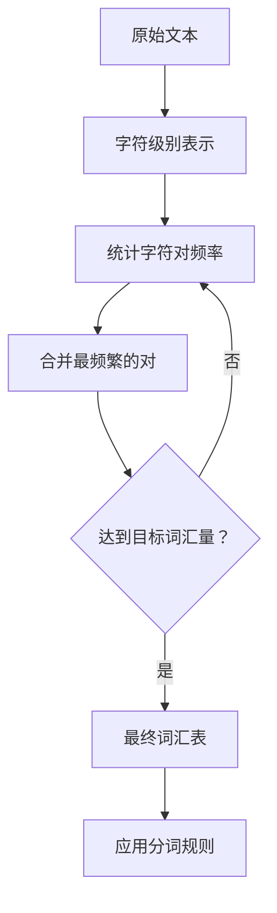
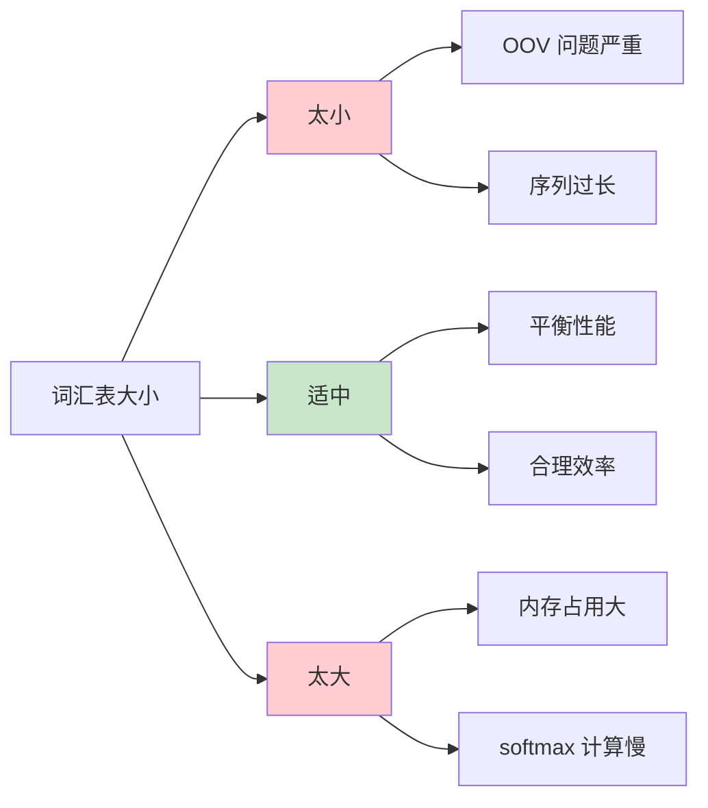

# Tokenization（分词）

## 1. 概述

Tokenization（分词）是自然语言处理（NLP）中最基础也是最关键的预处理步骤之一。它的核心任务是将连续的文本序列切分成离散的单元（tokens），这些单元可以是单词、子词、字符或其他有意义的语言单位。分词的质量直接影响后续 NLP 任务的性能，包括语言建模、机器翻译、文本分类等。

在现代 NLP 系统中，分词不仅仅是简单的空格分割，而是需要处理各种复杂的语言现象，如标点符号、缩写、复合词、多语言混合等。不同的分词策略会对模型的理解能力产生深远影响。

## 2. 分词的基本概念

### 2.1 什么是 Token

Token 是文本处理的最小单元。根据分词粒度的不同，Token 可以是：

- **单词级（Word-level）**：以完整单词为单位，如 "hello"、"world"
- **子词级（Subword-level）**：将单词进一步拆分为更有意义的子单元，如 "un-believ-able"
- **字符级（Character-level）**：以单个字符为单位，如 "h"、"e"、"l"、"l"、"o"

### 2.2 分词的挑战

分词看似简单，实则面临诸多挑战：

```
挑战示例：
- 缩写处理："don't" 应该分为 "do" + "n't" 还是保持整体？
- 复合词："New York" 是一个 token 还是两个？
- 标点符号："Hello, world!" 中的逗号和感叹号如何处理？
- 多语言混合："今天天气真好，let's go!" 中英文混合
- 领域特定术语："COVID-19"、"GPT-4" 等特殊格式
```

## 3. 主要分词方法

### 3.1 规则-based 分词

最传统的分词方法，基于预定义的规则进行切分。

```python
# 简单的空格分词
def whitespace_tokenize(text):
    return text.split()

# 使用正则表达式处理标点
import re
def regex_tokenize(text):
    # 将标点符号单独分离
    text = re.sub(r'([^\w\s])', r' \1 ', text)
    return text.split()

# 示例
text = "Hello, world! Don't you think?"
print(regex_tokenize(text))
# 输出：['Hello', ',', 'world', '!', 'Do', 'n', "'", 't', 'you', 'think', '?']
```

**优点**：
- 简单快速，无需训练
- 可解释性强，规则透明

**缺点**：
- 难以处理未登录词（OOV）
- 规则维护成本高
- 跨语言适应性差

### 3.2 基于词典的分词

主要用于中文等无空格语言的分词。

```python
# 简单的最大匹配分词
def max_match_tokenize(text, dictionary):
    tokens = []
    i = 0
    max_len = max(len(word) for word in dictionary)
    
    while i < len(text):
        matched = False
        # 从最长可能匹配开始
        for length in range(min(max_len, len(text) - i), 0, -1):
            word = text[i:i+length]
            if word in dictionary:
                tokens.append(word)
                i += length
                matched = True
                break
        if not matched:
            tokens.append(text[i])
            i += 1
    
    return tokens

# 示例
dictionary = {"中国", "人民", "共和国", "中", "国", "人", "民"}
text = "中华人民共和国"
print(max_match_tokenize(text, dictionary))
# 输出：['中华人民共和国'] 或 ['中国', '人民', '共和国']（取决于词典）
```

### 3.3 统计分词方法

基于机器学习模型，如 HMM、CRF 等进行分词。

```python
# 使用 jieba 进行中文分词
import jieba

text = "我爱自然语言处理"
tokens = list(jieba.cut(text))
print(tokens)
# 输出：['我', '爱', '自然语言处理']

# 可以添加自定义词典
jieba.add_word("自然语言处理")
```

## 4. 现代子词分词算法

### 4.1 Byte Pair Encoding (BPE)

BPE 是最流行的子词分词算法之一，由 Sennrich 等人于 2016 年提出。它通过迭代合并最频繁的字符对来构建词汇表。



**BPE 算法流程**：

```python
from collections import defaultdict
import regex as re

class BPETokenizer:
    def __init__(self, vocab_size=10000):
        self.vocab_size = vocab_size
        self.vocab = {}
        self.merges = {}
    
    def get_stats(self, vocab):
        """统计字符对频率"""
        pairs = defaultdict(int)
        for word, freq in vocab.items():
            symbols = word.split()
            for i in range(len(symbols) - 1):
                pairs[symbols[i], symbols[i+1]] += freq
        return pairs
    
    def merge_vocab(self, pair, vocab):
        """合并词汇表中的字符对"""
        new_vocab = {}
        bigram = re.escape(' '.join(pair))
        p = re.compile(r'(?<!\S)' + bigram + r'(?!\S)')
        for word in vocab:
            w_out = p.sub(''.join(pair), word)
            new_vocab[w_out] = vocab[word]
        return new_vocab
    
    def train(self, text_corpus):
        """训练 BPE 分词器"""
        # 初始化：字符级别词汇表
        vocab = defaultdict(int)
        for text in text_corpus:
            word = ' '.join(list(text)) + ' </w>'
            vocab[word] += 1
        
        # 迭代合并
        num_merges = self.vocab_size - len(set(' '.join(vocab.keys()).split()))
        for i in range(num_merges):
            pairs = self.get_stats(vocab)
            if not pairs:
                break
            best_pair = max(pairs, key=pairs.get)
            vocab = self.merge_vocab(best_pair, vocab)
            self.merges[i] = best_pair
        
        # 构建最终词汇表
        self.vocab = set(' '.join(vocab.keys()).split())
```

**BPE 示例**：

```
原始词汇：
- "low" 出现 5 次
- "lower" 出现 2 次
- "newest" 出现 6 次
- "widest" 出现 3 次

迭代 1：合并 (e, s) → "es"（出现 9 次）
迭代 2：合并 (e, s, t) → "est"（出现 9 次）
迭代 3：合并 (l, o) → "lo"（出现 7 次）
...

最终词汇表包含：l, o, w, e, r, n, w, e, s, t, lo, est, ...
```

### 4.2 WordPiece

WordPiece 是 Google 提出的子词分词方法，用于 BERT 等模型。与 BPE 类似，但合并策略基于语言模型似然度。

```python
# WordPiece 分词示例（使用 Hugging Face transformers）
from transformers import BertTokenizer

tokenizer = BertTokenizer.from_pretrained('bert-base-uncased')

text = "unbelievable"
tokens = tokenizer.tokenize(text)
print(tokens)
# 输出：['un', '##bel', '##ievable']

# 特殊标记
print(tokenizer.cls_token)  # [CLS]
print(tokenizer.sep_token)  # [SEP]
print(tokenizer.mask_token) # [MASK]
```

### 4.3 SentencePiece

SentencePiece 由 Google 提出，将输入文本视为原始字节序列，无需预分词。

```python
import sentencepiece as spm

# 训练 SentencePiece 模型
spm.SentencePieceTrainer.train(
    input='corpus.txt',
    model_prefix='mymodel',
    vocab_size=8000,
    model_type='bpe'
)

# 加载模型
sp = spm.SentencePieceProcessor()
sp.load('mymodel.model')

# 分词
text = "Hello world!"
tokens = sp.encode(text, out_type=str)
print(tokens)
# 输出：['▁Hello', '▁world', '!']

# 编码为 ID
ids = sp.encode(text, out_type=int)
print(ids)  # 输出：[1234, 5678, 901]

# 解码
decoded = sp.decode(ids)
print(decoded)  # 输出："Hello world!"
```

**SentencePiece 特点**：


## 5. 各模型的分词策略对比

| 模型 | 分词方法 | 词汇量 | 特点 |
|------|---------|--------|------|
| GPT-2 | BPE | 50,257 | 使用 byte-level BPE |
| BERT | WordPiece | 30,522 | 使用 ## 标记子词 |
| T5 | SentencePiece | 32,000 | 支持多语言 |
| RoBERTa | BPE | 50,265 | 基于 GPT-2 分词器 |
| XLNet | SentencePiece | 32,000 | 与 T5 类似 |

## 6. 分词对模型性能的影响

### 6.1 词汇表大小的权衡



### 6.2 实际影响示例

```python
# 比较不同分词器的效果
from transformers import AutoTokenizer

tokenizers = {
    'BERT': AutoTokenizer.from_pretrained('bert-base-uncased'),
    'GPT-2': AutoTokenizer.from_pretrained('gpt2'),
    'T5': AutoTokenizer.from_pretrained('t5-base')
}

text = "The quick brown fox jumps over the lazy dog."

for name, tokenizer in tokenizers.items():
    tokens = tokenizer.tokenize(text)
    ids = tokenizer.encode(text, add_special_tokens=False)
    print(f"{name}: {len(tokens)} tokens, {len(ids)} ids")
    print(f"  Tokens: {tokens[:5]}...")
```

## 7. 特殊场景处理

### 7.1 多语言分词

```python
# 使用多语言分词器
from transformers import AutoTokenizer

tokenizer = AutoTokenizer.from_pretrained('bert-base-multilingual-cased')

texts = [
    "Hello world",      # 英语
    "你好世界",          # 中文
    "こんにちは世界",    # 日语
    "Привет мир"        # 俄语
]

for text in texts:
    tokens = tokenizer.tokenize(text)
    print(f"{text}: {tokens}")
```

### 7.2 代码分词

```python
# 使用 CodeBERT 分词器处理代码
from transformers import AutoTokenizer

tokenizer = AutoTokenizer.from_pretrained('microsoft/codebert-base')

code = """
def hello_world():
    print("Hello, World!")
"""

tokens = tokenizer.tokenize(code)
print(tokens)
# 输出会保留代码结构信息
```

## 8. 最佳实践

1. **选择合适的分词器**：根据任务和语言选择预训练模型配套的分词器
2. **处理 OOV 词汇**：使用子词分词减少未登录词问题
3. **保持一致性**：训练和推理使用相同的分词配置
4. **考虑特殊标记**：正确处理 [CLS]、[SEP]、[PAD] 等特殊 token
5. **注意大小写**：根据模型要求决定是否保留大小写

## 9. 总结

Tokenization 是 NLP 流水线中不可或缺的一环。从简单的空格分词到复杂的子词算法，分词技术的发展反映了 NLP 领域对语言理解深度的不断追求。选择合适的分词策略对于模型性能至关重要，需要根据具体任务、语言特性和计算资源进行权衡。

现代子词分词方法（BPE、WordPiece、SentencePiece）通过平衡词汇表大小和序列长度，有效解决了 OOV 问题，成为 Transformer 模型的标准配置。理解这些分词算法的原理和应用，是深入掌握现代 NLP 技术的基础。
