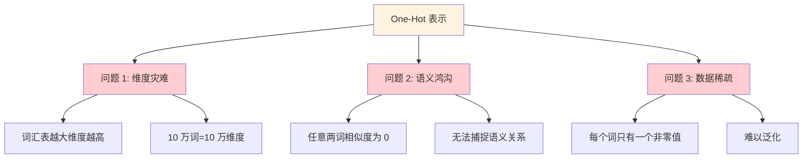
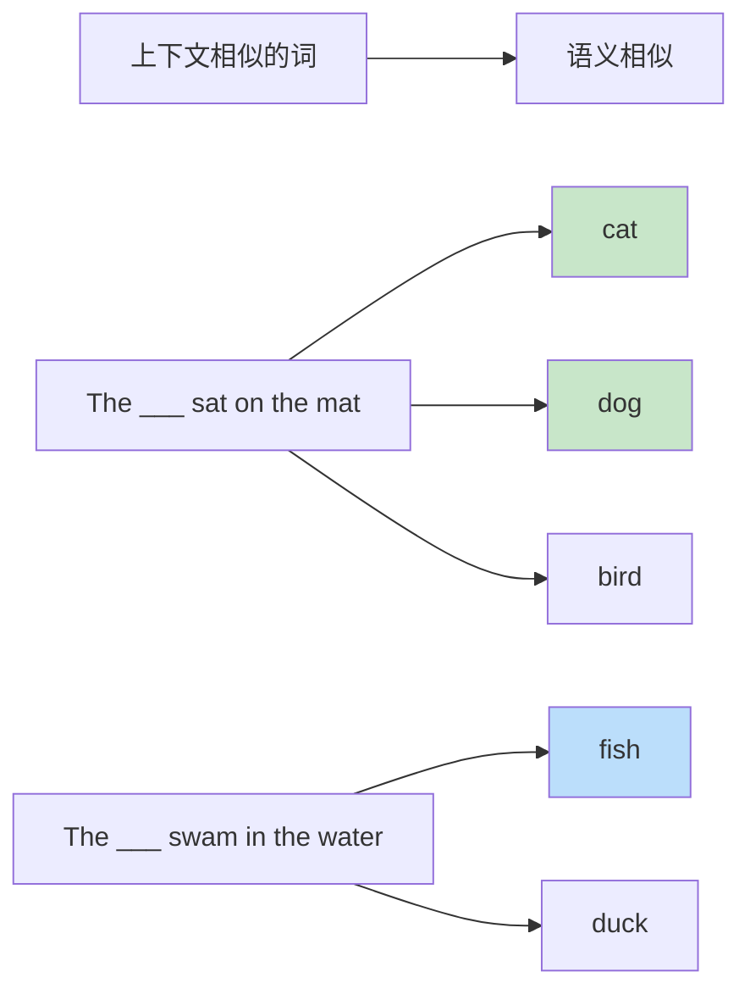
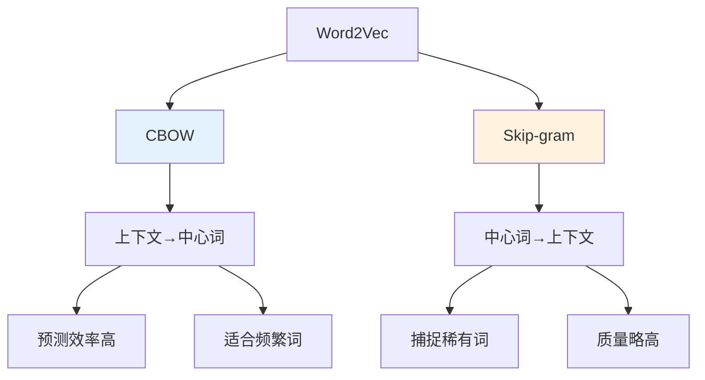

# Word Embedding（词嵌入）

## 1. 概述

Word Embedding（词嵌入）是自然语言处理中的核心技术之一，它将离散的词汇映射到连续的向量空间中。通过词嵌入，计算机能够捕捉词语之间的语义关系，使得语义相似的词在向量空间中也彼此靠近。

词嵌入的出现是 NLP 领域的重要里程碑，它解决了传统 one-hot 表示的稀疏性和语义缺失问题，为深度学习在 NLP 中的应用奠定了基础。

## 2. 为什么需要词嵌入

### 2.1 One-Hot 表示的局限性

在词嵌入出现之前，词语通常使用 one-hot 编码表示：

```python
import numpy as np

# 词汇表
vocab = ["cat", "dog", "fish", "bird"]
vocab_size = len(vocab)

# One-hot 编码
def one_hot_encode(word, vocab):
    vector = np.zeros(len(vocab))
    if word in vocab:
        vector[vocab.index(word)] = 1
    return vector

cat_vector = one_hot_encode("cat", vocab)
dog_vector = one_hot_encode("dog", vocab)

print(f"cat: {cat_vector}")  # [1. 0. 0. 0.]
print(f"dog: {dog_vector}")  # [0. 1. 0. 0.]

# 计算余弦相似度
def cosine_similarity(v1, v2):
    return np.dot(v1, v2) / (np.linalg.norm(v1) * np.linalg.norm(v2))

similarity = cosine_similarity(cat_vector, dog_vector)
print(f"cat 和 dog 的相似度：{similarity}")  # 0.0
```

**One-Hot 表示的问题**：



### 2.2 词嵌入的优势

词嵌入将词语映射到低维稠密向量空间：

```python
# 词嵌入示例（假设维度为 300）
embedding_dim = 300

# 随机初始化（实际训练后会捕捉语义）
cat_embedding = np.random.randn(embedding_dim)
dog_embedding = np.random.randn(embedding_dim)
fish_embedding = np.random.randn(embedding_dim)

# 经过训练后，语义相似的词向量会接近
# cat 和 dog 都是宠物，向量相似度较高
# cat 和 fish 相似度较低
```

**词嵌入的核心特性**：

1. **分布式表示**：每个词由多个特征共同表示
2. **语义相似性**：相似词在向量空间中距离近
3. **线性关系**：词向量间存在有意义的线性关系
4. **低维稠密**：通常 50-1000 维，远小于词汇表大小

## 3. 词嵌入的数学原理

### 3.1 分布式假设

词嵌入基于语言学中的**分布式假设**（Distributional Hypothesis）：

> "Words that occur in similar contexts tend to have similar meanings."
> —— J.R. Firth, 1957



### 3.2 向量空间模型

词嵌入将词语表示为向量空间中的点：

```python
import numpy as np
from sklearn.metrics.pairwise import cosine_similarity

# 简化的词向量示例（实际为 300 维）
word_vectors = {
    "king": np.array([0.8, 0.9, 0.7, 0.6]),
    "queen": np.array([0.7, 0.85, 0.75, 0.65]),
    "man": np.array([0.6, 0.7, 0.5, 0.4]),
    "woman": np.array([0.55, 0.65, 0.55, 0.45]),
    "cat": np.array([0.3, 0.4, 0.2, 0.3]),
    "dog": np.array([0.35, 0.45, 0.25, 0.35])
}

# 计算相似度
def get_similarity(word1, word2):
    v1 = word_vectors[word1].reshape(1, -1)
    v2 = word_vectors[word2].reshape(1, -1)
    return cosine_similarity(v1, v2)[0][0]

print(f"king-queen: {get_similarity('king', 'queen'):.3f}")
print(f"man-woman: {get_similarity('man', 'woman'):.3f}")
print(f"cat-dog: {get_similarity('cat', 'dog'):.3f}")
print(f"king-cat: {get_similarity('king', 'cat'):.3f}")
```

### 3.3 著名的向量类比

词嵌入最神奇的特性是能够捕捉线性关系：

```
king - man + woman ≈ queen
```

```python
# 向量类比示例
def vector_analogy(a, b, c, word_vectors):
    """计算 a - b + c 最接近的词"""
    result = word_vectors[a] - word_vectors[b] + word_vectors[c]
    
    best_word = None
    best_sim = -1
    
    for word, vector in word_vectors.items():
        if word in [a, b, c]:
            continue
        sim = cosine_similarity(result.reshape(1, -1), vector.reshape(1, -1))[0][0]
        if sim > best_sim:
            best_sim = sim
            best_word = word
    
    return best_word, best_sim

# king - man + woman = ?
result, similarity = vector_analogy("king", "man", "woman", word_vectors)
print(f"king - man + woman ≈ {result} (相似度：{similarity:.3f})")
```

## 4. 经典词嵌入方法

### 4.1 Word2Vec

Word2Vec 由 Google 的 Mikolov 等人于 2013 年提出，包含两种架构：



**CBOW（Continuous Bag of Words）**：

```python
import torch
import torch.nn as nn
import torch.nn.functional as F

class CBOW(nn.Module):
    def __init__(self, vocab_size, embedding_dim):
        super(CBOW, self).__init__()
        self.embeddings = nn.Embedding(vocab_size, embedding_dim)
        self.linear = nn.Linear(embedding_dim, vocab_size)
    
    def forward(self, context_words):
        # context_words: [batch_size, context_size]
        embeds = self.embeddings(context_words)  # [batch, context, dim]
        averaged = torch.mean(embeds, dim=1)     # [batch, dim]
        output = self.linear(averaged)           # [batch, vocab_size]
        return F.log_softmax(output, dim=1)

# 使用示例
vocab_size = 10000
embedding_dim = 300
context_size = 5  # 前后各 2 个词

model = CBOW(vocab_size, embedding_dim)
context = torch.randint(0, vocab_size, (32, context_size))  # batch=32
output = model(context)
print(output.shape)  # [32, 10000]
```

**Skip-gram**：

```python
class SkipGram(nn.Module):
    def __init__(self, vocab_size, embedding_dim):
        super(SkipGram, self).__init__()
        self.center_embeddings = nn.Embedding(vocab_size, embedding_dim)
        self.context_embeddings = nn.Embedding(vocab_size, embedding_dim)
    
    def forward(self, center_word, context_words):
        # center_word: [batch_size]
        # context_words: [batch_size, context_size]
        center_embed = self.center_embeddings(center_word)  # [batch, dim]
        context_embed = self.context_embeddings(context_words)  # [batch, context, dim]
        
        # 计算点积相似度
        scores = torch.bmm(context_embed, center_embed.unsqueeze(2)).squeeze(2)
        return F.log_softmax(scores, dim=1)

# 使用示例
model = SkipGram(vocab_size, embedding_dim)
center = torch.randint(0, vocab_size, (32,))
context = torch.randint(0, vocab_size, (32, context_size))
output = model(center, context)
print(output.shape)  # [32, context_size]
```

### 4.2 GloVe（Global Vectors）

GloVe 由 Stanford 的 Pennington 等人于 2014 年提出，结合了全局矩阵分解和局部上下文窗口的优点。

```python
# GloVe 的核心思想：最小化以下目标函数
# J = Σ f(X_ij) * (w_i^T * w̃_j + b_i + b̃_j - log(X_ij))^2
# 其中 X_ij 是词 i 和词 j 的共现次数

import numpy as np

class GloVeTrainer:
    def __init__(self, vocab_size, embedding_dim):
        self.vocab_size = vocab_size
        self.embedding_dim = embedding_dim
        self.W = np.random.randn(vocab_size, embedding_dim) * 0.1
        self.W_tilde = np.random.randn(vocab_size, embedding_dim) * 0.1
        self.b = np.zeros(vocab_size)
        self.b_tilde = np.zeros(vocab_size)
    
    def weighting_function(self, x, x_max=100, alpha=0.75):
        """GloVe 权重函数"""
        return np.minimum((x / x_max) ** alpha, 1.0)
    
    def compute_loss(self, cooccurrence_matrix):
        """计算 GloVe 损失"""
        loss = 0
        for i in range(self.vocab_size):
            for j in range(self.vocab_size):
                x_ij = cooccurrence_matrix[i, j]
                if x_ij > 0:
                    f_x = self.weighting_function(x_ij)
                    diff = np.dot(self.W[i], self.W_tilde[j]) + self.b[i] + self.b_tilde[j] - np.log(x_ij)
                    loss += f_x * diff ** 2
        return loss

# GloVe 词向量特点：
# 1. 基于全局共现矩阵
# 2. 训练速度快
# 3. 支持预训练词向量下载
```

### 4.3 FastText

FastText 由 Facebook AI 提出，考虑了词的内部结构（子词信息）。

```python
from gensim.models import FastText

# 训练 FastText 模型
sentences = [["cat", "sits", "on", "the", "mat"],
             ["dog", "runs", "in", "the", "park"]]

model = FastText(sentences, vector_size=100, window=5, min_count=1, workers=4, sg=1)

# 获取词向量
vector = model.wv["cat"]
print(f"cat 的向量维度：{vector.shape}")

# FastText 的优势：可以处理未登录词
# 通过组合子词向量来生成新词的表示
unknown_word = "cats"  # 假设训练集中没有这个词
if unknown_word in model.wv:
    vector = model.wv[unknown_word]
    print(f"{unknown_word} 的向量：{vector[:5]}...")
```

## 5. 词嵌入的应用

### 5.1 语义相似度计算

```python
from gensim.models import KeyedVectors

# 加载预训练词向量
# model = KeyedVectors.load_word2vec_format('GoogleNews-vectors-negative300.bin', binary=True)

# 计算相似度
# similarity = model.similarity('king', 'queen')
# print(f"king 和 queen 的相似度：{similarity}")

# 查找最相似的词
# similar = model.most_similar('king', topn=5)
# for word, score in similar:
#     print(f"{word}: {score:.3f}")
```

### 5.2 词向量可视化

```python
from sklearn.manifold import TSNE
import matplotlib.pyplot as plt

def visualize_embeddings(word_vectors, words):
    """使用 t-SNE 可视化词向量"""
    vectors = np.array([word_vectors[w] for w in words])
    
    tsne = TSNE(n_components=2, random_state=42)
    reduced = tsne.fit_transform(vectors)
    
    plt.figure(figsize=(10, 8))
    for i, word in enumerate(words):
        plt.scatter(reduced[i, 0], reduced[i, 1])
        plt.annotate(word, (reduced[i, 0], reduced[i, 1]))
    
    plt.title("Word Embeddings Visualization")
    plt.show()

# 示例
# words = ['king', 'queen', 'prince', 'princess', 'man', 'woman', 'boy', 'girl']
# visualize_embeddings(model, words)
```

### 5.3 作为下游任务的输入

```python
import torch
import torch.nn as nn

class TextClassifier(nn.Module):
    def __init__(self, vocab_size, embedding_dim, num_classes):
        super(TextClassifier, self).__init__()
        self.embedding = nn.Embedding(vocab_size, embedding_dim)
        self.lstm = nn.LSTM(embedding_dim, 128, batch_first=True)
        self.fc = nn.Linear(128, num_classes)
    
    def forward(self, x):
        # x: [batch_size, seq_len]
        embedded = self.embedding(x)  # [batch, seq, dim]
        _, (hidden, _) = self.lstm(embedded)
        output = self.fc(hidden[-1])
        return output

# 词嵌入层是模型的关键组成部分
# 可以在训练中学习，也可以使用预训练词向量初始化
```

## 6. 预训练词向量的使用

### 6.1 加载预训练词向量

```python
# 使用 gensim 加载各种预训练词向量
from gensim.models import KeyedVectors

# Word2Vec
# w2v = KeyedVectors.load_word2vec_format('word2vec.bin', binary=True)

# GloVe
# def load_glove(path):
#     embeddings = {}
#     with open(path, 'r', encoding='utf-8') as f:
#         for line in f:
#             values = line.split()
#             word = values[0]
#             vector = np.array(values[1:], dtype='float32')
#             embeddings[word] = vector
#     return embeddings

# glove_embeddings = load_glove('glove.6B.300d.txt')
```

### 6.2 初始化 Embedding 层

```python
def initialize_embedding_layer(pretrained_embeddings, vocab, embedding_dim):
    """用预训练词向量初始化 PyTorch Embedding 层"""
    vocab_size = len(vocab)
    embedding_matrix = np.zeros((vocab_size, embedding_dim))
    
    for word, idx in vocab.items():
        if word in pretrained_embeddings:
            embedding_matrix[idx] = pretrained_embeddings[word]
    
    embedding_layer = nn.Embedding(vocab_size, embedding_dim)
    embedding_layer.weight = nn.Parameter(torch.FloatTensor(embedding_matrix))
    embedding_layer.weight.requires_grad = False  # 冻结词向量
    
    return embedding_layer
```

## 7. 词嵌入的评估

### 7.1 内在评估（Intrinsic Evaluation）

```python
# 词相似度任务
# 使用 WordSim-353、SimLex-999 等数据集

def evaluate_similarity(model, test_data):
    """评估词相似度任务"""
    predictions = []
    gold = []
    
    for word1, word2, gold_score in test_data:
        if word1 in model and word2 in model:
            pred_score = model.similarity(word1, word2)
            predictions.append(pred_score)
            gold.append(gold_score)
    
    from scipy.stats import spearmanr
    correlation, p_value = spearmanr(predictions, gold)
    return correlation

# 词类比任务
def evaluate_analogy(model, test_data):
    """评估词类比任务"""
    correct = 0
    total = len(test_data)
    
    for a, b, c, expected in test_data:
        result = model.most_similar(positive=[a, c], negative=[b], topn=1)
        if result[0][0] == expected:
            correct += 1
    
    return correct / total
```

### 7.2 外在评估（Extrinsic Evaluation）

```python
# 在下游任务上的表现
# 如文本分类、命名实体识别、情感分析等

def evaluate_downstream_task(embedding_model, task_data):
    """在下游任务上评估词向量质量"""
    # 1. 使用词向量初始化模型
    # 2. 在任务数据上训练
    # 3. 报告准确率/F1 等指标
    pass
```

## 8. 词嵌入的局限性与改进

### 8.1 一词多义问题

传统词嵌入为每个词分配单一向量，无法处理多义词：

```
"bank" 在不同上下文中的含义：
- "river bank" → 河岸
- "bank account" → 银行
- "bank on" → 依赖

传统词嵌入只有一个向量，无法区分这些含义
```

**解决方案**：上下文相关词嵌入（如 ELMo、BERT）

### 8.2 罕见词问题

低频词的训练不充分，向量质量较差。

**解决方案**：
- FastText 的子词信息
- 字符级 CNN
- 数据增强

## 9. 最佳实践

1. **选择合适的维度**：通常 100-300 维，根据数据量调整
2. **使用预训练词向量**：在小数据集上尤其重要
3. **考虑是否微调**：大数据集可微调，小数据集建议冻结
4. **处理 OOV 词汇**：使用 UNK 标记或子词方法
5. **注意大小写**：根据任务决定是否区分大小写

## 10. 总结

词嵌入是深度学习 NLP 的基石，它将离散的符号转换为连续的向量表示，使得计算机能够理解和计算词语之间的语义关系。从 Word2Vec 到 GloVe 再到 FastText，词嵌入技术不断发展，为后续的上下文相关表示（如 BERT）奠定了基础。

理解词嵌入的原理和应用，是掌握现代 NLP 技术的关键一步。虽然预训练语言模型已经部分取代了静态词嵌入，但词嵌入的核心思想——分布式表示——仍然是 NLP 的基础。
