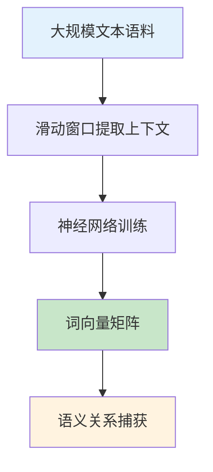
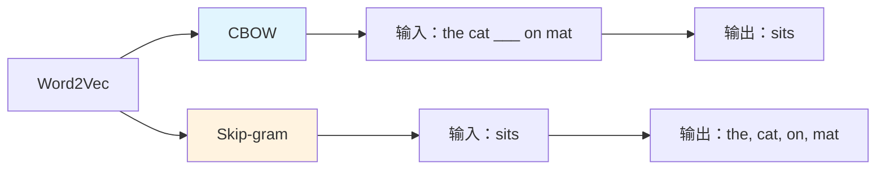
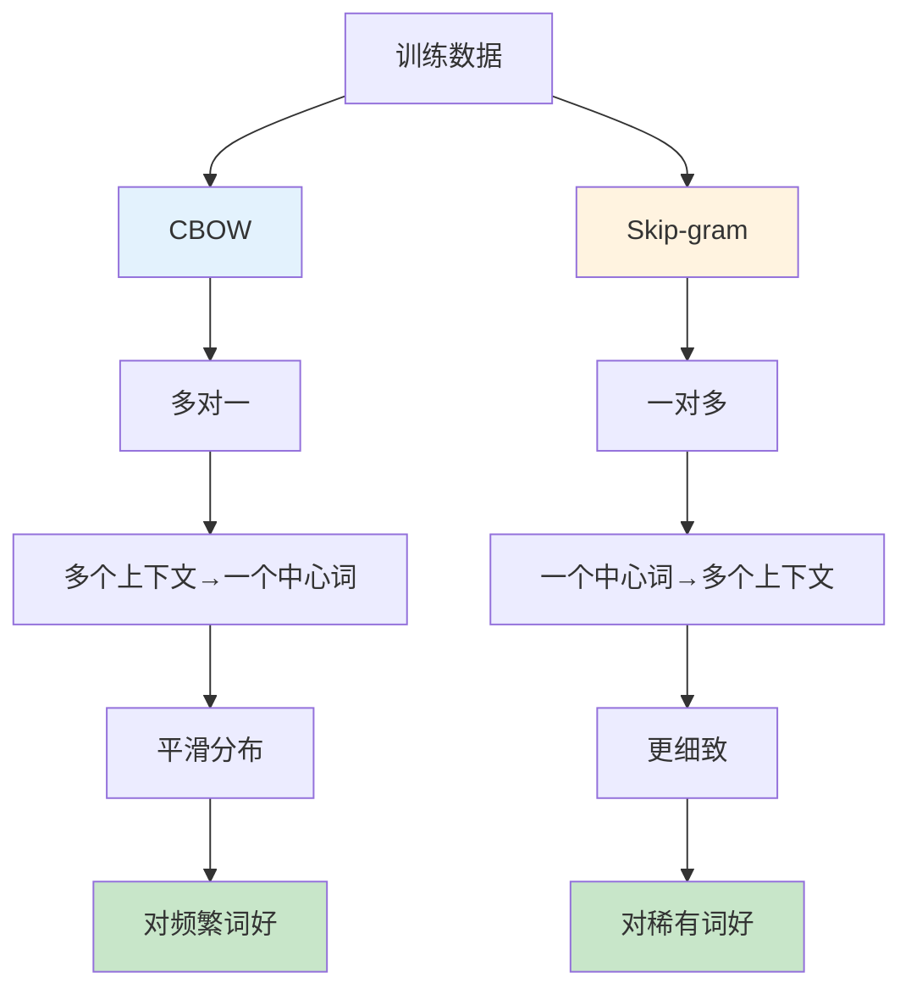

# Word2Vec

## 1. 概述

Word2Vec 是由 Google 的 Tomas Mikolov 等人于 2013 年提出的一种高效计算词向量的方法。它通过浅层神经网络将词语映射到低维连续向量空间，使得语义相似的词在向量空间中距离相近。Word2Vec 的出现极大地推动了深度学习在 NLP 领域的应用，是词嵌入技术的里程碑。

Word2Vec 的核心创新在于其高效的训练算法，能够在大规模语料上快速训练出高质量的词向量，同时捕捉到丰富的语义和句法关系。

## 2. Word2Vec 的核心思想

### 2.1 分布式表示

Word2Vec 基于分布式假设：上下文相似的词具有相似的语义。通过分析词语的上下文分布来学习词的向量表示。



### 2.2 两种架构

Word2Vec 包含两种模型架构：

| 模型 | 输入 | 输出 | 特点 |
|------|------|------|------|
| CBOW | 上下文词 | 中心词 | 训练快，适合频繁词 |
| Skip-gram | 中心词 | 上下文词 | 质量好，适合稀有词 |



## 3. CBOW 模型详解

### 3.1 模型结构

```python
import torch
import torch.nn as nn
import torch.nn.functional as F

class CBOWModel(nn.Module):
    def __init__(self, vocab_size, embedding_dim):
        super(CBOWModel, self).__init__()
        # 输入层到隐藏层（词嵌入）
        self.input_embedding = nn.Embedding(vocab_size, embedding_dim)
        # 隐藏层到输出层
        self.output_linear = nn.Linear(embedding_dim, vocab_size)
    
    def forward(self, context_indices):
        """
        context_indices: [batch_size, context_window_size]
        """
        # 获取上下文词的嵌入 [batch, context_size, embedding_dim]
        context_embeddings = self.input_embedding(context_indices)
        
        # 平均池化得到上下文表示 [batch, embedding_dim]
        context_representation = torch.mean(context_embeddings, dim=1)
        
        # 输出层 [batch, vocab_size]
        output = self.output_linear(context_representation)
        
        # Softmax 得到概率分布
        return F.log_softmax(output, dim=1)

# 模型参数说明
# vocab_size: 词汇表大小（如 50000）
# embedding_dim: 词向量维度（如 300）
# context_window_size: 上下文窗口大小（如 5，前后各 2 个词）
```

### 3.2 训练过程

```python
class CBOWTrainer:
    def __init__(self, model, learning_rate=0.001):
        self.model = model
        self.optimizer = torch.optim.SGD(model.parameters(), lr=learning_rate)
        self.criterion = nn.NLLLoss()
    
    def train_step(self, context_batch, target_batch):
        """
        context_batch: [batch_size, context_window_size]
        target_batch: [batch_size]
        """
        # 前向传播
        predictions = self.model(context_batch)
        
        # 计算损失
        loss = self.criterion(predictions, target_batch)
        
        # 反向传播
        self.optimizer.zero_grad()
        loss.backward()
        self.optimizer.step()
        
        return loss.item()

# 训练示例
# 假设语料："The cat sits on the mat"
# 窗口大小=2，对于"sits"：
# 上下文：["The", "cat", "on", "the"]
# 目标："sits"
```

### 3.3 负采样优化

原始的 Word2Vec 使用完整的 softmax，计算复杂度高。负采样（Negative Sampling）通过只更新少量样本提高效率。

```python
class NegativeSamplingCBOW(nn.Module):
    def __init__(self, vocab_size, embedding_dim, num_negatives=5):
        super().__init__()
        self.input_embedding = nn.Embedding(vocab_size, embedding_dim)
        self.output_embedding = nn.Embedding(vocab_size, embedding_dim)
        self.num_negatives = num_negatives
    
    def forward(self, context_indices, target_index, negative_indices):
        """
        context_indices: [batch_size, context_size]
        target_index: [batch_size]
        negative_indices: [batch_size, num_negatives]
        """
        # 上下文平均表示
        context_emb = self.input_embedding(context_indices).mean(dim=1)
        
        # 正样本得分
        target_emb = self.output_embedding(target_index)
        positive_score = (context_emb * target_emb).sum(dim=1)
        
        # 负样本得分
        neg_emb = self.output_embedding(negative_indices)
        negative_scores = torch.bmm(neg_emb, context_emb.unsqueeze(2)).squeeze(2)
        
        # 损失：最大化正样本，最小化负样本
        loss = -F.logsigmoid(positive_score) - \
               F.logsigmoid(-negative_scores).sum(dim=1)
        
        return loss.mean()
```

## 4. Skip-gram 模型详解

### 4.1 模型结构

```python
class SkipGramModel(nn.Module):
    def __init__(self, vocab_size, embedding_dim):
        super(SkipGramModel, self).__init__()
        # 中心词嵌入
        self.center_embedding = nn.Embedding(vocab_size, embedding_dim)
        # 上下文嵌入
        self.context_embedding = nn.Embedding(vocab_size, embedding_dim)
    
    def forward(self, center_indices, context_indices):
        """
        center_indices: [batch_size]
        context_indices: [batch_size, context_size]
        """
        # 中心词嵌入 [batch, dim]
        center_emb = self.center_embedding(center_indices)
        
        # 上下文嵌入 [batch, context_size, dim]
        context_emb = self.context_embedding(context_indices)
        
        # 计算点积得分 [batch, context_size]
        scores = torch.bmm(context_emb, center_emb.unsqueeze(2)).squeeze(2)
        
        return F.log_softmax(scores, dim=1)
```

### 4.2 Skip-gram 与 CBOW 的对比



| 特性 | CBOW | Skip-gram |
|------|------|-----------|
| 训练速度 | 快（2-3 倍） | 慢 |
| 频繁词 | 效果好 | 一般 |
| 稀有词 | 一般 | 效果好 |
| 词向量质量 | 好 | 略好 |
| 内存占用 | 较低 | 较高 |

## 5. Word2Vec 的训练技巧

### 5.1 层次 Softmax

使用霍夫曼树减少计算复杂度从 O(V) 到 O(log V)。

```python
import numpy as np

class HierarchicalSoftmax:
    def __init__(self, vocab_size, embedding_dim):
        self.vocab_size = vocab_size
        self.embedding_dim = embedding_dim
        # 内部节点向量（霍夫曼树有 V-1 个内部节点）
        self.internal_vectors = np.random.randn(vocab_size - 1, embedding_dim) * 0.1
    
    def get_path_and_codes(self, word_index):
        """
        获取从根到叶子的路径和左右编码
        实际实现需要构建霍夫曼树
        """
        # 这里简化示意
        # path: 内部节点索引列表
        # codes: 0/1 序列（左/右）
        pass
    
    def compute_loss(self, center_vec, path, codes):
        """
        沿路径计算损失
        """
        loss = 0
        for node_idx, code in zip(path, codes):
            node_vec = self.internal_vectors[node_idx]
            score = np.dot(center_vec, node_vec)
            # code=1 时最大化 sigmoid(score)
            # code=0 时最大化 sigmoid(-score)
            prob = 1 / (1 + np.exp(-code * score))
            loss -= np.log(prob + 1e-10)
        return loss
```

### 5.2 子采样（Subsampling）

对高频词进行降采样，提高训练效率和稀有词质量。

```python
def subsample_word(word_count, total_words, threshold=1e-5):
    """
    Word2Vec 子采样公式
    P(keep) = (sqrt(count/total) - threshold) / (count/total)
    """
    freq = word_count / total_words
    if freq < threshold:
        return 1.0
    prob = (np.sqrt(freq / threshold) + 1) * (threshold / freq)
    return min(1.0, prob)

# 示例
# "the" 出现 100 万次，总词数 1 亿
# P(keep) ≈ 0.033，大部分被丢弃
# "apple" 出现 1000 次
# P(keep) ≈ 1.0，全部保留
```

### 5.3 滑动窗口衰减

距离中心词越远的上下文词权重越低。

```python
def get_context_with_decay(sentence, center_pos, window_size):
    """
    带权重衰减的上下文窗口
    """
    context = []
    weights = []
    
    for i in range(center_pos - window_size, center_pos + window_size + 1):
        if i == center_pos or i < 0 or i >= len(sentence):
            continue
        
        distance = abs(i - center_pos)
        weight = 1.0 / distance  # 距离越远权重越低
        
        context.append(sentence[i])
        weights.append(weight)
    
    return context, weights
```

## 6. 使用 Gensim 训练 Word2Vec

### 6.1 基础用法

```python
from gensim.models import Word2Vec
from gensim.utils import simple_preprocess

# 准备语料
sentences = [
    ["the", "cat", "sits", "on", "the", "mat"],
    ["the", "dog", "runs", "in", "the", "park"],
    ["cats", "and", "dogs", "are", "pets"],
    # ... 更多句子
]

# 训练模型
model = Word2Vec(
    sentences=sentences,
    vector_size=300,      # 词向量维度
    window=5,             # 上下文窗口大小
    min_count=1,          # 最小词频
    workers=4,            # 并行线程数
    sg=1,                 # 1=Skip-gram, 0=CBOW
    hs=0,                 # 1=层次 softmax, 0=负采样
    negative=5,           # 负采样数量
    epochs=10             # 训练轮数
)

# 保存模型
model.save("word2vec.model")

# 加载模型
# model = Word2Vec.load("word2vec.model")
```

### 6.2 词向量操作

```python
# 获取词向量
vector = model.wv["cat"]
print(f"向量维度：{vector.shape}")  # (300,)

# 计算相似度
similarity = model.wv.similarity("cat", "dog")
print(f"cat 和 dog 的相似度：{similarity:.3f}")

# 查找最相似的词
similar = model.wv.most_similar("cat", topn=5)
for word, score in similar:
    print(f"{word}: {score:.3f}")

# 词类比
result = model.wv.most_similar(positive=["king", "woman"], negative=["man"], topn=1)
print(f"king - man + woman = {result[0][0]}")

# 不相似词
dissimilar = model.wv.doesnt_match(["cat", "dog", "bird", "car"])
print(f"不同类的词：{dissimilar}")  # car
```

### 6.3 增量训练

```python
# 可以继续训练新语料
new_sentences = [["ai", "and", "ml", "are", "related"]]
model.train(new_sentences, total_examples=len(new_sentences), epochs=model.epochs)

# 或者添加新词
model.build_vocab(new_sentences, update=True)
model.train(new_sentences, total_examples=len(new_sentences), epochs=model.epochs)
```

## 7. Word2Vec 的词向量特性

### 7.1 语义关系

```python
# 加载预训练模型
# from gensim.models import KeyedVectors
# model = KeyedVectors.load_word2vec_format('GoogleNews-vectors-negative300.bin', binary=True)

# 国家 - 首都关系
# model.most_similar(positive=['Paris', 'Germany'], negative=['France'])
# 输出：Berlin

# 动词时态
# model.most_similar(positive=['running'], negative=['run'])
# 输出：walking, jumping, ...

# 形容词比较级
# model.most_similar(positive=['better'], negative=['good'])
# 输出：worse, larger, ...
```

### 7.2 聚类可视化

```python
from sklearn.manifold import TSNE
import matplotlib.pyplot as plt

def plot_word_clusters(model, words):
    """可视化词向量聚类"""
    vectors = np.array([model.wv[word] for word in words])
    
    # t-SNE 降维
    tsne = TSNE(n_components=2, random_state=42, perplexity=10)
    reduced = tsne.fit_transform(vectors)
    
    plt.figure(figsize=(12, 10))
    plt.scatter(reduced[:, 0], reduced[:, 1], alpha=0.6)
    
    for i, word in enumerate(words):
        plt.annotate(word, (reduced[i, 0], reduced[i, 1]), fontsize=9)
    
    plt.title("Word2Vec Word Clusters")
    plt.grid(alpha=0.3)
    plt.show()

# 示例
# words = ['cat', 'dog', 'pet', 'animal', 'king', 'queen', 'man', 'woman', 
#          'paris', 'london', 'berlin', 'france', 'uk', 'germany']
# plot_word_clusters(model, words)
```

## 8. Word2Vec 的应用

### 8.1 作为特征用于分类

```python
from sklearn.linear_model import LogisticRegression
from sklearn.pipeline import Pipeline
import numpy as np

def document_vector(doc, model):
    """将文档表示为词向量的平均"""
    doc_vectors = [model.wv[word] for word in doc if word in model.wv]
    if len(doc_vectors) == 0:
        return np.zeros(model.vector_size)
    return np.mean(doc_vectors, axis=0)

# 准备数据
documents = [["cat", "pet", "cute"], ["dog", "pet", "loyal"], ["car", "fast", "vehicle"]]
labels = [0, 0, 1]  # 0=动物，1=车辆

X = np.array([document_vector(doc, model) for doc in documents])
y = np.array(labels)

# 训练分类器
clf = LogisticRegression()
clf.fit(X, y)
```

### 8.2 文本相似度

```python
def document_similarity(doc1, doc2, model):
    """计算两个文档的相似度"""
    vec1 = document_vector(doc1, model)
    vec2 = document_vector(doc2, model)
    
    from sklearn.metrics.pairwise import cosine_similarity
    sim = cosine_similarity([vec1], [vec2])[0][0]
    return sim

# 示例
# doc1 = ["cat", "pet", "animal"]
# doc2 = ["dog", "pet", "animal"]
# doc3 = ["car", "vehicle", "fast"]
# 
# print(f"doc1-doc2: {document_similarity(doc1, doc2, model):.3f}")
# print(f"doc1-doc3: {document_similarity(doc1, doc3, model):.3f}")
```

## 9. 局限性与改进

### 9.1 一词多义问题

Word2Vec 为每个词生成单一向量，无法处理多义词。

```
"bank" 只有一个向量，无法区分：
- 河岸 (river bank)
- 银行 (bank account)
- 依赖 (bank on)
```

**解决方案**：使用上下文相关的词嵌入（ELMo、BERT）

### 9.2 短语处理

```python
# 使用 bigram 检测处理短语
from gensim.models import Phrases, Word2Vec

sentences = [["new", "york", "is", "a", "city"]]

# 检测 bigram
bigram = Phrases(sentences, min_count=1, threshold=1)
bigram_sentences = bigram[sentences]
# 输出：[["new_york", "is", "a", "city"]]

# 用 bigram 句子训练
model = Word2Vec(bigram_sentences, vector_size=100)
```

## 10. 总结

Word2Vec 是词嵌入技术的经典方法，通过 CBOW 和 Skip-gram 两种架构，高效地学习词语的分布式表示。其核心贡献在于：

1. **高效训练**：负采样和层次 softmax 使大规模训练成为可能
2. **语义捕捉**：词向量能够编码丰富的语义和句法关系
3. **广泛应用**：成为后续 NLP 模型的基础组件

虽然现代预训练语言模型（如 BERT）在某些任务上超越了 Word2Vec，但其核心思想——分布式表示——仍然是 NLP 的基石。理解 Word2Vec 的原理和实现，是深入学习现代 NLP 技术的重要基础。
