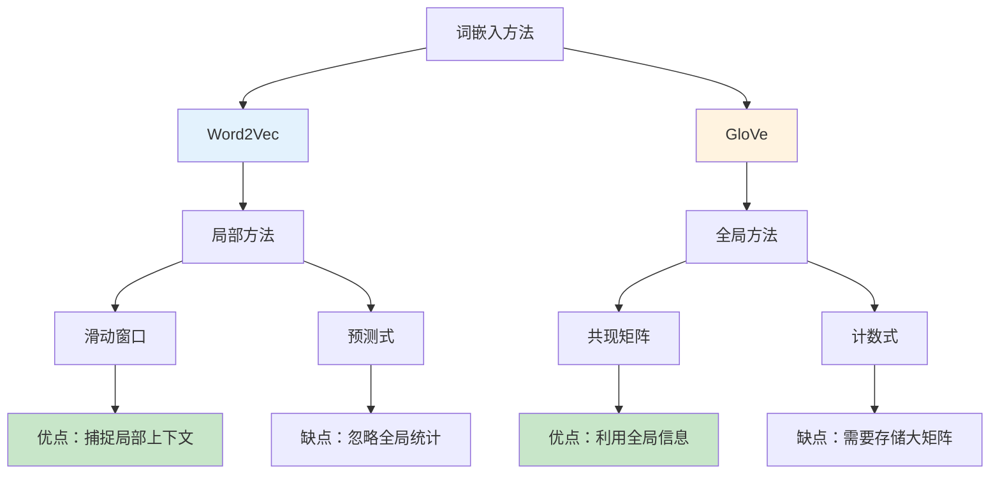

# GloVe（Global Vectors for Word Representation）

## 1. 概述

GloVe（Global Vectors for Word Representation）是由斯坦福大学 Jeffrey Pennington 等人于 2014 年提出的词嵌入方法。与 Word2Vec 的局部滑动窗口方法不同，GloVe 基于全局词 - 词共现矩阵，结合了矩阵分解和局部上下文窗口方法的优点。

GloVe 的核心思想是：词与词之间的共现统计信息包含了丰富的语义关系，通过对共现矩阵进行加权最小二乘回归，可以学习到高质量的词向量。

## 2. GloVe 的核心思想

### 2.1 从共现矩阵到词向量

```mermaid
graph TB
    A[大规模文本语料] --> B[构建共现矩阵 X]
    B --> C[X_ij = 词 i 和词 j 共现次数]
    C --> D[目标：学习词向量 w_i, w̃_j]
    D --> E[使得 w_i^T * w̃_j ≈ log(X_ij)]
    E --> F[得到词向量]
    
    style A fill:#e3f2fd
    style B fill:#fff3e0
    style F fill:#c8e6c9
```

### 2.2 共现矩阵示例

```python
import numpy as np
import pandas as pd

# 简化的共现矩阵示例
# 语料：
# "the cat sits on the mat"
# "the dog runs on the grass"
# "cats and dogs are pets"

vocab = ["the", "cat", "dog", "sits", "runs", "on", "mat", "grass", "and", "are", "pets"]
vocab_to_idx = {word: i for i, word in enumerate(vocab)}

# 共现矩阵（窗口大小=2）
cooccurrence = np.array([
    # the  cat  dog  sits runs on   mat  grass and  are  pets
    [0,   2,   2,   1,   1,   2,   1,   1,   0,   0,   0],   # the
    [2,   0,   1,   1,   0,   1,   1,   0,   1,   1,   1],   # cat
    [2,   1,   0,   0,   1,   1,   0,   1,   1,   1,   1],   # dog
    [1,   1,   0,   0,   0,   1,   1,   0,   0,   0,   0],   # sits
    [1,   0,   1,   0,   0,   1,   0,   1,   0,   0,   0],   # runs
    [2,   1,   1,   1,   1,   0,   1,   1,   0,   0,   0],   # on
    [1,   1,   0,   1,   0,   1,   0,   0,   0,   0,   0],   # mat
    [1,   0,   1,   0,   1,   1,   0,   0,   0,   0,   0],   # grass
    [0,   1,   1,   0,   0,   0,   0,   0,   0,   1,   1],   # and
    [0,   1,   1,   0,   0,   0,   0,   0,   1,   0,   1],   # are
    [0,   1,   1,   0,   0,   0,   0,   0,   1,   1,   0],   # pets
])

# 创建 DataFrame 便于查看
df = pd.DataFrame(cooccurrence, index=vocab, columns=vocab)
print(df)
```

### 2.3 关键洞察

GloVe 的关键洞察来自以下观察：

```python
# 考虑三个词：ice, steam, water
# 某些词与 ice 相关（solid, temperature），某些与 steam 相关（gas, boiling）
# water 与两者都相关

# 定义：P(k|w) = X_wk / X_w （词 k 在词 w 上下文中的条件概率）
# 关键比率：P(k|ice) / P(k|steam)

# 对于 k = "solid": 比率 >> 1（solid 与 ice 更相关）
# 对于 k = "gas": 比率 << 1（gas 与 steam 更相关）
# 对于 k = "water": 比率 ≈ 1（water 与两者都相关）
# 对于 k = "fashion": 比率 ≈ 1（fashion 与两者都不相关）

# GloVe 的目标：学习词向量使得向量差能编码这种比率信息
```

## 3. GloVe 模型详解

### 3.1 目标函数

GloVe 的目标函数为：

$$J = \sum_{i,j=1}^{V} f(X_{ij}) \left( w_i^T \tilde{w}_j + b_i + \tilde{b}_j - \log(X_{ij}) \right)^2$$

其中：
- $w_i$：词 i 的主向量
- $\tilde{w}_j$：词 j 的上下文向量
- $b_i, \tilde{b}_j$：偏置项
- $f(X_{ij})$：权重函数

```mermaid
graph LR
    A[词向量 w_i] --> B[点积 w_i^T * w̃_j]
    C[上下文向量 w̃_j] --> B
    D[偏置 b_i + b̃_j] --> E[预测值]
    B --> E
    E --> F{与 log(X_ij) 比较}
    F --> G[加权平方误差]
    
    style A fill:#e3f2fd
    style C fill:#fff3e0
    style G fill:#c8e6c9
```

### 3.2 权重函数

权重函数 $f(X_{ij})$ 的设计至关重要：

$$f(x) = \begin{cases} (x/x_{max})^\alpha & \text{if } x < x_{max} \\ 1 & \text{otherwise} \end{cases}$$

```python
def weighting_function(x, x_max=100, alpha=0.75):
    """
    GloVe 权重函数
    
    作用：
    1. 避免罕见共现（x 很小）主导损失
    2. 防止频繁共现（x 很大）权重过大
    3. 平滑过渡
    """
    if x < x_max:
        return (x / x_max) ** alpha
    return 1.0

# 可视化权重函数
import matplotlib.pyplot as plt

x_values = np.linspace(0, 200, 100)
y_values = [weighting_function(x) for x in x_values]

plt.figure(figsize=(8, 5))
plt.plot(x_values, y_values)
plt.axvline(x=100, color='r', linestyle='--', label='x_max')
plt.xlabel('Co-occurrence Count X_ij')
plt.ylabel('Weight f(X_ij)')
plt.title('GloVe Weighting Function')
plt.legend()
plt.grid(alpha=0.3)
plt.show()
```

### 3.3 完整实现

```python
import numpy as np
from collections import defaultdict
import re

class GloVe:
    def __init__(self, vocab_size=10000, embedding_dim=100, 
                 x_max=100, alpha=0.75, learning_rate=0.05):
        self.vocab_size = vocab_size
        self.embedding_dim = embedding_dim
        self.x_max = x_max
        self.alpha = alpha
        self.learning_rate = learning_rate
        
        # 初始化词向量和偏置
        self.W = np.random.randn(vocab_size, embedding_dim) * 0.1
        self.W_tilde = np.random.randn(vocab_size, embedding_dim) * 0.1
        self.b = np.zeros(vocab_size)
        self.b_tilde = np.zeros(vocab_size)
        
        # AdaGrad 累积平方梯度
        self.gradsq_W = np.ones((vocab_size, embedding_dim))
        self.gradsq_W_tilde = np.ones((vocab_size, embedding_dim))
        self.gradsq_b = np.ones(vocab_size)
        self.gradsq_b_tilde = np.ones(vocab_size)
    
    def build_cooccurrence_matrix(self, corpus, window_size=10):
        """构建共现矩阵"""
        cooccurrence = defaultdict(float)
        vocab = set()
        
        for document in corpus:
            tokens = re.findall(r'\w+', document.lower())
            vocab.update(tokens)
            
            for i, token in enumerate(tokens):
                start = max(0, i - window_size)
                end = min(len(tokens), i + window_size + 1)
                
                for j in range(start, end):
                    if i != j:
                        context = tokens[j]
                        # 距离越远权重越低
                        distance = abs(i - j)
                        weight = 1.0 / distance
                        cooccurrence[(token, context)] += weight
        
        # 构建词汇表映射
        self.vocab_to_idx = {word: idx for idx, word in enumerate(sorted(vocab))}
        self.idx_to_vocab = {idx: word for word, idx in self.vocab_to_idx.items()}
        
        # 构建稀疏共现矩阵
        self.cooccurrence = {}
        for (word1, word2), count in cooccurrence.items():
            if word1 in self.vocab_to_idx and word2 in self.vocab_to_idx:
                idx1 = self.vocab_to_idx[word1]
                idx2 = self.vocab_to_idx[word2]
                self.cooccurrence[(idx1, idx2)] = count
        
        return len(self.cooccurrence)
    
    def weight_func(self, x):
        """权重函数"""
        if x < self.x_max:
            return (x / self.x_max) ** self.alpha
        return 1.0
    
    def train(self, corpus, epochs=50, verbose=True):
        """训练 GloVe 模型"""
        # 构建共现矩阵
        num_pairs = self.build_cooccurrence_matrix(corpus)
        if verbose:
            print(f"共现矩阵：{len(self.vocab_to_idx)} 词，{num_pairs} 对")
        
        vocab_size = len(self.vocab_to_idx)
        
        for epoch in range(epochs):
            total_loss = 0.0
            np.random.shuffle(list(self.cooccurrence.keys()))
            
            for idx1, idx2 in self.cooccurrence.keys():
                X_ij = self.cooccurrence[(idx1, idx2)]
                f_x = self.weight_func(X_ij)
                
                # 前向计算
                diff = np.dot(self.W[idx1], self.W_tilde[idx2]) + \
                       self.b[idx1] + self.b_tilde[idx2] - np.log(X_ij)
                
                # 加权损失
                loss = f_x * diff * diff
                total_loss += loss
                
                # 梯度
                grad_common = f_x * diff
                
                grad_W = grad_common * self.W_tilde[idx2]
                grad_W_tilde = grad_common * self.W[idx1]
                grad_b = grad_common
                grad_b_tilde = grad_common
                
                # AdaGrad 更新
                self.gradsq_W[idx1] += grad_W ** 2
                self.gradsq_W_tilde[idx2] += grad_W_tilde ** 2
                self.gradsq_b[idx1] += grad_b ** 2
                self.gradsq_b_tilde[idx2] += grad_b_tilde ** 2
                
                self.W[idx1] -= self.learning_rate * grad_W / np.sqrt(self.gradsq_W[idx1])
                self.W_tilde[idx2] -= self.learning_rate * grad_W_tilde / np.sqrt(self.gradsq_W_tilde[idx2])
                self.b[idx1] -= self.learning_rate * grad_b / np.sqrt(self.gradsq_b[idx1])
                self.b_tilde[idx2] -= self.learning_rate * grad_b_tilde / np.sqrt(self.gradsq_b_tilde[idx2])
            
            if verbose and (epoch + 1) % 10 == 0:
                print(f"Epoch {epoch + 1}/{epochs}, Loss: {total_loss:.4f}")
        
        # 最终词向量 = W + W_tilde
        self.word_vectors = self.W + self.W_tilde
    
    def get_vector(self, word):
        """获取词向量"""
        if word in self.vocab_to_idx:
            return self.word_vectors[self.vocab_to_idx[word]]
        return None
    
    def similarity(self, word1, word2):
        """计算词相似度"""
        v1 = self.get_vector(word1)
        v2 = self.get_vector(word2)
        if v1 is None or v2 is None:
            return 0.0
        return np.dot(v1, v2) / (np.linalg.norm(v1) * np.linalg.norm(v2))
    
    def most_similar(self, word, topn=5):
        """查找最相似的词"""
        target = self.get_vector(word)
        if target is None:
            return []
        
        scores = {}
        for w in self.vocab_to_idx:
            if w != word:
                v = self.word_vectors[self.vocab_to_idx[w]]
                score = np.dot(target, v) / (np.linalg.norm(target) * np.linalg.norm(v))
                scores[w] = score
        
        sorted_words = sorted(scores.items(), key=lambda x: x[1], reverse=True)
        return sorted_words[:topn]
```

## 4. 使用预训练 GloVe 向量

### 4.1 下载和加载

```python
def load_glove_embeddings(file_path):
    """加载 GloVe 预训练词向量"""
    embeddings = {}
    
    with open(file_path, 'r', encoding='utf-8') as f:
        for line in f:
            values = line.split()
            word = values[0]
            vector = np.array(values[1:], dtype='float32')
            embeddings[word] = vector
    
    return embeddings

# 下载预训练向量
# http://nlp.stanford.edu/data/glove.6B.zip
# 包含：50d, 100d, 200d, 300d 四种维度
# 训练语料：Wikipedia + Gigaword (60 亿词)

# 加载
# glove_embeddings = load_glove_embeddings('glove.6B.300d.txt')
# print(f"词汇量：{len(glove_embeddings)}")  # 约 40 万
```

### 4.2 在 PyTorch 中使用

```python
import torch
import torch.nn as nn

def create_embedding_layer(glove_embeddings, vocab, embedding_dim, freeze=True):
    """创建 PyTorch Embedding 层并加载 GloVe 向量"""
    vocab_size = len(vocab)
    embedding_matrix = np.zeros((vocab_size, embedding_dim))
    
    oov_count = 0
    for word, idx in vocab.items():
        if word in glove_embeddings:
            embedding_matrix[idx] = glove_embeddings[word]
        else:
            # OOV 词使用随机初始化
            embedding_matrix[idx] = np.random.randn(embedding_dim) * 0.1
            oov_count += 1
    
    print(f"OOV 词数：{oov_count} / {vocab_size} ({oov_count/vocab_size*100:.1f}%)")
    
    embedding_layer = nn.Embedding(vocab_size, embedding_dim)
    embedding_layer.weight = nn.Parameter(torch.FloatTensor(embedding_matrix))
    
    if freeze:
        embedding_layer.weight.requires_grad = False
    
    return embedding_layer

# 使用示例
# vocab = {"the": 0, "cat": 1, "dog": 2, ...}
# embedding_layer = create_embedding_layer(glove_embeddings, vocab, 300, freeze=False)
```

## 5. GloVe vs Word2Vec



| 特性 | Word2Vec | GloVe |
|------|----------|-------|
| 方法类型 | 预测式（Predictive） | 计数式（Count-based） |
| 训练方式 | 局部滑动窗口 | 全局共现矩阵 |
| 训练速度 | 较快 | 较慢（需构建共现矩阵） |
| 内存占用 | 较低 | 较高（共现矩阵） |
| 词向量质量 | 好 | 略好（某些任务） |
| 并行化 | 容易 | 较难 |

## 6. GloVe 的应用

### 6.1 词相似度任务

```python
# 使用预训练 GloVe
# glove = load_glove_embeddings('glove.6B.300d.txt')

def cosine_similarity(v1, v2):
    return np.dot(v1, v2) / (np.linalg.norm(v1) * np.linalg.norm(v2))

# 评估 WordSim-353 等数据集
def evaluate_word_similarity(glove, test_data):
    """
    test_data: [(word1, word2, human_score), ...]
    """
    predictions = []
    gold = []
    
    for word1, word2, human_score in test_data:
        if word1 in glove and word2 in glove:
            pred = cosine_similarity(glove[word1], glove[word2])
            predictions.append(pred)
            gold.append(human_score)
    
    from scipy.stats import spearmanr
    correlation, _ = spearmanr(predictions, gold)
    return correlation

# GloVe 在 WordSim-353 上达到约 0.75 的 Spearman 相关系数
```

### 6.2 词类比任务

```python
def word_analogy(glove, word1, word2, word3, topn=1):
    """
    计算类比：word1 相对于 word2 如同 word3 相对于？
    例如：king - man + woman = ?
    """
    if any(w not in glove for w in [word1, word2, word3]):
        return None
    
    # 向量运算
    target = glove[word1] - glove[word2] + glove[word3]
    
    # 查找最接近的词
    best_word = None
    best_score = -1
    
    for word, vector in glove.items():
        if word in [word1, word2, word3]:
            continue
        score = cosine_similarity(target, vector)
        if score > best_score:
            best_score = score
            best_word = word
    
    return best_word, best_score

# 示例
# result, score = word_analogy(glove, 'king', 'man', 'woman')
# print(f"king - man + woman = {result} (score: {score:.3f})")
# 输出：queen
```

### 6.3 文本分类

```python
from sklearn.linear_model import LogisticRegression
from sklearn.metrics import classification_report

def text_to_vector(text, glove, dim=300):
    """将文本转换为 GloVe 向量的平均"""
    words = text.lower().split()
    vectors = [glove[w] for w in words if w in glove]
    
    if len(vectors) == 0:
        return np.zeros(dim)
    return np.mean(vectors, axis=0)

# 示例：情感分类
# train_texts = ["great movie", "terrible film", ...]
# train_labels = [1, 0, ...]
# 
# X_train = np.array([text_to_vector(t, glove) for t in train_texts])
# X_test = np.array([text_to_vector(t, glove) for t in test_texts])
# 
# clf = LogisticRegression()
# clf.fit(X_train, train_labels)
# predictions = clf.predict(X_test)
```

## 7. GloVe 的变体和改进

### 7.1 Common Crawl GloVe

斯坦福还提供了在 Common Crawl 上训练的更大规模 GloVe：

| 模型 | 语料 | 词汇量 | 维度 |
|------|------|--------|------|
| glove.6B | Wikipedia+Gigaword | 400K | 50/100/200/300 |
| glove.42B.300d | Common Crawl | 1.9M | 300 |
| glove.840B.300d | Common Crawl | 2.2M | 300 |

### 7.2 领域特定 GloVe

```python
# 可以在特定领域语料上训练 GloVe
# 如生物医学、法律、金融等

# 示例：生物医学 GloVe
# 语料：PubMed 摘要
# 词汇：医学术语
# 应用：医学文献检索、疾病预测
```

## 8. 总结

GloVe 通过结合全局矩阵分解和局部上下文窗口的优点，提供了一种高效学习词向量的方法。其核心贡献在于：

1. **理论基础**：从词共现统计比率的角度推导目标函数
2. **高效训练**：使用加权最小二乘和 AdaGrad 优化
3. **高质量向量**：在多种评估任务上达到 state-of-the-art

虽然上下文相关的预训练模型（如 BERT）在某些任务上超越了静态词嵌入，但 GloVe 由于其简单性和高效性，仍然是许多 NLP 应用的首选词嵌入方法。
