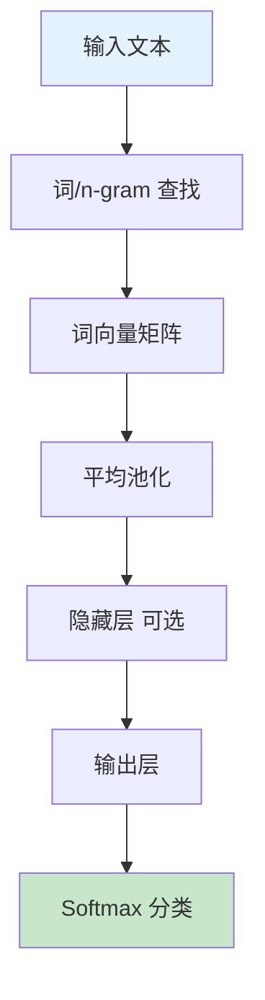
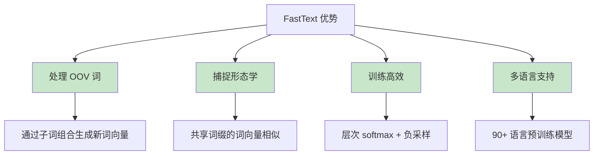

# FastText

## 1. 概述

FastText 是由 Facebook AI Research（FAIR）于 2016 年提出的词嵌入和文本分类方法。与 Word2Vec 和 GloVe 将每个词视为原子单元不同，FastText 考虑了词的内部结构，将词表示为字符 n-gram 的向量之和。这种设计使 FastText 能够：

1. **处理未登录词（OOV）**：通过组合子词向量生成新词的表示
2. **捕捉形态学信息**：共享词缀的词具有相似的表示
3. **高效训练和推理**：使用层次 softmax 和负采样优化

FastText 包含两个主要组件：
- **FastText 词向量**：考虑子词信息的词嵌入
- **FastText 文本分类**：高效的文本分类模型

## 2. FastText 的核心思想

### 2.1 子词（Subword）表示

```mermaid
graph TB
    A[单词 "where"] --> B[字符 n-gram 分解]
    B --> C["<wh", "whe", "her", "ere", "re>"]
    B --> D["<w", "wh", "whe", "her", "ere", "re", "e>"]
    C --> E[查找每个 n-gram 向量]
    D --> E
    E --> F[向量求和]
    F --> G[词向量表示]
    
    style A fill:#e3f2fd
    style G fill:#c8e6c9
```

```python
def get_subwords(word, min_n=3, max_n=6):
    """
    生成词的字符 n-gram
    
    使用特殊标记 < 和 > 表示词的开始和结束
    """
    # 添加边界标记
    word = f"<{word}>"
    ngrams = []
    
    for n in range(min_n, max_n + 1):
        for i in range(len(word) - n + 1):
            ngram = word[i:i+n]
            ngrams.append(ngram)
    
    # 始终包含完整词
    ngrams.append(word)
    
    return ngrams

# 示例
word = "where"
subwords = get_subwords(word, min_n=3, max_n=6)
print(f"'{word}' 的子词:")
for sw in subwords:
    print(f"  {sw}")

# 输出：
# <wh, whe, wher, where
# whe, wher, where, where>
# her, here, here>
# ere, ere>
# re>
# <where>（完整词）
```

### 2.2 词向量计算

FastText 的词向量是其所有子词向量的和：

```python
import numpy as np

class FastTextWordEmbedding:
    def __init__(self, vocab_size, embedding_dim, ngram_vocab_size):
        self.vocab_size = vocab_size
        self.embedding_dim = embedding_dim
        self.ngram_vocab_size = ngram_vocab_size
        
        # 词向量（用于已知词）
        self.word_embeddings = np.random.randn(vocab_size, embedding_dim) * 0.1
        
        # n-gram 向量表
        self.ngram_embeddings = np.random.randn(ngram_vocab_size, embedding_dim) * 0.1
        
        # n-gram 哈希函数（实际使用 hash trick）
        self.ngram_to_idx = {}
    
    def get_ngram_idx(self, ngram):
        """将 n-gram 哈希到索引"""
        if ngram not in self.ngram_to_idx:
            # 使用哈希避免存储所有 n-gram
            self.ngram_to_idx[ngram] = hash(ngram) % self.ngram_vocab_size
        return self.ngram_to_idx[ngram]
    
    def get_word_vector(self, word, word_idx):
        """
        获取词的向量表示
        = 词向量 + 所有子词向量之和
        """
        # 基础词向量
        word_vec = self.word_embeddings[word_idx].copy()
        
        # 获取子词
        subwords = get_subwords(word)
        
        # 累加子词向量
        for sw in subwords:
            ngram_idx = self.get_ngram_idx(sw)
            word_vec += self.ngram_embeddings[ngram_idx]
        
        # 平均
        word_vec /= (1 + len(subwords))
        
        return word_vec
    
    def get_oov_vector(self, word):
        """
        获取未登录词（OOV）的向量
        仅使用子词向量
        """
        subwords = get_subwords(word)
        
        if len(subwords) == 0:
            return np.zeros(self.embedding_dim)
        
        # 子词向量平均
        word_vec = np.zeros(self.embedding_dim)
        for sw in subwords:
            ngram_idx = self.get_ngram_idx(sw)
            word_vec += self.ngram_embeddings[ngram_idx]
        
        word_vec /= len(subwords)
        return word_vec

# FastText 的优势：
# 1. "unbelievable" 和 "unbelievably" 共享子词 "un", "believ", "able"
# 2. 即使 "unbelievable" 不在词汇表中，也能通过子词生成合理向量
```

## 3. FastText 词向量训练

### 3.1 Skip-gram with Subwords

```python
import torch
import torch.nn as nn
import torch.nn.functional as F

class FastTextSkipGram(nn.Module):
    def __init__(self, vocab_size, embedding_dim, ngram_vocab_size, num_negatives=5):
        super().__init__()
        self.vocab_size = vocab_size
        self.embedding_dim = embedding_dim
        self.ngram_vocab_size = ngram_vocab_size
        self.num_negatives = num_negatives
        
        # 词嵌入
        self.word_embeddings = nn.Embedding(vocab_size, embedding_dim)
        
        # n-gram 嵌入
        self.ngram_embeddings = nn.Embedding(ngram_vocab_size, embedding_dim)
        
        # 输出嵌入（用于负采样）
        self.output_embeddings = nn.Embedding(vocab_size, embedding_dim)
    
    def get_word_representation(self, word_idx, ngram_indices):
        """
        获取词的表示 = 词向量 + n-gram 向量之和
        
        word_idx: 词的索引
        ngram_indices: 该词所有 n-gram 的索引列表
        """
        # 词向量
        word_vec = self.word_embeddings(word_idx)
        
        # n-gram 向量
        if len(ngram_indices) > 0:
            ngram_tensor = torch.tensor(ngram_indices, dtype=torch.long)
            ngram_vecs = self.ngram_embeddings(ngram_tensor)
            ngram_sum = ngram_vecs.sum(dim=0)
            word_vec = word_vec + ngram_sum
        
        return word_vec
    
    def forward(self, center_word_idx, center_ngrams, context_word_idx, negative_indices):
        """
        center_word_idx: 中心词索引
        center_ngrams: 中心词的 n-gram 索引列表
        context_word_idx: 上下文词索引
        negative_indices: 负样本索引 [num_negatives]
        """
        # 获取中心词表示（包含子词信息）
        center_vec = self.get_word_representation(center_word_idx, center_ngrams)
        
        # 正样本得分
        context_vec = self.output_embeddings(context_word_idx)
        positive_score = torch.dot(center_vec, context_vec)
        
        # 负样本得分
        neg_vecs = self.output_embeddings(negative_indices)
        negative_scores = torch.mv(neg_vecs, center_vec)
        
        # 损失：最大化正样本，最小化负样本
        loss = -F.logsigmoid(positive_score) - F.logsigmoid(-negative_scores).sum()
        
        return loss

# 训练循环
def train_fasttext(model, data_loader, epochs=5, lr=0.025):
    optimizer = torch.optim.SGD(model.parameters(), lr=lr)
    
    for epoch in range(epochs):
        total_loss = 0
        for batch in data_loader:
            center_word, center_ngrams, context_word, negatives = batch
            
            optimizer.zero_grad()
            loss = model(center_word, center_ngrams, context_word, negatives)
            loss.backward()
            optimizer.step()
            
            total_loss += loss.item()
        
        print(f"Epoch {epoch+1}/{epochs}, Loss: {total_loss/len(data_loader):.4f}")
```

### 3.2 层次 Softmax

FastText 使用层次 softmax 加速训练：

```python
class HierarchicalSoftmaxFastText(nn.Module):
    def __init__(self, vocab_size, embedding_dim, ngram_vocab_size):
        super().__init__()
        self.word_embeddings = nn.Embedding(vocab_size, embedding_dim)
        self.ngram_embeddings = nn.Embedding(ngram_vocab_size, embedding_dim)
        
        # 霍夫曼树内部节点向量
        # 对于 V 个词，有 V-1 个内部节点
        self.internal_vectors = nn.Embedding(vocab_size - 1, embedding_dim)
        
        # 需要预构建霍夫曼树，存储每个词的路径和编码
        self.word_paths = {}  # word_idx -> [internal_node_indices]
        self.word_codes = {}  # word_idx -> [0/1 codes]
    
    def get_word_representation(self, word_idx, ngram_indices):
        word_vec = self.word_embeddings(word_idx)
        if len(ngram_indices) > 0:
            ngram_tensor = torch.tensor(ngram_indices, dtype=torch.long)
            ngram_vecs = self.ngram_embeddings(ngram_tensor)
            word_vec = word_vec + ngram_vecs.sum(dim=0)
        return word_vec
    
    def forward(self, center_word_idx, center_ngrams):
        center_vec = self.get_word_representation(center_word_idx, center_ngrams)
        
        # 沿霍夫曼树路径计算损失
        path = self.word_paths[center_word_idx.item()]
        codes = self.word_codes[center_word_idx.item()]
        
        loss = 0
        for node_idx, code in zip(path, codes):
            node_vec = self.internal_vectors.weight[node_idx]
            score = torch.dot(center_vec, node_vec)
            
            # code=1: 最大化 sigmoid(score)
            # code=0: 最大化 sigmoid(-score)
            prob = torch.sigmoid((2 * code - 1) * score)
            loss -= torch.log(prob + 1e-10)
        
        return loss
```

## 4. FastText 文本分类

### 4.1 模型架构

FastText 的文本分类模型非常简单高效：



```python
class FastTextClassifier(nn.Module):
    def __init__(self, vocab_size, embedding_dim, num_labels, ngram_vocab_size=None):
        super().__init__()
        self.vocab_size = vocab_size
        self.embedding_dim = embedding_dim
        self.num_labels = num_labels
        
        # 词嵌入
        self.embeddings = nn.Embedding(vocab_size, embedding_dim)
        
        # 可选：n-gram 嵌入（用于词袋 + n-gram 特征）
        if ngram_vocab_size:
            self.ngram_embeddings = nn.Embedding(ngram_vocab_size, embedding_dim)
            self.use_ngrams = True
        else:
            self.use_ngrams = False
        
        # 输出层
        self.fc = nn.Linear(embedding_dim, num_labels)
    
    def forward(self, text_indices, ngram_indices=None):
        """
        text_indices: [batch_size, seq_len] 词索引
        ngram_indices: [batch_size, num_ngrams] n-gram 索引（可选）
        """
        # 词嵌入 [batch, seq, dim]
        embedded = self.embeddings(text_indices)
        
        # 平均池化 [batch, dim]
        # 注意处理 padding
        mask = (text_indices != 0).unsqueeze(-1).float()
        summed = (embedded * mask).sum(dim=1)
        counts = mask.sum(dim=1).clamp(min=1)
        averaged = summed / counts
        
        # 添加 n-gram 特征
        if self.use_ngrams and ngram_indices is not None:
            ngram_embeds = self.ngram_embeddings(ngram_indices)
            ngram_avg = ngram_embeds.mean(dim=1)
            averaged = averaged + ngram_avg
        
        # 分类
        output = self.fc(averaged)
        return output
    
    def predict(self, text_indices, ngram_indices=None):
        logits = self.forward(text_indices, ngram_indices)
        probs = F.softmax(logits, dim=-1)
        predictions = probs.argmax(dim=-1)
        return predictions, probs
```

### 4.2 训练文本分类器

```python
from torch.utils.data import Dataset, DataLoader

class FastTextDataset(Dataset):
    def __init__(self, texts, labels, vocab, label_to_idx):
        self.texts = texts
        self.labels = labels
        self.vocab = vocab
        self.label_to_idx = label_to_idx
    
    def __len__(self):
        return len(self.texts)
    
    def __getitem__(self, idx):
        text = self.texts[idx]
        label = self.label_to_idx[self.labels[idx]]
        
        # 转换为索引
        indices = [self.vocab.get(word, self.vocab['<UNK>']) for word in text.split()]
        
        return torch.tensor(indices, dtype=torch.long), torch.tensor(label, dtype=torch.long)

# 训练
def train_classifier(model, train_loader, val_loader, epochs=10, lr=0.1):
    criterion = nn.CrossEntropyLoss()
    optimizer = torch.optim.SGD(model.parameters(), lr=lr)
    
    best_val_acc = 0
    
    for epoch in range(epochs):
        # 训练
        model.train()
        train_loss = 0
        
        for text_indices, labels in train_loader:
            optimizer.zero_grad()
            output = model(text_indices)
            loss = criterion(output, labels)
            loss.backward()
            optimizer.step()
            train_loss += loss.item()
        
        # 验证
        model.eval()
        correct = 0
        total = 0
        
        with torch.no_grad():
            for text_indices, labels in val_loader:
                predictions, _ = model.predict(text_indices)
                correct += (predictions == labels).sum().item()
                total += labels.size(0)
        
        val_acc = correct / total
        
        print(f"Epoch {epoch+1}/{epochs}: Train Loss={train_loss/len(train_loader):.4f}, Val Acc={val_acc:.4f}")
        
        if val_acc > best_val_acc:
            best_val_acc = val_acc
            torch.save(model.state_dict(), 'best_model.pt')
    
    return best_val_acc
```

## 5. 使用 Gensim FastText

### 5.1 训练词向量

```python
from gensim.models import FastText

# 准备语料
sentences = [
    ["fasttext", "is", "a", "library", "for", "learning", "word", "embeddings"],
    ["it", "handles", "out", "of", "vocabulary", "words", "well"],
    ["fasttext", "uses", "subword", "information"],
]

# 训练模型
model = FastText(
    sentences=sentences,
    vector_size=100,      # 词向量维度
    window=5,             # 上下文窗口
    min_count=1,          # 最小词频
    workers=4,            # 并行线程
    sg=1,                 # 1=Skip-gram, 0=CBOW
    negative=5,           # 负采样数
    epochs=10,            # 训练轮数
    min_n=3,              # 最小子词长度
    max_n=6,              # 最大子词长度
)

# 获取词向量
vector = model.wv["fasttext"]
print(f"向量维度：{vector.shape}")

# OOV 词处理
oov_vector = model.wv["fasttexts"]  # 训练集中没有这个词
print(f"OOV 词向量：{oov_vector[:5]}...")

# 保存模型
model.save("fasttext.model")
```

### 5.2 文本分类

```python
from gensim.models import FastText as FastTextClassifier

# FastText 也支持文本分类
# 但通常使用官方实现：https://github.com/facebookresearch/fastText

# 官方 FastText 命令行用法：
# 训练：fasttext supervised -input train.txt -output model -label __label__
# 预测：fasttext predict model.bin test.txt
# 测试：fasttext test model.bin test.txt
```

## 6. FastText 的优势与局限

### 6.1 优势



1. **OOV 处理能力**：
   - Word2Vec/GloVe：OOV 词无法处理
   - FastText：通过子词组合生成合理向量

2. **形态学信息**：
   ```
   "unhappy", "unfortunately", "uncertain"
   共享前缀 "un"，向量表示会相似
   ```

3. **训练速度**：
   - 层次 softmax 使训练复杂度从 O(V) 降至 O(log V)
   - 可以在数十亿词上训练

4. **多语言预训练**：
   - Facebook 提供了 157 种语言的预训练词向量
   - 涵盖全球 90% 以上的人口

### 6.2 局限性

1. **子词爆炸**：
   - n-gram 数量可能非常大
   - 需要哈希技巧压缩

2. **上下文无关**：
   - 与 Word2Vec/GloVe 一样，是静态词嵌入
   - 无法处理一词多义

3. **语言依赖**：
   - 对形态丰富的语言（如土耳其语、芬兰语）效果更好
   - 对孤立语（如中文）效果相对有限

## 7. 实际应用

### 7.1 多语言文本分类

```python
# FastText 官方支持多语言文本分类
# 预训练模型：https://fasttext.cc/docs/en/pretrained-vectors.html

# 示例：语言识别
# model = load_model('lid.176.bin')  # 176 种语言识别
# predictions = model.predict("Hello, how are you?")
# print(predictions)  # ('__label__en', 0.99)
```

### 7.2 情感分析

```python
# 训练情感分类器
# 数据格式：__label__positive Great movie!
#          __label__negative Terrible film

# 训练命令：
# fasttext supervised -input sentiment.txt -output sentiment_model -epoch 10 -lr 0.5

# 预测：
# fasttext predict sentiment_model.bin test.txt
```

### 7.3 词向量迁移

```python
# 使用预训练 FastText 词向量
import fasttext
import fasttext.util

# 下载预训练模型（英语）
fasttext.util.download_model('en', if_exists='ignore')
ft = fasttext.load_model('cc.en.300.bin')

# 获取词向量
vector = ft.get_word_vector('hello')
print(f"维度：{len(vector)}")  # 300

# 查找相似词
similar = ft.get_nearest_neighbors('hello')
for score, word in similar[:5]:
    print(f"{word}: {score:.3f}")

# OOV 词
oov_vector = ft.get_word_vector('chatgpt')  # 新词也能处理
```

## 8. 总结

FastText 通过引入子词信息，有效解决了传统词嵌入方法的 OOV 问题，同时保持了高效的训练和推理速度。其核心贡献包括：

1. **子词表示**：将词分解为字符 n-gram，捕捉形态学信息
2. **OOV 处理**：通过子词组合生成新词向量
3. **高效分类**：简单的词袋 + 平均池化架构，速度快效果好
4. **多语言支持**：提供 157 种语言的预训练模型

虽然上下文相关的预训练模型（如 BERT）在许多任务上超越了 FastText，但 FastText 由于其简单性、高效性和对 OOV 词的处理能力，仍然是工业界广泛使用的工具，特别是在资源受限或多语言场景中。
