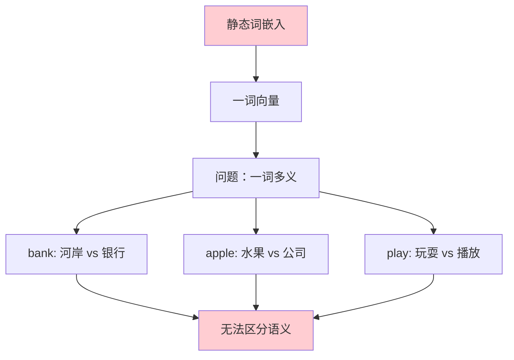
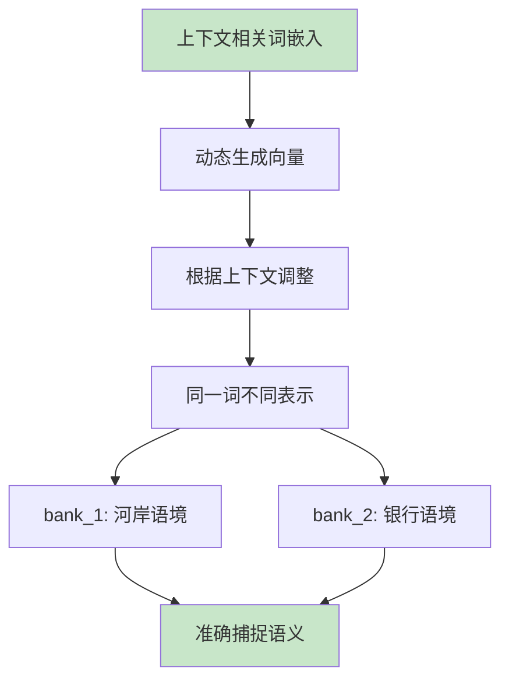
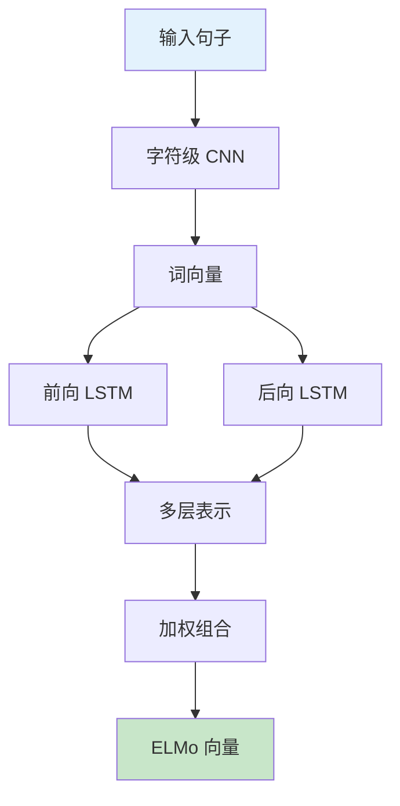
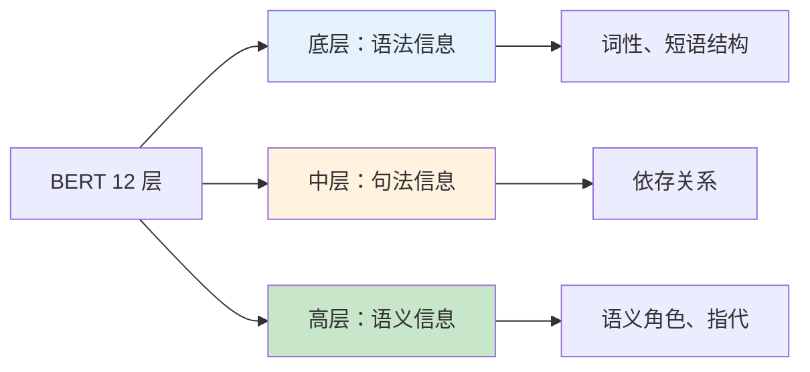
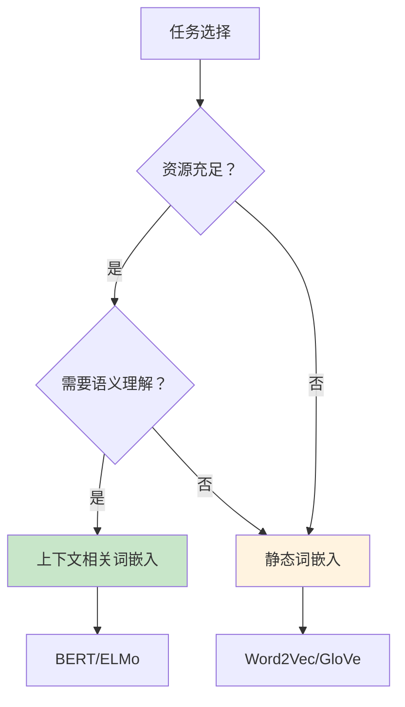

# Contextual Embedding（上下文相关词嵌入）

## 1. 概述

Contextual Embedding（上下文相关词嵌入）是词嵌入技术的重要演进。与传统的静态词嵌入（如 Word2Vec、GloVe、FastText）为每个词分配固定向量不同，上下文相关词嵌入根据词在句子中的具体上下文动态生成向量表示。

这一突破解决了传统词嵌入的核心局限——一词多义问题，使得同一个词在不同上下文中可以有不同的向量表示。

## 2. 从静态到动态的演进

### 2.1 静态词嵌入的局限



```python
# 静态词嵌入示例
# Word2Vec/GloVe 中，"bank" 只有一个向量

# 问题示例：
# "I sat on the river bank" - 这里 bank 指河岸
# "I went to the bank to deposit money" - 这里 bank 指银行

# 但 Word2Vec 中 bank 只有一个向量，无法区分这两种含义
```

### 2.2 上下文相关词嵌入的优势



```python
# 上下文相关词嵌入示例（以 BERT 为例）
from transformers import BertTokenizer, BertModel
import torch

tokenizer = BertTokenizer.from_pretrained('bert-base-uncased')
model = BertModel.from_pretrained('bert-base-uncased')

# 同一词在不同上下文中的表示
sentences = [
    "I sat on the river bank",
    "I went to the bank to deposit money"
]

for sentence in sentences:
    inputs = tokenizer(sentence, return_tensors='pt')
    outputs = model(**inputs)
    
    # 获取 "bank" 的向量（假设在第 5 个位置）
    bank_vector = outputs.last_hidden_state[0, 5, :]
    
    print(f"句子：{sentence}")
    print(f"bank 向量（前 5 维）：{bank_vector[:5].detach().numpy()}")
    print()

# 输出：两个 "bank" 的向量不同！
```

## 3. 主要上下文相关词嵌入方法

### 3.1 ELMo（Embeddings from Language Models）

ELMo 由 AllenAI 于 2018 年提出，是最早的上下文相关词嵌入方法之一。



```python
import torch
import torch.nn as nn

class ELMo(nn.Module):
    """
    ELMo 模型简化实现
    """
    def __init__(self, vocab_size, embedding_dim, hidden_dim, num_layers=2):
        super().__init__()
        
        # 字符级 CNN 用于处理 OOV
        self.char_cnn = nn.Sequential(
            nn.Embedding(vocab_size, embedding_dim),
            nn.Conv1d(embedding_dim, hidden_dim, kernel_size=3, padding=1),
            nn.MaxPool1d(2),
            nn.ReLU()
        )
        
        # 前向和后向 LSTM
        self.forward_lstm = nn.LSTM(hidden_dim, hidden_dim, num_layers, batch_first=True, bidirectional=False)
        self.backward_lstm = nn.LSTM(hidden_dim, hidden_dim, num_layers, batch_first=True, bidirectional=False)
        
        # 任务特定组合权重
        self.task_weights = nn.Parameter(torch.ones(num_layers + 1))
    
    def forward(self, char_indices):
        """
        char_indices: [batch_size, seq_len, char_len]
        """
        batch_size, seq_len, char_len = char_indices.shape
        
        # 字符级 CNN 获取词表示
        char_embeds = self.char_cnn(char_indices.view(-1, char_len))
        word_embeds = char_embeds.view(batch_size, seq_len, -1)
        
        # 前向 LSTM
        forward_out, _ = self.forward_lstm(word_embeds)
        
        # 后向 LSTM（输入反转）
        reversed_embeds = torch.flip(word_embeds, dims=[1])
        backward_out, _ = self.backward_lstm(reversed_embeds)
        backward_out = torch.flip(backward_out, dims=[1])
        
        # 拼接双向表示
        contextual_repr = torch.cat([forward_out, backward_out], dim=-1)
        
        # 多层加权组合（简化：只用最后一层）
        elmo_embedding = contextual_repr
        
        return elmo_embedding

# ELMo 特点：
# 1. 双向 LSTM 编码上下文
# 2. 多层表示可学习组合
# 3. 字符级处理 OOV 词
```

### 3.2 BERT 的上下文表示

BERT 使用 Transformer 编码器生成上下文相关表示。

```python
from transformers import BertTokenizer, BertModel

# 加载 BERT
tokenizer = BertTokenizer.from_pretrained('bert-base-uncased')
model = BertModel.from_pretrained('bert-base-uncased')

# 编码句子
sentence = "The bank was crowded"
inputs = tokenizer(sentence, return_tensors='pt')

# 获取上下文表示
with torch.no_grad():
    outputs = model(**inputs)
    # last_hidden_state: [batch_size, seq_len, hidden_size]
    contextual_embeddings = outputs.last_hidden_state

# 每个词的表示都依赖于整个句子的上下文
print(f"输入长度：{inputs['input_ids'].shape[1]}")
print(f"输出表示：{contextual_embeddings.shape}")

# 解码查看
tokens = tokenizer.convert_ids_to_tokens(inputs['input_ids'][0])
for i, token in enumerate(tokens):
    vector = contextual_embeddings[0, i, :5]  # 前 5 维
    print(f"{token}: {vector.numpy()}")
```

### 3.3 不同层的表示



```python
# 研究不同层的表示
from transformers import BertModel

model = BertModel.from_pretrained('bert-base-uncased', output_hidden_states=True)

sentence = "The animal didn't cross the street because it was too tired"
inputs = tokenizer(sentence, return_tensors='pt')

with torch.no_grad():
    outputs = model(**inputs)
    hidden_states = outputs.hidden_states  # 13 层（embedding + 12 层）

# 分析不同层对 "it" 的表示
it_index = 9  # "it" 的位置

for layer in [0, 4, 8, 12]:
    vector = hidden_states[layer][0, it_index, :5]
    print(f"Layer {layer}: {vector.numpy()}")

# 通常：
# - 底层适合 POS tagging 等任务
# - 中层适合依存分析
# - 高层适合 NLI、问答等语义任务
```

## 4. 上下文词嵌入的应用

### 4.1 词义消歧（WSD）

```python
def word_sense_disambiguation(context, target_word, senses, model, tokenizer):
    """
    使用上下文词嵌入进行词义消歧
    
    context: 包含目标词的句子
    target_word: 需要消歧的词
    senses: 可能的词义列表（每个词义有示例句）
    """
    # 获取目标词在上下文中的表示
    inputs = tokenizer(context, return_tensors='pt')
    with torch.no_grad():
        outputs = model(**inputs)
    
    # 找到目标词的位置
    tokens = tokenizer.convert_ids_to_tokens(inputs['input_ids'][0])
    target_idx = tokens.index(target_word.lower())
    
    target_vector = outputs.last_hidden_state[0, target_idx, :]
    
    # 计算与每个词义的相似度
    best_sense = None
    best_score = -1
    
    for sense_name, sense_examples in senses.items():
        for example in sense_examples:
            example_inputs = tokenizer(example, return_tensors='pt')
            with torch.no_grad():
                example_outputs = model(**example_inputs)
            
            # 获取示例中对应词的向量（简化：用平均）
            example_vector = example_outputs.last_hidden_state.mean(dim=1)
            
            # 计算相似度
            similarity = torch.cosine_similarity(target_vector.unsqueeze(0), example_vector)
            
            if similarity > best_score:
                best_score = similarity
                best_sense = sense_name
    
    return best_sense, best_score

# 示例
senses = {
    "bank_river": [
        "We sat on the river bank",
        "The bank was eroded by the flood"
    ],
    "bank_financial": [
        "I deposited money at the bank",
        "The bank approved my loan"
    ]
}

context = "I need to go to the bank to withdraw cash"
sense, score = word_sense_disambiguation(context, "bank", senses, model, tokenizer)
print(f"词义：{sense}, 置信度：{score:.3f}")
```

### 4.2 指代消解

```python
def coreference_resolution(sentence, pronoun, candidates, model, tokenizer):
    """
    使用上下文词嵌入解决指代问题
    
    sentence: 包含代词的句子
    pronoun: 代词（如 "it", "he", "she"）
    candidates: 可能的先行词列表
    """
    inputs = tokenizer(sentence, return_tensors='pt')
    
    with torch.no_grad():
        outputs = model(**inputs)
        embeddings = outputs.last_hidden_state[0]
    
    tokens = tokenizer.convert_ids_to_tokens(inputs['input_ids'][0])
    
    # 找到代词位置
    pronoun_idx = tokens.index(pronoun.lower())
    pronoun_vector = embeddings[pronoun_idx]
    
    # 找到每个候选词的向量并计算相似度
    best_candidate = None
    best_score = -1
    
    for candidate in candidates:
        if candidate.lower() in tokens:
            candidate_idx = tokens.index(candidate.lower())
            candidate_vector = embeddings[candidate_idx]
            
            similarity = torch.cosine_similarity(
                pronoun_vector.unsqueeze(0),
                candidate_vector.unsqueeze(0)
            )
            
            if similarity > best_score:
                best_score = similarity
                best_candidate = candidate
    
    return best_candidate, best_score

# 示例（Winograd Schema）
sentence = "The trophy doesn't fit in the suitcase because it is too large"
pronoun = "it"
candidates = ["trophy", "suitcase"]

antecedent, score = coreference_resolution(sentence, pronoun, candidates, model, tokenizer)
print(f"代词 '{pronoun}' 指代：{antecedent} (score: {score:.3f})")
# 期望输出：trophy
```

### 4.3 作为下游任务特征

```python
import torch.nn as nn

class NERWithELMo(nn.Module):
    """使用 ELMo/BERT 表示的 NER 模型"""
    
    def __init__(self, bert_model, num_labels):
        super().__init__()
        self.bert = bert_model
        hidden_size = bert_model.config.hidden_size
        
        self.classifier = nn.Sequential(
            nn.Linear(hidden_size, hidden_size // 2),
            nn.ReLU(),
            nn.Dropout(0.3),
            nn.Linear(hidden_size // 2, num_labels)
        )
    
    def forward(self, input_ids, attention_mask=None, labels=None):
        outputs = self.bert(
            input_ids=input_ids,
            attention_mask=attention_mask
        )
        
        sequence_output = outputs.last_hidden_state
        logits = self.classifier(sequence_output)
        
        loss = None
        if labels is not None:
            loss_fct = nn.CrossEntropyLoss()
            loss = loss_fct(logits.view(-1, num_labels), labels.view(-1))
        
        return {'loss': loss, 'logits': logits}

# 上下文词嵌入显著提升 NER 等序列标注任务的性能
```

## 5. 上下文词嵌入 vs 静态词嵌入

| 特性 | 静态词嵌入 | 上下文相关词嵌入 |
|------|-----------|-----------------|
| 表示方式 | 一词一向量 | 动态生成 |
| 一词多义 | 无法处理 | 天然支持 |
| OOV 处理 | 需要特殊处理 | 通过子词/字符处理 |
| 计算成本 | 低（查表） | 高（前向传播） |
| 存储需求 | 低 | 低（只存模型） |
| 典型方法 | Word2Vec, GloVe | ELMo, BERT, GPT |
| 适用场景 | 资源受限、简单任务 | 复杂语义任务 |



## 6. 高效使用上下文词嵌入

### 6.1 缓存策略

```python
class CachedContextualEmbeddings:
    """缓存上下文词嵌入以减少重复计算"""
    
    def __init__(self, model, tokenizer, cache_size=1000):
        self.model = model
        self.tokenizer = tokenizer
        self.cache = {}
        self.cache_size = cache_size
    
    def get_embedding(self, sentence, word_position):
        """获取句子中某位置的词嵌入"""
        cache_key = (sentence, word_position)
        
        if cache_key in self.cache:
            return self.cache[cache_key]
        
        inputs = self.tokenizer(sentence, return_tensors='pt')
        with torch.no_grad():
            outputs = self.model(**inputs)
            embedding = outputs.last_hidden_state[0, word_position, :]
        
        # 缓存
        if len(self.cache) >= self.cache_size:
            # 简单 LRU：删除第一个
            self.cache.pop(next(iter(self.cache)))
        
        self.cache[cache_key] = embedding
        return embedding
```

### 6.2 层选择策略

```python
def select_bert_layer(task_type):
    """根据任务类型选择 BERT 层"""
    
    layer_recommendations = {
        'pos_tagging': [1, 2, 3],      # 底层：语法信息
        'ner': [4, 5, 6, 7],           # 中层：局部语义
        'dependency_parsing': [3, 4, 5],
        'sentiment_analysis': [9, 10, 11, 12],  # 高层：全局语义
        'nli': [10, 11, 12],
        'question_answering': [8, 9, 10, 11, 12],
    }
    
    return layer_recommendations.get(task_type, [12])  # 默认用最后一层

# 使用推荐层
recommended_layers = select_bert_layer('ner')
print(f"NER 任务推荐使用层：{recommended_layers}")
```

### 6.3 池化策略

```python
def pool_bert_embeddings(outputs, pooling_strategy='cls'):
    """
    对 BERT 输出进行池化
    
    pooling_strategy:
    - 'cls': 使用 [CLS] 向量
    - 'mean': 平均所有 token
    - 'max': 最大池化
    - 'mean_max': 平均 + 最大拼接
    """
    last_hidden = outputs.last_hidden_state  # [batch, seq, dim]
    
    if pooling_strategy == 'cls':
        return last_hidden[:, 0, :]  # [CLS] token
    
    elif pooling_strategy == 'mean':
        # 排除 padding
        attention_mask = outputs.attention_mask
        expanded_mask = attention_mask.unsqueeze(-1).float()
        sum_embeddings = (last_hidden * expanded_mask).sum(dim=1)
        sum_mask = expanded_mask.sum(dim=1).clamp(min=1e-9)
        return sum_embeddings / sum_mask
    
    elif pooling_strategy == 'max':
        attention_mask = outputs.attention_mask
        last_hidden = last_hidden.masked_fill(~attention_mask.unsqueeze(-1).bool(), -1e9)
        return last_hidden.max(dim=1)[0]
    
    elif pooling_strategy == 'mean_max':
        mean_pool = pool_bert_embeddings(outputs, 'mean')
        max_pool = pool_bert_embeddings(outputs, 'max')
        return torch.cat([mean_pool, max_pool], dim=-1)
```

## 7. 总结

上下文相关词嵌入是 NLP 领域的重要突破，它解决了静态词嵌入无法处理一词多义的核心问题。主要特点包括：

1. **动态表示**：同一词在不同上下文中产生不同向量
2. **语义丰富**：捕捉词的语境依赖含义
3. **多层信息**：不同层编码不同层次的语言信息
4. **广泛适用**：显著提升各类 NLP 任务性能

从 ELMo 到 BERT 再到 GPT，上下文相关词嵌入技术不断发展，成为现代 NLP 系统的标准组件。理解其原理和使用方法，是掌握当代 NLP 技术的关键。
