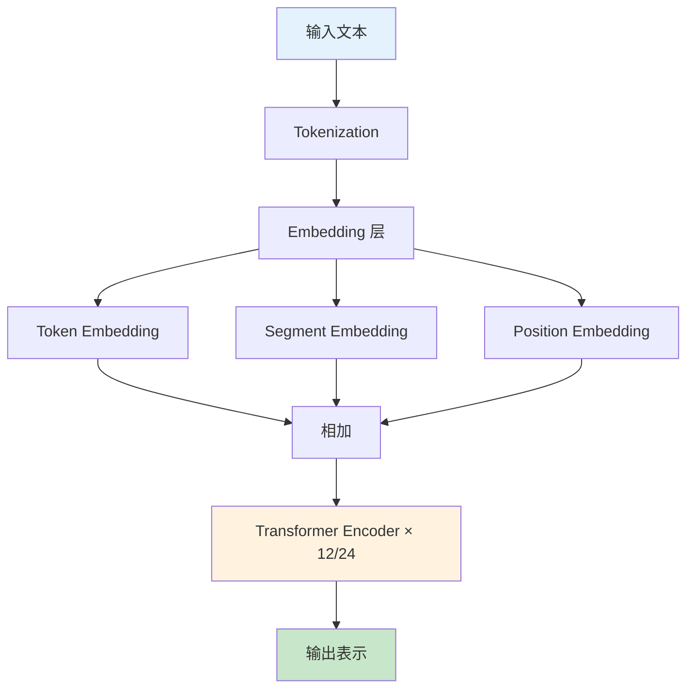
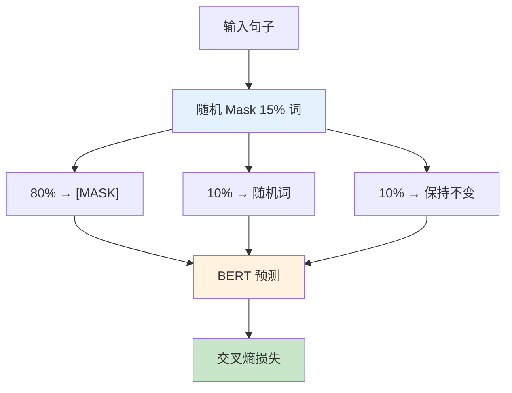

# BERT（Bidirectional Encoder Representations from Transformers）

## 1. 概述

BERT（Bidirectional Encoder Representations from Transformers）是由 Google 的 Jacob Devlin 等人于 2018 年提出的预训练语言模型。BERT 通过引入深度双向 Transformer 编码器和创新的预训练任务，在 11 项 NLP 任务上取得了 state-of-the-art 的结果，引发了 NLP 领域的"BERT 革命"。

BERT 的核心创新在于：
1. **深度双向表示**：同时利用左右上下文信息
2. **Masked LM 预训练**：完形填空式的语言建模
3. **Next Sentence Prediction**：句子对关系理解
4. **微调范式**：预训练 + 任务特定微调

## 2. BERT 的架构

### 2.1 模型结构



```python
import torch
import torch.nn as nn
from transformers import BertConfig, BertModel

# BERT 配置
config = BertConfig(
    vocab_size=30522,      # 词汇表大小
    hidden_size=768,       # 隐藏层维度
    num_hidden_layers=12,  # Transformer 层数（BERT-base）
    num_attention_heads=12, # 注意力头数
    intermediate_size=3072, # FFN 中间层维度
    max_position_embeddings=512,  # 最大序列长度
    type_vocab_size=2,     # 句子 A/B
)

# BERT-base 参数计算
# Embedding: 30522×768 + 2×768 + 512×768 ≈ 24M
# Transformer 每层：
#   - Self-Attention: 4×768×768 = 2.36M
#   - FFN: 2×768×3072 = 4.7M
#   - LayerNorm: 2×768×2 = 3K
# 12 层总计：12×(2.36M + 4.7M) ≈ 85M
# 总参数：约 110M

print(f"BERT-base 参数量：{config.num_hidden_layers * (4 * config.hidden_size**2 + 2 * config.hidden_size * config.intermediate_size) / 1e6:.1f}M")
```

### 2.2 输入表示

```python
from transformers import BertTokenizer

tokenizer = BertTokenizer.from_pretrained('bert-base-uncased')

# BERT 输入包含三种嵌入
sentence_a = "I love NLP"
sentence_b = "It is amazing"

# 编码句子对
inputs = tokenizer(
    sentence_a,
    sentence_b,
    return_tensors='pt',
    truncation=True,
    max_length=512
)

print(f"input_ids shape: {inputs['input_ids'].shape}")
print(f"token_type_ids shape: {inputs['token_type_ids'].shape}")
print(f"attention_mask shape: {inputs['attention_mask'].shape}")

# 解码查看
tokens = tokenizer.convert_ids_to_tokens(inputs['input_ids'][0])
print(f"Tokens: {tokens}")

# 特殊 token：
# [CLS] - 句子开始，用于分类任务
# [SEP] - 句子分隔符
# [PAD] - 填充
# [MASK] - 掩码 token（预训练时使用）
```

### 2.3 特殊 Token


| Token | 作用 | 示例 |
|-------|------|------|
| [CLS] | 分类 token，聚合句子表示 | 用于情感分类 |
| [SEP] | 分隔 token，分隔句子 | 句子 A [SEP] 句子 B |
| [MASK] | 掩码 token，预训练使用 | "I [MASK] NLP" |
| [PAD] | 填充 token | 补齐序列长度 |

## 3. 预训练任务

### 3.1 Masked Language Model（MLM）



```python
# MLM 示例
from transformers import BertForMaskedLM

model = BertForMaskedLM.from_pretrained('bert-base-uncased')

# 完形填空
sentence = "I love [MASK] learning"
inputs = tokenizer(sentence, return_tensors='pt')

with torch.no_grad():
    outputs = model(**inputs)
    predictions = outputs.logits

# 获取 [MASK] 位置的预测
mask_index = (inputs['input_ids'] == tokenizer.mask_token_id)[0].nonzero().item()
mask_predictions = predictions[0, mask_index, :]

# Top-5 预测
top5_indices = mask_predictions.topk(5).indices
top5_tokens = tokenizer.convert_ids_to_tokens(top5_indices)
top5_probs = mask_predictions.topk(5).values.softmax(dim=0)

for token, prob in zip(top5_tokens, top5_probs):
    print(f"{token}: {prob:.3f}")

# 输出可能包括：machine, deep, natural, reinforcement, ...
```

**Mask 策略详解**：

```python
def mask_tokens(inputs, tokenizer, mlm_probability=0.15):
    """
    BERT 的 MLM 掩码策略
    """
    labels = inputs.clone()
    
    # 创建概率矩阵
    probability_matrix = torch.full(labels.shape, mlm_probability)
    
    # 特殊 token 不 mask
    special_tokens_mask = tokenizer.get_special_tokens_mask(inputs.tolist(), already_has_special_tokens=True)
    probability_matrix.masked_fill_(torch.tensor(special_tokens_mask, dtype=torch.bool), value=0.0)
    
    # 决定哪些位置需要 mask
    masked_indices = torch.bernoulli(probability_matrix).bool()
    labels[~masked_indices] = -100  # 只计算 mask 位置的损失
    
    # 80% 替换为 [MASK]
    indices_replaced = torch.bernoulli(torch.full(labels.shape, 0.8)).bool() & masked_indices
    inputs[indices_replaced] = tokenizer.convert_tokens_to_ids(tokenizer.mask_token)
    
    # 10% 替换为随机词
    indices_random = torch.bernoulli(torch.full(labels.shape, 0.5)).bool() & masked_indices & ~indices_replaced
    random_words = torch.randint(len(tokenizer), labels.shape, dtype=torch.long)
    inputs[indices_random] = random_words[indices_random]
    
    # 10% 保持不变（模型需要预测原始词）
    # 剩余 10% 保持原样
    
    return inputs, labels
```

### 3.2 Next Sentence Prediction（NSP）

```python
# NSP 任务示例
from transformers import BertForNextSentencePrediction

model = BertForNextSentencePrediction.from_pretrained('bert-base-uncased')

# 连续句子
prompt = "In Italy, pizza is a popular dish. [SEP]"
candidate = "People often eat it with tomato sauce. [SEP]"

inputs = tokenizer(prompt, candidate, return_tensors='pt')

with torch.no_grad():
    outputs = model(**inputs)
    logits = outputs.logits

# 判断是否是连续句子
is_next_prob = logits.softmax(dim=1)[0, 0].item()
print(f"是连续句子的概率：{is_next_prob:.3f}")

# NSP 帮助 BERT 理解句子间关系
# 对问答、NLI 等任务特别有用
```

**NSP 的争议**：
后续研究发现 NSP 任务可能不是必需的，RoBERTa 去掉了 NSP 仍取得更好效果。

## 4. BERT 变体

### 4.1 BERT-base vs BERT-large

| 配置 | BERT-base | BERT-large |
|------|-----------|------------|
| 层数 | 12 | 24 |
| 隐藏层维度 | 768 | 1024 |
| 注意力头数 | 12 | 16 |
| 参数量 | 110M | 340M |
| 训练速度 | 快 | 慢 |
| 性能 | 好 | 更好 |

```python
from transformers import AutoModel

# BERT-base
bert_base = AutoModel.from_pretrained('bert-base-uncased')
print(f"BERT-base 参数：{sum(p.numel() for p in bert_base.parameters()) / 1e6:.1f}M")

# BERT-large
bert_large = AutoModel.from_pretrained('bert-large-uncased')
print(f"BERT-large 参数：{sum(p.numel() for p in bert_large.parameters()) / 1e6:.1f}M")
```

### 4.2 多语言 BERT

```python
# 多语言 BERT
from transformers import AutoTokenizer, AutoModel

tokenizer = AutoTokenizer.from_pretrained('bert-base-multilingual-cased')
model = AutoModel.from_pretrained('bert-base-multilingual-cased')

# 支持 104 种语言
texts = [
    "Hello world",           # 英语
    "你好世界",               # 中文
    "Bonjour le monde",      # 法语
    "Hola mundo",            # 西班牙语
    "こんにちは世界",         # 日语
]

for text in texts:
    inputs = tokenizer(text, return_tensors='pt')
    with torch.no_grad():
        outputs = model(**inputs)
    print(f"{text}: {outputs.last_hidden_state.shape}")

# 多语言 BERT 支持跨语言迁移
# 可以用英语微调，在其他语言上测试
```

## 5. BERT 微调

### 5.1 文本分类

```python
from transformers import BertForSequenceClassification, TrainingArguments, Trainer
from torch.utils.data import Dataset

class TextClassificationDataset(Dataset):
    def __init__(self, texts, labels, tokenizer, max_length=128):
        self.texts = texts
        self.labels = labels
        self.tokenizer = tokenizer
        self.max_length = max_length
    
    def __len__(self):
        return len(self.texts)
    
    def __getitem__(self, idx):
        encoding = self.tokenizer(
            self.texts[idx],
            max_length=self.max_length,
            padding='max_length',
            truncation=True,
            return_tensors='pt'
        )
        
        return {
            'input_ids': encoding['input_ids'].flatten(),
            'attention_mask': encoding['attention_mask'].flatten(),
            'labels': torch.tensor(self.labels[idx], dtype=torch.long)
        }

# 加载模型
model = BertForSequenceClassification.from_pretrained(
    'bert-base-uncased',
    num_labels=2  # 二分类
)

# 训练参数
training_args = TrainingArguments(
    output_dir='./results',
    num_train_epochs=3,
    per_device_train_batch_size=16,
    learning_rate=2e-5,  # BERT 微调常用小学习率
    weight_decay=0.01,
    warmup_ratio=0.1,
)

# 创建 Trainer
trainer = Trainer(
    model=model,
    args=training_args,
    train_dataset=train_dataset,
    eval_dataset=val_dataset,
)

# 开始训练
trainer.train()
```

### 5.2 问答系统

```python
from transformers import BertForQuestionAnswering

# 加载问答模型
model = BertForQuestionAnswering.from_pretrained('bert-large-uncased-whole-word-masking-finetuned-squad')
tokenizer = AutoTokenizer.from_pretrained('bert-large-uncased-whole-word-masking-finetuned-squad')

# 问答示例
question = "Who was the first president of the United States?"
context = "George Washington was the first president of the United States, serving from 1789 to 1797."

inputs = tokenizer(question, context, return_tensors='pt')

with torch.no_grad():
    outputs = model(**inputs)

# 获取答案 span
start_logits = outputs.start_logits
end_logits = outputs.end_logits

start_index = start_logits.argmax()
end_index = end_logits.argmax() + 1

answer_tokens = inputs['input_ids'][0, start_index:end_index]
answer = tokenizer.decode(answer_tokens)

print(f"问题：{question}")
print(f"答案：{answer}")
```

### 5.3 命名实体识别

```python
from transformers import BertForTokenClassification

# 加载 NER 模型
model = BertForTokenClassification.from_pretrained(
    'bert-base-cased',
    num_labels=9  # BIO 标注：B-PER, I-PER, B-ORG, I-ORG, B-LOC, I-LOC, O, [CLS], [SEP]
)

# NER 需要 token-level 标签
# 训练时使用 CrossEntropyLoss，忽略特殊 token 和 padding
```

## 6. BERT 的可视化与分析

### 6.1 注意力可视化

```python
import matplotlib.pyplot as plt
import seaborn as sns

def visualize_attention(model, tokenizer, sentence, layer=6, head=3):
    """可视化 BERT 的注意力权重"""
    from transformers import BertModel
    
    model = BertModel.from_pretrained(model, output_attentions=True)
    inputs = tokenizer(sentence, return_tensors='pt')
    
    with torch.no_grad():
        outputs = model(**inputs)
        attentions = outputs.attentions  # 12 层 × batch × heads × seq × seq
    
    # 获取指定层和头的注意力
    attn = attentions[layer][0, head].numpy()
    
    # 获取 token
    tokens = tokenizer.convert_ids_to_tokens(inputs['input_ids'][0])
    
    # 绘制热力图
    plt.figure(figsize=(10, 8))
    sns.heatmap(attn, xticklabels=tokens, yticklabels=tokens, cmap='YlOrRd')
    plt.title(f'Layer {layer}, Head {head}')
    plt.xticks(rotation=45)
    plt.yticks(rotation=0)
    plt.tight_layout()
    plt.show()

# 示例
# visualize_attention('bert-base-uncased', tokenizer, "The animal didn't cross the street because it was too tired")
```

### 6.2 层表示分析

```python
def analyze_layer_representations(model_name, sentences):
    """分析不同层的表示能力"""
    from transformers import BertModel
    
    model = BertModel.from_pretrained(model_name, output_hidden_states=True)
    tokenizer = AutoTokenizer.from_pretrained(model_name)
    
    layer_similarities = {i: [] for i in range(13)}
    
    for sent1, sent2 in sentences:
        inputs1 = tokenizer(sent1, return_tensors='pt')
        inputs2 = tokenizer(sent2, return_tensors='pt')
        
        with torch.no_grad():
            outputs1 = model(**inputs1)
            outputs2 = model(**inputs2)
        
        for layer in range(13):
            # 使用 CLS 向量
            vec1 = outputs1.hidden_states[layer][0, 0, :]
            vec2 = outputs2.hidden_states[layer][0, 0, :]
            
            sim = torch.cosine_similarity(vec1.unsqueeze(0), vec2.unsqueeze(0)).item()
            layer_similarities[layer].append(sim)
    
    # 绘制各层的平均相似度
    avg_sims = [sum(sims)/len(sims) for sims in layer_similarities.values()]
    
    plt.figure(figsize=(10, 5))
    plt.plot(range(13), avg_sims, marker='o')
    plt.xlabel('Layer')
    plt.ylabel('Average Similarity')
    plt.title('Layer-wise Representation Similarity')
    plt.grid(alpha=0.3)
    plt.show()
```

## 7. BERT 的局限性

### 7.1 序列长度限制

```python
# BERT 最大序列长度为 512
# 长文档需要特殊处理

def process_long_document(document, tokenizer, model, chunk_size=512):
    """处理长文档"""
    tokens = tokenizer.encode(document, add_special_tokens=False)
    
    chunks = []
    for i in range(0, len(tokens), chunk_size - 2):  # 预留 [CLS] 和 [SEP]
        chunk = tokens[i:i + chunk_size - 2]
        chunk = [tokenizer.cls_token_id] + chunk + [tokenizer.sep_token_id]
        chunks.append(chunk)
    
    # 分别处理每个 chunk
    representations = []
    for chunk in chunks:
        inputs = {'input_ids': torch.tensor([chunk])}
        with torch.no_grad():
            outputs = model(**inputs)
        representations.append(outputs.last_hidden_state[0, 0, :])  # CLS
    
    # 聚合（平均或最大池化）
    document_vector = torch.stack(representations).mean(dim=0)
    
    return document_vector
```

### 7.2 自回归能力缺失

BERT 是双向编码器，不适合生成任务：

```python
# BERT 不适合文本生成
# 因为：
# 1. 使用 [MASK] 训练，无法自回归生成
# 2. 双向注意力，生成时会看到未来 token

# 生成任务应使用 GPT 等解码器模型
```

## 8. 总结

BERT 通过深度双向 Transformer 和创新的预训练任务，彻底改变了 NLP 领域。其核心贡献包括：

1. **双向表示**：同时利用左右上下文
2. **预训练 + 微调**：统一的迁移学习框架
3. **广泛适用**：适用于各类 NLP 任务
4. **开源生态**：Hugging Face 等库使其易于使用

虽然 BERT 已被更强大的模型（如 RoBERTa、DeBERTa）超越，但其核心思想仍然是现代 NLP 的基础。理解 BERT 的原理和应用，是掌握当代 NLP 技术的关键。
