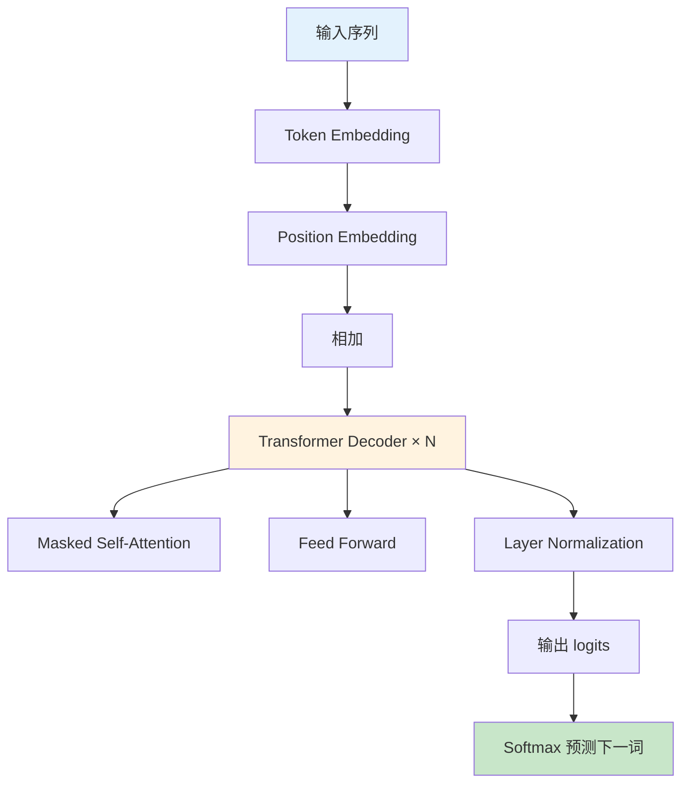
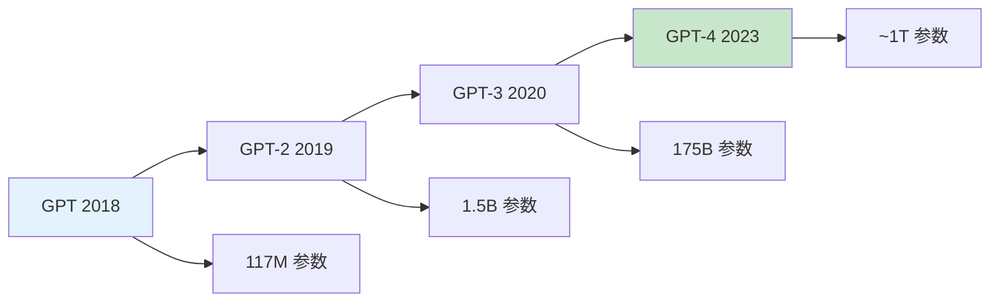
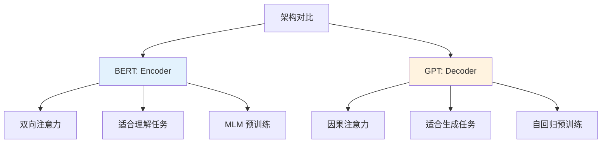

# GPT（Generative Pre-trained Transformer）

## 1. 概述

GPT（Generative Pre-trained Transformer）是由 OpenAI 提出的一系列自回归语言模型。与 BERT 的双向编码器架构不同，GPT 使用单向解码器架构，通过从左到右的自回归方式预测下一个 token，使其天然适合文本生成任务。

GPT 系列的发展代表了语言模型能力的持续突破：
- **GPT（2018）**：1.17 亿参数，证明预训练 + 微调范式
- **GPT-2（2019）**：15 亿参数，展示少样本学习能力
- **GPT-3（2020）**：1750 亿参数，涌现上下文学习能力
- **GPT-4（2023）**：多模态能力，更强的推理和理解

## 2. GPT 架构详解

### 2.1 Decoder-only 架构



```python
import torch
import torch.nn as nn
import math

class GPTBlock(nn.Module):
    """单个 GPT Decoder 块"""
    
    def __init__(self, config):
        super().__init__()
        self.ln_1 = nn.LayerNorm(config.n_embd)
        self.attn = nn.MultiheadAttention(
            embed_dim=config.n_embd,
            num_heads=config.n_head,
            dropout=config.attn_pdrop,
            batch_first=True
        )
        self.ln_2 = nn.LayerNorm(config.n_embd)
        self.mlp = nn.Sequential(
            nn.Linear(config.n_embd, 4 * config.n_embd),
            nn.GELU(),
            nn.Linear(4 * config.n_embd, config.n_embd),
            nn.Dropout(config.resid_pdrop)
        )
        self.dropout = nn.Dropout(config.resid_pdrop)
    
    def forward(self, x, attention_mask=None):
        # Pre-LayerNorm
        residual = x
        x = self.ln_1(x)
        
        # Causal self-attention
        attn_output, _ = self.attn(x, x, x, attn_mask=attention_mask, is_causal=True)
        x = residual + self.dropout(attn_output)
        
        # Feed forward
        residual = x
        x = self.ln_2(x)
        x = self.mlp(x)
        x = residual + self.dropout(x)
        
        return x

class GPTModel(nn.Module):
    """GPT 模型"""
    
    def __init__(self, config):
        super().__init__()
        self.config = config
        
        # Token 和位置嵌入
        self.token_embedding = nn.Embedding(config.vocab_size, config.n_embd)
        self.position_embedding = nn.Embedding(config.n_ctx, config.n_embd)
        self.dropout = nn.Dropout(config.embd_pdrop)
        
        # Transformer 块
        self.blocks = nn.ModuleList([GPTBlock(config) for _ in range(config.n_layer)])
        
        # 输出层
        self.ln_f = nn.LayerNorm(config.n_embd)
        self.head = nn.Linear(config.n_embd, config.vocab_size, bias=False)
        
        # 权重共享
        self.head.weight = self.token_embedding.weight
    
    def forward(self, input_ids, attention_mask=None):
        batch_size, seq_len = input_ids.shape
        
        # 位置嵌入
        positions = torch.arange(seq_len, device=input_ids.device).unsqueeze(0)
        
        # 嵌入求和
        x = self.token_embedding(input_ids) + self.position_embedding(positions)
        x = self.dropout(x)
        
        # 因果掩码
        if attention_mask is None:
            attention_mask = torch.triu(
                torch.ones(seq_len, seq_len, device=input_ids.device),
                diagonal=1
            ).bool()
        
        # Transformer 块
        for block in self.blocks:
            x = block(x, attention_mask)
        
        # 最终 LayerNorm
        x = self.ln_f(x)
        
        # 输出 logits
        logits = self.head(x)
        
        return logits

# GPT 配置示例
class GPTConfig:
    vocab_size = 50257      # BPE 词汇表
    n_ctx = 1024           # 最大上下文长度
    n_embd = 768           # 嵌入维度
    n_layer = 12           # 层数（GPT-2 small）
    n_head = 12            # 注意力头数
    attn_pdrop = 0.1
    embd_pdrop = 0.1
    resid_pdrop = 0.1

config = GPTConfig()
model = GPTModel(config)
print(f"GPT 参数量：{sum(p.numel() for p in model.parameters()) / 1e6:.1f}M")
```

### 2.2 因果注意力机制


```python
def create_causal_mask(seq_length, device='cpu'):
    """创建因果掩码（上三角为 True 表示遮蔽）"""
    mask = torch.triu(torch.ones(seq_length, seq_length, device=device), diagonal=1).bool()
    return mask

# 可视化因果掩码
import matplotlib.pyplot as plt
import seaborn as sns

mask = create_causal_mask(10)
plt.figure(figsize=(6, 5))
sns.heatmap(mask.numpy(), cmap='Reds', cbar=False)
plt.title('Causal Attention Mask')
plt.xlabel('Key Position')
plt.ylabel('Query Position')
plt.tight_layout()
plt.show()

# 位置 i 只能看到位置 0 到 i-1
# 这确保了生成时只能依赖已生成的 token
```

## 3. GPT 预训练

### 3.1 语言模型目标

```python
# GPT 使用标准语言模型目标：最大化 P(token_t | token_0, ..., token_{t-1})

def compute_lm_loss(logits, labels, ignore_index=-100):
    """
    计算语言模型损失
    
    logits: [batch, seq_len, vocab_size]
    labels: [batch, seq_len]， shifted input
    """
    # 调整形状
    shift_logits = logits[..., :-1, :].contiguous()
    shift_labels = labels[..., 1:].contiguous()
    
    # 展平
    loss_fct = nn.CrossEntropyLoss(ignore_index=ignore_index)
    loss = loss_fct(
        shift_logits.view(-1, shift_logits.size(-1)),
        shift_labels.view(-1)
    )
    
    return loss

# 训练数据示例
# input:  "The cat sat on the"
# target: "cat sat on the mat"
# 
# 模型学习：P("cat"|"The") × P("sat"|"The cat") × ...
```

### 3.2 数据预处理

```python
from torch.utils.data import Dataset
import random

class GPTextDataset(Dataset):
    """GPT 训练数据集"""
    
    def __init__(self, texts, tokenizer, max_length=1024):
        self.tokenizer = tokenizer
        self.max_length = max_length
        
        # 将所有文本拼接并 tokenize
        self.tokenized = []
        for text in texts:
            tokens = tokenizer.encode(text)
            self.tokenized.extend(tokens)
        
        # 分割为固定长度块
        self.blocks = []
        for i in range(0, len(self.tokenized) - max_length - 1, max_length):
            block = self.tokenized[i:i + max_length + 1]
            self.blocks.append(block)
    
    def __len__(self):
        return len(self.blocks)
    
    def __getitem__(self, idx):
        block = self.blocks[idx]
        input_ids = torch.tensor(block[:-1], dtype=torch.long)
        labels = torch.tensor(block[1:], dtype=torch.long)
        return {'input_ids': input_ids, 'labels': labels}

# 使用示例
# dataset = GPTextDataset(texts, tokenizer, max_length=1024)
# dataloader = DataLoader(dataset, batch_size=8, shuffle=True)
```

## 4. GPT 的文本生成

### 4.1 贪婪解码

```python
@torch.no_grad()
def generate_greedy(model, input_ids, max_new_tokens=50):
    """贪婪解码：每次选择概率最高的 token"""
    model.eval()
    
    for _ in range(max_new_tokens):
        # 前向传播
        logits = model(input_ids)
        next_token_logits = logits[:, -1, :]
        
        # 选择概率最高的 token
        next_token = torch.argmax(next_token_logits, dim=-1, keepdim=True)
        
        # 追加到输入
        input_ids = torch.cat([input_ids, next_token], dim=1)
        
        # 检查是否生成结束 token
        if next_token.item() == model.config.eos_token_id:
            break
    
    return input_ids

# 示例
# input_text = "Once upon a time"
# input_ids = tokenizer.encode(input_text, return_tensors='pt')
# output_ids = generate_greedy(model, input_ids, max_new_tokens=50)
# print(tokenizer.decode(output_ids[0]))
```

### 4.2 采样策略

```python
@torch.no_grad()
def generate_sample(model, input_ids, max_new_tokens=50, temperature=1.0, top_k=50, top_p=0.9):
    """
    带采样的文本生成
    
    temperature: 温度，>1 增加随机性，<1 减少随机性
    top_k: 只从概率最高的 k 个 token 中采样
    top_p: nucleus sampling，从累积概率超过 p 的最小 token 集合中采样
    """
    model.eval()
    
    for _ in range(max_new_tokens):
        logits = model(input_ids)
        next_token_logits = logits[:, -1, :] / temperature
        
        # Top-k 过滤
        if top_k > 0:
            indices_to_remove = next_token_logits < torch.topk(next_token_logits, top_k)[0][..., -1, None]
            next_token_logits[indices_to_remove] = float('-inf')
        
        # Top-p (nucleus) 过滤
        if top_p < 1.0:
            sorted_logits, sorted_indices = torch.sort(next_token_logits, descending=True)
            cumulative_probs = torch.cumsum(torch.softmax(sorted_logits, dim=-1), dim=-1)
            
            sorted_indices_to_remove = cumulative_probs > top_p
            sorted_indices_to_remove[..., 1:] = sorted_indices_to_remove[..., :-1].clone()
            sorted_indices_to_remove[..., 0] = 0
            
            indices_to_remove = sorted_indices_to_remove.scatter(
                1, sorted_indices, sorted_indices_to_remove
            )
            next_token_logits[indices_to_remove] = float('-inf')
        
        # 采样
        probs = torch.softmax(next_token_logits, dim=-1)
        next_token = torch.multinomial(probs, num_samples=1)
        
        input_ids = torch.cat([input_ids, next_token], dim=1)
        
        if next_token.item() == model.config.eos_token_id:
            break
    
    return input_ids

# 不同采样策略的效果
# temperature=1.0, top_k=50, top_p=0.9: 平衡质量和多样性
# temperature=0.7: 更保守，质量更高
# temperature=1.2: 更有创意，但可能不连贯
```

### 4.3 Beam Search

```python
@torch.no_grad()
def generate_beam_search(model, input_ids, num_beams=5, max_new_tokens=50, length_penalty=1.0):
    """
    Beam Search 生成
    
    num_beams: 束宽
    length_penalty: 长度惩罚，>1 鼓励更长序列
    """
    model.eval()
    
    # 初始化 beams
    beams = [(input_ids, 0.0)]  # (sequence, score)
    
    for _ in range(max_new_tokens):
        candidates = []
        
        for beam_seq, beam_score in beams:
            # 跳过已完成的 beams
            if beam_seq[0, -1].item() == model.config.eos_token_id:
                candidates.append((beam_seq, beam_score))
                continue
            
            # 前向传播
            logits = model(beam_seq)
            log_probs = torch.log_softmax(logits[:, -1, :], dim=-1)
            
            # 获取 top-k 候选
            topk_log_probs, topk_indices = torch.topk(log_probs, num_beams)
            
            for log_prob, idx in zip(topk_log_probs[0], topk_indices[0]):
                new_seq = torch.cat([beam_seq, idx.unsqueeze(0).unsqueeze(0)], dim=1)
                new_score = beam_score + log_prob.item()
                candidates.append((new_seq, new_score))
        
        # 应用长度惩罚并选择 top beams
        if length_penalty != 1.0:
            candidates.sort(key=lambda x: x[1] / (x[0].shape[1] ** length_penalty), reverse=True)
        else:
            candidates.sort(key=lambda x: x[1], reverse=True)
        
        beams = candidates[:num_beams]
        
        # 如果所有 beams 都完成，提前结束
        if all(b[0][0, -1].item() == model.config.eos_token_id for b in beams):
            break
    
    # 返回最佳 beam
    return beams[0][0]
```

## 5. GPT 系列演进

### 5.1 GPT 系列对比

| 模型 | 参数量 | 训练数据 | 上下文长度 | 发布年份 |
|------|--------|----------|-----------|---------|
| GPT | 117M | BookCorpus | 512 | 2018 |
| GPT-2 | 1.5B | WebText | 1024 | 2019 |
| GPT-3 | 175B | WebText + 更多 | 2048 | 2020 |
| GPT-4 | ~1T(估计) | 多模态 | 32K/128K | 2023 |



### 5.2 GPT-2 的零样本能力

```python
# GPT-2 展示了令人印象深刻的零样本能力
# 无需微调即可执行多种任务

from transformers import GPT2LMHeadModel, GPT2Tokenizer

tokenizer = GPT2Tokenizer.from_pretrained('gpt2')
model = GPT2LMHeadModel.from_pretrained('gpt2-xl')

# 文本续写
prompt = "The future of artificial intelligence"
inputs = tokenizer(prompt, return_tensors='pt')
outputs = model.generate(**inputs, max_new_tokens=50, temperature=0.7)
print(tokenizer.decode(outputs[0]))

# 问答（零样本）
prompt = "Q: What is the capital of France?\nA:"
inputs = tokenizer(prompt, return_tensors='pt')
outputs = model.generate(**inputs, max_new_tokens=20)
print(tokenizer.decode(outputs[0]))

# 翻译（零样本）
prompt = "English: Hello\nFrench:"
inputs = tokenizer(prompt, return_tensors='pt')
outputs = model.generate(**inputs, max_new_tokens=10)
print(tokenizer.decode(outputs[0]))
```

### 5.3 GPT-3 的上下文学习

```python
# GPT-3 展示了 in-context learning 能力
# 通过在 prompt 中提供示例，无需更新权重即可学习新任务

# Few-shot 示例
prompt = """
Translate English to French:

sea otter => loutre de mer
peppermint => menthe poivrée
plush giraffe => girafe peluche
cheese =>

"""

# GPT-3 会从示例中学习模式，输出 "fromage"

# 这种能力随模型规模增大而涌现
# GPT-3 (175B) >> GPT-2 (1.5B) 在上下文学习上
```

## 6. GPT vs BERT



| 特性 | BERT | GPT |
|------|------|-----|
| 架构 | Encoder-only | Decoder-only |
| 注意力 | 双向 | 单向（因果） |
| 预训练目标 | MLM + NSP | 自回归 LM |
| 擅长任务 | 理解、分类 | 生成、续写 |
| 上下文学习 | 弱 | 强 |
| 典型应用 | 搜索、问答 | 对话、创作 |

## 7. GPT 的应用

### 7.1 对话系统

```python
class Chatbot:
    def __init__(self, model, tokenizer):
        self.model = model
        self.tokenizer = tokenizer
        self.history = []
    
    def chat(self, user_input, max_new_tokens=100):
        # 构建对话历史
        context = "\n".join(self.history + [f"User: {user_input}", "Assistant:"])
        
        # 生成回复
        inputs = self.tokenizer(context, return_tensors='pt')
        outputs = self.model.generate(
            **inputs,
            max_new_tokens=max_new_tokens,
            temperature=0.7,
            top_p=0.9,
            do_sample=True,
            pad_token_id=self.tokenizer.eos_token_id
        )
        
        response = self.tokenizer.decode(outputs[0], skip_special_tokens=True)
        response = response.split("Assistant:")[-1].strip()
        
        # 更新历史
        self.history.append(f"User: {user_input}")
        self.history.append(f"Assistant: {response}")
        
        # 保持历史长度
        if len(self.history) > 10:
            self.history = self.history[-10:]
        
        return response

# 使用示例
# chatbot = Chatbot(model, tokenizer)
# response = chatbot.chat("Hello, how are you?")
# print(response)
```

### 7.2 代码生成

```python
# GPT 系列在代码生成上表现出色
# Codex (GPT-3 的代码版本) 可以生成多种编程语言的代码

prompt = """
# Python 函数：计算斐波那契数列
def fibonacci(n):
"""

# GPT 会续写完整的函数实现
# 包括递归或迭代实现、边界处理等
```

### 7.3 内容创作

```python
# GPT 可用于各种内容创作任务

# 故事创作
story_prompt = "Once upon a time, in a distant galaxy..."

# 诗歌创作
poem_prompt = "Write a haiku about spring:"

# 邮件撰写
email_prompt = "Write a professional email to reschedule a meeting:"

# 每个 prompt 都能生成连贯、相关的内容
```

## 8. GPT 的局限性与挑战

### 8.1 幻觉问题

```python
# GPT 可能生成看似合理但实际错误的内容
# 这被称为"幻觉"（hallucination）

# 示例：
# 问："Who was the president of the US in 2025?"
# GPT 可能编造一个不存在的答案

# 缓解方法：
# 1. 检索增强生成（RAG）
# 2. 事实核查
# 3. 提示模型承认不确定性
```

### 8.2 偏见问题

```python
# GPT 从训练数据中学习，可能继承社会偏见

# 示例：
# "The doctor said that ___" -> 更可能生成 "he"
# "The nurse said that ___" -> 更可能生成 "she"

# 缓解方法：
# 1. 数据清洗和平衡
# 2. 对抗性训练
# 3. 后处理过滤
```

### 8.3 计算成本

```python
# GPT 大模型的训练和推理成本高昂

# GPT-3 训练成本估计：
# - 计算：约 3.64e23 FLOPs
# - 时间：数周至数月
# - 费用：数百万美元

# 推理成本：
# - 175B 模型每次前向传播需要数百 GB 显存
# - 需要模型并行或张量并行
```

## 9. 总结

GPT 系列代表了自回归语言模型的发展巅峰，其核心贡献包括：

1. **Decoder-only 架构**：天然适合生成任务
2. **大规模预训练**：在海量数据上学习语言模式
3. **涌现能力**：随规模增大出现上下文学习等新能力
4. **广泛应用**：对话、创作、代码生成等

从 GPT 到 GPT-4，模型的规模和能力持续增长，推动了 AI 在多个领域的突破。理解 GPT 的原理和特性，是掌握现代生成式 AI 的关键。
