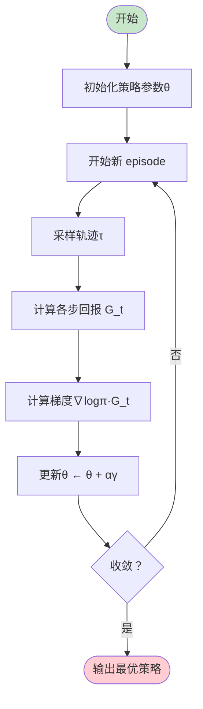
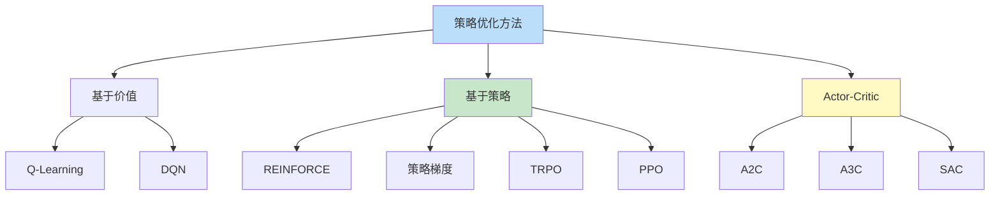

# 策略优化方法

## 1. 概述

策略优化（Policy Optimization）是强化学习的核心问题之一，目标是找到能够最大化期望累积奖励的最优策略π*。策略优化方法直接对策略参数进行优化，是连接强化学习理论与实际应用的关键桥梁。

**核心问题**：如何在策略空间中找到使期望回报最大化的策略参数？

策略优化方法主要分为两大类：
1. **基于价值的方法**：通过优化价值函数间接得到策略（如 Q-Learning）
2. **基于策略的方法**：直接优化策略参数（如 Policy Gradient）

### 1.1 策略表示

策略π可以用不同方式表示：

**表格型策略**（离散状态 - 动作空间）：
```
π(a|s) = 概率分布，Σ_a π(a|s) = 1
```

**参数化策略**（连续或大规模空间）：
```
π_θ(a|s) = 由参数θ决定的概率分布
常用形式：
  - 高斯策略：π_θ(a|s) = N(μ_θ(s), σ²)
  - Softmax 策略：π_θ(a|s) = exp(h(s,a,θ)) / Σ_a' exp(h(s,a',θ))
```

### 1.2 优化目标

策略优化的目标函数：
```
J(θ) = E_τ∼π_θ[R(τ)] = E_τ∼π_θ[Σ_t γ^t r_t]
```

其中τ = (s₀, a₀, s₁, a₁, ...) 是轨迹。

优化目标：
```
θ* = argmax_θ J(θ)
```

### 1.3 应用场景

- 机器人控制（连续动作空间）
- 游戏 AI（复杂决策）
- 自动驾驶（安全关键）
- 推荐系统（个性化策略）
- 金融交易（风险管理）

## 2. 算法原理

### 2.1 策略梯度定理

策略梯度定理提供了目标函数 J(θ) 的梯度表达式：

```
∇_θ J(θ) = E_τ∼π_θ[Σ_t ∇_θ log π_θ(a_t|s_t) Q^π(s_t, a_t)]
```

**关键洞察**：
- 梯度可以表示为期望形式
- 不需要知道环境动力学 P(s'|s,a)
- 可以通过采样轨迹来估计梯度

### 2.2 REINFORCE 算法

REINFORCE 是最基础的策略梯度算法：

```
初始化策略参数θ
对于每个 episode：
    采样轨迹 τ = (s₀, a₀, r₀, s₁, a₁, r₁, ...)
    对于每个时间步 t：
        计算回报 G_t = Σ_{k=t}^∞ γ^{k-t} r_k
        计算梯度：∇_θ J ≈ Σ_t ∇_θ log π_θ(a_t|s_t) G_t
    更新参数：θ ← θ + α ∇_θ J
```

### 2.3 带基线的策略梯度

为减少方差，引入基线函数 b(s)：

```
∇_θ J(θ) = E_τ∼π_θ[Σ_t ∇_θ log π_θ(a_t|s_t) (Q^π(s_t, a_t) - b(s_t))]
```

常用基线：
- 状态价值 V^π(s)
- 平均奖励
- 可学习的基线网络

### 2.4 Actor-Critic 方法

Actor-Critic 结合了策略梯度和价值学习：

**Actor（策略网络）**：
- 负责选择动作
- 通过策略梯度更新

**Critic（价值网络）**：
- 评估当前策略的好坏
- 提供 TD 误差作为优势估计

更新规则：
```
TD 误差：δ_t = r_t + γ V(s_{t+1}) - V(s_t)
Actor 更新：θ ← θ + α ∇_θ log π_θ(a_t|s_t) δ_t
Critic 更新：φ ← φ + β δ_t ∇_φ V_φ(s_t)
```

## 3. 算法流程

### 3.1 REINFORCE 算法流程



### 3.2 Actor-Critic 算法流程

```
初始化 Actor 参数θ和 Critic 参数φ
对于每个 episode：
    获取初始状态 s₀
    对于每个时间步 t：
        # Actor 选择动作
        a_t ∼ π_θ(·|s_t)
        
        # 执行动作，观察结果
        执行 a_t, 获得 r_t, s_{t+1}
        
        # Critic 评估
        δ_t = r_t + γ V_φ(s_{t+1}) - V_φ(s_t)
        
        # 存储经验
        存储 (s_t, a_t, δ_t)
    
    # 批量更新
    θ ← θ + α Σ_t ∇_θ log π_θ(a_t|s_t) δ_t
    φ ← φ + β Σ_t δ_t ∇_φ V_φ(s_t)
```

## 4. 代码实现

```python
import numpy as np
import torch
import torch.nn as nn
import torch.optim as optim
from torch.distributions import Categorical

class PolicyNetwork(nn.Module):
    """策略网络（Actor）"""
    
    def __init__(self, state_dim, action_dim, hidden_dim=128):
        super().__init__()
        self.fc1 = nn.Linear(state_dim, hidden_dim)
        self.fc2 = nn.Linear(hidden_dim, hidden_dim)
        self.fc3 = nn.Linear(hidden_dim, action_dim)
        
    def forward(self, x):
        x = torch.relu(self.fc1(x))
        x = torch.relu(self.fc2(x))
        logits = self.fc3(x)
        return logits
    
    def get_action(self, state):
        state = torch.FloatTensor(state).unsqueeze(0)
        logits = self.forward(state)
        dist = Categorical(logits=logits)
        action = dist.sample()
        log_prob = dist.log_prob(action)
        return action.item(), log_prob

class ValueNetwork(nn.Module):
    """价值网络（Critic）"""
    
    def __init__(self, state_dim, hidden_dim=128):
        super().__init__()
        self.fc1 = nn.Linear(state_dim, hidden_dim)
        self.fc2 = nn.Linear(hidden_dim, hidden_dim)
        self.fc3 = nn.Linear(hidden_dim, 1)
        
    def forward(self, x):
        x = torch.relu(self.fc1(x))
        x = torch.relu(self.fc2(x))
        return self.fc3(x)

class ActorCritic:
    """Actor-Critic 算法实现"""
    
    def __init__(self, state_dim, action_dim, lr_actor=3e-4, lr_critic=1e-3, gamma=0.99):
        self.gamma = gamma
        
        # 网络
        self.actor = PolicyNetwork(state_dim, action_dim)
        self.critic = ValueNetwork(state_dim)
        
        # 优化器
        self.actor_optimizer = optim.Adam(self.actor.parameters(), lr=lr_actor)
        self.critic_optimizer = optim.Adam(self.critic.parameters(), lr=lr_critic)
        
    def select_action(self, state):
        return self.actor.get_action(state)
    
    def compute_returns(self, rewards, masks):
        """计算折扣回报"""
        returns = []
        R = 0
        for r, mask in zip(reversed(rewards), reversed(masks)):
            R = r + mask * self.gamma * R
            returns.insert(0, R)
        return returns
    
    def update(self, states, actions, rewards, masks, log_probs):
        """更新 Actor 和 Critic"""
        # 计算回报
        returns = self.compute_returns(rewards, masks)
        returns = torch.FloatTensor(returns)
        
        # 标准化回报（减少方差）
        returns = (returns - returns.mean()) / (returns.std() + 1e-8)
        
        # Critic 损失（TD 误差）
        values = self.critic(torch.FloatTensor(states)).squeeze()
        critic_loss = nn.MSELoss()(values, returns)
        
        # Actor 损失（策略梯度）
        advantages = returns - values.detach()  # 优势函数
        actor_loss = -(torch.stack(log_probs) * advantages).mean()
        
        # 更新 Critic
        self.critic_optimizer.zero_grad()
        critic_loss.backward()
        self.critic_optimizer.step()
        
        # 更新 Actor
        self.actor_optimizer.zero_grad()
        actor_loss.backward()
        self.actor_optimizer.step()
        
        return actor_loss.item(), critic_loss.item()

class REINFORCE:
    """REINFORCE 算法实现"""
    
    def __init__(self, state_dim, action_dim, lr=1e-3, gamma=0.99):
        self.gamma = gamma
        self.policy = PolicyNetwork(state_dim, action_dim)
        self.optimizer = optim.Adam(self.policy.parameters(), lr=lr)
        
    def select_action(self, state):
        return self.policy.get_action(state)
    
    def update(self, rewards, log_probs):
        """REINFORCE 更新"""
        # 计算折扣回报
        returns = []
        R = 0
        for r in reversed(rewards):
            R = r + self.gamma * R
            returns.insert(0, R)
        
        returns = torch.FloatTensor(returns)
        
        # 标准化
        returns = (returns - returns.mean()) / (returns.std() + 1e-8)
        
        # 策略梯度损失
        policy_loss = -(torch.stack(log_probs) * returns).mean()
        
        # 更新
        self.optimizer.zero_grad()
        policy_loss.backward()
        self.optimizer.step()
        
        return policy_loss.item()

# 使用示例
if __name__ == "__main__":
    # CartPole 环境示例
    state_dim = 4
    action_dim = 2
    
    # Actor-Critic
    agent = ActorCritic(state_dim, action_dim)
    
    # 训练循环（伪代码）
    # for episode in range(n_episodes):
    #     state = env.reset()
    #     states, actions, rewards, masks, log_probs = [], [], [], [], []
    #     
    #     for t in range(max_steps):
    #         action, log_prob = agent.select_action(state)
    #         next_state, reward, done, _ = env.step(action)
    #         
    #         states.append(state)
    #         actions.append(action)
    #         rewards.append(reward)
    #         masks.append(1 - done)
    #         log_probs.append(log_prob)
    #         
    #         state = next_state
    #         if done:
    #             break
    #     
    #     actor_loss, critic_loss = agent.update(states, actions, rewards, masks, log_probs)
    
    print("Actor-Critic 算法实现完成")
```

## 5. 应用场景

### 5.1 机器人控制

在连续控制任务中，策略优化方法可以直接输出连续的动作值（如关节扭矩），适用于：
- 机械臂抓取
- 双足行走
- 无人机飞行控制

### 5.2 游戏 AI

- **AlphaGo**：使用策略网络指导搜索
- **Dota 2 AI**：OpenAI Five 使用 PPO（策略优化方法）
- **StarCraft II**：AlphaStar 结合策略梯度与搜索

### 5.3 推荐系统

策略优化可以学习个性化的推荐策略：
- 状态：用户历史行为、上下文
- 动作：推荐内容
- 奖励：点击、停留时间、转化

### 5.4 自动驾驶

- 状态：传感器数据、交通状况
- 动作：转向、加速、刹车
- 奖励：安全、效率、舒适度

## 6. 高级技术

### 6.1 信任域方法（TRPO）

TRPO 通过约束策略更新幅度来保证单调改进：

```
max_θ E[π_θ(a|s)/π_θ_old(a|s) · A(s,a)]
s.t. E[KL(π_θ_old || π_θ)] ≤ δ
```

### 6.2 近端策略优化（PPO）

PPO 使用截断的目标函数简化 TRPO：

```
L^CLIP(θ) = E[min(r_t(θ)·A_t, clip(r_t(θ), 1-ε, 1+ε)·A_t)]
```

其中 r_t(θ) = π_θ(a|s) / π_θ_old(a|s)

### 6.3 确定性策略梯度（DPG）

对于连续动作空间，可以使用确定性策略：

```
∇_θ J(θ) = E_s[∇_θ μ_θ(s) ∇_a Q(s,a)|_{a=μ_θ(s)}]
```

## 7. 总结

策略优化方法是强化学习的核心：

1. **直接优化策略**：适用于连续动作空间和随机策略
2. **策略梯度定理**：提供无偏梯度估计
3. **Actor-Critic 架构**：结合策略梯度与价值学习，减少方差
4. **现代变体**：TRPO、PPO 等提供稳定高效的优化

理解策略优化是掌握现代 RL 算法（如 PPO、SAC）的基础。

## 附录：Mermaid 图表

### 策略优化方法分类



### Actor-Critic 架构

```mermaid
flowchart LR
    subgraph Agent
        A[Actor 策略网络] -->|选择动作 a| E[环境]
        C[Critic 价值网络] -->|评估 V(s)| A
    end
    
    E -->|状态 s, 奖励 r | A
    E -->|状态 s| C
    
    A -->|梯度∇logπ·δ | UpdateA[更新 Actor]
    C -->|TD 误差δ | UpdateC[更新 Critic]
    
    style A fill:#c8e6c9
    style C fill:#ffcdd2
```
