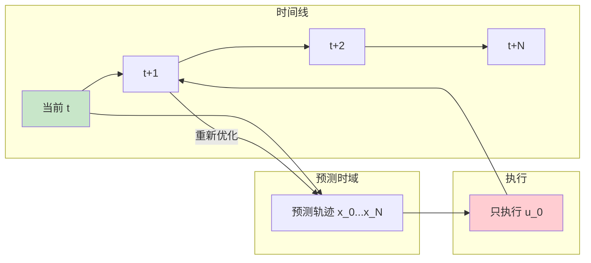
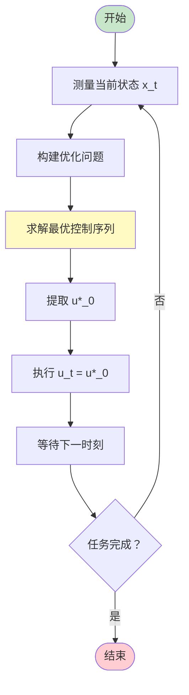

# 模型预测控制

## 1. 概述

模型预测控制（Model Predictive Control, MPC）是一种先进的优化控制方法，它使用系统模型来预测未来行为，并通过在线优化确定最优控制动作。MPC 在强化学习中扮演重要角色，特别是在需要处理约束和长期规划的场景中。

**核心思想**：在每个时间步，基于当前状态和系统模型，求解一个有限时域的最优控制问题，只执行第一个控制动作，然后在下一时间步重新优化。

MPC 的关键特点：
- **基于模型**：需要系统的动态模型
- **滚动时域**：有限视野优化，反复重规划
- **显式约束**：可以直接处理状态和输入约束
- **反馈机制**：通过重优化实现鲁棒性

### 1.1 历史背景

MPC 起源于 1970 年代的工业过程控制，最初用于化工、石油等慢速过程。随着计算能力的提升，MPC 已扩展到快速动态系统，如机器人、自动驾驶和无人机控制。

### 1.2 与强化学习的关系

MPC 与 RL 有密切联系：
- **共同点**：都基于模型进行序贯决策
- **区别**：
  - MPC：在线优化，显式约束处理
  - RL：离线学习，隐式约束（通过奖励）
- **结合**：学习模型 + MPC 规划（如 MBRL）

### 1.3 应用场景

- 自动驾驶（轨迹规划）
- 机器人控制（机械臂、双足）
- 无人机飞行
- 工业过程控制
- 能源管理系统

## 2. 算法原理

### 2.1 基本框架

MPC 在每个时间步 t 解决以下优化问题：

```
最小化：J = Σ_{k=0}^{N-1} l(x_k, u_k) + l_N(x_N)

约束条件:
    x_0 = x_t（当前状态）
    x_{k+1} = f(x_k, u_k)（系统动态）
    u_k ∈ U（输入约束）
    x_k ∈ X（状态约束）
    x_N ∈ X_f（终端约束）
```

其中：
- N：预测时域
- l：阶段成本
- l_N：终端成本
- f：系统动态模型

### 2.2 滚动时域优化



**关键步骤**：
1. 测量当前状态 x_t
2. 求解优化问题得到最优控制序列 u*_0, u*_1, ..., u*_{N-1}
3. 执行 u_t = u*_0
4. 时间推进到 t+1，重复步骤 1-3

### 2.3 数学公式

**系统模型**（离散时间）：
```
x_{k+1} = f(x_k, u_k)
```

对于线性系统：
```
x_{k+1} = A x_k + B u_k
```

**优化问题**（线性二次型 MPC）：
```
最小化：J = Σ_{k=0}^{N-1} (x_k^T Q x_k + u_k^T R u_k) + x_N^T P x_N

约束：
    x_{k+1} = A x_k + B u_k
    u_min ≤ u_k ≤ u_max
    x_min ≤ x_k ≤ x_max
```

其中 Q, R, P 是权重矩阵。

### 2.4 稳定性保证

MPC 的稳定性通过以下方式保证：

1. **终端约束**：
   ```
   x_N ∈ X_f（控制不变集）
   ```

2. **终端成本**：
   ```
   l_N(x) = x^T P x
   P 是 Lyapunov 方程的解
   ```

3. **足够长的时域**：
   - N 足够大时，即使没有终端约束也稳定

## 3. 算法流程

### 3.1 标准 MPC 算法

```
算法：模型预测控制

输入:
    当前状态 x_t
    预测时域 N
    权重矩阵 Q, R, P
    约束 U, X

输出:
    控制动作 u_t

步骤:
1. 测量/估计当前状态 x_t
2. 构建优化问题:
   min_{u_0,...,u_{N-1}} Σ_{k=0}^{N-1} l(x_k, u_k) + l_N(x_N)
   s.t. x_{k+1} = f(x_k, u_k)
        x_0 = x_t
        u_k ∈ U, x_k ∈ X
3. 求解优化问题，得到 u*_0, ..., u*_{N-1}
4. 应用控制：u_t = u*_0
5. 等待下一采样时刻，返回步骤 1
```

### 3.2 流程图



## 4. 代码实现

```python
import numpy as np
from scipy.optimize import minimize

class LinearMPC:
    """线性系统 MPC 控制器"""
    
    def __init__(self, A, B, Q, R, N, u_min=None, u_max=None):
        """
        参数:
            A, B: 系统矩阵 x_{k+1} = A x_k + B u_k
            Q, R: 成本权重
            N: 预测时域
            u_min, u_max: 控制输入约束
        """
        self.A = A
        self.B = B
        self.Q = Q
        self.R = R
        self.N = N
        self.nx = A.shape[0]  # 状态维度
        self.nu = B.shape[1]  # 控制维度
        
        self.u_min = u_min if u_min is not None else -np.inf
        self.u_max = u_max if u_max is not None else np.inf
    
    def predict(self, x0, U):
        """
        预测状态轨迹
        
        参数:
            x0: 初始状态
            U: 控制序列 [u_0, u_1, ..., u_{N-1}]
        
        返回:
            X: 状态轨迹 [x_0, x_1, ..., x_N]
        """
        X = [x0]
        x = x0.copy()
        
        for k in range(self.N):
            u = U[k * self.nu:(k + 1) * self.nu]
            x = self.A @ x + self.B @ u
            X.append(x)
        
        return np.array(X)
    
    def cost(self, U, x0, x_ref):
        """
        计算成本函数
        
        J = Σ (x_k - x_ref)^T Q (x_k - x_ref) + u_k^T R u_k
        """
        X = self.predict(x0, U)
        J = 0
        
        for k in range(self.N):
            x = X[k]
            u = U[k * self.nu:(k + 1) * self.nu]
            J += (x - x_ref).T @ self.Q @ (x - x_ref)
            J += u.T @ self.R @ u
        
        # 终端成本
        x_N = X[-1]
        J += (x_N - x_ref).T @ self.Q @ (x_N - x_ref)
        
        return J
    
    def solve(self, x0, x_ref):
        """
        求解 MPC 优化问题
        
        返回:
            u_opt: 最优控制序列
            x_opt: 最优状态轨迹
        """
        # 优化变量：所有控制输入展平
        U0 = np.zeros(self.N * self.nu)
        
        # 约束
        constraints = []  # 线性 MPC 无等式约束（动态已嵌入）
        bounds = []
        for _ in range(self.N * self.nu):
            bounds.append((self.u_min, self.u_max))
        
        # 求解
        result = minimize(
            self.cost,
            U0,
            args=(x0, x_ref),
            method='SLSQP',
            bounds=bounds,
            constraints=constraints
        )
        
        U_opt = result.x
        X_opt = self.predict(x0, U_opt)
        
        return U_opt, X_opt
    
    def step(self, x0, x_ref):
        """
        执行一步 MPC 控制
        
        返回:
            u0: 要执行的控制动作
        """
        U_opt, X_opt = self.solve(x0, x_ref)
        u0 = U_opt[:self.nu]
        return u0

# 示例：双积分器系统
def create_double_integrator():
    """
    双积分器系统：位置 - 速度
    状态：x = [position, velocity]
    控制：u = acceleration
    """
    dt = 0.1
    
    # 离散化系统
    A = np.array([
        [1, dt],
        [0, 1]
    ])
    
    B = np.array([
        [dt**2 / 2],
        [dt]
    ])
    
    # 成本权重
    Q = np.array([
        [1, 0],
        [0, 0.1]
    ])
    
    R = np.array([[0.01]])
    
    return A, B, Q, R

# 使用示例
if __name__ == "__main__":
    # 创建系统
    A, B, Q, R = create_double_integrator()
    
    # 创建 MPC 控制器
    mpc = LinearMPC(A, B, Q, R, N=20, u_min=-1, u_max=1)
    
    # 初始状态和目标
    x0 = np.array([0, 0])  # 从原点静止开始
    x_ref = np.array([10, 0])  # 目标：位置 10，速度 0
    
    # 仿真
    x = x0.copy()
    trajectory = [x.copy()]
    
    for t in range(50):
        # MPC 控制
        u = mpc.step(x, x_ref)
        
        # 系统动态
        x = A @ x + B @ u
        trajectory.append(x.copy())
        
        if np.linalg.norm(x - x_ref) < 0.1:
            print(f"在 t={t} 时到达目标")
            break
    
    trajectory = np.array(trajectory)
    print(f"最终状态：{x}")
    print(f"位置轨迹：{trajectory[:, 0]}")
```

## 5. 应用场景

### 5.1 自动驾驶

**轨迹规划**：
- 状态：位置、速度、航向角
- 控制：加速度、转向角
- 约束：速度限制、避障、道路边界
- 成本：跟踪参考轨迹、平滑性、舒适度

### 5.2 机器人控制

**机械臂跟踪**：
- 状态：关节角度、角速度
- 控制：关节力矩
- 约束：力矩限制、关节限位
- 成本：跟踪误差、能量消耗

### 5.3 无人机飞行

**四旋翼控制**：
- 状态：位置、速度、姿态、角速度
- 控制：推力、力矩
- 约束：最大推力、姿态限制
- 成本：位置跟踪、能量

### 5.4 过程控制

**化工反应器**：
- 状态：温度、浓度、压力
- 控制：流量、加热功率
- 约束：安全限制、设备容量
- 成本：产量、质量、能耗

## 6. 高级主题

### 6.1 非线性 MPC（NMPC）

对于非线性系统 x_{k+1} = f(x_k, u_k)：
- 优化问题变为非凸
- 需要非线性优化求解器（如 IPOPT）
- 计算成本更高，但更准确

### 6.2 鲁棒 MPC

处理模型不确定性和扰动：
- **Tube MPC**：围绕标称轨迹的"管道"
- **Min-Max MPC**：优化最坏情况
- **随机 MPC**：考虑概率分布

### 6.3 经济 MPC

直接使用经济指标作为成本：
```
J = Σ 经济成本（能耗、原料、产量）
```

与传统 MPC 的区别：
- 传统：跟踪设定点
- 经济：直接优化经济效益

### 6.4 学习增强 MPC

结合机器学习和 MPC：
- **学习模型**：用神经网络学习 f(x,u)
- **学习成本**：从数据学习成本函数
- **学习约束**：从数据学习安全约束

## 7. 总结

模型预测控制是强大的控制方法：

1. **基于模型**：利用系统知识进行预测
2. **显式约束**：直接处理物理和操作限制
3. **滚动优化**：通过重规划实现反馈
4. **广泛应用**：从工业到机器人
5. **与 RL 互补**：MPC 擅长约束处理，RL 擅长学习

MPC 与强化学习的结合（如学习模型 + MPC）是当前研究热点。

## 附录：Mermaid 图表

### MPC 滚动时域示意图

```mermaid
graph TD
    subgraph t 时刻
        X0_t[x_t 当前] --> X1_t[x_1 预测]
        X1_t --> X2_t[x_2 预测]
        X2_t --> dots_t[...]
        dots_t --> XN_t[x_N 预测]
        
        U0_t[u*_0 执行]
        U1_t[u*_1]
        U2_t[u*_2]
        UN_t[u*_N-1]
        
        X0_t -.-> U0_t
        X1_t -.-> U1_t
    end
    
    subgraph t+1 时刻
        X0_t1[x_{t+1} 新测量] --> X1_t1[重新预测]
    end
    
    X0_t -->|执行 u*_0| X0_t1
    X0_t1 -->|重新优化 | X1_t1
    
    style X0_t fill:#c8e6c9
    style X0_t1 fill:#c8e6c9
    style U0_t fill:#ffcdd2
```

### MPC 与 RL 对比

```mermaid
graph LR
    subgraph MPC
        M1[模型 f(x,u)] --> M2[在线优化]
        M2 --> M3[显式约束]
        M3 --> M4[滚动执行]
    end
    
    subgraph RL
        R1[数据收集] --> R2[离线学习]
        R2 --> R3[隐式约束]
        R3 --> R4[直接执行]
    end
    
    M4 -.结合.-> R1
    
    style MPC fill:#e3f2fd
    style RL fill:#fff3e0
```
