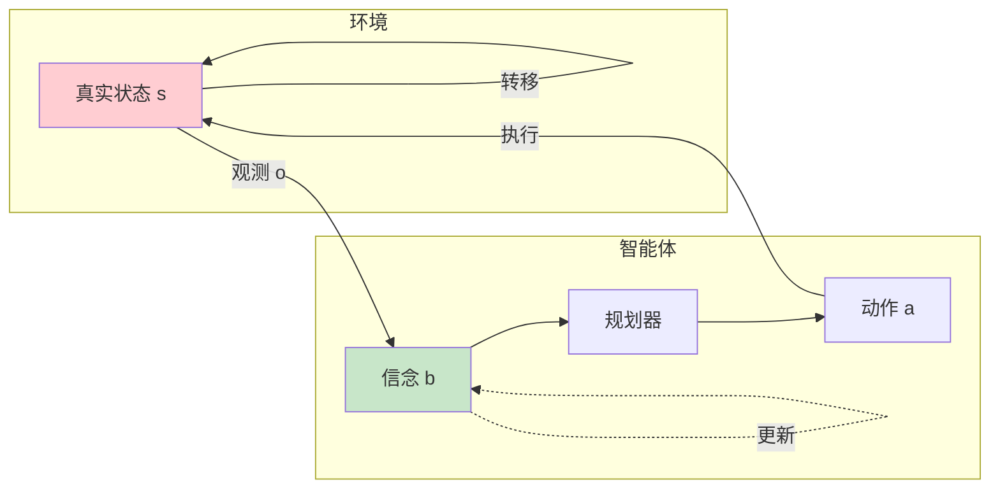
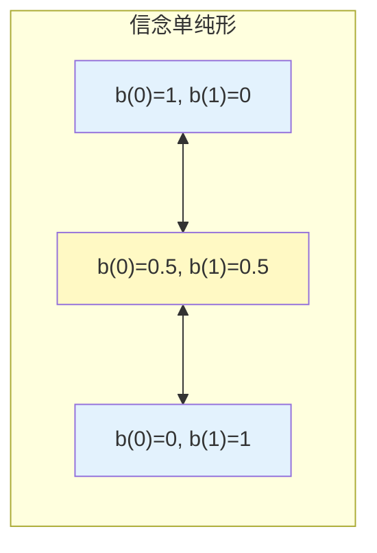

# 部分可观测 MDP

## 1. 概述

部分可观测马尔可夫决策过程（Partially Observable Markov Decision Process, POMDP）是 MDP 的扩展，用于建模智能体无法直接观测到完整状态的场景。在 POMDP 中，智能体只能通过观测来推断状态，这使问题变得更加复杂和贴近现实。

**核心挑战**：智能体不知道确切的状态，只能基于历史观测和动作来估计状态的概率分布（信念状态）。

POMDP 的关键特点：
- **部分可观测**：状态不能直接观测
- **信念状态**：用概率分布表示对状态的置信
- **信息收集**：动作既有工具价值也有信息价值
- **计算复杂**：精确求解是 PSPACE-完全的

### 1.1 与 MDP 的区别

| 方面 | MDP | POMDP |
|------|-----|-------|
| **状态观测** | 完全可观测 | 部分可观测 |
| **决策依据** | 当前状态 s | 信念状态 b(s) |
| **马尔可夫性** | 状态满足 | 信念状态满足 |
| **求解复杂度** | P-完全 | PSPACE-完全 |
| **最优策略** | 状态→动作 | 信念→动作 |

### 1.2 现实应用场景

POMDP 更贴近现实，因为完全观测往往是理想化假设：
- **机器人导航**：传感器噪声、遮挡
- **医疗诊断**：病情不能完全观测
- **扑克游戏**：对手手牌未知
- **对话系统**：用户意图不确定
- **自动驾驶**：其他车辆意图不明

### 1.3 历史背景

POMDP 理论在 1960-70 年代由 Aström 等人奠定基础。由于计算复杂性，早期主要研究小规模问题。2000 年代后，近似算法的发展使 POMDP 能够应用于更大规模的实际问题。

## 2. 数学原理

### 2.1 POMDP 定义

POMDP 由七元组定义：

```
POMDP = (S, A, O, T, Z, R, γ)
```

其中：
- `S`：状态空间
- `A`：动作空间
- `O`：观测空间
- `T`：状态转移函数 T(s'|s,a) = P(s'|s,a)
- `Z`：观测函数 Z(o|s',a) = P(o|s',a)
- `R`：奖励函数 R(s,a)
- `γ`：折扣因子

### 2.2 信念状态

**信念状态**：状态的概率分布

```
b(s) = P(s | h_t)
```

其中 h_t = (a_0, o_1, a_1, o_2, ..., a_{t-1}, o_t) 是历史。

**信念更新**（贝叶斯更新）：
```
b'(s') = P(s' | b, a, o)
       = η · Z(o|s',a) · Σ_s T(s'|s,a) · b(s)
```

其中η是归一化常数。

### 2.3 信念空间 MDP

关键洞察：信念状态 b 满足马尔可夫性！

可以将 POMDP 转化为信念空间上的 MDP：
- **状态**：信念 b ∈ Δ(S)（概率单纯形）
- **动作**：与原 POMDP 相同
- **转移**：τ(b'|b,a) = P(b'|b,a)
- **奖励**：ρ(b,a) = Σ_s b(s) R(s,a)

**最优价值函数**：
```
V*(b) = max_a [ρ(b,a) + γ Σ_o P(o|b,a) V*(b')]
```

### 2.4 α-向量表示

对于有限时域 POMDP，最优价值函数是分段线性和凸的：

```
V(b) = max_{α∈Γ} α · b = max_{α∈Γ} Σ_s α(s) b(s)
```

其中Γ是α-向量的有限集合。

每个α-向量对应一个条件策略（conditional plan）。

## 3. 算法原理

### 2.5 精确算法

**枚举法**（Enumeration）：
- 生成所有可能的α-向量
- 复杂度：O(|A|^|O|^N)，N 为时域
- 仅适用于极小规模问题

**动态规划**：
```
Γ_0 = {零向量}
Γ_{t+1} = 并集_{a,o} 交叉和 (Γ_t, a, o)
```

**Witness 算法**：
- 只生成必要的α-向量
- 通过线性规划验证

### 2.6 近似算法

由于精确算法不可扩展，实际使用近似方法：

**1. 点基值迭代（PBVI）**：
- 只在一组代表性信念点上更新价值
- 可扩展到更大问题

**2. 蒙特卡洛树搜索（POMCP）**：
- 基于采样的在线规划
- 适用于大规模问题

**3. 深度强化学习**：
- 用 RNN/LSTM 编码历史
- 学习信念表示

**4. QMDP**：
- 假设一步后完全可观测
- 下界近似

## 4. 算法流程

### 4.1 信念更新流程

```mermaid
flowchart TD
    Start([当前信念 b_t]) --> Action[执行动作 a_t]
    Action --> Observe[获得观测 o_{t+1}]
    Observe --> Predict[预测：b_pred(s') = Σ_s T(s'|s,a)·b(s)]
    Predict --> Update[更新：b(s') ∝ Z(o|s',a)·b_pred(s')]
    Update --> Normalize[归一化]
    Normalize --> Next[新信念 b_{t+1}]
    
    style Start fill:#c8e6c9
    style Next fill:#ffcdd2
```

### 4.2 在线规划算法（POMCP）

```
算法：POMCP（Partially Observable Monte Carlo Planning）

输入:
    当前历史 h
    模拟次数 N

输出:
    最优动作 a*

步骤:
1. 初始化搜索树（根节点 = h）
2. 重复 N 次：
    a. 从根节点开始选择动作（UCT 选择）
    b. 模拟状态转移和观测
    c. 累积回报
    d. 反向传播更新节点统计
3. 选择访问次数最多的动作
4. 执行动作，获得真实观测
5. 更新历史，重用搜索树
```

## 5. 代码实现

```python
import numpy as np
from collections import defaultdict

class POMDP:
    """POMDP 环境基类"""
    
    def __init__(self, S, A, O, T, Z, R, gamma=0.95):
        """
        S, A, O: 状态、动作、观测空间（列表）
        T: 转移概率 T[s][a][s']
        Z: 观测概率 Z[s'][a][o]
        R: 奖励函数 R[s][a]
        """
        self.S = S
        self.A = A
        self.O = O
        self.T = np.array(T)
        self.Z = np.array(Z)
        self.R = np.array(R)
        self.gamma = gamma
        
        self.nS = len(S)
        self.nA = len(A)
        self.nO = len(O)
        
        self.s = None  # 当前真实状态
    
    def reset(self):
        """重置环境"""
        self.s = np.random.randint(self.nS)
        return self._observe()
    
    def _observe(self):
        """生成观测"""
        obs_probs = self.Z[self.s, :, :]
        # 简化：观测只依赖状态
        obs_probs = obs_probs.mean(axis=0)
        return np.random.choice(self.nO, p=obs_probs)
    
    def step(self, a):
        """执行动作"""
        # 状态转移
        s_next = np.random.choice(self.nS, p=self.T[self.s, a])
        # 奖励
        r = self.R[self.s, a]
        # 观测
        self.s = s_next
        o = self._observe()
        return s_next, r, o, False

class BeliefUpdater:
    """信念状态更新器"""
    
    def __init__(self, pomdp):
        self.pomdp = pomdp
        self.belief = None
    
    def initialize(self, belief=None):
        """初始化信念（均匀分布或给定）"""
        if belief is None:
            self.belief = np.ones(self.pomdp.nS) / self.pomdp.nS
        else:
            self.belief = np.array(belief)
        return self.belief
    
    def update(self, belief, a, o):
        """
        贝叶斯信念更新
        
        b'(s') ∝ Z(o|s',a) · Σ_s T(s'|s,a) · b(s)
        """
        nS = self.pomdp.nS
        
        # 预测步骤：b_pred(s') = Σ_s T(s'|s,a) · b(s)
        b_pred = np.zeros(nS)
        for s_next in range(nS):
            for s in range(nS):
                b_pred[s_next] += self.pomdp.T[s, a, s_next] * belief[s]
        
        # 更新步骤：b'(s') ∝ Z(o|s',a) · b_pred(s')
        b_new = np.zeros(nS)
        for s in range(nS):
            b_new[s] = self.pomdp.Z[s, a, o] * b_pred[s]
        
        # 归一化
        if b_new.sum() > 0:
            b_new = b_new / b_new.sum()
        else:
            # 防止数值问题
            b_new = np.ones(nS) / nS
        
        return b_new
    
    def step(self, a, o):
        """执行一步信念更新"""
        self.belief = self.update(self.belief, a, o)
        return self.belief

class QMDPSolver:
    """QMDP 近似求解器"""
    
    def __init__(self, pomdp):
        self.pomdp = pomdp
        self.V_mdp = None
    
    def solve_mdp(self, max_iterations=1000, threshold=1e-6):
        """求解底层 MDP 的最优价值"""
        V = np.zeros(self.pomdp.nS)
        
        for _ in range(max_iterations):
            delta = 0
            V_new = np.zeros(self.pomdp.nS)
            
            for s in range(self.pomdp.nS):
                q_values = np.zeros(self.pomdp.nA)
                for a in range(self.pomdp.nA):
                    q_values[a] = self.pomdp.R[s, a]
                    for s_next in range(self.pomdp.nS):
                        q_values[a] += self.pomdp.gamma * self.pomdp.T[s, a, s_next] * V[s_next]
                
                V_new[s] = np.max(q_values)
                delta = max(delta, abs(V_new[s] - V[s]))
            
            V = V_new
            if delta < threshold:
                break
        
        self.V_mdp = V
        return V
    
    def get_q_values(self, belief):
        """
        计算信念状态下的 Q 值
        
        Q(b,a) = Σ_s b(s) · Q_MDP(s,a)
        Q_MDP(s,a) ≈ R(s,a) + γ Σ T(s'|s,a) V_MDP(s')
        """
        if self.V_mdp is None:
            self.solve_mdp()
        
        Q = np.zeros(self.pomdp.nA)
        
        for a in range(self.pomdp.nA):
            for s in range(self.pomdp.nS):
                # Q_MDP(s,a)
                q_mdp = self.pomdp.R[s, a]
                for s_next in range(self.pomdp.nS):
                    q_mdp += self.pomdp.gamma * self.pomdp.T[s, a, s_next] * self.V_mdp[s_next]
                
                Q[a] += belief[s] * q_mdp
        
        return Q
    
    def select_action(self, belief):
        """基于 QMDP 选择动作"""
        Q = self.get_q_values(belief)
        return np.argmax(Q)

# 示例：老虎机问题（经典 POMDP 基准）
def create_tiger_problem():
    """
    老虎机问题：
    - 2 个状态：老虎在左/右
    - 3 个动作：开左门、开右门、听声音
    - 2 个观测：听到左/右有声音
    """
    S = [0, 1]  # 0: 老虎在左，1: 老虎在右
    A = [0, 1, 2]  # 0: 开左，1: 开右，2: 听
    O = [0, 1]  # 0: 听左声，1: 听右声
    
    # 转移（老虎位置不变，除非开门后重置）
    T = np.zeros((2, 3, 2))
    for a in range(3):
        T[:, a, :] = np.eye(2)  # 状态不变
    
    # 观测（听声音有 85% 准确率）
    Z = np.zeros((2, 3, 2))
    # 听动作
    Z[0, 2, 0] = 0.85  # 老虎在左，听到左声
    Z[0, 2, 1] = 0.15
    Z[1, 2, 0] = 0.15
    Z[1, 2, 1] = 0.85
    # 开门动作（无信息）
    Z[:, 0, :] = 0.5
    Z[:, 1, :] = 0.5
    
    # 奖励
    R = np.zeros((2, 3))
    R[:, 2] = -1  # 听声音代价
    R[0, 0] = -100  # 开左门，老虎在左
    R[1, 0] = 10    # 开左门，老虎在右（得宝）
    R[0, 1] = 10    # 开右门，老虎在左（得宝）
    R[1, 1] = -100  # 开右门，老虎在右
    
    return POMDP(S, A, O, T, Z, R, gamma=0.95)

# 使用示例
if __name__ == "__main__":
    # 创建环境
    env = create_tiger_problem()
    
    # 信念更新器
    updater = BeliefUpdater(env)
    belief = updater.initialize()
    
    # QMDP 求解器
    solver = QMDPSolver(env)
    solver.solve_mdp()
    
    print("初始信念:", belief)
    print("MDP 价值:", solver.V_mdp)
    
    # 仿真
    for t in range(10):
        # 选择动作
        a = solver.select_action(belief)
        
        # 执行
        s, r, o = env.step(a)
        
        # 更新信念
        belief = updater.update(belief, a, o)
        
        action_names = ['开左', '开右', '听']
        print(f"t={t}: 动作={action_names[a]}, 奖励={r}, 信念={belief}")
        
        if a < 2:  # 开门后重置
            env.reset()
            belief = updater.initialize()
```

## 6. 应用场景

### 6.1 机器人导航

- **问题**：传感器噪声、动态障碍
- **信念**：机器人位置的概率分布
- **应用**：SLAM、避障、探索

### 6.2 医疗诊断

- **问题**：病情不能完全观测
- **信念**：疾病状态的概率
- **应用**：诊断测试选择、治疗方案

### 6.3 对话系统

- **问题**：用户意图不确定
- **信念**：用户目标的分布
- **应用**：槽位填充、澄清提问

### 6.4 游戏 AI

- **问题**：对手信息隐藏
- **信念**：对手手牌/策略
- **应用**：扑克、星际争霸

## 7. 总结

POMDP 是更通用的序贯决策框架：

1. **部分可观测**：更贴近现实
2. **信念状态**：将 POMDP 转化为信念空间 MDP
3. **计算挑战**：精确求解困难，需近似
4. **信息价值**：动作有收集信息的价值
5. **广泛应用**：机器人、医疗、对话等

理解 POMDP 对于处理现实世界的不确定性至关重要。

## 附录：Mermaid 图表

### POMDP 决策循环



### 信念空间可视化（2 状态）


