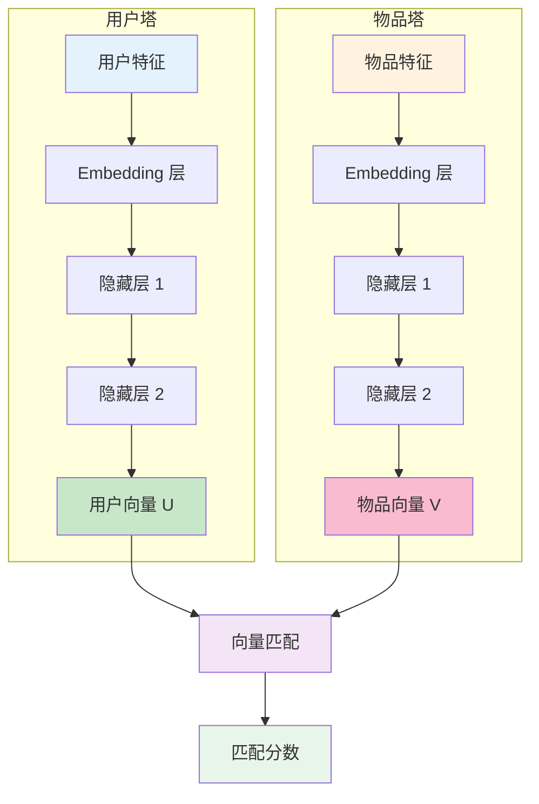
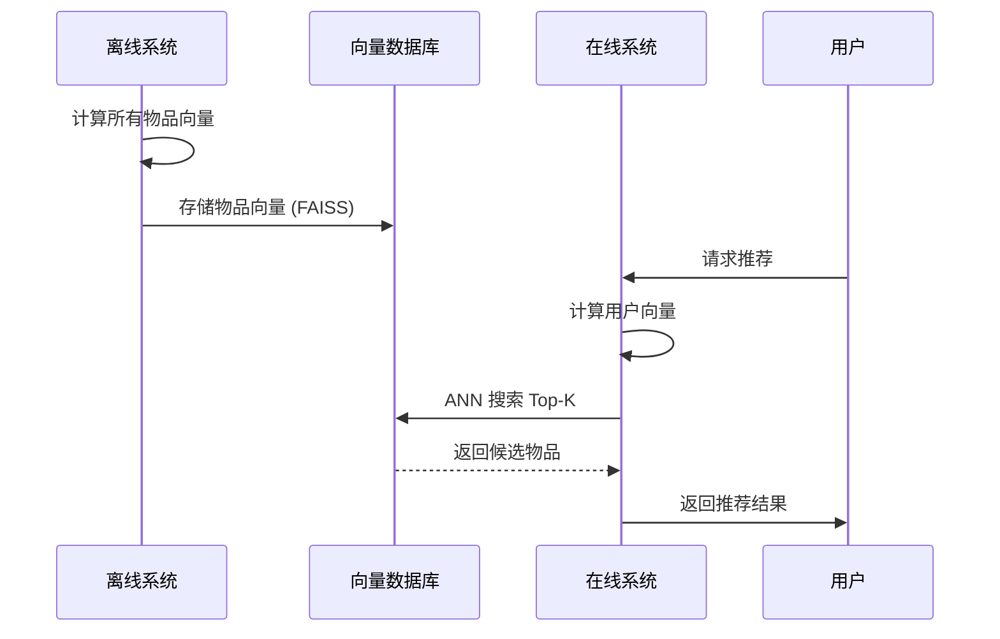
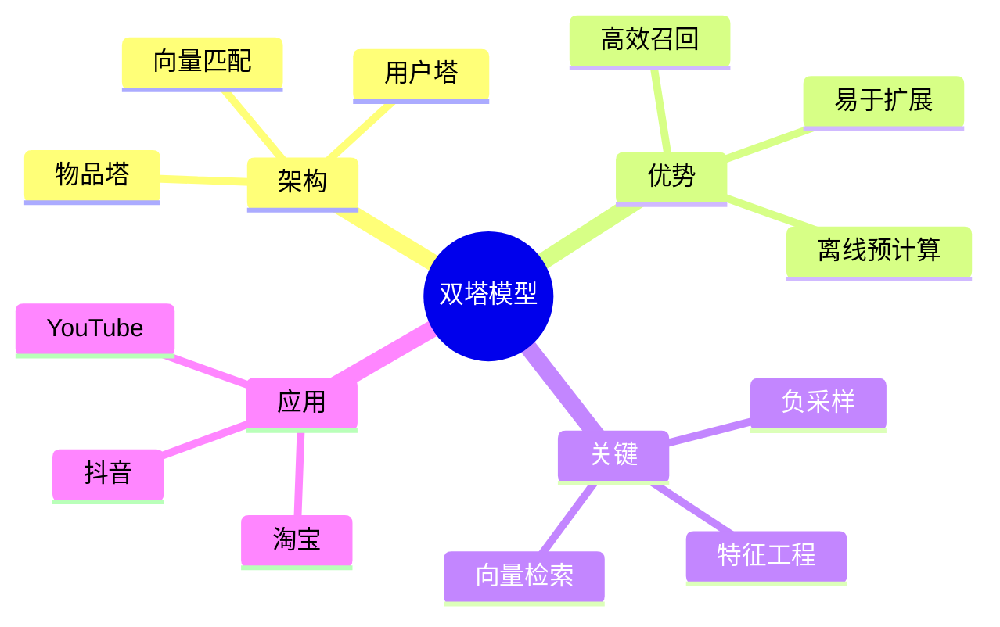

# 双塔模型（Two-Tower Model）

## 1. 概述

双塔模型（Two-Tower Model）是推荐系统召回阶段的经典深度学习架构。它通过两个独立的神经网络分别学习用户和物品的表示，然后在向量空间中进行匹配。

双塔模型的核心优势：**用户塔和物品塔独立计算，支持离线预计算物品向量，在线实时用户向量，实现高效的大规模召回**。

## 2. 模型架构

### 2.1 整体结构



### 2.2 数学形式化

**用户塔：**
$$u = f_U(x_U; \theta_U)$$

**物品塔：**
$$v = f_I(x_I; \theta_I)$$

**匹配分数：**
$$s(u, v) = u^T \cdot v = \sum_{k=1}^{d} u_k \cdot v_k$$

其中：
- $x_U$：用户特征
- $x_I$：物品特征
- $\theta_U, \theta_I$：用户塔和物品塔参数
- $d$：向量维度

## 3. 特征工程

### 3.1 用户特征

```python
user_features = {
    # 统计特征
    "user_id": "embedding",
    "age": "numeric",
    "gender": "embedding",
    "city": "embedding",
    
    # 行为统计
    "click_count_7d": "numeric",
    "purchase_count_30d": "numeric",
    "avg_session_duration": "numeric",
    
    # 序列特征（需聚合）
    "last_5_categories": "multi-hot",
    "last_10_brands": "embedding_pooling",
    
    # 上下文
    "current_hour": "embedding",
    "device_type": "embedding",
}
```

### 3.2 物品特征

```python
item_features = {
    # 基本属性
    "item_id": "embedding",
    "category": "embedding",
    "brand": "embedding",
    "price": "numeric",
    
    # 统计特征
    "avg_rating": "numeric",
    "click_count": "numeric",
    "conversion_rate": "numeric",
    
    # 文本特征
    "title_embedding": "pretrained_bert",
    "description_embedding": "pretrained_bert",
    
    # 图像特征
    "image_embedding": "pretrained_resnet",
}
```

## 4. 模型实现

### 4.1 PyTorch 实现

```python
import torch
import torch.nn as nn
import torch.nn.functional as F

class TwoTowerModel(nn.Module):
    def __init__(self, user_config, item_config, embedding_dim=64):
        super().__init__()
        
        # 用户塔
        self.user_embeddings = nn.ModuleDict({
            name: nn.Embedding(size, embedding_dim)
            for name, size in user_config['categorical'].items()
        })
        
        user_numeric_dim = sum(user_config['numeric_dims'])
        self.user_tower = nn.Sequential(
            nn.Linear(embedding_dim * len(user_config['categorical']) + user_numeric_dim, 256),
            nn.ReLU(),
            nn.BatchNorm1d(256),
            nn.Dropout(0.3),
            nn.Linear(256, 128),
            nn.ReLU(),
            nn.BatchNorm1d(128),
            nn.Linear(128, embedding_dim)
        )
        
        # 物品塔
        self.item_embeddings = nn.ModuleDict({
            name: nn.Embedding(size, embedding_dim)
            for name, size in item_config['categorical'].items()
        })
        
        item_numeric_dim = sum(item_config['numeric_dims'])
        self.item_tower = nn.Sequential(
            nn.Linear(embedding_dim * len(item_config['categorical']) + item_numeric_dim, 256),
            nn.ReLU(),
            nn.BatchNorm1d(256),
            nn.Dropout(0.3),
            nn.Linear(256, 128),
            nn.ReLU(),
            nn.BatchNorm1d(128),
            nn.Linear(128, embedding_dim)
        )
    
    def user_forward(self, user_features):
        """用户塔前向传播"""
        embeds = []
        
        # 类别特征 embedding
        for name, emb in self.user_embeddings.items():
            embeds.append(emb(user_features[name]))
        
        # 数值特征拼接
        if 'numeric' in user_features:
            embeds.append(user_features['numeric'])
        
        user_repr = torch.cat(embeds, dim=1)
        user_vector = self.user_tower(user_repr)
        user_vector = F.normalize(user_vector, p=2, dim=1)  # L2 归一化
        
        return user_vector
    
    def item_forward(self, item_features):
        """物品塔前向传播"""
        embeds = []
        
        for name, emb in self.item_embeddings.items():
            embeds.append(emb(item_features[name]))
        
        if 'numeric' in item_features:
            embeds.append(item_features['numeric'])
        
        item_repr = torch.cat(embeds, dim=1)
        item_vector = self.item_tower(item_repr)
        item_vector = F.normalize(item_vector, p=2, dim=1)
        
        return item_vector
    
    def forward(self, user_features, item_features):
        """计算匹配分数"""
        user_vector = self.user_forward(user_features)
        item_vector = self.item_forward(item_features)
        
        # 点积作为匹配分数
        score = torch.sum(user_vector * item_vector, dim=1, keepdim=True)
        
        return score, user_vector, item_vector
```

### 4.2 损失函数

```python
class BPRLoss(nn.Module):
    """BPR 排序损失"""
    
    def forward(self, pos_scores, neg_scores):
        """
        pos_scores: 正样本分数 (batch_size, 1)
        neg_scores: 负样本分数 (batch_size, 1)
        """
        diff = pos_scores - neg_scores
        loss = -torch.mean(torch.log(torch.sigmoid(diff) + 1e-8))
        return loss


class ContrastiveLoss(nn.Module):
    """对比损失（InfoNCE）"""
    
    def __init__(self, temperature=0.07):
        super().__init__()
        self.temperature = temperature
    
    def forward(self, user_vectors, item_vectors):
        """
        user_vectors: (batch_size, dim)
        item_vectors: (batch_size, dim)
        """
        batch_size = user_vectors.shape[0]
        
        # 计算相似度矩阵
        sim_matrix = user_vectors @ item_vectors.T / self.temperature
        
        # 对角线是正样本
        labels = torch.arange(batch_size).to(user_vectors.device)
        
        # 交叉熵损失
        loss = F.cross_entropy(sim_matrix, labels)
        
        return loss
```

### 4.3 训练代码

```python
def train_two_tower(model, train_loader, optimizer, device, n_epochs=10):
    """训练双塔模型"""
    
    model.to(device)
    model.train()
    
    for epoch in range(n_epochs):
        total_loss = 0.0
        
        for batch in train_loader:
            user_features = {k: v.to(device) for k, v in batch['user'].items()}
            pos_item_features = {k: v.to(device) for k, v in batch['pos_item'].items()}
            neg_item_features = {k: v.to(device) for k, v in batch['neg_item'].items()}
            
            optimizer.zero_grad()
            
            # 正样本分数
            pos_score, _, _ = model(user_features, pos_item_features)
            
            # 负样本分数
            neg_score, _, _ = model(user_features, neg_item_features)
            
            # BPR 损失
            loss_fn = BPRLoss()
            loss = loss_fn(pos_score, neg_score)
            
            loss.backward()
            optimizer.step()
            
            total_loss += loss.item()
        
        avg_loss = total_loss / len(train_loader)
        print(f"Epoch {epoch + 1}/{n_epochs}, Loss: {avg_loss:.4f}")
```

## 5. 召回流程

### 5.1 离线 + 在线架构



### 5.2 FAISS 向量检索

```python
import faiss
import numpy as np

class VectorIndex:
    def __init__(self, dim=64, n_items=1000000):
        self.dim = dim
        # IVFPQ 索引（适合大规模）
        quantizer = faiss.IndexFlatIP(dim)  # 内积
        self.index = faiss.IndexIVFPQ(quantizer, dim, 100, 8, 8)
        
    def train(self, item_vectors):
        """训练索引"""
        self.index.train(item_vectors.astype('float32'))
    
    def add(self, item_vectors, item_ids):
        """添加物品向量"""
        self.index.add(item_vectors.astype('float32'))
        self.item_ids = item_ids
    
    def search(self, user_vector, k=100):
        """搜索最近邻"""
        D, I = self.index.search(user_vector.astype('float32').reshape(1, -1), k)
        
        # 返回物品 ID 和分数
        return [(self.item_ids[i], D[0][j]) for j, i in enumerate(I[0])]
    
    def save(self, path):
        faiss.write_index(self.index, path)
    
    def load(self, path):
        self.index = faiss.read_index(path)
```

## 6. 优化技巧

### 6.1 难负采样

```python
def hard_negative_sampling(user_vector, item_vectors, pos_items, k=10):
    """
    选择分数最高的负样本作为难负例
    """
    scores = item_vectors @ user_vector
    
    # 排除正样本
    scores[pos_items] = -float('inf')
    
    # 选择 top-k 作为难负例
    hard_negatives = np.argsort(scores)[::-1][:k]
    
    return hard_negatives
```

### 6.2 温度参数

```python
class TemperatureScaling(nn.Module):
    """温度缩放，调节向量分布"""
    
    def __init__(self, dim=64):
        super().__init__()
        self.temperature = nn.Parameter(torch.ones(1) * 0.07)
    
    def forward(self, user_vectors, item_vectors):
        sim = user_vectors @ item_vectors.T
        sim = sim / self.temperature.clamp(min=0.01)
        return sim
```

### 6.3 多任务学习

```python
class MultiTaskTwoTower(nn.Module):
    """多任务双塔模型"""
    
    def __init__(self, base_model, n_tasks=3):
        super().__init__()
        self.base_model = base_model
        self.task_towers = nn.ModuleList([
            nn.Sequential(
                nn.Linear(64, 32),
                nn.ReLU(),
                nn.Linear(32, 1)
            ) for _ in range(n_tasks)
        ])
    
    def forward(self, user_features, item_features, task_id):
        _, user_vec, item_vec = self.base_model(user_features, item_features)
        
        # 拼接
        combined = torch.cat([user_vec, item_vec], dim=1)
        
        # 特定任务输出
        output = self.task_towers[task_id](combined)
        
        return output
```

## 7. 工业应用

### 7.1 YouTube DNN 召回

YouTube 的双塔召回架构：

```
用户塔输入：
├── 观看历史（视频 ID embedding）
├── 搜索历史
├── 人口统计学特征
└── 上下文特征

物品塔输入：
├── 视频 ID embedding
├── 类别 embedding
└── 上传时间等

输出：
├── 128 维用户向量
├── 128 维物品向量
└── 内积匹配
```

### 7.2 淘宝推荐

```
用户特征：
├── 基础画像
├── 行为序列（注意力聚合）
├── 实时行为
└── 社交关系

物品特征：
├── 商品属性
├── 商家信息
├── 统计特征
└── 图像/文本 embedding

规模：
├── 亿级用户
├── 十亿级物品
└── 毫秒级召回
```

## 8. 总结



**核心要点：**
1. 双塔独立计算，支持高效召回
2. 物品向量离线预计算，用户向量在线计算
3. FAISS 等 ANN 库实现快速检索
4. 负采样策略对效果影响大
5. 特征工程是核心竞争点
