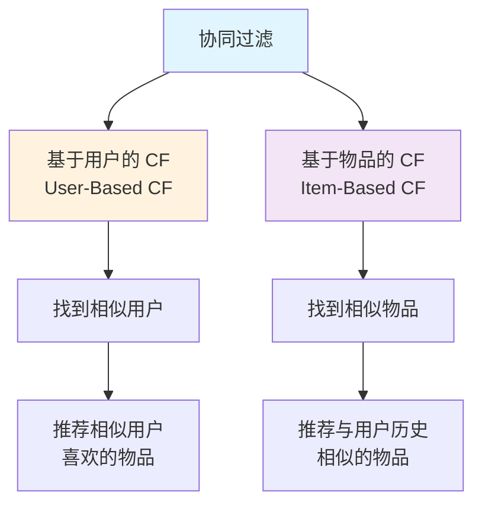
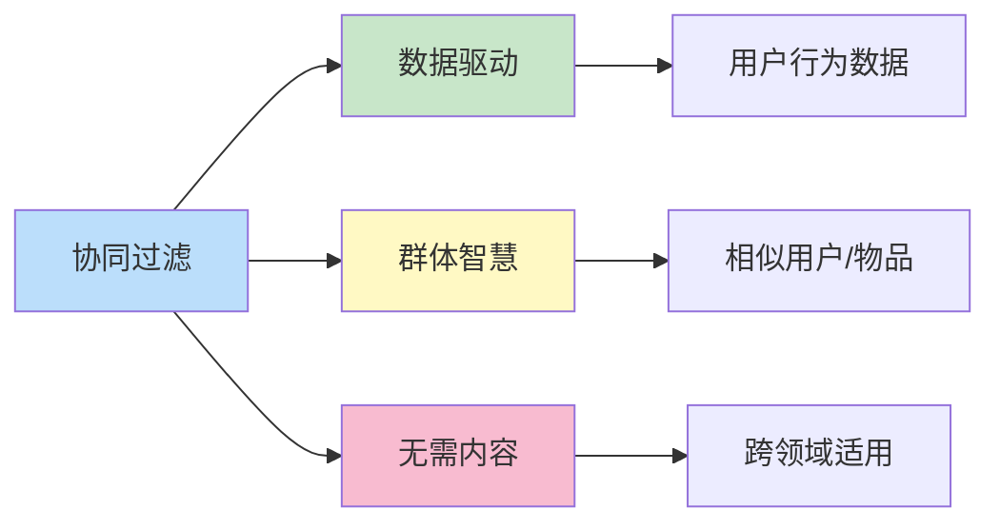

# 协同过滤（Collaborative Filtering）

## 1. 概述

协同过滤（Collaborative Filtering，简称 CF）是推荐系统中最经典、应用最广泛的算法之一。它的核心思想是：**利用用户群体的集体智慧来进行个性化推荐**。

协同过滤的基本假设是：
- 如果两个用户在过去对某些物品的评价相似，那么他们在未来对其他物品的评价也可能相似
- 如果两个物品被同一组用户以相似的方式评价，那么这两个物品是相似的

## 2. 核心原理

### 2.1 基于邻域的方法

协同过滤主要分为两大类：



### 2.2 数学表达

用户 - 物品评分矩阵 $R \in \mathbb{R}^{m \times n}$，其中：
- $m$ 表示用户数量
- $n$ 表示物品数量
- $r_{ui}$ 表示用户 $u$ 对物品 $i$ 的评分

预测评分公式：

$$\hat{r}_{ui} = \mu + b_u + b_i + \sum_{k \in K} w_{uk} \cdot (r_{ki} - \mu)$$

其中：
- $\mu$ 是全局平均评分
- $b_u$ 是用户偏置
- $b_i$ 是物品偏置
- $w_{uk}$ 是用户相似度权重

## 3. 相似度计算

### 3.1 余弦相似度（Cosine Similarity）

$$\text{sim}(u, v) = \cos(\theta) = \frac{\vec{u} \cdot \vec{v}}{||\vec{u}|| \cdot ||\vec{v}||} = \frac{\sum_{i \in I_{uv}} r_{ui} \cdot r_{vi}}{\sqrt{\sum_{i \in I_u} r_{ui}^2} \cdot \sqrt{\sum_{i \in I_v} r_{vi}^2}}$$

### 3.2 皮尔逊相关系数（Pearson Correlation）

$$\text{sim}(u, v) = \frac{\sum_{i \in I_{uv}} (r_{ui} - \bar{r}_u)(r_{vi} - \bar{r}_v)}{\sqrt{\sum_{i \in I_u} (r_{ui} - \bar{r}_u)^2} \cdot \sqrt{\sum_{i \in I_v} (r_{vi} - \bar{r}_v)^2}}$$

### 3.3 杰卡德相似度（Jaccard Similarity）

适用于隐式反馈：

$$\text{sim}(u, v) = \frac{|I_u \cap I_v|}{|I_u \cup I_v|}$$

## 4. 算法实现

### 4.1 User-Based CF 实现

```python
import numpy as np
from collections import defaultdict

class UserBasedCF:
    def __init__(self, n_neighbors=20):
        self.n_neighbors = n_neighbors
        self.user_similarity = None
        self.user_items = defaultdict(set)
        
    def fit(self, ratings):
        """
        ratings: dict {(user_id, item_id): rating}
        """
        # 构建用户 - 物品映射
        for (u, i), r in ratings.items():
            self.user_items[u].add(i)
        
        # 计算用户相似度矩阵
        users = list(set(u for u, i in ratings.keys()))
        n_users = len(users)
        self.user_similarity = np.zeros((n_users, n_users))
        
        for i, u in enumerate(users):
            for j, v in enumerate(users):
                if i == j:
                    self.user_similarity[i, j] = 1.0
                else:
                    self.user_similarity[i, j] = self._cosine_similarity(u, v, ratings)
        
        return self
    
    def _cosine_similarity(self, u, v, ratings):
        # 找到共同评分的物品
        common_items = self.user_items[u] & self.user_items[v]
        if not common_items:
            return 0.0
        
        vec_u = [ratings[(u, i)] for i in common_items]
        vec_v = [ratings[(v, i)] for i in common_items]
        
        dot_product = sum(a * b for a, b in zip(vec_u, vec_v))
        norm_u = np.sqrt(sum(a ** 2 for a in vec_u))
        norm_v = np.sqrt(sum(b ** 2 for b in vec_v))
        
        if norm_u == 0 or norm_v == 0:
            return 0.0
        
        return dot_product / (norm_u * norm_v)
    
    def recommend(self, user_id, ratings, n_recommendations=10):
        # 找到最相似的 K 个用户
        user_idx = list(set(u for u, i in ratings.keys())).index(user_id)
        similar_users = np.argsort(self.user_similarity[user_idx])[::-1][1:self.n_neighbors + 1]
        
        # 收集推荐候选
        item_scores = defaultdict(float)
        item_sim_sum = defaultdict(float)
        
        for neighbor_idx in similar_users:
            neighbor_id = list(set(u for u, i in ratings.keys()))[neighbor_idx]
            sim = self.user_similarity[user_idx, neighbor_idx]
            
            for (u, i), r in ratings.items():
                if u == neighbor_id and i not in self.user_items[user_id]:
                    item_scores[i] += sim * r
                    item_sim_sum[i] += abs(sim)
        
        # 归一化并排序
        recommendations = []
        for item_id in item_scores:
            if item_sim_sum[item_id] > 0:
                score = item_scores[item_id] / item_sim_sum[item_id]
                recommendations.append((item_id, score))
        
        recommendations.sort(key=lambda x: x[1], reverse=True)
        return recommendations[:n_recommendations]
```

### 4.2 Item-Based CF 实现

```python
class ItemBasedCF:
    def __init__(self, n_neighbors=20):
        self.n_neighbors = n_neighbors
        self.item_similarity = None
        self.user_items = defaultdict(set)
        self.item_users = defaultdict(set)
        
    def fit(self, ratings):
        # 构建映射
        for (u, i), r in ratings.items():
            self.user_items[u].add(i)
            self.item_users[i].add(u)
        
        # 计算物品相似度
        items = list(set(i for u, i in ratings.keys()))
        n_items = len(items)
        self.item_similarity = np.zeros((n_items, n_items))
        
        for i, item1 in enumerate(items):
            for j, item2 in enumerate(items):
                if i == j:
                    self.item_similarity[i, j] = 1.0
                else:
                    self.item_similarity[i, j] = self._adjusted_cosine(item1, item2, ratings)
        
        return self
    
    def _adjusted_cosine(self, i1, i2, ratings):
        # 找到共同评分的用户
        common_users = self.item_users[i1] & self.item_users[i2]
        if not common_users:
            return 0.0
        
        # 计算用户平均评分
        user_avg = {}
        for u in common_users:
            user_ratings = [r for (user, item), r in ratings.items() if user == u]
            user_avg[u] = np.mean(user_ratings)
        
        vec_i1 = [ratings[(u, i1)] - user_avg[u] for u in common_users]
        vec_i2 = [ratings[(u, i2)] - user_avg[u] for u in common_users]
        
        dot_product = sum(a * b for a, b in zip(vec_i1, vec_i2))
        norm_i1 = np.sqrt(sum(a ** 2 for a in vec_i1))
        norm_i2 = np.sqrt(sum(b ** 2 for b in vec_i2))
        
        if norm_i1 == 0 or norm_i2 == 0:
            return 0.0
        
        return dot_product / (norm_i1 * norm_i2)
    
    def recommend(self, user_id, ratings, n_recommendations=10):
        user_history = [(i, r) for (u, i), r in ratings.items() if u == user_id]
        
        item_scores = defaultdict(float)
        
        for hist_item, hist_rating in user_history:
            hist_idx = list(set(i for u, i in ratings.keys())).index(hist_item)
            
            for item_idx, sim in enumerate(self.item_similarity[hist_idx]):
                if sim > 0:
                    item_id = list(set(i for u, i in ratings.keys()))[item_idx]
                    if item_id not in self.user_items[user_id]:
                        item_scores[item_id] += sim * hist_rating
        
        recommendations = sorted(item_scores.items(), key=lambda x: x[1], reverse=True)
        return recommendations[:n_recommendations]
```

## 5. 优缺点分析

### 5.1 优点

| 优点 | 说明 |
|------|------|
| **无需领域知识** | 不需要了解物品内容，纯基于行为数据 |
| **发现潜在兴趣** | 能发现用户潜在但未明确表达的兴趣 |
| **效果稳定** | 在多种场景下都有不错的表现 |
| **可解释性强** | "因为和你相似的用户喜欢..."易于理解 |

### 5.2 缺点

| 缺点 | 说明 | 解决方案 |
|------|------|----------|
| **冷启动问题** | 新用户/物品无法推荐 | 混合推荐、内容推荐 |
| **稀疏性问题** | 评分矩阵稀疏导致相似度不准 | 矩阵分解、降维 |
| **可扩展性差** | 用户/物品增多时计算量大 | 采样、聚类、近似最近邻 |
| **流行度偏差** | 热门物品更容易被推荐 | 去偏算法、多样性优化 |

## 6. 工业界应用

### 6.1 Amazon 的 Item-to-Item CF

Amazon 是最早大规模应用协同过滤的公司之一：
- 使用 Item-Based CF 而非 User-Based（物品数相对稳定）
- 离线计算物品相似度，在线快速查询
- "买了又买"、"看了又看"功能的核心算法

### 6.2 Netflix 推荐

Netflix Prize 竞赛推动了协同过滤的发展：
- 结合多种 CF 变体
- 与矩阵分解结合
- 时序加权处理

## 7. 优化技巧

### 7.1 相似度归一化

```python
def normalized_similarity(raw_sim, n_common_items, min_common=3):
    """考虑共同评分数量的相似度归一化"""
    if n_common_items < min_common:
        return raw_sim * (n_common_items / min_common)
    return raw_sim
```

### 7.2 时间衰减

```python
def time_weighted_rating(rating, timestamp, current_time, half_life_days=30):
    """时间衰减加权"""
    import math
    days_diff = (current_time - timestamp).days
    decay_factor = math.pow(0.5, days_diff / half_life_days)
    return rating * decay_factor
```

### 7.3 多样性优化

```python
def diversify_recommendations(recommendations, item_categories, diversity_weight=0.3):
    """MMR (Maximal Marginal Relevance) 多样性优化"""
    selected = []
    remaining = recommendations.copy()
    
    while remaining and len(selected) < 10:
        best_score = -float('inf')
        best_item = None
        
        for item, score in remaining:
            # 相关性 - 多样性惩罚
            sim_to_selected = max(
                cosine_similarity(item, s) for s in selected
            ) if selected else 0
            
            mmr_score = diversity_weight * score - (1 - diversity_weight) * sim_to_selected
            
            if mmr_score > best_score:
                best_score = mmr_score
                best_item = (item, score)
        
        if best_item:
            selected.append(best_item[0])
            remaining.remove(best_item)
    
    return selected
```

## 8. 总结

协同过滤作为推荐系统的基石算法，具有以下特点：



**关键要点：**
1. User-Based 适合用户少、物品多的场景
2. Item-Based 适合物品稳定、用户多的场景
3. 相似度计算是核心，需根据数据特点选择
4. 工业应用中常与其他算法融合使用
5. 冷启动和稀疏性是主要挑战

协同过滤虽然"古老"，但至今仍是推荐系统的重要组成部分，理解它是深入学习推荐系统的基础。
