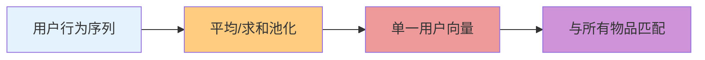
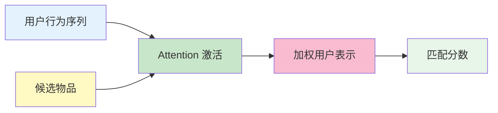
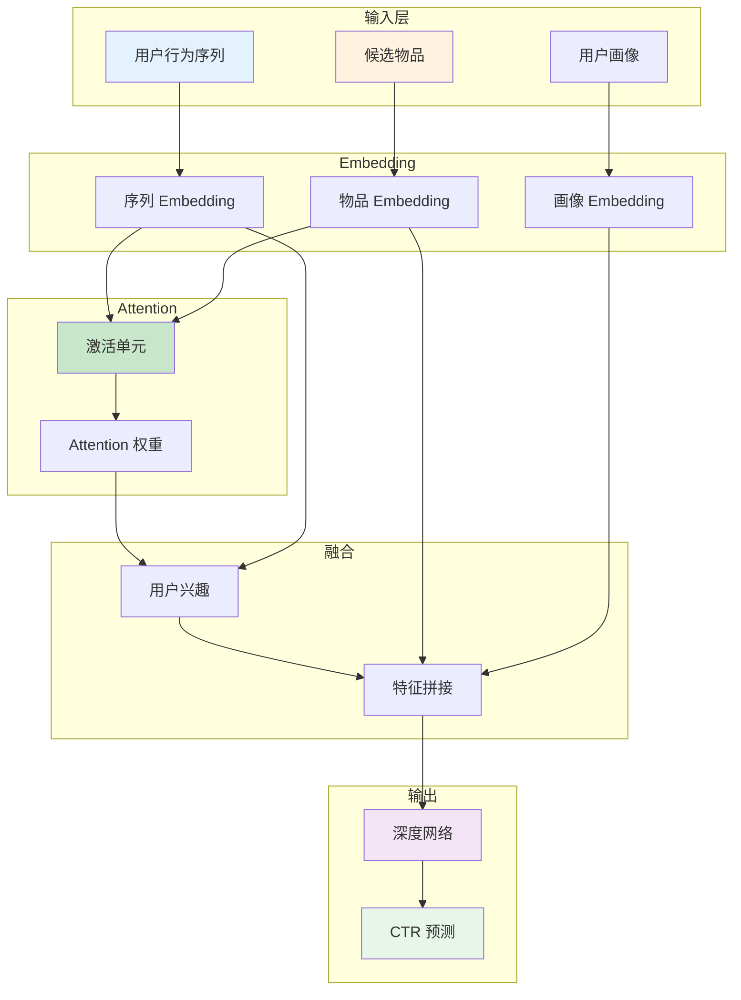
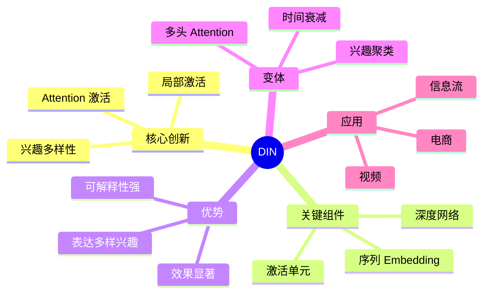

# DIN（Deep Interest Network）

## 1. 概述

DIN（Deep Interest Network）是阿里巴巴在 2018 年提出的序列推荐模型，核心创新是**Attention 机制捕捉用户兴趣的多样性**。

传统方法将用户行为序列压缩为单一向量，无法表达用户多样的兴趣。DIN 通过 Attention 机制，让候选物品"激活"相关的历史行为，实现**兴趣的自适应表达**。

## 2. 核心思想

### 2.1 问题动机

**传统方法的局限：**



**问题：**
- 用户兴趣是多样的（喜欢多种类型）
- 单一向量无法表达多样性
- 候选物品不同，相关历史行为也不同

**DIN 的解决方案：**



**核心思想：**
- 对于不同候选物品，用户兴趣表示不同
- 通过 Attention 权重激活相关历史行为
- 实现"兴趣的局部激活"

### 2.2 数学形式化

**Attention 权重：**

$$a_i = \frac{\exp(f(\mathbf{v}_A, \mathbf{h}_i))}{\sum_{j=1}^{N} \exp(f(\mathbf{v}_A, \mathbf{h}_j))}$$

其中：
- $\mathbf{v}_A$：候选物品向量
- $\mathbf{h}_i$：第 $i$ 个历史行为向量
- $f(\cdot)$：激活函数（MLP）

**激活单元（Activation Unit）：**

$$f(\mathbf{v}_A, \mathbf{h}_i) = \text{MLP}([\mathbf{v}_A, \mathbf{h}_i, \mathbf{v}_A - \mathbf{h}_i, \mathbf{v}_A \odot \mathbf{h}_i])$$

**用户兴趣表示：**

$$\mathbf{u} = \sum_{i=1}^{N} a_i \cdot \mathbf{h}_i$$

## 3. 模型架构

### 3.1 整体结构



### 3.2 激活单元详解

```python
import torch
import torch.nn as nn

class ActivationUnit(nn.Module):
    """DIN 激活单元"""
    
    def __init__(self, embedding_dim, hidden_units=[64, 32]):
        super().__init__()
        
        # 输入：[v_A, h_i, v_A - h_i, v_A ⊙ h_i]
        input_dim = embedding_dim * 4
        
        layers = []
        for hidden in hidden_units:
            layers.extend([
                nn.Linear(input_dim, hidden),
                nn.ReLU(),
                nn.Dropout(0.3)
            ])
            input_dim = hidden
        
        layers.append(nn.Linear(hidden_units[-1], 1))
        self.mlp = nn.Sequential(*layers)
    
    def forward(self, candidate, history_seq):
        """
        candidate: (batch, embedding_dim) 候选物品
        history_seq: (batch, seq_len, embedding_dim) 历史序列
        """
        batch_size, seq_len, _ = history_seq.shape
        
        # 扩展 candidate 到序列维度
        candidate_exp = candidate.unsqueeze(1).expand(-1, seq_len, -1)
        
        # 拼接特征
        diff = candidate_exp - history_seq
        hadamard = candidate_exp * history_seq
        
        features = torch.cat([candidate_exp, history_seq, diff, hadamard], dim=-1)
        
        # 计算 Attention 权重
        scores = self.mlp(features)  # (batch, seq_len, 1)
        scores = scores.squeeze(-1)  # (batch, seq_len)
        
        # Softmax 归一化
        attention_weights = torch.softmax(scores, dim=1)  # (batch, seq_len)
        
        # 加权求和
        user_interest = torch.sum(
            attention_weights.unsqueeze(-1) * history_seq,
            dim=1
        )  # (batch, embedding_dim)
        
        return user_interest, attention_weights
```

### 3.3 DIN 完整模型

```python
class DIN(nn.Module):
    """Deep Interest Network"""
    
    def __init__(
        self,
        item_vocab_size,
        embedding_dim=64,
        hidden_units=[256, 128, 64],
        seq_max_len=50
    ):
        super().__init__()
        
        # Embedding 层
        self.item_embedding = nn.Embedding(item_vocab_size, embedding_dim, padding_idx=0)
        
        # 激活单元
        self.activation_unit = ActivationUnit(embedding_dim)
        
        # 深度网络
        dnn_layers = []
        input_dim = embedding_dim * 3  # 用户兴趣 + 候选物品 + 用户画像
        
        for hidden in hidden_units:
            dnn_layers.extend([
                nn.Linear(input_dim, hidden),
                nn.ReLU(),
                nn.BatchNorm1d(hidden),
                nn.Dropout(0.3)
            ])
            input_dim = hidden
        
        dnn_layers.append(nn.Linear(hidden_units[-1], 1))
        self.dnn = nn.Sequential(*dnn_layers)
    
    def forward(self, user_seq, candidate_item, user_profile=None):
        """
        user_seq: (batch, seq_len) 用户历史物品序列
        candidate_item: (batch,) 候选物品
        user_profile: (batch, profile_dim) 用户画像（可选）
        """
        # Embedding
        seq_embed = self.item_embedding(user_seq)  # (batch, seq_len, dim)
        candidate_embed = self.item_embedding(candidate_item)  # (batch, dim)
        
        # Attention 激活
        user_interest, attention_weights = self.activation_unit(
            candidate_embed, seq_embed
        )
        
        # 拼接特征
        features = [user_interest, candidate_embed]
        if user_profile is not None:
            features.append(user_profile)
        
        combined = torch.cat(features, dim=-1)
        
        # DNN 预测
        output = torch.sigmoid(self.dnn(combined))
        
        return output.squeeze(), attention_weights
```

## 4. 训练技巧

### 4.1 位置编码

```python
class PositionalEncoding(nn.Module):
    """序列位置编码"""
    
    def __init__(self, dim, max_len=100):
        super().__init__()
        
        pe = torch.zeros(max_len, dim)
        position = torch.arange(0, max_len).unsqueeze(1).float()
        div_term = torch.exp(torch.arange(0, dim, 2).float() * (-torch.log(torch.tensor(10000.0)) / dim))
        
        pe[:, 0::2] = torch.sin(position * div_term)
        pe[:, 1::2] = torch.cos(position * div_term)
        
        self.register_buffer('pe', pe.unsqueeze(0))
    
    def forward(self, x):
        """
        x: (batch, seq_len, dim)
        """
        return x + self.pe[:, :x.size(1), :]
```

### 4.2 掩码 Attention

```python
def masked_attention(scores, mask):
    """
    掩码 Attention，处理变长序列
    
    scores: (batch, seq_len)
    mask: (batch, seq_len) 1=有效，0=填充
    """
    # 填充位置设为负无穷
    scores = scores.masked_fill(mask == 0, -1e9)
    
    # Softmax
    attention = torch.softmax(scores, dim=1)
    
    # 确保填充位置权重为 0
    attention = attention * mask
    
    return attention
```

### 4.3 序列增强

```python
class SequenceAugmentation(nn.Module):
    """序列增强模块"""
    
    def __init__(self, augmentation_type='dropout'):
        super().__init__()
        self.augmentation_type = augmentation_type
    
    def forward(self, seq_embed, training=True):
        if not training:
            return seq_embed
        
        if self.augmentation_type == 'dropout':
            # Embedding Dropout
            mask = torch.bernoulli(torch.ones_like(seq_embed) * 0.8)
            return seq_embed * mask
        
        elif self.augmentation_type == 'mask':
            # 随机 mask 部分物品
            mask = torch.rand(seq_embed.shape[:2]).unsqueeze(-1) > 0.1
            return seq_embed * mask.float()
        
        return seq_embed
```

## 5. 优化与变体

### 5.1 多头 Attention

```python
class MultiHeadAttention(nn.Module):
    """多头 Attention 变体"""
    
    def __init__(self, dim, n_heads=4):
        super().__init__()
        self.n_heads = n_heads
        self.head_dim = dim // n_heads
        
        self.W_q = nn.Linear(dim, dim)
        self.W_k = nn.Linear(dim, dim)
        self.W_v = nn.Linear(dim, dim)
        self.W_o = nn.Linear(dim, dim)
    
    def forward(self, query, key, value, mask=None):
        batch_size = query.shape[0]
        
        # 线性变换并分头
        Q = self.W_q(query).view(batch_size, -1, self.n_heads, self.head_dim).transpose(1, 2)
        K = self.W_k(key).view(batch_size, -1, self.n_heads, self.head_dim).transpose(1, 2)
        V = self.W_v(value).view(batch_size, -1, self.n_heads, self.head_dim).transpose(1, 2)
        
        # Attention
        scores = torch.matmul(Q, K.transpose(-2, -1)) / (self.head_dim ** 0.5)
        
        if mask is not None:
            scores = scores.masked_fill(mask.unsqueeze(1) == 0, -1e9)
        
        attention = torch.softmax(scores, dim=-1)
        
        # 加权求和
        out = torch.matmul(attention, V)
        out = out.transpose(1, 2).contiguous().view(batch_size, -1, self.n_heads * self.head_dim)
        
        return self.W_o(out)
```

### 5.2 兴趣聚类

```python
class InterestClustering(nn.Module):
    """用户兴趣聚类（多兴趣）"""
    
    def __init__(self, embedding_dim, n_interests=4):
        super().__init__()
        self.n_interests = n_interests
        self.clusters = nn.Parameter(torch.randn(n_interests, embedding_dim))
    
    def forward(self, seq_embed, mask=None):
        """
        将序列聚类为多个兴趣中心
        """
        batch_size, seq_len, dim = seq_embed.shape
        
        # 计算每个物品到各兴趣中心的距离
        clusters_exp = self.clusters.unsqueeze(0).unsqueeze(0)  # (1, 1, n_interests, dim)
        seq_exp = seq_embed.unsqueeze(2)  # (batch, seq_len, 1, dim)
        
        distance = torch.sum((seq_exp - clusters_exp) ** 2, dim=-1)  # (batch, seq_len, n_interests)
        
        # 软分配
        assignment = torch.softmax(-distance, dim=-1)  # (batch, seq_len, n_interests)
        
        if mask is not None:
            assignment = assignment * mask.unsqueeze(-1)
        
        # 聚合兴趣
        interests = torch.sum(
            assignment.unsqueeze(-1) * seq_embed.unsqueeze(2),
            dim=1
        )  # (batch, n_interests, dim)
        
        return interests
```

## 6. 工业应用

### 6.1 阿里巴巴电商推荐

**应用场景：**
```
淘宝/天猫推荐系统

输入特征：
├── 用户行为序列（点击、收藏、加购、购买）
├── 候选商品特征
├── 用户画像
└── 上下文特征

Attention 设计：
├── 行为类型加权（购买>收藏>点击）
├── 时间衰减（近期行为权重高）
└── 多样性控制

效果：
├── CTR 提升 10%+
└── GMV 显著提升
```

### 6.2 视频推荐

```
YouTube/抖音 视频推荐

序列构建：
├── 观看历史（最近 50 个视频）
├── 搜索历史
└── 互动历史（点赞、评论、分享）

Attention 变体：
├── 观看时长加权
├── 完播率加权
└── 类别感知 Attention

挑战：
├── 序列长度长（>100）
├── 实时性要求高
└── 冷启动用户
```

## 7. 总结



**核心要点：**
1. DIN 通过 Attention 实现兴趣的自适应表达
2. 激活单元是核心，计算候选物品与历史行为的相关性
3. 序列长度、位置编码、掩码是工程关键
4. 多头 Attention、兴趣聚类是常见变体
5. 工业界广泛应用，效果显著

DIN 是序列推荐的里程碑工作，后续的 DIEN、DSIN 等都是在 DIN 基础上的改进。
