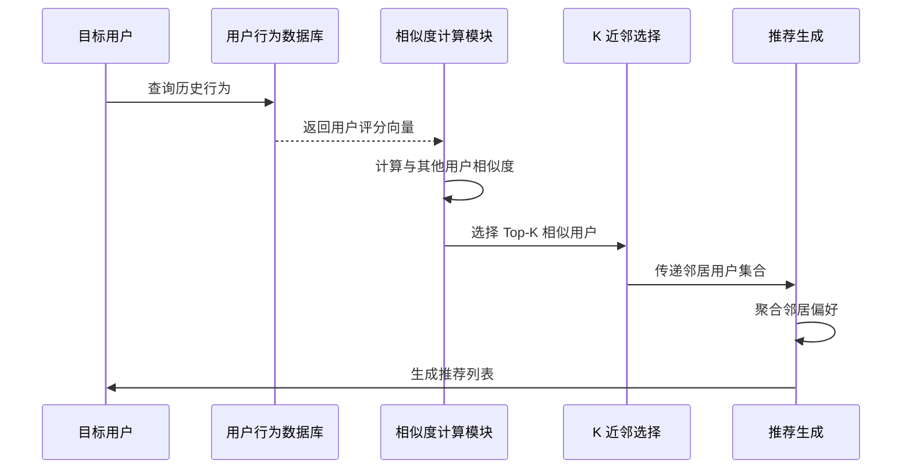
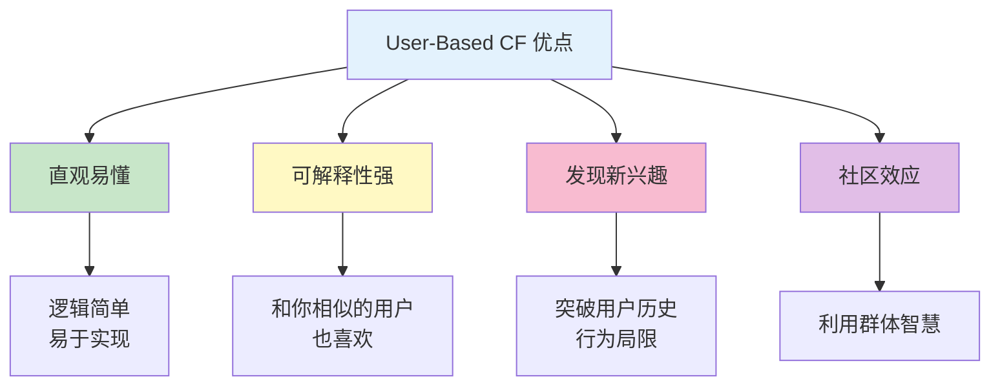
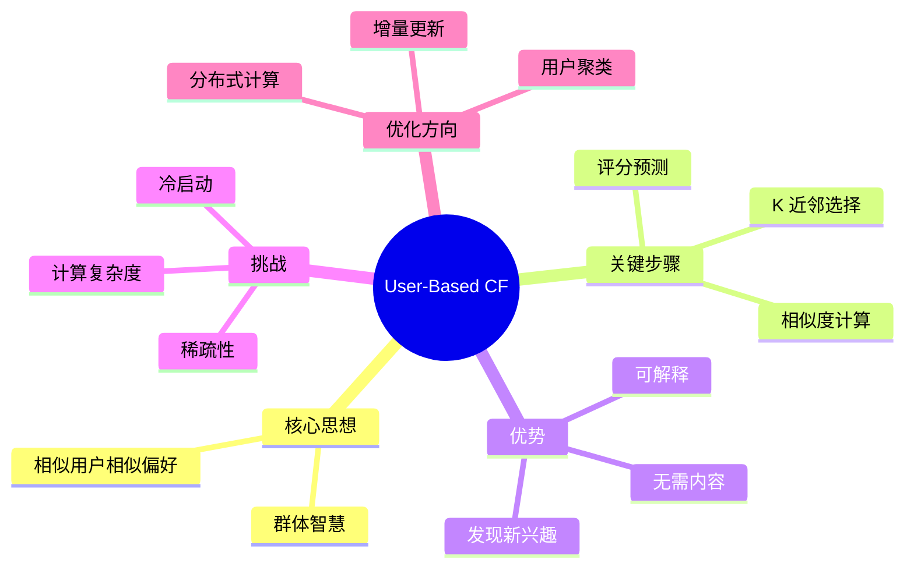

# User-Based Collaborative Filtering（基于用户的协同过滤）

## 1. 概述

User-Based Collaborative Filtering（基于用户的协同过滤，简称 User-Based CF）是协同过滤算法的两大经典范式之一。它的核心思想非常直观：**找到与目标用户兴趣相似的其他用户，然后将这些相似用户喜欢而目标用户尚未接触的物品推荐给目标用户**。

用一句通俗的话来说："**和你品味相似的人喜欢的东西，你也可能会喜欢**"。

## 2. 算法原理

### 2.1 基本流程



### 2.2 数学形式化

给定：
- 用户集合 $U = \{u_1, u_2, ..., u_m\}$
- 物品集合 $I = \{i_1, i_2, ..., i_n\}$
- 评分矩阵 $R \in \mathbb{R}^{m \times n}$

对于目标用户 $u$ 和候选物品 $i$，预测评分为：

$$\hat{r}_{ui} = \bar{r}_u + \frac{\sum_{v \in N_k(u)} \text{sim}(u, v) \cdot (r_{vi} - \bar{r}_v)}{\sum_{v \in N_k(u)} |\text{sim}(u, v)|}$$

其中：
- $\bar{r}_u$ 是用户 $u$ 的平均评分
- $N_k(u)$ 是用户 $u$ 的 K 个最近邻居
- $\text{sim}(u, v)$ 是用户 $u$ 和 $v$ 的相似度
- $r_{vi}$ 是邻居用户 $v$ 对物品 $i$ 的评分

## 3. 关键步骤详解

### 3.1 用户相似度计算

**余弦相似度实现：**

```python
import numpy as np
from scipy.sparse import csr_matrix

def compute_user_cosine_similarity(rating_matrix):
    """
    计算用户之间的余弦相似度
    
    Args:
        rating_matrix: 稀疏矩阵 (用户×物品)
    
    Returns:
        user_similarity: 用户相似度矩阵
    """
    # 归一化每一行（用户）
    norms = np.sqrt(rating_matrix.multiply(rating_matrix).sum(axis=1))
    norms[norms == 0] = 1  # 避免除零
    normalized = rating_matrix.multiply(1 / norms)
    
    # 计算余弦相似度
    user_similarity = normalized.dot(normalized.T)
    
    return user_similarity
```

**皮尔逊相关系数实现：**

```python
def compute_user_pearson_similarity(rating_matrix):
    """
    计算用户之间的皮尔逊相关系数
    """
    # 计算用户平均评分
    user_means = rating_matrix.mean(axis=1).A1
    user_means = np.nan_to_num(user_means, nan=0)
    
    # 中心化
    centered = rating_matrix - user_means.reshape(-1, 1)
    centered = csr_matrix(centered)
    
    # 计算相似度
    norms = np.sqrt(centered.multiply(centered).sum(axis=1))
    norms[norms == 0] = 1
    normalized = centered.multiply(1 / norms)
    
    pearson_sim = normalized.dot(normalized.T)
    
    return pearson_sim
```

### 3.2 K 近邻选择

```python
def find_k_nearest_users(user_idx, similarity_matrix, k=20, min_common_items=3):
    """
    找到 K 个最相似的用户
    
    Args:
        user_idx: 目标用户索引
        similarity_matrix: 用户相似度矩阵
        k: 邻居数量
        min_common_items: 最小共同评分物品数
    
    Returns:
        neighbors: 邻居用户索引列表
    """
    # 获取相似度分数
    similarities = similarity_matrix[user_idx].toarray().flatten()
    
    # 排除自己
    similarities[user_idx] = -1
    
    # 排序并选择 Top-K
    neighbor_indices = np.argsort(similarities)[::-1][:k]
    
    # 过滤相似度为负或共同物品太少的
    valid_neighbors = []
    for idx in neighbor_indices:
        if similarities[idx] > 0:
            valid_neighbors.append((idx, similarities[idx]))
    
    return valid_neighbors
```

### 3.3 评分预测与推荐生成

```python
def predict_rating(user_idx, item_idx, neighbors, rating_matrix):
    """
    预测用户对物品的评分
    
    Args:
        user_idx: 目标用户索引
        item_idx: 物品索引
        neighbors: 邻居用户列表 [(idx, sim), ...]
        rating_matrix: 评分矩阵
    
    Returns:
        predicted_rating: 预测评分
    """
    user_mean = rating_matrix[user_idx].mean()
    
    numerator = 0.0
    denominator = 0.0
    
    for neighbor_idx, sim in neighbors:
        if rating_matrix[neighbor_idx, item_idx] > 0:  # 邻居评过分
            neighbor_mean = rating_matrix[neighbor_idx].mean()
            numerator += sim * (rating_matrix[neighbor_idx, item_idx] - neighbor_mean)
            denominator += abs(sim)
    
    if denominator == 0:
        return user_mean
    
    return user_mean + numerator / denominator


def generate_recommendations(user_idx, rating_matrix, similarity_matrix, k=20, n_rec=10):
    """
    为用户生成推荐列表
    
    Returns:
        recommendations: [(item_idx, predicted_score), ...]
    """
    # 找到邻居
    neighbors = find_k_nearest_users(user_idx, similarity_matrix, k)
    
    # 获取用户已评分物品
    rated_items = set(rating_matrix[user_idx].nonzero()[1])
    
    # 预测所有未评分物品
    predictions = []
    n_items = rating_matrix.shape[1]
    
    for item_idx in range(n_items):
        if item_idx not in rated_items:
            pred = predict_rating(user_idx, item_idx, neighbors, rating_matrix)
            predictions.append((item_idx, pred))
    
    # 排序并返回 Top-N
    predictions.sort(key=lambda x: x[1], reverse=True)
    return predictions[:n_rec]
```

## 4. 完整实现示例

```python
class UserBasedCFRecommender:
    """完整的 User-Based CF 推荐器"""
    
    def __init__(self, k_neighbors=20, min_common_items=3, similarity='pearson'):
        self.k_neighbors = k_neighbors
        self.min_common_items = min_common_items
        self.similarity_method = similarity
        self.user_similarity = None
        self.rating_matrix = None
        self.user_map = {}  # user_id -> index
        self.item_map = {}  # item_id -> index
        self.reverse_user_map = {}
        self.reverse_item_map = {}
    
    def fit(self, ratings_df):
        """
        训练模型
        
        Args:
            ratings_df: DataFrame with columns [user_id, item_id, rating]
        """
        # 构建映射
        users = sorted(ratings_df['user_id'].unique())
        items = sorted(ratings_df['item_id'].unique())
        
        self.user_map = {u: i for i, u in enumerate(users)}
        self.item_map = {i: j for j, i in enumerate(items)}
        self.reverse_user_map = {i: u for u, i in self.user_map.items()}
        self.reverse_item_map = {j: i for i, j in self.item_map.items()}
        
        # 构建评分矩阵
        n_users = len(users)
        n_items = len(items)
        self.rating_matrix = np.zeros((n_users, n_items))
        
        for _, row in ratings_df.iterrows():
            u_idx = self.user_map[row['user_id']]
            i_idx = self.item_map[row['item_id']]
            self.rating_matrix[u_idx, i_idx] = row['rating']
        
        # 计算相似度
        if self.similarity_method == 'cosine':
            self.user_similarity = self._cosine_similarity()
        else:
            self.user_similarity = self._pearson_similarity()
        
        return self
    
    def _cosine_similarity(self):
        """余弦相似度"""
        norms = np.linalg.norm(self.rating_matrix, axis=1, keepdims=True)
        norms[norms == 0] = 1
        normalized = self.rating_matrix / norms
        return np.dot(normalized, normalized.T)
    
    def _pearson_similarity(self):
        """皮尔逊相关系数"""
        user_means = self.rating_matrix.mean(axis=1, keepdims=True)
        user_means = np.nan_to_num(user_means, nan=0)
        
        centered = self.rating_matrix - user_means
        norms = np.linalg.norm(centered, axis=1, keepdims=True)
        norms[norms == 0] = 1
        normalized = centered / norms
        
        return np.dot(normalized, normalized.T)
    
    def recommend(self, user_id, n_recommendations=10):
        """为用户生成推荐"""
        if user_id not in self.user_map:
            raise ValueError(f"Unknown user: {user_id}")
        
        u_idx = self.user_map[user_id]
        
        # 获取邻居
        similarities = self.user_similarity[u_idx].copy()
        similarities[u_idx] = -1  # 排除自己
        
        neighbor_indices = np.argsort(similarities)[::-1][:self.k_neighbors]
        neighbors = [(idx, similarities[idx]) for idx in neighbor_indices if similarities[idx] > 0]
        
        # 预测评分
        rated_items = set(np.where(self.rating_matrix[u_idx] > 0)[0])
        predictions = []
        
        for i_idx in range(self.rating_matrix.shape[1]):
            if i_idx not in rated_items:
                pred = self._predict(u_idx, i_idx, neighbors)
                if pred > 0:
                    predictions.append((i_idx, pred))
        
        # 排序
        predictions.sort(key=lambda x: x[1], reverse=True)
        
        # 转换回原始 ID
        recommendations = [
            (self.reverse_item_map[i_idx], score)
            for i_idx, score in predictions[:n_recommendations]
        ]
        
        return recommendations
    
    def _predict(self, u_idx, i_idx, neighbors):
        """预测评分"""
        user_mean = self.rating_matrix[u_idx].mean()
        
        num = 0.0
        den = 0.0
        
        for n_idx, sim in neighbors:
            if self.rating_matrix[n_idx, i_idx] > 0:
                n_mean = self.rating_matrix[n_idx].mean()
                num += sim * (self.rating_matrix[n_idx, i_idx] - n_mean)
                den += abs(sim)
        
        if den == 0:
            return user_mean
        
        return user_mean + num / den
```

## 5. 优缺点分析

### 5.1 优点



| 优点 | 详细说明 |
|------|----------|
| **直观易懂** | 算法逻辑符合人类直觉，易于理解和接受 |
| **可解释性强** | 可以明确告知用户"因为和你相似的用户喜欢" |
| **发现潜在兴趣** | 能推荐用户未曾接触但可能喜欢的物品类别 |
| **社区发现** | 天然形成用户社群，有助于社交功能 |
| **无需物品内容** | 纯基于行为，适用于任何类型物品 |

### 5.2 缺点

| 缺点 | 详细说明 | 缓解方案 |
|------|----------|----------|
| **计算复杂度高** | O(U²)，用户增长时急剧恶化 | 采样、聚类、分布式 |
| **用户变化敏感** | 用户行为变化需重新计算相似度 | 增量更新、在线学习 |
| **冷启动问题** | 新用户无法找到相似用户 | 混合推荐、内容推荐 |
| **稀疏性问题** | 共同评分少导致相似度不准 | 矩阵分解、降维 |
| **流行度偏差** | 热门物品主导推荐 | 去偏、多样性优化 |

## 6. 适用场景

### 6.1 适合使用 User-Based CF 的场景

1. **用户数量相对稳定且不多**
   - 社区类产品（<10 万用户）
   - 垂直领域平台

2. **用户兴趣变化较快**
   - 新闻推荐
   - 短视频推荐
   - 时尚/潮流相关

3. **社交属性强**
   - 社交网络
   - 关注关系重要的平台

4. **物品更新频繁**
   - 新闻文章
   - UGC 内容平台

### 6.2 不适合的场景

1. **用户量极大**（千万级以上）
2. **物品相对稳定**（如图书、电影）
3. **对实时性要求极高**
4. **用户行为极其稀疏**

## 7. 优化技巧

### 7.1 用户聚类预处理

```python
from sklearn.cluster import KMeans

def cluster_users(rating_matrix, n_clusters=100):
    """
    先对用户聚类，只在簇内计算相似度
    """
    # 降维
    from sklearn.decomposition import TruncatedSVD
    svd = TruncatedSVD(n_components=50)
    user_factors = svd.fit_transform(rating_matrix)
    
    # 聚类
    kmeans = KMeans(n_clusters=n_clusters, random_state=42)
    cluster_labels = kmeans.fit_predict(user_factors)
    
    return cluster_labels
```

### 7.2 时间衰减加权

```python
def time_weighted_similarity(ratings_u, ratings_v, timestamps_u, timestamps_v, half_life=30):
    """
    考虑时间因素的用户相似度
    """
    import numpy as np
    from datetime import datetime
    
    current_time = datetime.now()
    
    # 计算时间权重
    weights_u = [2 ** (-(current_time - ts).days / half_life) for ts in timestamps_u]
    weights_v = [2 ** (-(current_time - ts).days / half_life) for ts in timestamps_v]
    
    # 加权评分
    weighted_u = [r * w for r, w in zip(ratings_u, weights_u)]
    weighted_v = [r * w for r, w in zip(ratings_v, weights_v)]
    
    # 计算加权余弦相似度
    dot = sum(a * b for a, b in zip(weighted_u, weighted_v))
    norm_u = np.sqrt(sum(a ** 2 for a in weighted_u))
    norm_v = np.sqrt(sum(b ** 2 for b in weighted_v))
    
    return dot / (norm_u * norm_v) if norm_u and norm_v else 0
```

### 7.3 相似度置信度

```python
def confidence_weighted_similarity(raw_sim, n_common_items, min_items=5, max_items=50):
    """
    根据共同评分数量调整相似度置信度
    """
    if n_common_items < min_items:
        # 共同物品太少，降低置信度
        confidence = n_common_items / min_items
    elif n_common_items > max_items:
        confidence = 1.0
    else:
        confidence = (n_common_items - min_items) / (max_items - min_items)
    
    return raw_sim * confidence
```

## 8. 工业应用案例

### 8.1 早期 Amazon

Amazon 在 1998 年的论文中描述了 User-Based CF 的应用：
- 计算用户相似度基于购买历史
- 使用相关系数而非余弦相似度
- 推荐"与你相似的用户购买的书籍"

### 8.2 社交网络推荐

- **Facebook**: 好友推荐部分使用 User-Based 思想
- **Twitter**: 关注推荐基于相似用户行为
- **LinkedIn**: "你可能认识的人"

### 8.3 新闻推荐

- **Google News**: 早期版本使用 User-Based CF
- **今日头条**: 用户聚类后在簇内推荐

## 9. 总结

User-Based CF 作为推荐系统的经典算法，具有以下特点：



**核心要点：**
1. User-Based 适合用户少、物品多、兴趣变化快的场景
2. 相似度计算是核心，皮尔逊通常优于余弦
3. 用户量增长时必须采用优化策略
4. 工业界常与 Item-Based 混合使用
5. 理解 User-Based 是学习推荐系统的基础

虽然现代推荐系统更多使用深度学习模型，但 User-Based CF 的思想仍然重要，是理解推荐系统演进的起点。
