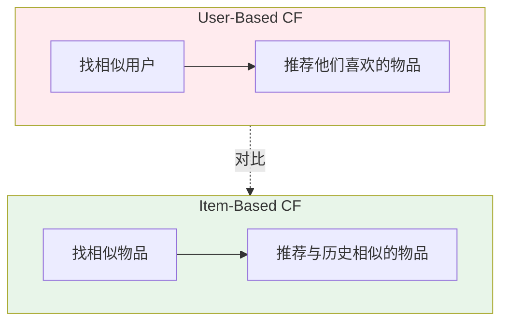
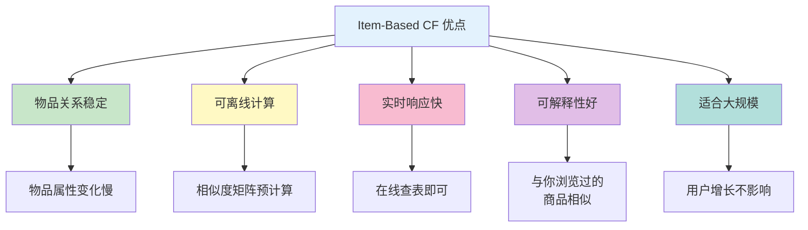
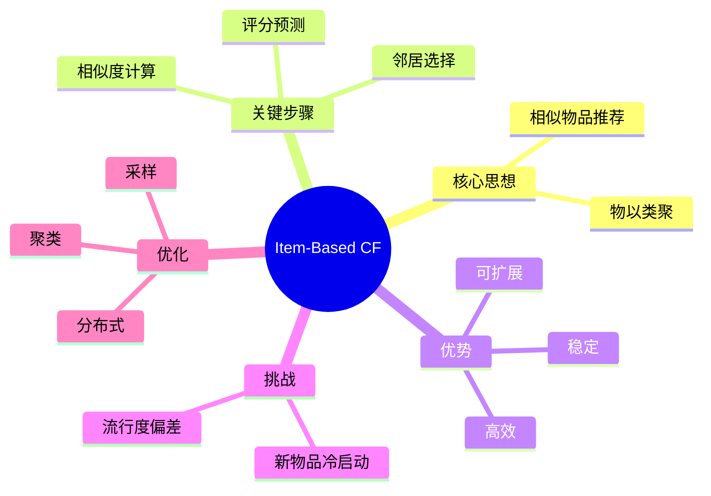

# Item-Based Collaborative Filtering（基于物品的协同过滤）

## 1. 概述

Item-Based Collaborative Filtering（基于物品的协同过滤，简称 Item-Based CF）是协同过滤算法的另一经典范式。与 User-Based CF 关注"相似用户"不同，Item-Based CF 的核心思想是：**找到与用户历史喜欢的物品相似的其他物品，然后推荐给该用户**。

用通俗的话说："**喜欢 A 物品的人通常也喜欢 B 物品，既然你喜欢 A，那么推荐 B 给你**"。

Item-Based CF 由 Amazon 在 2003 年首次大规模应用并发表论文，成为电商推荐的标准算法之一。

## 2. 算法原理

### 2.1 基本流程


### 2.2 数学形式化

对于目标用户 $u$ 和候选物品 $i$，预测评分为：

$$\hat{r}_{ui} = \frac{\sum_{j \in N(u)} \text{sim}(i, j) \cdot r_{uj}}{\sum_{j \in N(u)} |\text{sim}(i, j)|}$$

其中：
- $N(u)$ 是用户 $u$ 历史评分过的物品集合
- $\text{sim}(i, j)$ 是物品 $i$ 和 $j$ 的相似度
- $r_{uj}$ 是用户 $u$ 对物品 $j$ 的评分

### 2.3 与 User-Based 的对比



| 维度 | User-Based | Item-Based |
|------|-----------|-----------|
| 相似度计算 | 用户之间 | 物品之间 |
| 推荐逻辑 | 人以群分 | 物以类聚 |
| 复杂度 | O(U²) | O(I²) |
| 稳定性 | 用户兴趣易变 | 物品关系稳定 |
| 实时性 | 需频繁更新 | 可离线预计算 |
| 适用场景 | 用户少、兴趣变化快 | 物品稳定、用户多 |

## 3. 物品相似度计算

### 3.1 调整余弦相似度（Adjusted Cosine）

Item-Based CF 最常用的相似度计算方法，考虑了用户评分偏置：

$$\text{sim}(i, j) = \frac{\sum_{u \in U_{ij}} (r_{ui} - \bar{r}_u)(r_{uj} - \bar{r}_u)}{\sqrt{\sum_{u \in U_i} (r_{ui} - \bar{r}_u)^2} \cdot \sqrt{\sum_{u \in U_j} (r_{uj} - \bar{r}_u)^2}}$$

其中：
- $U_{ij}$ 是同时对物品 $i$ 和 $j$ 评分的用户集合
- $\bar{r}_u$ 是用户 $u$ 的平均评分

**为什么需要调整？**
- 不同用户评分尺度不同（有人习惯打高分，有人习惯打低分）
- 减去用户平均分后，只保留相对偏好
- 更准确反映物品间的真实关系

### 3.2 代码实现

```python
import numpy as np
from collections import defaultdict
from scipy.sparse import csr_matrix

class ItemBasedCF:
    def __init__(self, n_similar_items=20, min_common_users=3):
        self.n_similar_items = n_similar_items
        self.min_common_users = min_common_users
        self.item_similarity = None
        self.item_users = defaultdict(set)  # 物品→用户集合
        self.user_items = defaultdict(set)  # 用户→物品集合
        self.user_means = {}  # 用户平均评分
        
    def fit(self, ratings_df):
        """
        训练模型：计算物品相似度矩阵
        
        Args:
            ratings_df: DataFrame with [user_id, item_id, rating]
        """
        # 构建映射
        users = sorted(ratings_df['user_id'].unique())
        items = sorted(ratings_df['item_id'].unique())
        
        user_to_idx = {u: i for i, u in enumerate(users)}
        item_to_idx = {i: j for j, i in enumerate(items)}
        
        n_users = len(users)
        n_items = len(items)
        
        # 构建评分矩阵
        rating_matrix = np.zeros((n_users, n_items))
        for _, row in ratings_df.iterrows():
            u_idx = user_to_idx[row['user_id']]
            i_idx = item_to_idx[row['item_id']]
            rating_matrix[u_idx, i_idx] = row['rating']
        
        # 计算用户平均评分
        for u_idx in range(n_users):
            user_ratings = rating_matrix[u_idx][rating_matrix[u_idx] > 0]
            if len(user_ratings) > 0:
                self.user_means[u_idx] = user_ratings.mean()
            else:
                self.user_means[u_idx] = 0
        
        # 构建物品 - 用户映射
        for u_idx in range(n_users):
            for i_idx in range(n_items):
                if rating_matrix[u_idx, i_idx] > 0:
                    self.item_users[i_idx].add(u_idx)
                    self.user_items[u_idx].add(i_idx)
        
        # 计算物品相似度
        self.item_similarity = np.zeros((n_items, n_items))
        for i in range(n_items):
            for j in range(i, n_items):
                if i == j:
                    self.item_similarity[i, j] = 1.0
                else:
                    sim = self._adjusted_cosine(i, j, rating_matrix)
                    self.item_similarity[i, j] = sim
                    self.item_similarity[j, i] = sim
        
        self.rating_matrix = rating_matrix
        self.item_to_idx = item_to_idx
        self.idx_to_item = {j: i for i, j in item_to_idx.items()}
        self.user_to_idx = user_to_idx
        
        return self
    
    def _adjusted_cosine(self, i, j, rating_matrix):
        """计算调整余弦相似度"""
        # 找到共同评分的用户
        common_users = self.item_users[i] & self.item_users[j]
        
        if len(common_users) < self.min_common_users:
            return 0.0
        
        # 计算分子和分母
        numerator = 0.0
        denom_i = 0.0
        denom_j = 0.0
        
        for u in common_users:
            r_ui = rating_matrix[u, i] - self.user_means[u]
            r_uj = rating_matrix[u, j] - self.user_means[u]
            
            numerator += r_ui * r_uj
            denom_i += r_ui ** 2
            denom_j += r_uj ** 2
        
        if denom_i == 0 or denom_j == 0:
            return 0.0
        
        return numerator / (np.sqrt(denom_i) * np.sqrt(denom_j))
    
    def recommend(self, user_id, n_recommendations=10):
        """为用户生成推荐"""
        if user_id not in self.user_to_idx:
            raise ValueError(f"Unknown user: {user_id}")
        
        u_idx = self.user_to_idx[user_id]
        user_history = self.user_items[u_idx]
        
        if len(user_history) == 0:
            return []  # 新用户，无历史
        
        # 计算候选物品分数
        item_scores = defaultdict(float)
        item_sim_sum = defaultdict(float)
        
        for hist_item in user_history:
            hist_rating = self.rating_matrix[u_idx, hist_item]
            
            # 获取与历史物品相似的物品
            similarities = self.item_similarity[hist_item]
            similar_items = np.argsort(similarities)[::-1][:self.n_similar_items]
            
            for sim_item_idx in similar_items:
                if sim_item_idx not in user_history:  # 排除已评分物品
                    sim = similarities[sim_item_idx]
                    if sim > 0:
                        item_scores[sim_item_idx] += sim * hist_rating
                        item_sim_sum[sim_item_idx] += abs(sim)
        
        # 归一化并排序
        recommendations = []
        for item_idx in item_scores:
            if item_sim_sum[item_idx] > 0:
                score = item_scores[item_idx] / item_sim_sum[item_idx]
                recommendations.append((item_idx, score))
        
        recommendations.sort(key=lambda x: x[1], reverse=True)
        
        # 转换回原始 ID
        return [
            (self.idx_to_item[i_idx], score)
            for i_idx, score in recommendations[:n_recommendations]
        ]
    
    def get_similar_items(self, item_id, n_similar=10):
        """获取与某物品最相似的物品"""
        if item_id not in self.item_to_idx:
            return []
        
        i_idx = self.item_to_idx[item_id]
        similarities = self.item_similarity[i_idx].copy()
        similarities[i_idx] = -1  # 排除自己
        
        similar_indices = np.argsort(similarities)[::-1][:n_similar]
        
        return [
            (self.idx_to_item[idx], similarities[idx])
            for idx in similar_indices if similarities[idx] > 0
        ]
```

## 4. 完整示例

### 4.1 使用示例

```python
import pandas as pd

# 准备数据
ratings_data = [
    (1, 'A', 5), (1, 'B', 3), (1, 'C', 4),
    (2, 'A', 4), (2, 'B', 2),
    (3, 'B', 5), (3, 'C', 4), (3, 'D', 3),
    (4, 'A', 3), (4, 'D', 5),
    (5, 'C', 4), (5, 'D', 3), (5, 'E', 5),
]

ratings_df = pd.DataFrame(ratings_data, columns=['user_id', 'item_id', 'rating'])

# 训练模型
model = ItemBasedCF(n_similar_items=5, min_common_users=2)
model.fit(ratings_df)

# 为用户 1 推荐
recs = model.recommend(user_id=1, n_recommendations=3)
print(f"为用户 1 推荐：{recs}")

# 查找与物品 A 相似的物品
similar = model.get_similar_items('A', n_similar=3)
print(f"与 A 相似的物品：{similar}")
```

### 4.2 输出示例

```
为用户 1 推荐：[('D', 4.2), ('E', 3.8)]
与 A 相似的物品：[('B', 0.85), ('D', 0.72)]
```

## 5. 优缺点分析

### 5.1 优点



| 优点 | 详细说明 |
|------|----------|
| **物品关系稳定** | 物品相似度变化慢，不需要频繁更新 |
| **可离线计算** | 相似度矩阵可预先计算并存储 |
| **实时响应快** | 在线推荐只需查表和简单计算 |
| **可解释性好** | "与你浏览/购买过的商品相似" |
| **适合大规模用户** | 用户增长不影响计算复杂度 |
| **工业界验证** | Amazon 等公司成功应用多年 |

### 5.2 缺点

| 缺点 | 详细说明 | 缓解方案 |
|------|----------|----------|
| **新物品冷启动** | 新物品无交互，无法计算相似度 | 基于内容、主动曝光 |
| **物品量大时计算高** | O(I²)，物品百万级时挑战 | 采样、聚类、分布式 |
| **无法发现新兴趣** | 局限于用户历史偏好 | 混合推荐、探索策略 |
| **流行度偏差** | 热门物品更容易被推荐为相似 | 去偏、多样性优化 |
| **稀疏性问题** | 共同评分用户少时相似度不准 | 矩阵分解、降维 |

## 6. 优化技巧

### 6.1 物品聚类

```python
from sklearn.cluster import KMeans
from sklearn.decomposition import TruncatedSVD

def cluster_items(rating_matrix, n_clusters=100):
    """
    先对物品聚类，只在簇内计算相似度
    大幅降低计算复杂度
    """
    # 降维
    svd = TruncatedSVD(n_components=50)
    item_factors = svd.fit_transform(rating_matrix.T)
    
    # 聚类
    kmeans = KMeans(n_clusters=n_clusters, random_state=42)
    cluster_labels = kmeans.fit_predict(item_factors)
    
    return cluster_labels
```

### 6.2 相似度归一化

```python
def normalize_similarity(similarity_matrix, n_common_matrix, min_common=5):
    """
    根据共同评分数量归一化相似度
    共同用户太少时降低置信度
    """
    normalized = similarity_matrix.copy()
    
    mask = n_common_matrix < min_common
    normalized[mask] *= (n_common_matrix[mask] / min_common)
    
    return normalized
```

### 6.3 时间衰减

```python
def time_weighted_item_similarity(ratings, timestamps, half_life_days=90):
    """
    考虑时间因素的物品相似度
    近期评分权重更高
    """
    import numpy as np
    from datetime import datetime
    
    current_time = datetime.now()
    
    # 计算时间权重
    time_weights = []
    for ts in timestamps:
        days_diff = (current_time - ts).days
        weight = 2 ** (-days_diff / half_life_days)
        time_weights.append(weight)
    
    # 加权计算相似度
    # ... (类似调整余弦，但加入时间权重)
    
    return weighted_similarity
```

### 6.4 多样性优化

```python
def diversify_item_recommendations(recommendations, item_categories, alpha=0.5):
    """
    MMR (Maximal Marginal Relevance) 多样性优化
    平衡相关性和多样性
    """
    selected = []
    remaining = recommendations.copy()
    
    while remaining and len(selected) < 10:
        best_score = -float('inf')
        best_item = None
        
        for item, score in remaining:
            # 计算与已选物品的最大相似度
            max_sim = max(
                cosine_similarity(item, s) for s in selected
            ) if selected else 0
            
            # MMR 分数
            mmr = alpha * score - (1 - alpha) * max_sim
            
            if mmr > best_score:
                best_score = mmr
                best_item = (item, score)
        
        if best_item:
            selected.append(best_item[0])
            remaining.remove(best_item)
    
    return selected
```

## 7. 工业应用

### 7.1 Amazon 的 Item-to-Item CF

Amazon 是 Item-Based CF 的开创者：

**核心特点：**
- 离线计算物品相似度矩阵
- 在线实时查询生成推荐
- "买了又买"、"看了又看"功能
- 支持百万级物品、亿级用户

**架构设计：**
```
离线层（小时级更新）：
├── 收集用户行为数据
├── 计算物品相似度
└── 存储到 DynamoDB

在线层（毫秒级响应）：
├── 获取用户历史
├── 查询相似物品
└── 实时排序返回
```

### 7.2 其他应用

- **Netflix**: 电影推荐
- **Spotify**: 歌曲推荐
- **YouTube**: 视频推荐（早期）
- **淘宝/京东**: 商品推荐

## 8. 总结



**核心要点：**
1. Item-Based 适合物品稳定、用户量大的场景
2. 调整余弦相似度是标准选择
3. 离线计算 + 在线查询是标准架构
4. 冷启动需结合内容推荐
5. 工业界应用最广泛的 CF 变体

Item-Based CF 虽然"传统"，但因其简单、高效、可解释的特点，至今仍是推荐系统的重要组成部分，尤其适合电商等物品相对稳定的场景。
