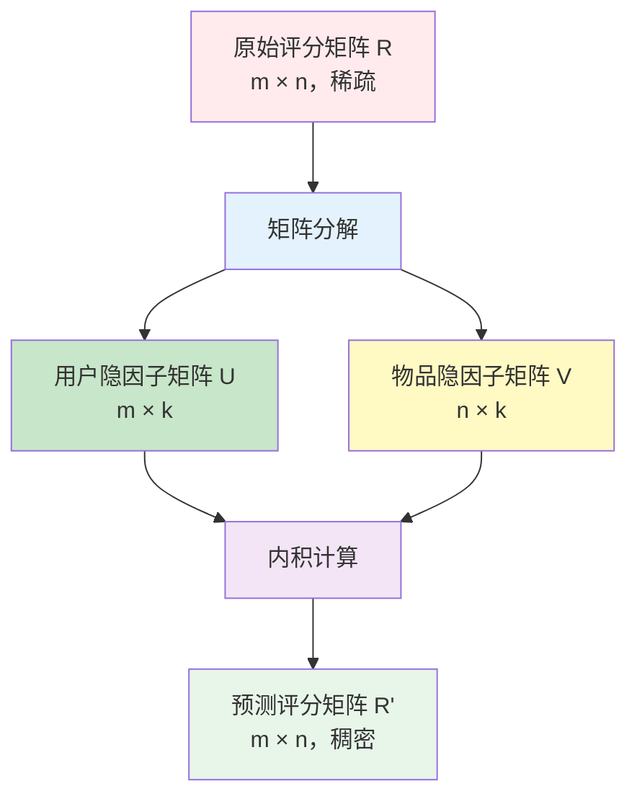
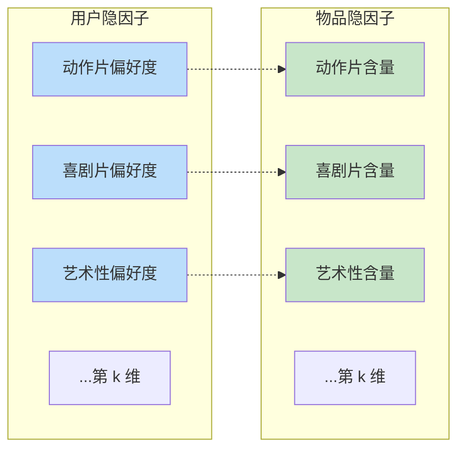
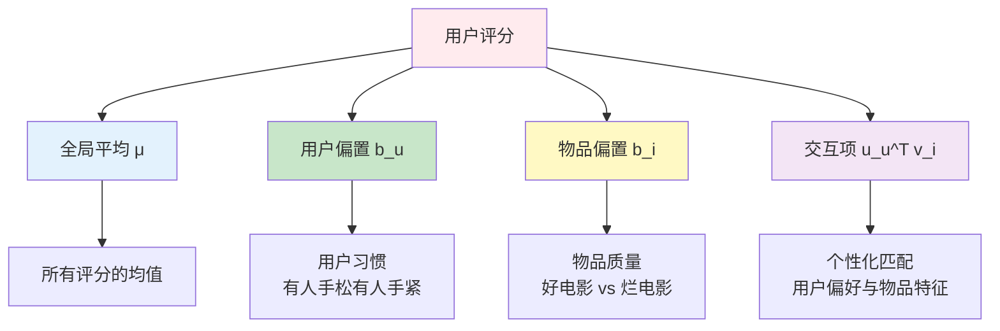
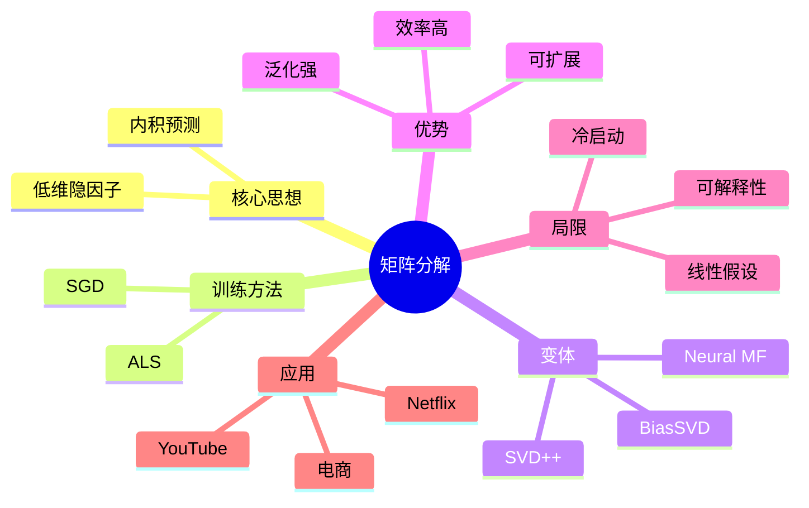

# 矩阵分解（Matrix Factorization）

## 1. 概述

矩阵分解（Matrix Factorization，简称 MF）是推荐系统中最重要、影响最深远的算法之一。它将传统的基于邻域的协同过滤提升到了**隐因子模型**的新高度，是连接经典推荐算法与现代深度学习的桥梁。

矩阵分解的核心思想：**将高维稀疏的用户 - 物品评分矩阵分解为两个低维稠密的隐因子矩阵，通过隐因子的内积来预测用户对物品的评分**。

矩阵分解在 Netflix Prize 竞赛中大放异彩，成为推荐系统领域的里程碑式算法。

## 2. 算法原理

### 2.1 问题形式化

给定用户 - 物品评分矩阵 $R \in \mathbb{R}^{m \times n}$：
- $m$：用户数量
- $n$：物品数量
- $r_{ui}$：用户 $u$ 对物品 $i$ 的评分（大部分缺失）

矩阵分解的目标：找到两个低维矩阵 $U$ 和 $V$，使得：

$$R \approx U \times V^T$$

其中：
- $U \in \mathbb{R}^{m \times k}$：用户隐因子矩阵
- $V \in \mathbb{R}^{n \times k}$：物品隐因子矩阵
- $k \ll m, n$：隐因子维度（通常 10-200）

### 2.2 算法流程图



### 2.3 预测公式

对于用户 $u$ 和物品 $i$，预测评分为：

$$\hat{r}_{ui} = u_u^T \cdot v_i = \sum_{f=1}^{k} u_{uf} \cdot v_{if}$$

其中：
- $u_u \in \mathbb{R}^k$：用户 $u$ 的隐因子向量
- $v_i \in \mathbb{R}^k$：物品 $i$ 的隐因子向量
- $k$：隐因子维度

### 2.4 隐因子的直观理解



**隐因子含义：**
- 每个维度代表一种抽象的"特征"或"偏好"
- 算法自动学习，不需要人工定义
- 可能对应"动作程度"、"浪漫程度"等，但通常不可直接解释
- 用户和物品在同一隐空间，内积表示匹配度

## 3. 模型训练

### 3.1 损失函数

带正则化的平方误差损失：

$$\min_{U, V} \sum_{(u, i) \in K} (r_{ui} - u_u^T v_i)^2 + \lambda \left(\sum_{u} ||u_u||^2 + \sum_{i} ||v_i||^2\right)$$

其中：
- $K$：已知评分的集合
- $\lambda$：正则化系数，防止过拟合

### 3.2 优化算法

#### 随机梯度下降（SGD）

**更新规则：**

对于每个观测评分 $(u, i, r_{ui})$：

1. 计算预测误差：
   $$e_{ui} = r_{ui} - \hat{r}_{ui} = r_{ui} - u_u^T v_i$$

2. 更新用户因子：
   $$u_u \leftarrow u_u + \alpha \cdot (e_{ui} \cdot v_i - \lambda \cdot u_u)$$

3. 更新物品因子：
   $$v_i \leftarrow v_i + \alpha \cdot (e_{ui} \cdot u_u - \lambda \cdot v_i)$$

其中 $\alpha$ 是学习率。

#### 交替最小二乘（ALS）

固定 $V$，求解 $U$（闭式解）；然后固定 $U$，求解 $V$；交替进行。

**用户因子更新：**
$$u_u = \left(V_{I_u}^T V_{I_u} + \lambda I\right)^{-1} V_{I_u}^T r_u$$

其中 $I_u$ 是用户 $u$ 评分过的物品索引集合。

### 3.3 SGD 实现

```python
import numpy as np
from typing import List, Tuple

class MatrixFactorization:
    """矩阵分解推荐模型（SGD 优化）"""
    
    def __init__(
        self,
        n_factors: int = 20,
        learning_rate: float = 0.01,
        regularization: float = 0.02,
        n_epochs: int = 100,
        random_state: int = 42
    ):
        self.n_factors = n_factors
        self.lr = learning_rate
        self.reg = regularization
        self.n_epochs = n_epochs
        self.random_state = random_state
        
        self.U = None  # 用户因子
        self.V = None  # 物品因子
        self.user_bias = None
        self.item_bias = None
        self.global_mean = None
        
        self.user_to_idx = {}
        self.item_to_idx = {}
        self.idx_to_user = {}
        self.idx_to_item = {}
    
    def fit(self, ratings: List[Tuple[int, int, float]]):
        """
        训练模型
        
        Args:
            ratings: 列表 [(user_id, item_id, rating), ...]
        """
        np.random.seed(self.random_state)
        
        # 构建映射
        users = sorted(set(u for u, i, r in ratings))
        items = sorted(set(i for u, i, r in ratings))
        
        self.user_to_idx = {u: i for i, u in enumerate(users)}
        self.item_to_idx = {i: j for j, i in enumerate(items)}
        self.idx_to_user = {i: u for u, i in self.user_to_idx.items()}
        self.idx_to_item = {j: i for i, j in self.item_to_idx.items()}
        
        n_users = len(users)
        n_items = len(items)
        
        # 初始化因子矩阵（正态分布）
        self.U = np.random.normal(0, 0.1, (n_users, self.n_factors))
        self.V = np.random.normal(0, 0.1, (n_items, self.n_factors))
        
        # 初始化偏置
        self.global_mean = np.mean([r for u, i, r in ratings])
        self.user_bias = np.zeros(n_users)
        self.item_bias = np.zeros(n_items)
        
        # 转换数据为索引
        train_data = [
            (self.user_to_idx[u], self.item_to_idx[i], r)
            for u, i, r in ratings
        ]
        
        # SGD 训练
        for epoch in range(self.n_epochs):
            np.random.shuffle(train_data)
            total_loss = 0.0
            
            for u_idx, i_idx, rating in train_data:
                # 预测
                pred = self.global_mean + self.user_bias[u_idx] + self.item_bias[i_idx]
                pred += np.dot(self.U[u_idx], self.V[i_idx])
                
                # 误差
                error = rating - pred
                total_loss += error ** 2
                
                # 更新偏置
                self.user_bias[u_idx] += self.lr * (error - self.reg * self.user_bias[u_idx])
                self.item_bias[i_idx] += self.lr * (error - self.reg * self.item_bias[i_idx])
                
                # 更新因子
                u_factor = self.U[u_idx].copy()
                self.U[u_idx] += self.lr * (error * self.V[i_idx] - self.reg * self.U[u_idx])
                self.V[i_idx] += self.lr * (error * u_factor - self.reg * self.V[i_idx])
            
            # 打印进度
            if (epoch + 1) % 10 == 0:
                rmse = np.sqrt(total_loss / len(train_data))
                print(f"Epoch {epoch + 1}/{self.n_epochs}, RMSE: {rmse:.4f}")
        
        return self
    
    def predict(self, user_id: int, item_id: int) -> float:
        """预测用户对物品的评分"""
        if user_id not in self.user_to_idx or item_id not in self.item_to_idx:
            return self.global_mean  # 冷启动返回全局平均
        
        u_idx = self.user_to_idx[user_id]
        i_idx = self.item_to_idx[item_id]
        
        pred = self.global_mean + self.user_bias[u_idx] + self.item_bias[i_idx]
        pred += np.dot(self.U[u_idx], self.V[i_idx])
        
        return pred
    
    def recommend(self, user_id: int, user_rated_items: List[int], n_recommendations: int = 10):
        """
        为用户生成推荐
        
        Args:
            user_id: 用户 ID
            user_rated_items: 用户已评分的物品列表
            n_recommendations: 推荐数量
        """
        if user_id not in self.user_to_idx:
            return []  # 新用户
        
        u_idx = self.user_to_idx[user_id]
        
        # 计算所有物品的分数
        scores = []
        for i_idx in range(self.V.shape[0]):
            item_id = self.idx_to_item[i_idx]
            if item_id not in user_rated_items:
                pred = self.global_mean + self.user_bias[u_idx] + self.item_bias[i_idx]
                pred += np.dot(self.U[u_idx], self.V[i_idx])
                scores.append((item_id, pred))
        
        # 排序
        scores.sort(key=lambda x: x[1], reverse=True)
        
        return scores[:n_recommendations]
```

### 3.4 ALS 实现

```python
class ALSMatrixFactorization:
    """矩阵分解（ALS 优化）"""
    
    def __init__(self, n_factors=20, regularization=0.1, n_iterations=20):
        self.n_factors = n_factors
        self.reg = regularization
        self.n_iterations = n_iterations
        self.U = None
        self.V = None
    
    def fit(self, rating_matrix):
        """
        使用 ALS 训练
        
        Args:
            rating_matrix: 稀疏矩阵 (用户×物品)
        """
        from scipy.sparse import csr_matrix
        import numpy as np
        
        n_users, n_items = rating_matrix.shape
        
        # 初始化
        self.U = np.random.normal(0, 0.1, (n_users, self.n_factors))
        self.V = np.random.normal(0, 0.1, (n_items, self.n_factors))
        
        # 正则化矩阵
        reg_matrix = self.reg * np.eye(self.n_factors)
        
        for iteration in range(self.n_iterations):
            # 固定 V，更新 U
            for u in range(n_users):
                # 用户 u 评分过的物品
                items_u = rating_matrix[u].nonzero()[1]
                if len(items_u) == 0:
                    continue
                
                V_u = self.V[items_u]  # (n_items_u, k)
                r_u = rating_matrix[u, items_u].toarray().flatten()  # (n_items_u,)
                
                # 闭式解
                A = V_u.T @ V_u + reg_matrix
                b = V_u.T @ r_u
                self.U[u] = np.linalg.solve(A, b)
            
            # 固定 U，更新 V
            for i in range(n_items):
                # 评分过物品 i 的用户
                users_i = rating_matrix[:, i].nonzero()[0]
                if len(users_i) == 0:
                    continue
                
                U_i = self.U[users_i]  # (n_users_i, k)
                r_i = rating_matrix[users_i, i].toarray().flatten()  # (n_users_i,)
                
                # 闭式解
                A = U_i.T @ U_i + reg_matrix
                b = U_i.T @ r_i
                self.V[i] = np.linalg.solve(A, b)
            
            # 计算损失
            if (iteration + 1) % 5 == 0:
                pred = self.U @ self.V.T
                mask = rating_matrix.toarray() > 0
                rmse = np.sqrt(np.mean((rating_matrix.toarray()[mask] - pred[mask]) ** 2))
                print(f"Iteration {iteration + 1}/{self.n_iterations}, RMSE: {rmse:.4f}")
        
        return self
```

## 4. 带偏置的矩阵分解（BiasSVD）

### 4.1 模型公式

$$\hat{r}_{ui} = \mu + b_u + b_i + u_u^T v_i$$

其中：
- $\mu$：全局平均评分
- $b_u$：用户偏置（该用户倾向于打高分/低分）
- $b_i$：物品偏置（该物品倾向于被评高分/低分）
- $u_u^T v_i$：用户 - 物品交互

### 4.2 偏置的意义



### 4.3 实现示例

```python
class BiasSVD:
    """带偏置的 SVD"""
    
    def __init__(self, n_factors=20, lr=0.005, reg=0.02, n_epochs=100):
        self.n_factors = n_factors
        self.lr = lr
        self.reg = reg
        self.n_epochs = n_epochs
        
    def fit(self, ratings):
        # 初始化
        self.global_mean = np.mean([r for u, i, r in ratings])
        
        users = set(u for u, i, r in ratings)
        items = set(i for u, i, r in ratings)
        
        self.user_to_idx = {u: i for i, u in enumerate(users)}
        self.item_to_idx = {i: j for j, i in enumerate(items)}
        
        n_users = len(users)
        n_items = len(items)
        
        self.U = np.random.normal(0, 0.1, (n_users, self.n_factors))
        self.V = np.random.normal(0, 0.1, (n_items, self.n_factors))
        self.user_bias = np.zeros(n_users)
        self.item_bias = np.zeros(n_items)
        
        # 训练
        train_data = [(self.user_to_idx[u], self.item_to_idx[i], r) for u, i, r in ratings]
        
        for epoch in range(self.n_epochs):
            np.random.shuffle(train_data)
            
            for u_idx, i_idx, r in train_data:
                pred = self.global_mean + self.user_bias[u_idx] + self.item_bias[i_idx]
                pred += np.dot(self.U[u_idx], self.V[i_idx])
                
                error = r - pred
                
                # 更新
                self.user_bias[u_idx] += self.lr * (error - self.reg * self.user_bias[u_idx])
                self.item_bias[i_idx] += self.lr * (error - self.reg * self.item_bias[i_idx])
                
                U_copy = self.U[u_idx].copy()
                self.U[u_idx] += self.lr * (error * self.V[i_idx] - self.reg * self.U[u_idx])
                self.V[i_idx] += self.lr * (error * U_copy - self.reg * self.V[i_idx])
        
        return self
```

## 5. 优缺点分析

### 5.1 优点

| 优点 | 说明 |
|------|------|
| **解决稀疏性** | 低维稠密表示，缓解数据稀疏问题 |
| **泛化能力强** | 可预测未直接关联的用户 - 物品对 |
| **计算高效** | 预测时只需向量点积 O(k) |
| **可扩展性好** | 适合大规模数据，支持分布式 |
| **可融合特征** | 易扩展加入偏置、上下文等 |
| **理论基础强** | 有严格的数学推导 |

### 5.2 缺点

| 缺点 | 说明 | 缓解方案 |
|------|------|----------|
| **可解释性差** | 隐因子含义不明确 | 可视化、后分析 |
| **冷启动问题** | 新用户/物品无因子 | 混合推荐、内容初始化 |
| **训练成本** | 需迭代训练 | 增量更新、在线学习 |
| **超参数敏感** | k、学习率等需调优 | 交叉验证、自动化调参 |
| **线性假设** | 内积是线性操作 | 神经网络扩展（Neural CF） |

## 6. 优化技巧

### 6.1 学习率调度

```python
def learning_rate_schedule(initial_lr, epoch, decay_rate=0.95, min_lr=0.001):
    """学习率衰减"""
    lr = initial_lr * (decay_rate ** epoch)
    return max(lr, min_lr)
```

### 6.2 早停策略

```python
def train_with_early_stopping(model, train_data, val_data, patience=10):
    """带早停的训练"""
    best_val_loss = float('inf')
    patience_counter = 0
    
    for epoch in range(model.n_epochs):
        model.fit_epoch(train_data)  # 训练一轮
        val_loss = evaluate(model, val_data)  # 验证
        
        if val_loss < best_val_loss:
            best_val_loss = val_loss
            patience_counter = 0
            best_model_state = model.get_state()  # 保存最佳模型
        else:
            patience_counter += 1
        
        if patience_counter >= patience:
            print(f"Early stopping at epoch {epoch}")
            model.set_state(best_model_state)  # 恢复最佳模型
            break
```

### 6.3 负采样（针对隐式反馈）

```python
def negative_sampling(interactions, n_users, n_items, n_negatives=4):
    """为隐式反馈生成负样本"""
    positive_set = set(interactions)  # {(u, i), ...}
    negatives = []
    
    for u, i in interactions:
        for _ in range(n_negatives):
            while True:
                neg_i = np.random.randint(0, n_items)
                if (u, neg_i) not in positive_set:
                    negatives.append((u, neg_i, 0))  # 负样本标签为 0
                    break
    
    return negatives
```

## 7. 工业应用

### 7.1 Netflix Prize

Netflix Prize 是推荐系统历史上最著名的竞赛：

**背景：**
- 2006-2009 年，Netflix 举办
- 目标：将推荐准确率提升 10%
- 奖金：100 万美元
- 数据：1 亿条评分，48 万用户，1.7 万电影

**获胜方案：**
- 矩阵分解是核心组件
- 融合多种模型（SVD++、RBM、KNN 等）
- 最终提升 10.06%

### 7.2 现代应用

- **YouTube**: 视频召回（双塔模型的基础）
- **Spotify**: 音乐推荐
- **Pinterest**: PinSAGE（图 + 矩阵分解）
- **阿里巴巴**: 电商推荐

## 8. 总结



**核心要点：**
1. 矩阵分解是推荐系统的里程碑算法
2. 隐因子自动学习，无需人工定义特征
3. SGD 和 ALS 是两种主要优化方法
4. 偏置项显著提升效果
5. 是理解现代深度学习推荐的基础

矩阵分解虽然已被深度学习模型超越，但其思想仍然深刻影响着推荐系统的发展，是每位推荐工程师的必备知识。
