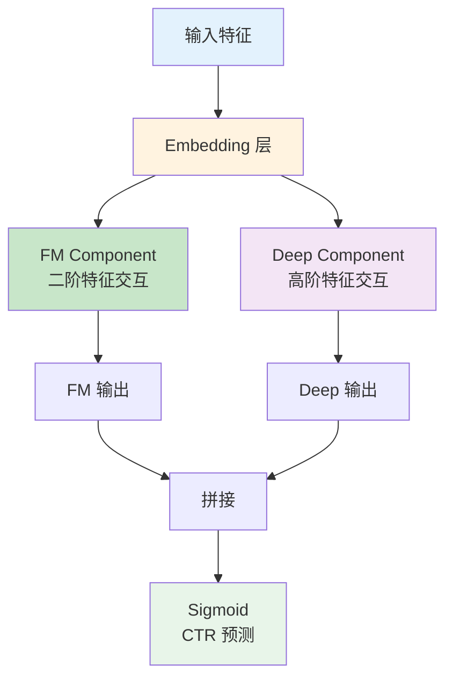

# DeepFM / Wide&Deep / Deep&Cross 面试题（15 道）

## DeepFM 题目（5 道）

### 题目 1：DeepFM 架构

**问题：** 请画出 DeepFM 的架构图并解释其核心思想。

**参考答案：**

**DeepFM 架构图：**



**核心思想：**

1. **FM 部分**：
   - 自动学习二阶特征交互
   - 无需人工特征工程
   - 公式：$\sum_{i=1}^{d}\sum_{j=i+1}^{d} \langle v_i, v_j \rangle x_i x_j$

2. **Deep 部分**：
   - 多层神经网络
   - 学习高阶非线性交互
   - 深层特征表示

3. **端到端训练**：
   - FM 和 Deep 共享 Embedding
   - 联合优化，无需预训练

**优势：**
- 结合低阶 + 高阶特征交互
- 无需人工特征交叉
- 端到端训练

**评分：** 架构清晰 3 分，思想准确 2 分

---

### 题目 2：DeepFM vs FM

**问题：** DeepFM 相比传统 FM 有什么改进？

**参考答案：**

**FM 局限：**

| 局限 | 说明 |
|------|------|
| 只能学习二阶交互 | 无法捕捉高阶特征组合 |
| 线性模型 | 表达能力有限 |
| 特征工程依赖 | 需要人工设计交叉特征 |

**DeepFM 改进：**

| 改进 | 说明 |
|------|------|
| 高阶交互 | Deep 部分学习任意阶交互 |
| 非线性 | 神经网络激活函数引入非线性 |
| 自动特征 | 无需人工设计交叉特征 |
| 共享 Embedding | FM 和 Deep 共享，参数高效 |

**公式对比：**

$$\text{FM: } \hat{y} = w_0 + \sum w_i x_i + \sum\sum \langle v_i, v_j \rangle x_i x_j$$

$$\text{DeepFM: } \hat{y} = \text{Sigmoid}(y_{FM} + y_{Deep})$$

**评分：** 对比清晰 5 分

---

### 题目 3：DeepFM 实现

**问题：** 实现 DeepFM 的核心代码。

**参考答案：**

```python
import torch
import torch.nn as nn

class DeepFM(nn.Module):
    def __init__(self, field_dims, embed_dim, hidden_units=[256, 128]):
        super().__init__()
        
        self.n_fields = len(field_dims)
        self.embed_dim = embed_dim
        
        # Embedding 层
        self.embedding = nn.ModuleList([
            nn.Embedding(size, embed_dim) for size in field_dims
        ])
        
        # FM 部分
        self.fm_first = nn.Embedding(sum(field_dims), 1)
        nn.init.xavier_uniform_(self.fm_first.weight)
        
        # Deep 部分
        deep_input_dim = self.n_fields * embed_dim
        deep_layers = []
        
        for hidden in hidden_units:
            deep_layers.extend([
                nn.Linear(deep_input_dim, hidden),
                nn.ReLU(),
                nn.BatchNorm1d(hidden),
                nn.Dropout(0.2)
            ])
            deep_input_dim = hidden
        
        self.deep_network = nn.Sequential(*deep_layers)
        
        # 输出层
        self.fc = nn.Linear(hidden_units[-1] + self.n_fields, 1)
    
    def forward(self, x):
        """
        x: (batch_size, n_fields) 类别特征索引
        """
        # Embedding
        embed_out = [emb(x[:, i]) for i, emb in enumerate(self.embedding)]
        embed_out = torch.cat(embed_out, dim=1)  # (batch, n_fields * embed_dim)
        
        # FM 一阶
        fm_first = torch.sum(self.fm_first(x), dim=1, keepdim=True)  # (batch, 1)
        
        # FM 二阶
        embed_sum = torch.sum(torch.cat(embed_out, dim=1).view(-1, self.n_fields, self.embed_dim), dim=1)
        fm_second = torch.sum(embed_sum ** 2, dim=1, keepdim=True)  # 简化版
        
        fm_out = fm_first + fm_second
        
        # Deep 部分
        deep_out = self.deep_network(embed_out.view(embed_out.size(0), -1))
        
        # 拼接输出
        combined = torch.cat([fm_out, deep_out], dim=1)
        output = torch.sigmoid(self.fc(combined))
        
        return output.squeeze()
```

**评分：** 实现正确 5 分

---

### 题目 4：DeepFM 特征处理

**问题：** DeepFM 如何处理连续特征和类别特征？

**参考答案：**

**类别特征：**
```python
# 直接 Embedding
class_embedding = nn.Embedding(n_categories, embed_dim)
class_embed = class_embedding(class_feature)  # (batch, embed_dim)
```

**连续特征：**
```python
# 方法 1：直接拼接
continuous_feat = continuous_feat.unsqueeze(1)  # (batch, 1)

# 方法 2：分桶后 Embedding
n_buckets = 100
bucketed = torch.bucketize(continuous_feat, boundaries)
continuous_embed = embedding(bucketed)

# 方法 3：非线性变换
continuous_embed = nn.Linear(1, embed_dim)(continuous_feat.unsqueeze(1))
```

**混合处理：**
```python
class DeepFMWithContinuous(nn.Module):
    def __init__(self, cat_dims, num_continuous, embed_dim):
        super().__init__()
        
        # 类别特征 Embedding
        self.cat_embedding = nn.ModuleList([
            nn.Embedding(dim, embed_dim) for dim in cat_dims
        ])
        
        # 连续特征处理
        self.cont_linear = nn.Linear(num_continuous, embed_dim * len(cat_dims))
    
    def forward(self, cat_features, cont_features):
        # 类别
        cat_embeds = [emb(cat_features[:, i]) for i, emb in enumerate(self.cat_embedding)]
        cat_embeds = torch.cat(cat_embeds, dim=1)
        
        # 连续
        cont_embeds = self.cont_linear(cont_features)
        
        # 拼接
        combined = torch.cat([cat_embeds, cont_embeds], dim=1)
        
        return combined
```

**评分：** 方法全面 5 分

---

### 题目 5：DeepFM 训练技巧

**问题：** DeepFM 训练时有哪些技巧？

**参考答案：**

**1. 学习率调度：**
```python
optimizer = torch.optim.Adam(model.parameters(), lr=0.001)
scheduler = torch.optim.lr_scheduler.ReduceLROnPlateau(
    optimizer, mode='min', factor=0.5, patience=3
)
```

**2. 梯度裁剪：**
```python
torch.nn.utils.clip_grad_norm_(model.parameters(), max_norm=1.0)
```

**3. Dropout 正则化：**
```python
nn.Dropout(0.2)  # 防止过拟合
```

**4. Batch Normalization：**
```python
nn.BatchNorm1d(hidden_dim)  # 加速收敛
```

**5. 负采样（CTR 场景）：**
```python
# CTR 数据正负样本不平衡
# 对负样本下采样或加权
pos_weight = torch.tensor([n_neg / n_pos])
criterion = nn.BCEWithLogitsLoss(pos_weight=pos_weight)
```

**6. 早停：**
```python
best_auc = 0
patience = 5
for epoch in range(n_epochs):
    val_auc = evaluate(model, val_loader)
    if val_auc > best_auc:
        best_auc = val_auc
        patience_counter = 0
        save_checkpoint(model)
    else:
        patience_counter += 1
        if patience_counter >= patience:
            break
```

**评分：** 技巧实用 5 分

---

## Wide&Deep 题目（5 道）

### 题目 6：Wide&Deep 原理

**问题：** 请解释 Wide&Deep 模型的核心思想和架构。

**参考答案：**

**核心思想：**

Wide&Deep 结合了：
- **Wide 部分**：记忆能力（Memorization）
  - 线性模型
  - 学习特征交叉
  - 捕捉历史规律

- **Deep 部分**：泛化能力（Generalization）
  - 神经网络
  - 学习隐式交互
  - 泛化到未见组合

**架构图：**

```
输入特征
  ├──→ Wide 部分（线性 + 交叉特征）──┐
  └──→ Deep 部分（Embedding+MLP）───┤
                                     ↓
                              拼接 → 输出 → Sigmoid
```

**数学公式：**

$$y = \sigma(w_{wide}^T [x, \phi(x)] + w_{deep}^T a^{(l)} + b)$$

其中：
- $x$：原始特征
- $\phi(x)$：交叉特征变换
- $a^{(l)}$：Deep 部分最后一层激活

**评分：** 思想清晰 3 分，公式正确 2 分

---

### 题目 7：Wide 部分特征

**问题：** Wide&Deep 中 Wide 部分需要哪些特征？如何构造交叉特征？

**参考答案：**

**Wide 部分特征：**

1. **原始特征**：
   - 类别特征（One-Hot）
   - 连续特征（归一化）

2. **交叉特征**（核心）：
   ```
   示例：
   - AND(app_installed, impression_slot)
   - AND(user_gender, item_category)
   - AND(age_bucket, location)
   ```

**交叉特征构造：**

```python
# 方法 1：笛卡尔积
def create_cross_feature(feature1, feature2):
    """
    feature1: [0, 1, 2, ...]
    feature2: [0, 1, 0, ...]
    返回：交叉特征索引
    """
    n1 = max(feature1) + 1
    n2 = max(feature2) + 1
    cross = feature1 * n2 + feature2
    return cross

# 方法 2：特征哈希
def hash_cross_feature(feat1, feat2, num_buckets=10000):
    combined = [f"{f1}_{f2}" for f1, f2 in zip(feat1, feat2)]
    hashed = [hash(f) % num_buckets for f in combined]
    return hashed

# 方法 3：TF 特征列
import tensorflow as tf

crossed_feature = tf.feature_column.crossed_column(
    ['age_bucket', 'location'],
    hash_bucket_size=10000
)
```

**交叉特征选择：**
- 业务强相关的特征组合
- 历史统计显著的组合
- 不宜过多（防止过拟合）

**评分：** 方法实用 5 分

---

### 题目 8：Wide&Deep 实现

**问题：** 实现 Wide&Deep 模型。

**参考答案：**

```python
import torch
import torch.nn as nn

class WideAndDeep(nn.Module):
    def __init__(self, wide_dim, deep_dims, embed_dim=16):
        super().__init__()
        
        # Wide 部分（线性）
        self.wide = nn.Linear(wide_dim, 1)
        
        # Deep 部分
        self.embedding = nn.Embedding(deep_dims[0], embed_dim)
        
        deep_layers = []
        prev_dim = embed_dim
        for hidden_dim in deep_dims[1:]:
            deep_layers.extend([
                nn.Linear(prev_dim, hidden_dim),
                nn.ReLU(),
                nn.BatchNorm1d(hidden_dim)
            ])
            prev_dim = hidden_dim
        
        self.deep = nn.Sequential(*deep_layers)
        
        # 输出层
        self.fc = nn.Linear(1 + prev_dim, 1)
    
    def forward(self, wide_input, deep_input):
        """
        wide_input: (batch, wide_dim) 稀疏特征
        deep_input: (batch,) 类别特征索引
        """
        # Wide 部分
        wide_out = self.wide(wide_input)  # (batch, 1)
        
        # Deep 部分
        deep_embed = self.embedding(deep_input)
        deep_out = self.deep(deep_embed)
        
        # 拼接
        combined = torch.cat([wide_out, deep_out], dim=1)
        
        # 输出
        output = torch.sigmoid(self.fc(combined))
        
        return output.squeeze()
```

**评分：** 实现正确 5 分

---

### 题目 9：Wide&Deep vs DeepFM

**问题：** Wide&Deep 和 DeepFM 有什么区别？

**参考答案：**

**对比分析：**

| 维度 | Wide&Deep | DeepFM |
|------|-----------|--------|
| 提出时间 | 2016 (Google) | 2017 (华为) |
| Wide 部分 | 线性 + 人工交叉 | FM（自动二阶） |
| 特征工程 | 需要人工交叉特征 | 无需人工交叉 |
| Embedding | 独立 | FM 和 Deep 共享 |
| 训练方式 | 端到端 | 端到端 |
| 表达能力 | 一阶 + 高阶 | 二阶 + 高阶 |

**选择建议：**

```
┌─────────────────────────────────────────────────┐
│  选择 Wide&Deep：                                │
│  • 有强业务先验（已知有效交叉）                 │
│  • 需要可解释的交叉特征                         │
│  • 特征工程能力强                               │
├─────────────────────────────────────────────────┤
│  选择 DeepFM：                                   │
│  • 不想做特征工程                               │
│  • 自动学习特征交互                             │
│  • 数据量足够                                   │
└─────────────────────────────────────────────────┘
```

**评分：** 对比清晰 5 分

---

### 题目 10：Wide&Deep 应用

**问题：** Wide&Deep 在工业界有哪些应用？

**参考答案：**

**Google Play 应用：**

原始论文中的应用场景：

```
特征设计：
├── Installed apps（用户已安装应用）
├── Impression slots（展示位置）
├── User features（年龄、语言等）
└── App features（类别、开发者等）

交叉特征：
├── AND(installed_app, impression_slot)
├── AND(user_language, app_category)
└── ...

效果：
├── App 下载率提升 3.9%
└── 线上 A/B 测试显著
```

**其他应用：**

| 公司 | 场景 | 效果 |
|------|------|------|
| 阿里 | 电商 CTR | 提升 2-5% |
| 美团 | 外卖推荐 | 订单量提升 |
| 字节 | 广告 CTR | 显著提升 |

**评分：** 案例丰富 5 分

---

## Deep&Cross 题目（5 道）

### 题目 11：Cross Network 原理

**问题：** 请解释 Deep&Cross 中 Cross Network 的原理和公式。

**参考答案：**

**Cross Network 核心：**

显式学习有界的特征交叉，无需人工设计。

**交叉层公式：**

$$x_{l+1} = x_0 x_l^T w_l + b_l + x_l$$

其中：
- $x_0$：输入向量（原始特征）
- $x_l$：第 $l$ 层输出
- $w_l$：权重向量
- $b_l$：偏置

**直观理解：**

```
第 l 层交叉 = x_0 ⊗ (x_l · w_l) + x_l
            = 原始特征 ⊗ 当前层投影 + 残差连接
```

**架构图：**


**特点：**
- 显式特征交叉
- 残差连接防止梯度消失
- 参数高效（每层 d+1 个参数）

**评分：** 公式正确 3 分，解释清晰 2 分

---

### 题目 12：DCN 版本演进

**问题：** DCN v1 和 v2 有什么区别？

**参考答案：**

**DCN v1 局限：**

1. 交叉层输出是向量，维度受限
2. 只能学习特定形式的交叉
3. 与 Deep 部分简单拼接

**DCN v2 改进：**

**1. 矩阵化交叉：**
$$X_{l+1} = X_0 X_l^T W_l + X_l$$

从向量变为矩阵，学习更丰富的交叉。

**2. 混合结构：**
```
DCN v2 架构：
├── Stacked Cross Layers（堆叠交叉层）
├── Parallel Deep Layers（并行深度层）
└── Residual Connections（残差连接）
```

**3. 低秩分解：**
```python
# 减少参数
W_l = U_l V_l^T  # 低秩分解
```

**对比：**

| 特性 | DCN v1 | DCN v2 |
|------|--------|--------|
| 交叉形式 | 向量 | 矩阵 |
| 结构 | 简单拼接 | 混合残差 |
| 参数效率 | 低 | 高（低秩） |
| 表达能力 | 有限 | 更强 |

**评分：** 演进清晰 5 分

---

### 题目 13：DCN 实现

**问题：** 实现 Cross Network。

**参考答案：**

```python
import torch
import torch.nn as nn

class CrossLayer(nn.Module):
    """单个交叉层"""
    
    def __init__(self, input_dim):
        super().__init__()
        self.weight = nn.Parameter(torch.randn(input_dim, 1))
        self.bias = nn.Parameter(torch.zeros(input_dim, 1))
        self.input_dim = input_dim
    
    def forward(self, x_0, x_l):
        """
        x_0: (batch, input_dim, 1) 原始输入
        x_l: (batch, input_dim, 1) 当前层输出
        """
        batch_size = x_0.shape[0]
        
        # x_l^T · w
        xl_w = torch.matmul(x_l.transpose(1, 2), self.weight)  # (batch, 1, 1)
        
        # x_0 · (x_l^T · w)
        cross = torch.matmul(x_0, xl_w)  # (batch, dim, 1)
        
        # 残差
        out = cross + self.bias + x_l
        
        return out


class CrossNetwork(nn.Module):
    """堆叠交叉层"""
    
    def __init__(self, input_dim, n_layers=3):
        super().__init__()
        self.n_layers = n_layers
        self.cross_layers = nn.ModuleList([
            CrossLayer(input_dim) for _ in range(n_layers)
        ])
    
    def forward(self, x):
        """
        x: (batch, input_dim)
        """
        x_0 = x.unsqueeze(2)  # (batch, dim, 1)
        x_l = x_0
        
        for layer in self.cross_layers:
            x_l = layer(x_0, x_l)
        
        return x_l.squeeze(2)  # (batch, dim)
```

**评分：** 实现正确 5 分

---

### 题目 14：DCN 优缺点

**问题：** DCN 相比 DeepFM 有什么优缺点？

**参考答案：**

**DCN 优点：**

| 优点 | 说明 |
|------|------|
| 显式交叉 | 有界的特征交叉，可解释 |
| 自动学习 | 无需人工设计交叉特征 |
| 参数高效 | 每层只需 d+1 参数 |
| 深层交叉 | 多层堆叠学习高阶交叉 |

**DCN 缺点：**

| 缺点 | 说明 |
|------|------|
| 交叉形式受限 | 只能是特定形式的交叉 |
| 计算复杂度 | 矩阵运算，比 FM 慢 |
| 调参复杂 | 层数、低秩等超参数 |

**对比 DeepFM：**

| 维度 | DeepFM | DCN |
|------|--------|-----|
| 交叉方式 | FM 内积 | 显式交叉层 |
| 可解释性 | 低 | 较高 |
| 参数效率 | 高 | 中 |
| 训练速度 | 快 | 较慢 |
| 效果 | 好 | 略好 |

**选择建议：**
- 需要可解释交叉 → DCN
- 追求训练效率 → DeepFM
- 数据量大 → 都可尝试

**评分：** 对比全面 5 分

---

### 题目 15：特征交叉方法对比

**问题：** 总结推荐系统中特征交叉的主要方法。

**参考答案：**

**特征交叉方法对比：**

| 方法 | 交叉阶数 | 是否自动 | 可解释性 | 计算成本 |
|------|----------|----------|----------|----------|
| 人工交叉 | 任意 | 否 | 高 | 低 |
| FM | 二阶 | 是 | 中 | 低 |
| FFM | 二阶（场感知） | 是 | 中 | 中 |
| DeepFM | 二阶 + 高阶 | 是 | 低 | 中 |
| DCN | 有界高阶 | 是 | 中 | 中 |
| xDeepFM | 显式高阶 | 是 | 中 | 高 |
| AutoInt | 自注意力 | 是 | 低 | 高 |

**演进趋势：**

```
人工交叉 → FM → DeepFM → DCN → xDeepFM → AutoInt
   ↓         ↓       ↓        ↓         ↓          ↓
 完全手动  自动二阶  高低阶   显式交叉  显式高阶   注意力
```

**选择建议：**

```python
if 有业务先验:
    人工交叉 + Wide&Deep
elif 需要可解释:
    DCN
elif 追求效果:
    xDeepFM / AutoInt
else:
    DeepFM  # 基线
```

**评分：** 总结全面 5 分

---

## 综合评分标准

| 总分 | 等级 | 说明 |
|------|------|------|
| 68-75 | 优秀 | 深入理解，灵活运用 |
| 55-67 | 良好 | 掌握核心，解决常见问题 |
| 40-54 | 一般 | 了解基础，缺乏深度 |
| <40 | 较差 | 概念不清，需加强学习 |
