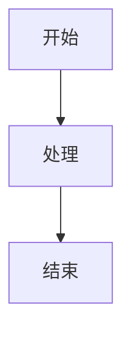

# MDX 写作规范 v1.0

> 本项目所有文章统一使用 MDX 格式，确保内容质量和一致性

---

## 📋 文件命名规范

```
content/knowledge/[分类]/[编号]_[标题].mdx
```

**示例：**
- `content/knowledge/LLM/001_Transformer 架构详解.mdx`
- `content/knowledge/CV/002_目标检测算法综述.mdx`

**编号规则：**
- 3 位数字编号（001, 002, 003...）
- 按创建顺序递增

---

## 📝 文章结构

### 1. Frontmatter（必需）

```mdx
---
title: "文章标题"
category: "LLM"
difficulty: "⭐⭐⭐"
tags: ["Transformer", "Attention", "深度学习"]
createdAt: "2026-03-31"
updatedAt: "2026-03-31"
---
```

**必填字段：**
- `title` - 文章标题
- `category` - 分类（LLM/CV/NLP/ML/DL/RecSys/RL）
- `difficulty` - 难度（1-5 星）
- `tags` - 标签数组
- `createdAt` - 创建日期

### 2. 摘要（必需）

```mdx
> **分类**: 大语言模型 | **编号**: LLM-001 | **难度**: ⭐⭐⭐
>
> `标签 1` `标签 2` `标签 3`
>
> **摘要**: 200 字以内的文章摘要，说明文章核心内容。
```

### 3. 正文结构

```mdx
## 一、核心概念

### 1.1 什么是 XXX

内容...

## 二、核心原理

### 2.1 数学公式

内容...

## 三、代码实现

### 3.1 完整示例

内容...

## 四、总结

内容...

## 参考资料

- [论文/文档链接](url)
```

---

## 🎨 可用组件

### 1. Callout（信息框）

```mdx
<Callout type="info" title="💡 核心概念">
这是重要概念说明
</Callout>
```

**类型：**
- `info` - 蓝色信息框 ℹ️
- `warning` - 黄色警告框 ⚠️
- `success` - 绿色成功框 ✅
- `error` - 红色错误框 ❌
- `tip` - 紫色提示框 💡
- `note` - 灰色注释框 📝

### 2. Collapsible（折叠框）

```mdx
<Collapsible title="📦 点击查看：代码示例">

```python
def hello():
    print("Hello World")
```

</Collapsible>
```

**注意：** 折叠内容前后必须有空行

### 3. Quiz（测验题）

```mdx
<Quiz question="以下哪项是正确的？">
<Answer correct={True}>正确答案</Answer>
<Answer correct={False}>错误答案</Answer>
<Answer correct={False}>错误答案</Answer>
</Quiz>
```

### 4. Step（步骤说明）

```mdx
<Step number="1" title="第一步">
步骤内容描述
</Step>

<Step number="2" title="第二步">
步骤内容描述
</Step>
```

### 5. Comparison（对比表格）

```mdx
<Comparison
  items={[
    { title: "方案 A", items: ["特点 1", "特点 2"], pros: ["优势"], cons: ["劣势"] },
    { title: "方案 B", items: ["特点 1", "特点 2"], pros: ["优势"], cons: ["劣势"] }
  ]}
/>
```

### 6. Mermaid（图表）

```mdx

```

---

## 📌 写作规范

### ✅ 推荐做法

1. **使用组件增强可读性**
   - 重要概念用 `<Callout>` 标注
   - 补充材料用 `<Collapsible>` 折叠
   - 关键步骤用 `<Step>` 分步

2. **代码示例完整**
   - 包含导入语句
   - 添加注释说明
   - 提供运行示例

3. **图表辅助理解**
   - 流程图用 Mermaid
   - 对比用 Comparison 组件
   - 复杂概念配图

### ❌ 避免做法

1. **不要使用 JSX 语法**
   ```mdx
   <!-- ❌ 错误 -->
   <Step number={1} title="第一步">
   
   <!-- ✅ 正确 -->
   <Step number="1" title="第一步">
   ```

2. **不要在代码块中使用 title 属性**
   ```mdx
   <!-- ❌ 错误 -->
   ```python title="example.py"
   
   <!-- ✅ 正确 -->
   ```python
   ```

3. **不要在 Callout 中使用三重引号**
   ```mdx
   <!-- ❌ 错误 -->
   <Callout>
   ```python
   code = """三重引号"""
   ```
   </Callout>
   
   <!-- ✅ 正确 -->
   <Callout>
   代码示例见下方
   </Callout>
   
   ```python
   code = """三重引号"""
   ```
   ```

---

## 🔧 技术细节

### 组件导入

所有组件自动可用，无需手动导入：
- Callout
- Collapsible
- Quiz
- Step
- Comparison
- Mermaid

### 数学公式

使用行内或块级格式：

```mdx
行内公式：$E = mc^2$

块级公式：
$$
\text{Attention}(Q, K, V) = \text{softmax}\left(\frac{QK^T}{\sqrt{d_k}}\right)V
$$
```

### 代码高亮

支持所有常见语言：
- python
- javascript
- typescript
- java
- cpp
- go
- rust
- sql
- bash

---

## 📖 示例文章

参考以下文章学习 MDX 写作：

1. **005_LLM 应用开发实战.mdx** - 完整组件使用示例
2. **001_Transformer 架构详解.mdx** - 技术文章结构示例
3. **002_LLM 位置编码详解.mdx** - 数学公式示例

---

## 🚀 快速开始

```bash
# 1. 创建新文章
touch content/knowledge/LLM/006_新文章标题.mdx

# 2. 复制模板
cat content/knowledge/LLM/005_LLM\ 应用开发实战.mdx > content/knowledge/LLM/006_新文章标题.mdx

# 3. 编辑内容
code content/knowledge/LLM/006_新文章标题.mdx

# 4. 本地测试
npm run dev

# 5. 提交
git add .
git commit -m "feat: 添加 006_新文章标题"
git push
```

---

## 📊 质量检查清单

发布前检查：

- [ ] Frontmatter 完整
- [ ] 摘要清晰（200 字以内）
- [ ] 至少使用 2 个 Callout
- [ ] 代码示例可运行
- [ ] 至少 1 个图表（Mermaid/Comparison）
- [ ] 参考资料完整
- [ ] 拼写检查通过
- [ ] 本地构建成功

---

**版本：** 1.0  
**更新日期：** 2026-03-31  
**维护者：** AI 学习与面试大全团队
