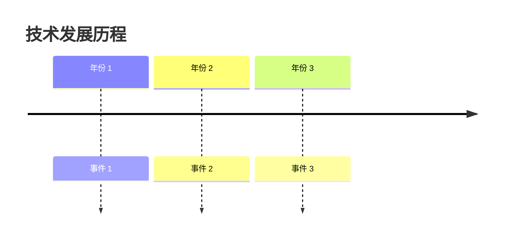
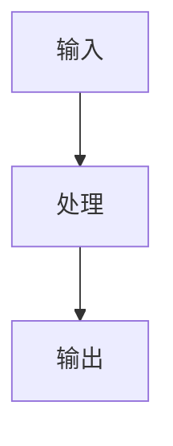
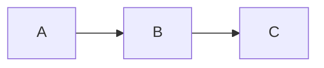
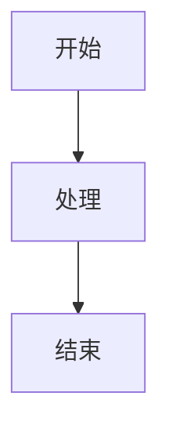

# 技术文档写作规范 v1.0

> 本项目所有技术文档的统一写作标准  
> 整合：MDX 格式 + 优秀技术文档特质 + 维基百科结构

---

## 📋 目录

1. [文档类型](#1-文档类型)
2. [文件规范](#2-文件规范)
3. [文章结构](#3-文章结构)
4. [MDX 组件使用](#4-mdx 组件使用)
5. [写作原则](#5-写作原则)
6. [质量检查](#6-质量检查)
7. [模板示例](#7-模板示例)

---

## 1. 文档类型

本项目包含两种文档类型，采用不同写作策略：

### 1.1 知识库文章（Knowledge Base）

| 特征 | 说明 |
|------|------|
| **目的** | 系统性学习一个知识点 |
| **结构** | 维基百科式 |
| **深度** | 全面、深入、完整 |
| **读者** | 想要深入理解技术的人 |
| **示例** | 《Transformer 架构详解》《RAG 原理》 |

### 1.2 面试题解析（Interview Questions）

| 特征 | 说明 |
|------|------|
| **目的** | 解决具体面试问题 |
| **结构** | 问题驱动式 |
| **深度** | 聚焦、实用、可回答 |
| **读者** | 准备技术面试的人 |
| **示例** | 《如何实现 LoRA 微调》《RAG 优化策略》 |

---

## 2. 文件规范

### 2.1 文件命名

```
content/knowledge/[分类]/[编号]_[标题].mdx
```

**示例：**
```
content/knowledge/LLM/001_Transformer 架构详解.mdx
content/knowledge/CV/002_目标检测算法综述.mdx
content/knowledge/ML/003_决策树与随机森林.mdx
```

**编号规则：**
- 3 位数字，按创建顺序递增（001, 002, 003...）
- 同一分类内连续编号
- 不同分类独立编号

### 2.2 分类体系

| 分类代码 | 分类名称 | 说明 |
|---------|---------|------|
| `ML` | 机器学习基础 | 监督学习、无监督学习、模型评估 |
| `DL` | 深度学习 | 神经网络、CNN、RNN、Transformer |
| `NLP` | 自然语言处理 | 词向量、语言模型、文本生成 |
| `CV` | 计算机视觉 | 图像分类、目标检测、分割 |
| `LLM` | 大语言模型 | Prompt、RAG、Fine-tuning、Agent |
| `RecSys` | 推荐系统 | 召回排序、协同过滤、深度学习 |
| `RL` | 强化学习 | MDP、Q-Learning、Policy Gradient |

### 2.3 Frontmatter（必需）

```mdx
---
title: "文章标题"
category: "LLM"
difficulty: "⭐⭐⭐"
tags: ["Transformer", "Attention", "深度学习"]
createdAt: "2026-03-31"
updatedAt: "2026-03-31"
author: "作者名"
version: "1.0"
---
```

**必填字段：**
- `title` - 文章标题（准确、简洁）
- `category` - 分类（见分类体系）
- `difficulty` - 难度（1-5 星）
- `tags` - 标签数组（3-5 个）
- `createdAt` - 创建日期（YYYY-MM-DD）

**选填字段：**
- `updatedAt` - 更新日期
- `author` - 作者
- `version` - 版本号

---

## 3. 文章结构

### 3.1 知识库文章结构（维基百科式）

```mdx
# [技术名称]

> **分类**: [分类名称] | **编号**: [编号] | **难度**: [难度]
>
> `标签 1` `标签 2` `标签 3`
>
> **摘要**: 200 字以内的核心概述，说明技术定义、重要性、应用场景。

---

## 目录

---

## 一、概述

用 500 字以内讲清楚：
- 这是什么技术
- 为什么重要
- 解决了什么问题
- 核心思想是什么

<Callout type="info" title="💡 核心洞察">
用一句话概括技术的核心价值
</Callout>

---

## 二、背景与历史

### 2.1 问题起源
- 技术发展遇到了什么瓶颈
- 为什么需要这项技术

### 2.2 发展历程


### 2.3 命名由来
- 名称含义
- 提出者/机构

---

## 三、核心概念

### 3.1 定义
准确的技术定义（可引用论文/官方文档）

### 3.2 基本术语
| 术语 | 定义 | 说明 |
|------|------|------|
| 术语 1 | 定义 | 补充说明 |
| 术语 2 | 定义 | 补充说明 |

### 3.3 相关概念
- 与 XXX 的关系
- 与 YYY 的区别

---

## 四、原理与机制

### 4.1 工作原理


### 4.2 技术细节
分步骤详细说明工作原理

### 4.3 数学基础
$$
\text{核心公式}
$$

**符号说明：**
- 符号 1：含义
- 符号 2：含义

---

## 五、实现

### 5.1 典型实现
| 实现 | 框架 | 特点 | 链接 |
|------|------|------|------|
| 实现 1 | PyTorch | 特点说明 | GitHub 链接 |

### 5.2 代码示例

<Collapsible title="🐍 点击查看：完整实现">

```python
# 完整可运行的代码示例
# 包含导入语句、注释、使用示例
```

</Collapsible>

### 5.3 配置说明
- 环境要求
- 依赖安装
- 参数配置

---

## 六、应用

### 6.1 应用场景
- 场景 1：说明
- 场景 2：说明

### 6.2 案例分析
实际项目中的应用案例

### 6.3 最佳实践
- 实践 1
- 实践 2

---

## 七、变体与扩展

### 7.1 主要变体
| 变体 | 改进点 | 适用场景 |
|------|--------|----------|
| 变体 1 | 改进说明 | 场景说明 |

### 7.2 相关技术
- 技术 1：与本文技术的关系
- 技术 2：与本文技术的关系

### 7.3 后续发展
技术的演进方向

---

## 八、优势与局限

<Comparison
  items={[
    { title: "✅ 优势", items: ["优势 1", "优势 2", "优势 3"] },
    { title: "⚠️ 局限", items: ["局限 1", "局限 2", "局限 3"] }
  ]}
/>

### 8.3 适用场景
**适合：**
- 场景 1
- 场景 2

**不适合：**
- 场景 1
- 场景 2

---

## 九、对比与评价

### 9.1 与相关技术对比
| 特性 | 本文技术 | 技术 A | 技术 B |
|------|---------|--------|--------|
| 特性 1 | ✅ | ❌ | ⚠️ |
| 特性 2 | ⭐⭐⭐ | ⭐⭐ | ⭐⭐⭐⭐ |

### 9.2 业界评价
- 引用权威评价
- 学术影响（引用数）
- 产业影响

---

## 十、参考资源

### 10.1 原始论文
- 论文标题，作者，年份，[链接](url)

### 10.2 官方文档
- [文档名称](url)

### 10.3 学习资源
- [教程名称](url)
- [视频课程](url)

---

## 十一、常见问题

<Collapsible title="❓ FAQ">

**Q1: 问题 1？**

A: 回答 1

**Q2: 问题 2？**

A: 回答 2

</Collapsible>

---

## 十二、总结

<Callout type="success" title="✅ 学习完成">

用 200 字总结全文核心要点，并给出下一步学习建议。

</Callout>

---

## 十三、更新历史

| 版本 | 日期 | 更新内容 | 作者 |
|------|------|---------|------|
| 1.0 | 2026-03-31 | 初始版本 | 作者名 |
```

---

### 3.2 面试题解析结构（问题驱动式）

```mdx
# [面试问题]

> **分类**: [分类] | **难度**: [难度] | **考察频率**: ⭐⭐⭐
>
> `标签 1` `标签 2`
>
> **一句话回答**: 用 30 秒能说清楚的核心答案

---

## 一、问题解析

### 1.1 面试官想考察什么
- 知识点 1
- 知识点 2

### 1.2 回答框架
```
1. 定义（10 秒）
2. 原理（30 秒）
3. 应用（20 秒）
4. 扩展（可选）
```

---

## 二、核心答案

### 2.1 定义
准确定义（背诵级）

### 2.2 原理


### 2.3 关键点
- 关键点 1（必答）
- 关键点 2（必答）
- 关键点 3（加分项）

---

## 三、代码实现

```python
# 手撕代码级别
# 简洁、完整、可运行
```

---

## 四、进阶问题

<Collapsible title="🔥 面试官可能会追问">

**追问 1: 问题？**

回答要点：
- 要点 1
- 要点 2

**追问 2: 问题？**

回答要点：
- 要点 1
- 要点 2

</Collapsible>

---

## 五、常见错误

<Callout type="warning" title="⚠️ 避免这些错误">

- ❌ 错误 1
- ❌ 错误 2
- ❌ 错误 3

</Callout>

---

## 六、参考回答模板

```
[30 秒版本]
一句话概括 + 核心要点

[2 分钟版本]
定义 + 原理 + 应用 + 个人理解

[深入版本]
完整技术细节 + 代码 + 扩展讨论
```

---

## 七、相关题目

- [相关题目 1](链接)
- [相关题目 2](链接)
```

---

## 4. MDX 组件使用

### 4.1 Callout（信息框）

```mdx
<Callout type="info" title="💡 核心概念">

内容...

</Callout>
```

**使用场景：**
- `info` - 重要概念说明
- `warning` - 注意事项/常见错误
- `success` - 总结/鼓励
- `error` - 错误示例
- `tip` - 技巧/最佳实践
- `note` - 补充说明

**注意：**
- 内容前后必须有空行
- 避免在三重引号字符串内使用

---

### 4.2 Collapsible（折叠框）

```mdx
<Collapsible title="📦 点击查看：详细内容">

```python
# 代码/长文本内容
```

</Collapsible>
```

**使用场景：**
- 完整代码示例
- 补充材料
- FAQ
- 进阶内容

**注意：**
- 标题要清晰说明内容
- 内容前后必须有空行

---

### 4.3 Quiz（测验题）

```mdx
<Quiz question="以下哪项是正确的？">
<Answer correct={True}>正确答案</Answer>
<Answer correct={False}>错误答案</Answer>
<Answer correct={False}>错误答案</Answer>
</Quiz>
```

**使用场景：**
- 章节末尾测试理解
- 关键概念检查
- 面试模拟

**注意：**
- 至少 3 个选项
- 只有 1 个正确答案
- `correct` 属性用字符串 "True"/"False"

---

### 4.4 Step（步骤说明）

```mdx
<Step number="1" title="第一步：准备工作">

步骤内容...

</Step>

<Step number="2" title="第二步：实现核心逻辑">

步骤内容...

</Step>
```

**使用场景：**
- 教程步骤
- 流程说明
- 操作指南

**注意：**
- `number` 用字符串
- 标题简明扼要

---

### 4.5 Comparison（对比表格）

```mdx
<Comparison
  items={[
    { 
      title: "方案 A", 
      items: ["特点 1", "特点 2"], 
      pros: ["优势 1"], 
      cons: ["劣势 1"] 
    },
    { 
      title: "方案 B", 
      items: ["特点 1", "特点 2"], 
      pros: ["优势 1"], 
      cons: ["劣势 1"] 
    }
  ]}
/>
```

**使用场景：**
- 技术方案对比
- 优劣势分析
- 选型建议

---

### 4.6 Mermaid（图表）

```mdx

```

**支持的图表类型：**
- `graph` - 流程图
- `sequenceDiagram` - 时序图
- `classDiagram` - 类图
- `timeline` - 时间线
- `pie` - 饼图

---

## 5. 写作原则

### 5.1 内容质量

| 原则 | 说明 | 检查方法 |
|------|------|----------|
| **准确性** | 技术细节正确无误 | 代码可运行、公式正确 |
| **完整性** | 覆盖关键知识点 | 对照维基百科结构 |
| **清晰性** | 表达简洁明了 | 避免长句、术语解释 |
| **实用性** | 能解决实际问题 | 有代码、有案例 |
| **独特性** | 有一手经验/洞见 | 不是文档翻译 |

### 5.2 读者友好

| 原则 | 说明 | 实现方式 |
|------|------|----------|
| **渐进式** | 由浅入深 | 概述→原理→实现→扩展 |
| **多视角** | 满足不同学习者 | 直觉/视觉/实践/理论 |
| **可浏览** | 快速找到信息 | 小标题、列表、表格 |
| **可验证** | 能动手实践 | 完整代码、运行结果 |

### 5.3 写作禁忌

**❌ 避免：**
- 大段连续文字（超过 5 行）
- 没有解释的代码
- 模糊的描述（"显著提升"→"提升 30%"）
- 过时的信息（标注版本/日期）
- 抄袭内容（必须原创或注明引用）

**✅ 推荐：**
- 每段 3-5 行
- 代码有注释和说明
- 具体数字和案例
- 标注信息来源
- 原创内容为主

---

## 6. 质量检查

### 6.1 发布前检查清单

**内容检查：**
- [ ] Frontmatter 完整
- [ ] 摘要清晰（200 字以内）
- [ ] 目录结构完整
- [ ] 至少使用 2 个 Callout
- [ ] 至少 1 个图表（Mermaid/Comparison）
- [ ] 代码示例完整可运行
- [ ] 参考资料完整
- [ ] 拼写和语法检查

**技术检查：**
- [ ] 代码可运行
- [ ] 公式正确
- [ ] 链接有效
- [ ] 图片显示正常
- [ ] 本地构建成功

**MDX 检查：**
- [ ] 组件语法正确（属性用引号）
- [ ] 没有 JSX 花括号（`number={1}` → `number="1"`）
- [ ] 代码块没有 title 属性
- [ ] Callout 内没有三重引号

### 6.2 评分标准

| 维度 | 权重 | 评分标准 |
|------|------|----------|
| **准确性** | 25% | 技术正确、无错误 |
| **完整性** | 20% | 覆盖关键知识点 |
| **清晰性** | 20% | 易于理解 |
| **实用性** | 20% | 有代码、有案例 |
| **规范性** | 15% | 符合本规范 |

**80 分以上才能发布。**

---

## 7. 模板示例

### 7.1 知识库文章模板

文件位置：`templates/knowledge-template.mdx`

```bash
# 使用方式
cp templates/knowledge-template.mdx content/knowledge/LLM/006_新文章标题.mdx
```

### 7.2 面试题解析模板

文件位置：`templates/question-template.mdx`

```bash
# 使用方式
cp templates/question-template.mdx content/questions/LLM/001_新题目.mdx
```

---

## 附录

### A. 常用链接

- [MDX 官方文档](https://mdxjs.com/)
- [Mermaid 文档](https://mermaid.js.org/)
- [Next.js MDX](https://nextjs.org/docs/app/building-your-application/configuring/mdx)

### B. 参考文章

- [维基百科写作规范](https://zh.wikipedia.org/wiki/Wikipedia:风格手册)
- [技术写作最佳实践](https://documentation.divio.com/)

### C. 工具推荐

- **写作**：VS Code + MDX 插件
- **图表**：Mermaid Live Editor
- **检查**：markdownlint
- **构建**：Next.js + MDX

---

**版本：** 1.0  
**创建日期：** 2026-03-31  
**维护者：** AI 学习与面试大全团队  
**更新日志：** 初始版本
