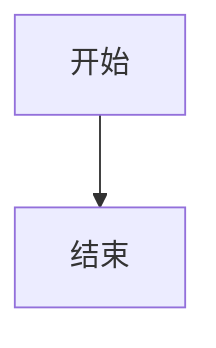

# MDX 写作快速参考 🚀

> 写作时快速查阅的速查表 | 完整版见 [`docs/写作规范.md`](写作规范.md)

---

## 📋 发布前检查清单

**复制此清单，发布前逐项检查：**

```
内容检查：
[ ] Frontmatter 完整（title/category/difficulty/tags/createdAt）
[ ] 摘要清晰（200 字以内）
[ ] 目录结构完整
[ ] 至少使用 2 个 Callout
[ ] 至少 1 个图表（Mermaid/Comparison）
[ ] 代码示例完整可运行
[ ] 参考资料完整

MDX 检查：
[ ] 组件语法正确（属性用引号）
[ ] 没有 JSX 花括号（number="1" 而非 number={1}）
[ ] 代码块没有 title 属性
[ ] Callout 内没有三重引号

技术检查：
[ ] 代码可运行
[ ] 公式正确
[ ] 链接有效
[ ] 本地构建成功（npm run build）
```

---

## 🎨 组件速查

### Callout

```mdx
<Callout type="info" title="💡 标题">
内容...
</Callout>
```

**类型：** `info` `warning` `success` `error` `tip` `note`

---

### Collapsible

```mdx
<Collapsible title="📦 点击查看">

内容...

</Collapsible>
```

**注意：** 内容前后必须有空行

---

### Quiz

```mdx
<Quiz question="问题？">
<Answer correct="True">正确答案</Answer>
<Answer correct="False">错误答案</Answer>
<Answer correct="False">错误答案</Answer>
</Quiz>
```

---

### Step

```mdx
<Step number="1" title="步骤标题">
内容...
</Step>
```

---

### Comparison

```mdx
<Comparison
  items={[
    { title: "方案 A", items: ["特点"], pros: ["优势"], cons: ["劣势"] }
  ]}
/>
```

---

### Mermaid

````mdx

````

---

## ⚠️ 常见错误

### ❌ 错误写法

```mdx
<!-- 错误：JSX 花括号 -->
<Step number={1} title="步骤">

<!-- 错误：代码块 title -->
```python title="example.py"

<!-- 错误：Callout 内三重引号 -->
<Callout>
```python
code = """三重引号"""
```
</Callout>
```

### ✅ 正确写法

```mdx
<!-- 正确：字符串引号 -->
<Step number="1" title="步骤">

<!-- 正确：无 title -->
```python

<!-- 正确：避免三重引号 -->
<Callout>
代码示例见下方
</Callout>

```python
code = "单引号"
```
```

---

## 📝 Frontmatter 模板

```mdx
---
title: "文章标题"
category: "LLM"
difficulty: "⭐⭐⭐"
tags: ["标签 1", "标签 2", "标签 3"]
createdAt: "2026-03-31"
updatedAt: "2026-03-31"
author: "作者名"
version: "1.0"
---
```

---

## 📐 文章结构

### 知识库文章

```
# 标题

> 摘要

---

## 一、概述
## 二、背景与历史
## 三、核心概念
## 四、原理与机制
## 五、实现
## 六、应用
## 七、变体与扩展
## 八、优势与局限
## 九、对比与评价
## 十、参考资源
## 十一、常见问题
## 十二、总结
## 十三、更新历史
```

### 面试题解析

```
# 问题

> 一句话回答

---

## 一、问题解析
## 二、核心答案
## 三、代码实现
## 四、进阶问题
## 五、常见错误
## 六、参考回答模板
## 七、相关题目
## 八、自测题
```

---

## 🚀 快速开始

```bash
# 1. 复制模板
cp templates/knowledge-template.mdx content/knowledge/LLM/006_新标题.mdx

# 2. 编辑
code content/knowledge/LLM/006_新标题.mdx

# 3. 测试
npm run dev

# 4. 发布
git add . && git commit -m "feat: 添加 006_新标题" && git push
```

---

## 📚 参考文章

**知识库示例：**
- `content/knowledge/LLM/001_Transformer 架构详解.mdx`
- `content/knowledge/LLM/005_LLM 应用开发实战.mdx`

**模板：**
- `templates/knowledge-template.mdx`
- `templates/question-template.mdx`

**完整规范：**
- `docs/写作规范.md`

---

**最后更新：** 2026-03-31
