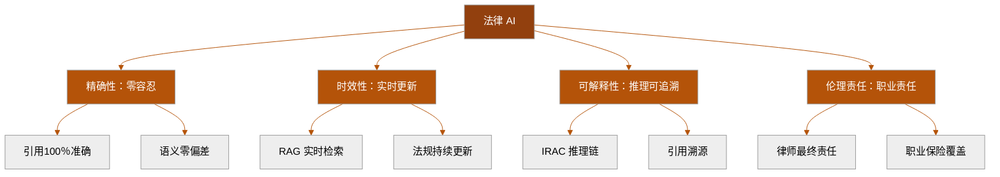

# AI + 法律行业:大语言模型在法律工作流中的工具集成生态

> 📅 2026-05-14 | 📖 28 min 阅读 | 🏷️ 进阶 | #AI 法律 #法律科技 #合同审查 #法律研究 #DocuSign #Harvey #Thomson Reuters #合规 #法律 AI 工具

## 摘要

2026 年,AI 正在深度重塑法律行业的工作方式。Anthropic 的 Claude 与 DocuSign、Thomson Reuters、Harvey 等法律工具完成深度集成,从合同审查到法律研究,从合规审计到案件准备,大语言模型已经成为法律从业者的核心生产力工具。本文系统梳理 AI 在法律行业的应用全景、工具集成生态、实战案例、技术实现路径以及对法律从业者的深远影响。

---

## 1. AI 重塑法律行业:从辅助工具到核心生产力

**法律行业**是全球最保守的专业服务领域之一,但 **2026 年**正在成为 **AI 法律技术**的转折年份。**Anthropic** 的 **Claude** 系列模型与 **DocuSign**、**Thomson Reuters**、**Harvey** 等法律科技巨头的深度集成,标志着 **大语言模型**正式从"实验性辅助工具"转变为法律工作流的**核心基础设施**。

法律行业的核心工作可以概括为三个关键环节:**法律研究**(查找判例、法规、学术文献)、**文书工作**(合同起草、条款审查、合规报告)、**决策支持**(风险评估、案件策略、合规建议)。这三个环节的共同特征是**高度依赖文本处理**和**专业领域知识**--而这正是 **LLM** 最擅长的领域。

传统法律工作的痛点极其明显:一个**资深律师**每年花费约 **40%** 的工作时间在**文档审查**上,而初级律师的时间消耗比例更高。法律研究通常需要在多个数据库之间切换--**Westlaw**、**LexisNexis**、**HeinOnline**--每个数据库的检索语法和覆盖范围都不同。**合同审查**往往需要人工逐条比对标准条款库,耗时且容易遗漏细微差异。

**AI 的介入改变了这一切**。**Claude** 具备处理**长上下文**(200K+ token)的能力,意味着它可以一次性读完整份合同或数百页的法庭文件。**Harvey** 作为专为法律行业训练的 AI 平台,已经整合了全球 **50+ 个司法管辖区**的法律数据库。**DocuSign** 的 AI 助手能够在合同签署流程中实时提供条款风险分析和修改建议。

这种转变的深层意义在于:**AI 不是替代律师,而是放大律师的专业判断力**。一个使用 AI 工具的律师可以在 **30 分钟**内完成过去需要 **3 天**的合同审查工作--但最终的**法律判断和风险评估**仍然需要人类律师的专业知识。

**法律 AI 的成熟度**可以用三个指标衡量:**工具集成的广度**(能接入多少法律系统)、**专业领域的深度**(能否理解特定法域的细微差异)、**工作流嵌入的程度**(AI 是否成为日常工作的一部分而非额外步骤)。2026 年的 Claude-Legal 生态在这三个维度上都达到了前所未有的水平。

> 💡 **提示**：如果你是法律从业者,建议从「合同审查 AI 助手」开始体验--这是当前法律 AI 中最成熟、ROI 最高的应用场景。选择一个支持长上下文的大语言模型,让它先帮你审查一份你已经熟悉的合同,对比 AI 的分析和你的判断,感受 AI 的能力和局限。

> ⚠️ **注意**：不要将 AI 的法律分析直接作为法律意见使用。AI 可能会产生「幻觉」(Hallucination)--编造不存在的判例或引用错误的法条。2025 年已有律师因提交 AI 生成的虚假判例而被法院制裁的案例。AI 分析必须经过人类律师的交叉验证。

---

## 2. Claude 法律工具集成生态全景

**Claude** 在法律行业的集成不是一个单一工具,而是一个**多层次的工具生态系统**。理解这个生态的结构,是有效使用 AI 法律工具的前提。

### 第一层:核心法律研究平台

**Thomson Reuters** 是全球最大的法律信息提供商,其 **Westlaw** 数据库覆盖了全球超过 **24,000 个**法律资源。Claude 与 Thomson Reuters 的集成意味着律师可以在 **Claude 的对话界面**中直接进行法律检索,而无需切换到 Westlaw 的独立平台。这种集成的技术实现基于 **API 级对接**--Claude 的 **Function Calling** 机制可以调用 Thomson Reuters 的检索接口,将检索结果作为上下文嵌入对话。

**Harvey** 则是一个更为专注的法律 AI 平台,它不仅仅是"LLM + 法律数据库"的简单组合,而是**针对法律工作流从头构建的 AI 系统**。Harvey 的训练数据包括了全球主要法域的**判例法、成文法、法规条例、法律评论**和**合同模板**。Harvey 的独特之处在于它能够理解**法律推理的逻辑结构**--它不只是检索相关法条,而是能够像律师一样进行**IRAC 分析**(Issue-Rule-Analysis-Conclusion)。

### 第二层:合同与文档管理

**DocuSign** 是全球领先的电子签名和合同管理平台,日处理合同超过 **100 万份**。Claude 与 DocuSign 的集成体现在三个核心场景:

**合同起草阶段**:当用户在 DocuSign 中创建合同时,Claude 可以基于合同类型和双方角色,**自动生成初始条款草案**,并标注哪些条款是行业标准、哪些是偏向某一方的高风险条款。

**合同审查阶段**:Claude 可以对合同进行**逐条审查**,将每个条款与标准模板库进行比对,识别出**偏离标准**的条款并评估其风险等级。审查结果以结构化的方式呈现,包括:条款编号、偏离程度、风险等级、建议修改方案。

**签署后管理**:合同签署后,Claude 可以持续监控合同中的**关键义务节点**(如付款期限、续约选项、终止条件),在关键时间点前自动提醒相关人员。

### 第三层:合规与监管

在**合规管理**领域,Claude 可以与企业的**合规管理系统**集成,实现以下功能:

**法规变更监控**:Claude 持续追踪相关法域的法规更新,当有新的法规发布或现有法规修订时,自动评估其对现有业务流程的影响。

**合规审计报告生成**:基于企业的运营数据和适用的法规要求,Claude 可以自动生成**合规差距分析报告**,列出不符合项及其整改建议。

**内部政策审查**:企业内部的规章制度、员工手册、隐私政策等文件,都可以通过 Claude 进行**法规一致性审查**,确保内部政策与外部法规同步。

### 生态集成的技术架构

这些工具之间的集成并非简单的"API 对接",而是基于**统一的语义理解层**。Claude 的 **Anthropic API** 提供核心的语言理解和生成能力,各法律工具通过 **Function Calling** 暴露其专业功能,Claude 作为**协调中枢**将各工具的能力组合成完整的法律工作流。这种架构的优势在于:**每个工具可以继续专注于自己的专业领域**,而 Claude 负责理解用户意图并调度合适的工具。

### AI 法律工具集成架构

(架构图请见下方 Mermaid 图表)

> 💡 **提示**：对于大型律师事务所,建议采用「渐进式集成」策略:先在一个业务线(如合同管理)试点 Claude + DocuSign,验证效果后再扩展到法律研究和合规管理。不要一次性全面切换,保留传统工作流程作为对照和备份。

> ⚠️ **注意**：法律工具的 AI 集成涉及大量敏感客户数据。在部署任何 AI 法律工具之前,必须进行**数据隐私评估**:AI 服务提供商是否会存储你的合同数据?数据是否用于模型训练?数据存储在哪个司法管辖区?这些问题在 GDPR 和各国数据保护法框架下都有严格的合规要求。

---

## 3. 法律 AI 的核心技术原理

理解法律 AI 的技术原理,有助于你更好地使用这些工具并评估它们的局限性。法律 AI 的核心技术可以归纳为**四个关键技术组件**。

### 法律领域的预训练与微调

通用大语言模型(如 Claude、GPT-4)在训练时已经接触了大量**公开的**法律文本--法庭判决、法律评论、法规条文等。但这种通用训练有几个**固有局限**:

第一,**训练数据截止**。通用模型的知识有一个明确的截止日期(Cut-off Date),在此之后发布的法规、判例和修正案,模型完全不知道。**法律是一个持续变化的领域**--新的判例每天都在产生,法规也在不断更新。

第二,**专业术语的理解偏差**。法律术语在日常语境和专业语境中的含义可能完全不同。例如,"consideration"(对价)在日常英语中是"考虑"的意思,但在合同法中是一个**特定的法律概念**,指合同双方交换的价值。通用模型可能无法准确区分这些语境。

第三,**法域差异**。不同司法管辖区的法律体系差异巨大--**英美法系**(Common Law)依赖判例法,而**大陆法系**(Civil Law)以成文法为主。一个在美国法上有效的分析框架,在中国法或欧盟法上可能完全不适用。

**解决方案是「专业微调」+「实时检索」**:

**专业微调**(Domain-Specific Fine-tuning):使用**法律专属数据集**对通用模型进行微调。Harvey 的做法是使用超过 **50 亿份**法律文档(包括判例、法规、合同模板、法律评论)对基础模型进行训练,使其掌握**法律推理的逻辑模式**和**专业术语的精确含义**。

**实时检索增强**(RAG for Legal):即使模型经过了专业微调,它仍然无法知道训练数据截止日期之后的法律变化。因此,所有法律 AI 系统都采用 **RAG(检索增强生成)** 架构--在用户提问时,先从一个**实时更新的法律数据库**中检索相关法条和判例,然后将这些检索结果作为上下文提供给 LLM 进行分析和回答。这种方式确保了 AI 的回答始终基于**最新的**法律信息。

### 法律推理的结构化建模

法律推理不是简单的"问答",而是遵循特定的**逻辑结构**。**IRAC 方法**(Issue-Rule-Analysis-Conclusion)是法律分析的标准框架:

- **Issue(问题)**:识别法律争议的核心问题
- **Rule(规则)**:找出适用的法律规则
- **Analysis(分析)**:将规则应用到具体事实
- **Conclusion(结论)**:得出法律判断

AI 法律系统需要能够识别并遵循这种逻辑结构。这要求模型不仅仅理解**文字的表面含义**,还要理解**法律论证的逻辑关系**--哪些是前提,哪些是推论,哪些是反论。

**实现方式**是通过**提示词工程**(Prompt Engineering)和**结构化输出**(Structured Output)。法律 AI 系统会引导 LLM 按照 IRAC 框架组织其分析,并以结构化的格式(如 JSON)输出,方便与其他系统集成。

> 💡 **提示**：评估一个法律 AI 系统时,问一个关键问题:它是否使用 RAG 架构连接实时法律数据库?如果不使用,那么它的法律分析最多只能反映训练截止日期之前的法律状态,对于时效性要求极高的法律工作来说这是不可接受的。

> ⚠️ **注意**：法律微调模型的「幻觉」问题比通用模型更隐蔽--它可能用非常专业的法律语言「自信地」输出一个完全错误的结论。因此,法律 AI 的输出必须进行**来源标注**(Citation)--每一个法律判断都应该附带引用的法条或判例,以便人工验证。

---

## 4. 法律 AI 实战:合同审查工作流

合同审查是法律 AI 最成熟的应用场景,也是大多数法律从业者**第一个接触**的 AI 法律工具。下面以一份**软件许可协议**(Software License Agreement)为例,展示 AI 合同审查的完整工作流。

### 步骤一:合同解析与结构化

AI 首先将合同从非结构化的文本格式转换为**结构化的数据模型**。这包括识别:

- **合同类型**:软件许可协议(SaaS 订阅模式)
- **合同各方**:许可方(Provider)、被许可方(Customer)
- **关键日期**:生效日期、到期日期、续约日期
- **金额条款**:许可费用、付款周期、违约金
- **核心义务**:服务等级协议(SLA)、数据保护义务、知识产权归属
- **风险条款**:责任限制、赔偿条款、终止条件

### 步骤二:条款比对与偏差分析

AI 将合同的每个条款与**标准条款库**进行比对。以一个具体的赔偿条款为例:标准条款要求 Provider 进行全面的赔偿辩护(indemnify, defend and hold harmless),而实际合同中的条款将责任限制为过去 12 个月的费用,缺少 defend(辩护)义务。AI 分析后会标记为**高风险**,并建议恢复标准条款的完整赔偿义务。

AI 对识别出的所有偏差进行**风险评级**,并生成风险分布报告:

| 风险等级 | 条款数量 | 典型条款 | 建议行动 |
|---------|---------|---------|---------|
| 🔴 高风险 | 3 | 赔偿条款、责任限制、数据泄露 | 必须修改,不建议签署 |
| 🟡 中风险 | 7 | SLA 标准、续约条款、争议解决 | 建议修改,可谈判 |
| 🟢 低风险 | 12 | 通知条款、语言版本、管辖法 | 可接受,关注即可 |

### 步骤四:修改建议与谈判支持

基于风险分析,AI 生成**逐条修改建议**,并为每条建议提供**谈判论据**。这些论据引用行业标准、相关判例和法律评论,帮助律师在与对方谈判时提供**有理有据的修改建议**。

**AI 在合同审查中的效率提升**:传统方式下,一份 **50 页**的软件许可协议需要资深律师 **3-5 小时**的审查时间。使用 AI 辅助后,审查时间可以缩短到 **30-45 分钟**--但**关键判断**(是否接受某项风险、谈判策略的制定)仍然需要人类律师的专业经验。

> 💡 **提示**：合同审查 AI 的最佳实践是「人机协同」而非「全自动化」:让 AI 完成初筛和偏差分析,人类律师专注于高风险条款的策略判断。这样既能大幅提升效率,又不会牺牲法律判断的质量。

> ⚠️ **注意**：AI 的合同分析能力受限于其训练数据中的合同类型。如果 AI 没有见过你所在行业的特殊合同模板(如医疗设备许可、军工合同),它的偏差分析可能基于不恰当的标准模板。始终确保 AI 使用的是**与你行业相关的**标准条款库。

---

## 4.5. AI 法律审查的代码实现与系统架构

### AI 合同审查引擎核心实现

```python
from dataclasses import dataclass
from typing import List, Dict

@dataclass
class ClauseAnalysis:
    clause_type: str
    deviation_level: str  # minor/moderate/major
    risk_level: str       # low/medium/high
    issues: List[str]
    suggested_revision: str

class ContractReviewAI:
    def __init__(self, llm_client, clause_db):
        self.llm = llm_client
        self.db = clause_db

    def review(self, contract: str) -> List[ClauseAnalysis]:
        clauses = self._parse(contract)
        results = []
        for clause in clauses:
            standard = self.db.find(clause.type)
            deviation = self._compare(clause.text, standard)
            if deviation > 0.3:
                analysis = self.llm.analyze(clause, standard, deviation)
                results.append(analysis)
        return sorted(results, key=lambda x: x.risk_level)

    def generate_report(self, analyses: List[ClauseAnalysis]) -> str:
        report = "合同审查报告\n"
        high_risk = [a for a in analyses if a.risk_level == "high"]
        report += f"高风险条款: {len(high_risk)} 条\n"
        for a in high_risk:
            report += f"- {a.clause_type}: {a.issues[0]}\n"
        return report
```


---

## 6.5. 法律 AI 与其他行业 AI 的关键差异对比



---

## 5. 法律 AI 实战:法律研究工作流

法律研究是另一个 **AI 能够带来革命性效率提升**的领域。传统的法律研究需要律师在多个数据库之间切换,使用不同的检索语法,阅读大量可能不相关的结果。**AI 法律研究助手**改变了这一工作模式。

### AI 法律研究的工作模式

**自然语言查询**:律师可以用自然语言描述法律问题,而无需掌握特定数据库的检索语法。例如,「在加利福尼亚州,雇主是否需要对远程办公员工在家中遭受的工伤负责?」

**智能检索与排序**:AI 系统使用 **语义搜索**(Semantic Search)而非简单的关键词匹配。这意味着它能够理解查询的**法律含义**,而不仅仅是字面匹配。搜索结果按照**相关性、权威性、时效性**三个维度综合排序。

**判例摘要生成**:对于每个相关判例,AI 自动生成**结构化摘要**,包括:案件事实、争议焦点、法院推理、判决结果、后续影响。这省去了律师阅读整份判决书的时间。

**跨法域比较**:当法律问题涉及多个司法管辖区时,AI 可以自动生成**比较分析**--同一法律问题在不同法域下的处理方式和判例结果。

### 实战案例:数据隐私合规研究

假设一家**中国企业**准备在欧盟市场推出服务,需要了解 **GDPR** 的合规要求。传统方式下,律师需要:

1. 在 Westlaw 或 LexisNexis 中检索 GDPR 相关条款
2. 阅读欧洲法院(CJEU)的相关判例
3. 查阅各国数据保护监管机构(DPA)的指导意见
4. 对比中国《个人信息保护法》(PIPL)的要求
5. 整理合规差距清单

**AI 辅助流程**:

律师向 AI 系统提出问题:「中国企业向欧盟用户提供 SaaS 服务,需要满足哪些 GDPR 合规要求?与中国 PIPL 有何差异?」

AI 系统通过 **RAG 架构**执行以下步骤:

1. **检索 GDPR 核心条款**:数据主体权利、合法性基础、数据跨境传输规则、DPO 任命要求
2. **检索相关判例**:Schrems II 判决、Google Spain 判决等关键判例的要点
3. **检索监管机构指南**:EDPB 的最新指导意见、主要成员国 DPA 的执法案例
4. **检索 PIPL 相关条款**:个人信息跨境传输规则、单独同意要求、个人信息保护负责人制度
5. **生成比较分析报告**:以表格形式呈现 GDPR 与 PIPL 在关键要求上的异同

最终输出是一份结构化的**合规差距分析报告**,列出了企业需要采取的合规措施、优先级别和预计成本。

**效率对比**:传统方式需要 **2-3 个工作日**,AI 辅助方式可以缩短到 **2-4 小时**--但**最终的合规策略制定**仍然需要律师的专业判断,特别是在涉及多个法域的复杂场景下。

> 💡 **提示**：法律研究的 AI 辅助最适合「广度检索」场景--快速了解某个法律领域的全貌。对于「深度研究」场景--如为最高法院上诉案件准备法律论证--AI 可以作为起点,但必须辅以大量的人工深度阅读和判例分析。

> ⚠️ **注意**：AI 法律检索的结果质量高度依赖于底层数据库的覆盖范围。如果某个法域的判例数据不完整,或者某个特定领域的法规没有被收录,AI 的分析就会有**系统性遗漏**。在使用 AI 法律研究结果之前,务必确认其数据库覆盖了你需要的所有法域和法律领域。

---

## 6. 法律 AI 与其他行业 AI 的关键差异

法律 AI 不是通用 AI 的简单"换皮",它有独特的**行业要求**和**技术挑战**。理解这些差异,有助于正确评估法律 AI 的能力和局限。

### 精确性要求:零容忍 vs 容错

在**创意写作**或**营销文案**场景中,AI 输出的一个小错误通常不会影响最终效果。但在**法律场景**中,一个条款的误读可能导致**数百万美元的损失**或**严重的法律后果**。法律 AI 的**容错率几乎为零**。

这种精确性要求体现在两个层面:

**引用精确性**:法律分析中的每一个引用(法条编号、判例名称、条款引用)都必须**100% 准确**。AI 生成的虚假引用(Hallucinated Citation)不仅会让整个分析失去可信度,还可能构成**职业不端行为**。

**语义精确性**:法律语言中的细微措辞差异可能产生完全不同的法律后果。"shall"(应当)和"may"(可以)的区别在普通合同中可能就是**义务性条款**和**选择性条款**的分界线。

### 时效性要求:实时更新 vs 静态知识

法律是一个**持续变化**的领域--新的法规、新的判例、新的司法解释每天都在产生。一个法律 AI 系统如果使用的是三个月前的数据库,它可能已经遗漏了**关键的法律变化**。

这要求法律 AI 系统必须具备**实时数据接入**能力,而不能仅仅依赖训练时的静态数据。**RAG 架构**(检索增强生成)是解决这个问题的标准方案--模型本身不需要频繁更新,但它连接的数据库必须是实时的。

### 可解释性要求:推理过程可追溯 vs 黑箱输出

在法律场景中,结论本身不如**得出结论的推理过程**重要。律师需要向客户、法院、监管机构展示其法律判断的**推理链条**--从法律依据到事实认定,再到最终结论。

这就要求法律 AI 系统不仅能够给出结论,还要能够展示**完整的推理过程**:引用了哪些法条和判例、如何从这些法律依据推导出结论、考虑了哪些反驳观点。这种**可解释性**(Explainability)是法律 AI 区别于其他行业 AI 的核心特征。

### 伦理与责任要求:职业责任 vs 工具责任

律师对其法律意见承担**职业责任**(Professional Liability)。当 AI 工具被用于法律分析时,责任归属变得更加复杂:

- 如果 AI 提供了错误的法律分析,谁承担责任?是律师、AI 提供商,还是双方?
- 律师是否有义务了解 AI 工具的技术原理和局限性?
- 客户是否有权知道其法律分析是 AI 辅助完成的?

这些问题在目前的法律框架下**尚未有明确答案**,但全球主要司法管辖区都在加速制定相关法规。律师在使用 AI 工具时,必须意识到自己仍然是**最终责任的承担者**。

> 💡 **提示**：选择法律 AI 工具时,优先选择提供「引用溯源」功能的系统--每一个法律判断都应该附带可点击的法条或判例链接,方便人工验证。没有引用溯源功能的法律 AI 工具,在法律场景中的使用风险极高。

> ⚠️ **注意**：法律 AI 的责任边界是一个快速发展的法律领域。在部署法律 AI 工具之前,建议咨询你的职业责任保险提供商,确认 AI 辅助的法律工作是否在保险覆盖范围内。一些保险公司已经开始将「未经适当验证的 AI 输出」列为免责条款。

---

## 7. 法律 AI 的数据隐私与合规考量

法律行业处理的是**最敏感**的商业和个人数据--合同条款、商业机密、诉讼策略、个人信息。将 AI 引入法律工作流,**数据隐私和合规**是首当其冲的考量。

### 数据分类与处理

法律数据可以按照敏感程度分为**三个层级**:

**公开数据**:公开的判例、法规、法律评论等。这类数据不涉及隐私风险,可以被 AI 系统自由使用。**Thomson Reuters** 和 **Harvey** 的训练数据主要来自这一层级。

**客户数据**:合同、法律意见书、诉讼文件等。这类数据包含商业机密和个人隐私信息,受到严格的法律保护。当客户数据被用于 AI 分析时,必须满足以下条件:
- **数据加密传输和存储**(端到端加密)
- **数据隔离**(不同客户的数据不能混用)
- **数据留存策略**(分析完成后数据是否保留、保留多久)
- **明确的用户同意**(客户是否知道其数据被 AI 处理)

**高度敏感数据**:未公开的并购交易、正在进行的诉讼、政府调查相关信息。这类数据通常需要**本地部署**的 AI 系统,而非云端服务。

### 跨境数据传输

法律数据的跨境传输受到各国数据保护法的严格约束:

**GDPR(欧盟通用数据保护条例)**:将法律数据中的个人信息传输到欧盟以外的地区(如美国)需要满足**充分性认定**(Adequacy Decision)或**标准合同条款**(SCCs)等条件。如果 AI 服务提供商的服务器在美国,而处理的数据涉及欧盟公民的个人信息,则必须符合 GDPR 的跨境传输要求。

**中国《个人信息保护法》**:中国法律对个人信息的跨境传输有更加严格的限制--需要满足**安全评估**、**个人信息保护认证**或**标准合同**等条件之一。对于法律数据中的个人信息,跨境传输的合规门槛更高。

### AI 训练数据的使用

一个关键的隐私问题是:**客户数据是否被用于 AI 模型的训练**?

不同 AI 服务提供商的政策差异很大:

**Anthropic(Claude)**:明确表示不会使用企业客户的 API 调用来训练其基础模型。企业客户的数据仅用于提供 API 服务,不会用于改进模型。

**Harvey**:作为专为法律行业设计的平台,其隐私政策通常更加严格--客户数据被隔离存储,不会与其他客户共享,也不会用于训练通用模型。

**开源/自部署方案**:如果你部署的是开源法律 AI 模型(如基于 **Llama 3** 微调的法律模型),数据完全保留在你的基础设施中,不存在数据外泄风险。

**选择建议**:对于涉及商业机密的法律工作,优先选择明确承诺**不使用客户数据训练模型**的 AI 服务提供商,或考虑**本地部署**方案。

> 💡 **提示**：在向任何 AI 法律工具输入数据之前,先进行数据脱敏处理:移除客户名称、具体金额、商业秘密等敏感信息,仅保留法律分析所需的条款文本和结构。这样即使数据被意外泄露,也不会造成实质性的商业损失。

> ⚠️ **注意**：不要将包含商业机密的合同全文输入到公共 AI 聊天界面(如免费的 ChatGPT 网页版)。这些服务的数据保留政策通常不够严格,你的商业机密可能被用于模型训练或意外泄露。始终使用企业级的、有明确隐私承诺的 AI 法律工具。

---

## 8. 法律 AI 的未来趋势:从辅助到自主

法律 AI 正在经历从**辅助工具**向**半自主系统**的演进。理解这一趋势,有助于法律从业者提前做好准备。

### 趋势一:法律 Agent 的兴起

2026 年的 **AI Agent** 技术正在被引入法律领域。与传统的"问答式"法律 AI 不同,**法律 Agent** 具备**自主规划**和**工具调用**能力:

一个法律 Agent 可以自主完成以下工作流:
1. 接收客户的法律咨询请求
2. **自主检索**相关的法规和判例(通过 Thomson Reuters API)
3. 分析法律风险并生成初步报告
4. 如果涉及合同审查,**自主调用** DocuSign 的合同分析模块
5. 如果识别出高风险条款,**自主标记**并通知人类律师介入
6. 生成最终的**法律意见书草稿**供律师审核

这种**半自主模式**的核心特征是:**AI 负责执行标准化的分析流程,人类律师负责关键判断和质量把控**。

### 趋势二:多法域法律 AI

随着企业全球化程度的加深,**跨法域法律分析**的需求快速增长。未来的法律 AI 系统将能够:

- **自动识别**交易涉及的所有司法管辖区
- **并行分析**各法域的法律要求
- **识别法域冲突**(同一行为在 A 法域合法但在 B 法域违法)
- **生成合规策略**,在满足所有法域要求的前提下实现商业目标

### 趋势三:法律 AI 的标准化与认证

随着法律 AI 的普及,行业正在加速推进**标准化**和**认证**体系:

- **法律 AI 性能基准测试**:类似于 MMLU 等通用 AI 评测,但专门针对法律任务(合同审查准确率、法律检索召回率、法律推理逻辑性)
- **法律 AI 供应商认证**:第三方机构对法律 AI 系统的精确性、安全性、合规性进行评估和认证
- **律师 AI 使用资格认证**:部分司法管辖区可能要求律师在使用 AI 工具之前完成特定的培训课程

### 趋势四:法律 AI 与区块链的结合

**智能合约**(Smart Contract)和 **AI 法律分析** 的结合是一个新兴方向:
- AI 分析传统法律合同,识别关键条款和义务
- 将这些条款转化为**可执行的智能合约代码**
- 在区块链上自动执行合同的**条件触发**条款(如付款、续约、终止)

这种结合的核心价值在于:**将法律判断(AI)与自动执行(区块链)分离**--AI 负责理解和解释法律条款,区块链负责确保条款的自动执行。

### 法律 AI RAG 架构:实时法律检索增强

```typescript
// 法律 AI RAG 架构:实时法律检索增强生成
interface LegalDocument {
  id: string;
  type: 'statute' | 'case' | 'regulation';
  jurisdiction: string;
  content: string;
  effectiveDate: Date;
}

class LegalRAGSystem {
  private vectorStore: VectorStore;  // 向量数据库
  private llm: LLMClient;           // 大语言模型

  async answerLegalQuery(query: string): Promise<string> {
    // 1. 语义检索相关法律文档
    const relevantDocs = await this.vectorStore.search(query, {
      filters: { jurisdiction: 'CN', type: 'statute' },
      topK: 10
    });

    // 2. 构建增强上下文
    const context = relevantDocs
      .map(d => \
```

> 💡 **提示**：对于法律科技创业者来说,「多法域合规 AI」是一个被低估的市场机会。大多数法律 AI 工具仍然专注于单一法域(主要是美国法),而中国企业在出海过程中面临的是复杂的多法域合规挑战。一个能够同时处理中国法、欧盟法和美国法的 AI 合规工具,有巨大的市场需求。

> ⚠️ **注意**：法律 AI 的「自主化」趋势并不意味着律师可以被完全替代。法律的核心价值在于**专业判断**和**信任关系**--客户购买的不仅是法律分析的结果,还有律师的专业信誉和道德责任。AI 可以提高分析效率,但无法替代律师与客户之间的信任关系。

---

## 9. 法律从业者如何拥抱 AI:行动指南

面对 AI 对法律行业的深刻影响,法律从业者需要采取**系统性的行动**来适应这一变革。以下是分阶段的行动指南。

### 第一阶段:基础认知(1-3 个月)

**了解 AI 的能力边界**:花时间亲自体验主流的法律 AI 工具(Claude + DocuSign、Harvey 等),了解它们在合同审查、法律研究、合规分析等场景中的实际表现。重点关注:**AI 擅长什么、不擅长什么、常见错误类型是什么**。

**学习 AI 基础知识**:不需要成为技术专家,但需要理解 **LLM 的基本原理**、**RAG 架构**、**提示词工程**等核心概念。这将帮助你更有效地使用 AI 工具并识别其输出的可靠性。

**关注行业动态**:订阅法律科技相关的资讯来源(如 Artificial Lawyer、LegalTech News),了解最新的法律 AI 工具、判例和法规变化。

### 第二阶段:工具整合(3-6 个月)

**选择并试点 AI 工具**:根据你的业务类型,选择 **1-2 个**最适合的法律 AI 工具进行试点。例如:
- 如果你的业务以合同为主:优先试点 Claude + DocuSign
- 如果你的业务以诉讼为主:优先试点 Harvey 的法律研究模块
- 如果你的业务以合规为主:优先试点 AI 合规监控工具

**建立 AI 使用规范**:在你的团队中制定 AI 使用指南,包括:哪些场景可以使用 AI、哪些场景必须人工处理、AI 输出的验证流程、数据隐私要求等。

**培训团队成员**:确保团队中的所有律师和助理都接受过 AI 工具的使用培训。AI 工具的效果很大程度上取决于使用者的熟练程度。

### 第三阶段:战略升级(6-12 个月)

**重新设计工作流**:基于 AI 工具的能力,重新设计你的法律服务工作流。目标是:**将标准化的分析工作(合同初筛、法律检索)交给 AI,将人类的精力集中在高价值的判断和策略制定上**。

**评估商业模式影响**:AI 大幅提高了法律工作的效率,这可能影响传统的**按小时计费**模式。考虑向**固定费用**或**价值定价**转型,因为客户不会为 AI 能在几分钟内完成的工作支付数小时的费用。

**探索新服务领域**:AI 使小型律所也能够提供过去只有大型律所才能承担的复杂法律分析服务。考虑利用 AI 能力扩展你的服务范围,进入新的业务领域。

> 💡 **提示**：对于个人法律从业者,最高效的 AI 学习路径是「边用边学」--不要花几周时间学习 AI 理论,而是直接从你当前正在处理的一个合同或案件开始,用 AI 辅助完成它。在实践中学习的效果远好于理论学习。

> ⚠️ **注意**：AI 对法律行业的冲击不是均匀的--它首先影响的是**标准化程度最高**的法律工作(基础合同审查、常规法律检索),而**最复杂、最需要创造性思维**的法律工作(法庭辩论、复杂交易结构设计)受到的影响最小。如果你是从事标准化法律工作的初级律师,需要更快地提升你的专业深度和战略思维能力。

---

## 10. 扩展阅读与资源推荐

法律 AI 是一个快速发展的交叉领域,以下是值得深入阅读的资源和方向。

### 必读论文与报告

**AI 在法律领域的综述**:
- Katz et al., "A Brief History of AI and Law" (2023) - AI 与法律交叉研究的权威综述
- Ashley, "Artificial Intelligence and Legal Analytics" (2017) - 法律分析 AI 化的奠基性著作
- Surden, "Machine Learning and Law" (2014) - 机器学习在法律中的应用前景分析

**法律 AI 工具评测**:
- Thomson Reuters 发布的 "AI in Legal Practice" 年度报告 - 法律 AI  adoption 的行业数据
- Harvey AI 的技术白皮书 - 法律专用 AI 系统的架构设计
- Stanford CodeX 的 "Legal AI Benchmark" - 法律 AI 性能的系统性评测

### 实践资源

**在线课程**:
- Stanford Law School 的 "AI and Legal Practice" 课程(Coursera)
- Harvard Law School 的 "Technology and the Law" 研讨课

**开源工具**:
- **Blackstone**:spaCy 的法律 NLP 管道,支持法律文本的实体识别和关系提取
- **LexNLP**:专注于法律文本的自然语言处理库
- **ContractReader**:开源合同解析和信息提取工具

### 行业社区

- **Artificial Lawyer**:全球领先的法律 AI 资讯平台
- **Legal Hackers**:全球性的法律科技创新社区
- **International Legal Technology Association (ILTA)**:法律科技行业组织

### 前沿研究方向

**法律论证的 AI 建模**:如何将法律论证的逻辑结构(主张、证据、推理、反驳)用 AI 可以理解和生成的方式建模,是当前法律 AI 研究的核心挑战之一。

**判例预测**:使用 AI 预测法院的判决结果--这不是预测「谁赢谁输」,而是预测法院在特定法律问题上的**推理方向和判决依据**。

**法规影响分析**:AI 自动评估新法规对现有合同和业务的影响--当一个新的法规出台时,AI 能够自动扫描企业现有的所有合同,识别出需要修改的条款并生成修改建议。

> 💡 **提示**：如果你想深入了解法律 AI 的技术实现,推荐阅读 Harvey AI 的技术博客和 Thomson Reuters 的开发者文档。这些文档不仅介绍了工具的使用方法,还深入讲解了背后的技术架构和设计理念,是理解法律 AI 系统设计的最佳实践参考。

> ⚠️ **注意**：法律 AI 领域的研究文献质量参差不齐--有些论文声称的「高准确率」是在非常有限的数据集上取得的,在真实场景中可能大幅降低。在阅读法律 AI 研究论文时,重点关注其**数据集规模**、**评测方法**和**跨法域的泛化能力**,而不是单纯的准确率数字。

---

