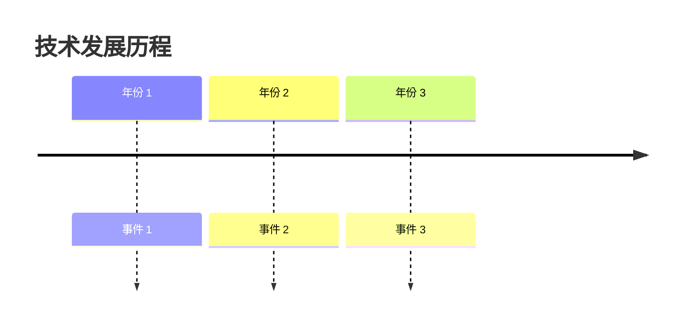
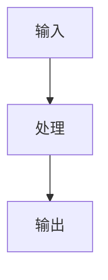

> **分类**: [分类名称] | **编号**: [编号] | **难度**: [难度]
>
> `标签 1` `标签 2` `标签 3`
>
> **摘要**: 200 字以内的核心概述，说明技术定义、重要性、应用场景。

---

## 一、概述

用 500 字以内讲清楚：
- 这是什么技术
- 为什么重要
- 解决了什么问题
- 核心思想是什么

<Callout type="info" title="💡 核心洞察">
用一句话概括技术的核心价值
</Callout>

---

## 二、背景与历史

### 2.1 问题起源
- 技术发展遇到了什么瓶颈
- 为什么需要这项技术

### 2.2 发展历程



### 2.3 命名由来
- 名称含义
- 提出者/机构

---

## 三、核心概念

### 3.1 定义
准确的技术定义（可引用论文/官方文档）

### 3.2 基本术语

| 术语 | 定义 | 说明 |
|------|------|------|
| 术语 1 | 定义 | 补充说明 |
| 术语 2 | 定义 | 补充说明 |

### 3.3 相关概念
- 与 XXX 的关系
- 与 YYY 的区别

---

## 四、原理与机制

### 4.1 工作原理



### 4.2 技术细节
分步骤详细说明工作原理

### 4.3 数学基础

$$
\text{核心公式}
$$

**符号说明：**
- 符号 1：含义
- 符号 2：含义

---

## 五、实现

### 5.1 典型实现

| 实现 | 框架 | 特点 | 链接 |
|------|------|------|------|
| 实现 1 | PyTorch | 特点说明 | GitHub 链接 |

### 5.2 代码示例

<Collapsible title="🐍 点击查看：完整实现">

```python
# 完整可运行的代码示例
# 包含导入语句、注释、使用示例
```

</Collapsible>

### 5.3 配置说明
- 环境要求
- 依赖安装
- 参数配置

---

## 六、应用

### 6.1 应用场景
- 场景 1：说明
- 场景 2：说明

### 6.2 案例分析
实际项目中的应用案例

### 6.3 最佳实践
- 实践 1
- 实践 2

---

## 七、变体与扩展

### 7.1 主要变体

| 变体 | 改进点 | 适用场景 |
|------|--------|----------|
| 变体 1 | 改进说明 | 场景说明 |

### 7.2 相关技术
- 技术 1：与本文技术的关系
- 技术 2：与本文技术的关系

### 7.3 后续发展
技术的演进方向

---

## 八、优势与局限

<Comparison
  items={[
    { title: "✅ 优势", items: ["优势 1", "优势 2", "优势 3"] },
    { title: "⚠️ 局限", items: ["局限 1", "局限 2", "局限 3"] }
  ]}
/>

### 8.3 适用场景

**适合：**
- 场景 1
- 场景 2

**不适合：**
- 场景 1
- 场景 2

---

## 九、对比与评价

### 9.1 与相关技术对比

| 特性 | 本文技术 | 技术 A | 技术 B |
|------|---------|--------|--------|
| 特性 1 | ✅ | ❌ | ⚠️ |
| 特性 2 | ⭐⭐⭐ | ⭐⭐ | ⭐⭐⭐⭐ |

### 9.2 业界评价
- 引用权威评价
- 学术影响（引用数）
- 产业影响

---

## 十、参考资源

### 10.1 原始论文
- 论文标题，作者，年份，[链接](url)

### 10.2 官方文档
- [文档名称](url)

### 10.3 学习资源
- [教程名称](url)
- [视频课程](url)

---

## 十一、常见问题

<Collapsible title="❓ FAQ">

**Q1: 问题 1？**

A: 回答 1

**Q2: 问题 2？**

A: 回答 2

</Collapsible>

---

## 十二、总结

<Callout type="success" title="✅ 学习完成">

用 200 字总结全文核心要点，并给出下一步学习建议。

</Callout>

---

## 十三、更新历史

| 版本 | 日期 | 更新内容 | 作者 |
|------|------|---------|------|
| 1.0 | 2026-03-31 | 初始版本 | 作者名 |
